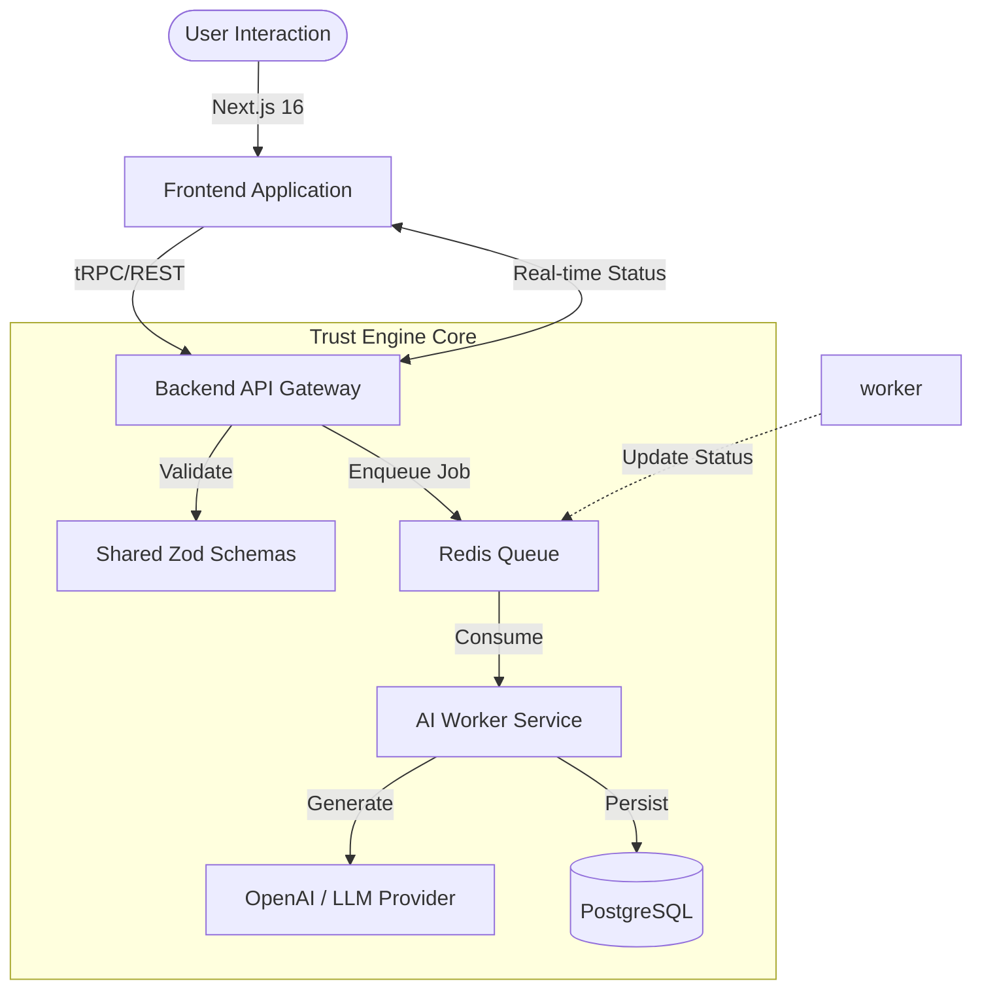

# Architecture & Trust Engine

> **System Status**: Active Development
> **Engine Core**: Event-Driven Resume Tailoring Pipeline
> **Sovereignty**: Local-First, Container-Native

## 1. System Overview

`tailorcv` is a **Full-Stack AI Orchestration Engine** designed to autonomously tailor professional resumes. It is architected as a **TypeScript Monorepo** ensuring strict type safety across the boundaries of the Frontend (User Intent), Backend (Orchestration), and AI Workers (Execution).

The system prioritizes **Immutability** in its infrastructure and **Type Integrity** in its data flow. All business logic is strictly typed via Zod schemas shared across the entire stack.

---

## 2. High-Level Architecture

The system follows an **Asynchronous Event-Driven** pattern to handle the high-latency nature of AI generation.

### Core Components
| Component | Technology | Responsibility |
|-----------|------------|----------------|
| **Frontend** | Next.js 16, React 19, HeroUI | User Intent, Real-time Feedback, Optimistic UI. |
| **Backend** | Node.js, Express | API Gateway, Auth Validation, Orchestration. |
| **Shared** | TypeScript, Zod | **The Source of Truth**. Shared types and validation logic. |
| **Worker** | Redis, BullMQ | Asynchronous Job Processing, AI Interaction, Rate Limiting. |
| **Persistence** | PostgreSQL, Prisma | Relational Data Integrity, User State. |

---

## 3. Data Flow & Integrity

### The "Shared Truth" Pattern
To prevent "contract drift" between Frontend and Backend, `tailorcv` enforces a strict **Shared Schema Strategy**.
1.  **Definition**: All validation logic (`resume.ts`, `onboarding.ts`) lives in `packages/shared`.
2.  **Consumption**:
    *   **Frontend**: Uses schemas for Client-Side Validation (React Hook Form).
    *   **Backend**: Uses the *exact same* schemas for API Payload Validation.
3.  **Result**: It is mathematically impossible for the Client to send data that the Server's validation logic deems invalid, assuming the shared package is kept in sync.

### The Asynchronous Generation Loop
1.  **Intent**: User submits a "Tailor Request" via the Frontend.
2.  **Ingest**: API validates payload via Shared Schema and pushes a job to Redis. Returns `202 Accepted` immediately.
3.  **Processing**: The Worker Service picks up the job, hydrates the context, and invokes the LLM.
4.  **Feedback**: The Frontend polls (or mimics via SSE) the job status to update the UI progressively.

---

## 4. Technical Trade-offs & Decision Log

| Decision | Context | Trade-off | Rationale |
|----------|---------|-----------|-----------|
| **Monorepo Structure** | FE and BE are tightly coupled by data contracts. | **Complexity**: Requires tooling (Turborepo/Workspaces) to manage builds. | **Integrity**: Ensures atomicity of changes. You cannot break the API without breaking the Frontend build. Essential for "Trust". |
| **Next.js 16 (Canary)** | Using cutting-edge React features. | **Stability**: Potential for breaking changes in beta features. | **Performance**: Leverages React Compiler and Server Actions for a superior user experience. |
| **Redis for Queues** | AI generation takes 30s+ per request. | **Infrastructure**: Adds a required stateful service to manage. | **UX**: Prevents HTTP timeouts and allows for robust retry logic/failure management. |

---

## 5. Security & Sovereignty

*   **Local Sovereignty**: The entire stack (including DB and Redis) allows for "Air-Gapped" styles of logic execution. No logic is hidden behind proprietary cloud SDKs.
*   **Non-Root Execution**: All production containers run as a non-root user (`node` or similar) to minimize the attack surface.
*   **Environment Isolation**: Strict separation of secrets via `.env` files, injected only at runtime.
