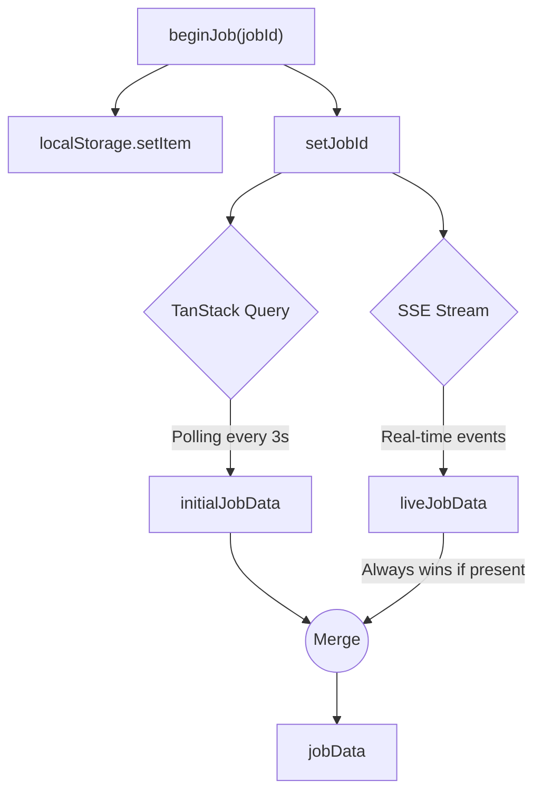

# Onboarding Job Data Flow

This document explains how data flows through the `OnboardingJobProvider` when a user starts an onboarding job (like parsing a resume or GitHub profile).

## The Big Picture: The Hybrid Model

The system uses **two parallel data sources** that feed into a single merged state (`jobData`). This gives us the speed of real-time server pushes with the resilience of standard polling.

---

## 5-Phase Breakdown

### 1. Job Starts (`beginJob`)
- The user triggers `beginJob(jobId)`.
- The `jobId` is saved in React state **and** `localStorage`.
- Saving to `localStorage` means if the user refreshes the page mid-job, the UI can immediately pick up where it left off.
- Setting `jobId` unblocks both the Polling (TanStack) and Streaming logic at the same time.

### 2. Polling: The Safety Net (TanStack Query)
- **What it does:** Uses `useOnboardingJobQuery` to fetch the job status.
- **Why we need it:** If the SSE stream drops or fails to connect, polling acts as a reliable fallback.
- **When it runs:** It fires immediately on mount to grab the initial state. Then, it polls every 3 seconds.
- **When it stops:** The moment the SSE stream successfully receives its first piece of data (`liveJobData` becomes truthy), the polling **turns itself off**. It also stops if the job finishes (`SUCCEEDED` or `FAILED`).

### 3. Streaming: The Speedy Path (SSE)
- **What it does:** Uses `useStream` to connect to Server-Sent Events.
- **Why we need it:** Polling every 3 seconds feels sluggish for real-time progress. The stream pushes updates instantly to the UI.
- **When it runs:** In parallel with polling. Every server event calls `setLiveJobData(data)`.
- **The Golden Rule:** The combined `jobData` state is calculated as `liveJobData || initialJobData`. This means the stream **always wins** and overwrites the polled data once it connects.
- **When it stops:** It disconnects automatically when the job reaches `SUCCEEDED` or `FAILED`.

### 4. Terminal States (`SUCCEEDED` / `FAILED`)

| Status | What happens automatically? |
| :--- | :--- |
| **`FAILED`** | 1. Shows an error toast. 2. Calls `clearJob()` on the next tick to wipe all state and localStorage, resetting the UI so the user can try again. |
| **`SUCCEEDED`** | 1. `jobData.resultBaseResumeId` becomes available. 2. The `useBaseResumeQuery` triggers to fetch the final parsed resume data. 3. We check for missing AI data and warn the user if needed. 4. Redirects the user to `/resumes/:id/review`. 5. Calls `clearJob()` to clean up. |

### 5. Cleanup & Safety Features

Managing cleanup correctly is critical so we don't accidentally pollute the next job the user tries to run.

- **Two-Stage Persistence Cleanup:**
  - `localStorage` is cleared *immediately* when a terminal state is reached. This is an early cleanup so a hard refresh won't try to load a finished job.
  - In-memory `jobId` is kept alive slightly longer to allow the final UI transitions (like routing to the review page) to finish, before being cleared by `clearJob()`.
- **Dead-Man's Switch (5-Minute Timeout):**
  - If a job gets stuck on the backend and never emits a `SUCCEEDED` or `FAILED` status, we don't want to poll forever.
  - A 5-minute timer starts when the job begins. If the job doesn't finish in that window, `clearJob()` is forcefully called to reset the UI.
- **Stable References:**
  - Methods like `beginJob` and `clearJob` are wrapped in `useCallback` to prevent unnecessary re-renders in components that consume the context.
