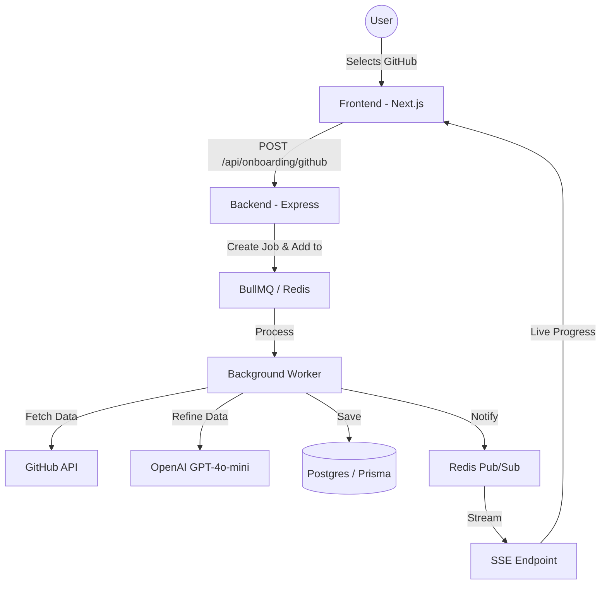

# Architecture Deep Dive: Real-Time AI Onboarding System

This document provides a comprehensive technical breakdown of the architectural decisions, data flows, and implementation details of the TailorCV Onboarding system.

---

## 1. System Overview

The goal of the system is to take raw data (manual forms, "About Me" text, or GitHub activity) and transform it into a professional, ATS-optimized base resume in real-time.

---

## 2. The Background Processing Engine (BullMQ)

### Why BullMQ?

Originally, the project used Graphile Worker. We migrated to **BullMQ** for several senior-level reasons:

- **Redis Orchestration**: BullMQ uses Redis, which is significantly faster for job state transitions than polling a Postgres table.
- **Advanced Lifecycle**: It provides built-in support for retries, delays, and complex parent-child job dependencies.
- **Monitoring**: Integration with `Bull Board` allows us to visualize our queues in real-time.

### The Windows "Pathing" Challenge

In traditional Node.js workers, you run "Sandboxed Workers" (code in a separate file). On Windows, absolute paths can be problematic.

- **Our Solution**: We used **Inline Processors**. We import the logic directly into the main worker-runner. This ensures that the worker environment is identical to the API environment, simplifying local development.

---

## 3. Real-Time Communication (SSE + Redis Pub/Sub)

Instead of forcing the frontend to "poll" the database every 2 seconds (which is expensive and slow), we implemented a high-performance **Reactive Pipeline**.

### The Sequence:

1. **Worker Progress**: As the worker executes, it calls `publishJobUpdate`.
2. **Redis Pub/Sub**: The update is published to a Redis channel called `job_updates`.
3. **The Subscription**: The API has a long-lived GET request (`/api/onboarding/jobs/:id/stream`).
4. **The "Fan Out"**: When the API receives a Redis notification for a specific `jobId`, it pushes that data down the **SSE (Server-Sent Events)** pipe to the user.

**Senior Insight - Why SSE over WebSockets?**

- **SSE** is simpler to implement, works over standard HTTP, and has automatic reconnection built into the browser. Since we only need "Server-to-Client" updates, WebSockets would have been unnecessary overhead.

---

## 4. GitHub Data Synthesis (The Service Layer)

In `onboarding.service.ts`, we implemented the `generateFromGithub` logic. This is where the magic happens.

### Dynamic Imports (Lazy Loading)

We used `await import('./github.service')` inside the function.

- **Why?** To prevent **Circular Dependencies**. If Service A imports Service B, and Service B imports Service A, the app crashes. Dynamic imports break this cycle and also improve startup time by not loading heavy GitHub logic until it's actually needed.

### AI Extraction

We don't just send raw JSON to the AI. We construct a **Context-Rich Prompt**:

- **Source Material**: Recent commits (messages/dates), Top 3 Repos (descriptions), and Tech Stack detection.
- **The Schema**: We use `zodResponseFormat(aiExtractionResponseSchema)` with OpenAI's Beta Parse API. This guarantees that the AI returns a valid, typed JSON object that matches our database schema perfectly.

---

## 5. Frontend Architecture (React Hooks & Context)

The frontend is designed to be "resilient." If you refresh the page while a job is running, it doesn't lose progress.

### `OnboardingJobContext.tsx`

This is the "Brain" of the frontend onboarding.

- **Persistence**: It stores the `jobId` in `localStorage`.
- **Hybrid Sync**: When the app starts, it fetches the current state from the API (TanStack Query) and _then_ connects the SSE stream for live updates.

### `useStream` Hook

This is a custom utility we built to manage SSE connections.

- It handles `EventSource` initialization.
- It handles cleanup (closing the connection) when the component unmounts.
- It manages the state updates for the generation overlay.

---

## 6. How to Extend This

If you wanted to add "LinkedIn Parsing" tomorrow:

1. Add a new payload type to `OnboardingJobPayload`.
2. Create a `generateFromLinkedin` function in the service.
3. Route the worker to that function.
4. Add a new `LinkedInStep` UI component.

**The architecture is now decoupled—the UI doesn't care _how_ the resume is generated, it only cares about the `jobId`.**
