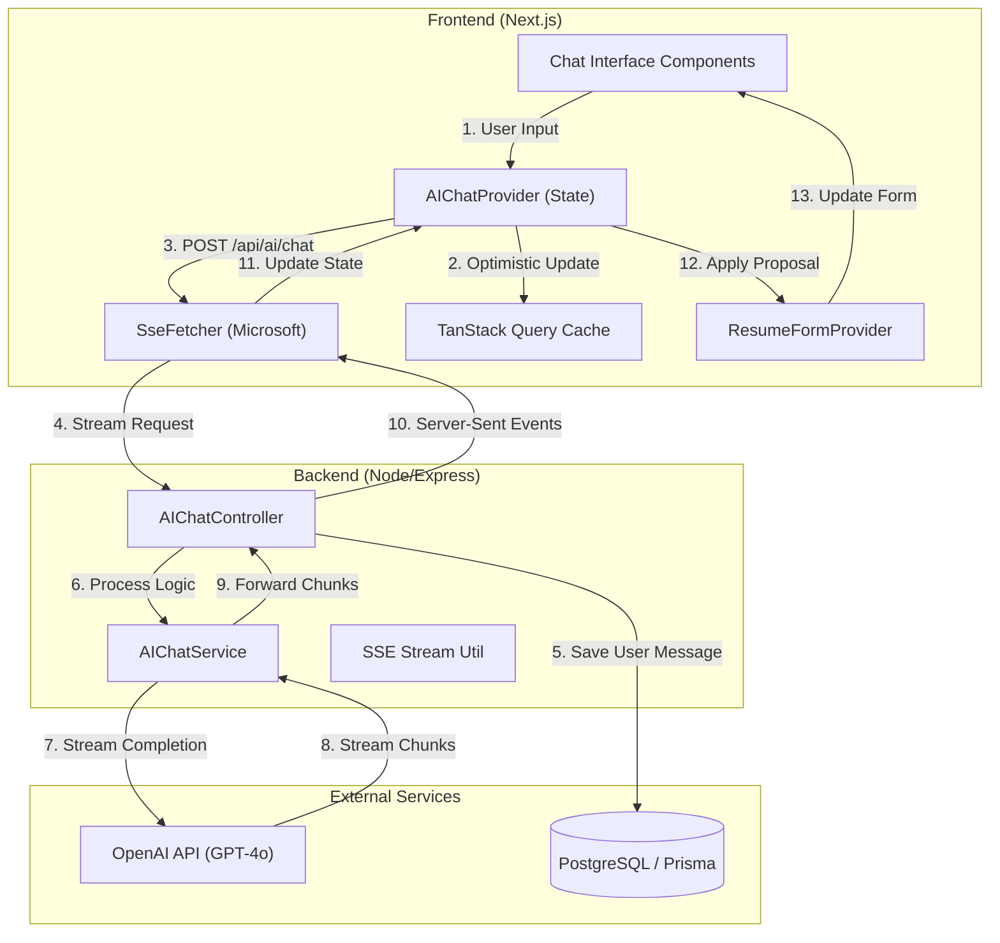

# ADR 001: AI Chat Feature for Resume Review

## Status

**Implemented** - January 30, 2026
**Optimized** - February 12, 2026
**Synchronized** - February 14, 2026
**AI Edit (Tool Calling)** - February 17, 2026

## Context

Users reviewing their resumes need an intelligent, context-aware assistant to provide real-time feedback, rephrasing suggestions, and career advice without leaving the editor. The experience must be visually "premium", highly responsive, and cost-effective.

## Functional Specification

The AI Chat feature provides a continuously accessible drawer interface with the following capabilities:

### 1. Interactive Chat Interface

- **Persistent Drawer**: Fixed-position chat window that stays open while users edit their resume.
- **Fullscreen Mode**: One-click expansion for a focused, distraction-free writing experience.
- **Input Experience**: Auto-expanding text area with multi-line support.
- **Quick Actions**: Horizontally scrollable "chips" for common requests.
- **Stop Response**: Users can abort a streaming response mid-generation via `AbortController`.

### 2. Conversation Management (Sidebar)

- **History**: Animated sidebar (Framer Motion) lists past conversations, ordered by most recent activity.
- **Management**: Users can create **New Chats** or **Delete** old conversations (with confirmation dialog).
- **AI-Generated Titles**: New conversations receive a concise 3-5 word title generated by `gpt-4o-mini`.
- **Metadata Display**: Each item shows relative time (via `date-fns`) and message count.

### 3. Context Awareness

- **Resume Injection**: The AI automatically receives the user's _current_ resume data.
- **Sanitization**: Context is automatically stripped of internal database IDs (`id` fields), `version` metadata, and pretty-printing to minimize token usage.

### 4. Resume Edit Proposals (Tool Calling)

- **AI-Initiated Edits**: When the user requests a change (e.g., "Change my name to John"), the AI calls the `update_resume` tool instead of describing the change in text.
- **Proposal Card UI**: Proposals render as rich, diff-aware cards showing only the changed/added fields with Apply and Discard buttons.
- **Field-Specific Renderers**: `SkillsProposal`, `ContactProposal`, `ListProposal` (experiences, projects, education), and `TextProposal` (summary) each show contextual diffs against current resume data.
- **Status Tracking**: Proposals have three states (`pending`, `applied`, `discarded`) persisted in message metadata and tracked via optimistic UI.
- **Apply Flow**: `ResumeFormContext.applyUpdate()` merges the partial `BaseResumeData` proposal into the active form, then `updateMessageStatusAction` persists the status.

### 5. Proposal Hydration & Persistence

- **Hydration**: The `hydrateProposalIds` utility intelligently merges AI proposals (which lack database IDs) with the current resume state. It matches existing items (e.g., "Project A") to preserve their stable IDs and generates new UUIDs for new items.
- **Persistence**: Proposal data and their status (`pending`, `applied`, `discarded`) are stored in the `metadata` JSON column of the `ChatMessage` table. On page load, the frontend rehydrates this state, ensuring buttons like "Applied" remain correct even after a refresh.

### 6. Undo/Redo Integration

- **Strategy**: The `ResumeFormProvider` implements a stack-based state machine (`history` and `future` stacks) storing full snapshots of `BaseResumeData`.
- **Integration**: When AI applies a change via `applyUpdate`, it pushes the *current* state to `history`, clears `future`, and resets the form with the new data. This allows users to undo AI changes exactly like manual edits.

---

## Technical Architecture

### 1. High-Level Data Flow



### 2. Frontend Implementation (Next.js 16 + HeroUI)

#### State Management

- **Global Provider**: `AIChatProvider` (Context API) manages UI state (visibility, fullscreen, sidebar), conversation selection, streaming state, and resume context.
- **Data Layer**: TanStack Query (React Query) with two query definitions:
  - `useConversationsQuery` — fetches the conversation list (`staleTime: 5min`).
  - `useConversationDetailsQuery` — fetches a single conversation's messages (`staleTime: 5min`).
- **Cache Helpers**: `useConversationsCache()` and `useConversationDetailsCache()` provide typed optimistic update primitives (`list.add`, `list.remove`, `setData`, `rollback`, `cancel`, `invalidate`).

#### SSE Client

- Uses `@microsoft/fetch-event-source` (not native `EventSource`) to support `POST` requests with JSON bodies and custom headers.
- Sends `x-idempotency-key` header per request to prevent duplicate processing.
- Streams write directly into the TanStack Query cache — no local component state for messages.

#### Components

| Component | Location | Purpose |
|---|---|---|
| `AIChatProvider` | `providers/ai-chat-provider.tsx` | Global state and streaming logic |
| `ChatSidebar` | `review/ai-chat/chat-sidebar.tsx` | Animated conversation list |
| `ConversationItem` | `review/ai-chat/conversation-item.tsx` | Single conversation row |
| `ChatMessageBubble` | `review/ai-chat/chat-message-bubble.tsx` | Message rendering with Markdown and proposal cards |
| `ChatMessageList` | `review/ai-chat/chat-message-list.tsx` | Scrollable message container |
| `ChatInputArea` | `review/ai-chat/chat-input-area.tsx` | Auto-expanding input |
| `ChatHeader` | `review/ai-chat/chat-header.tsx` | Header with controls |
| `ChatQuickActions` | `review/ai-chat/chat-quick-actions.tsx` | Predefined action chips |
| `ChatTriggerButton` | `review/ai-chat/chat-trigger-button.tsx` | Floating open button |
| `ProposalCard` | `ai-chat/proposal/proposal-card.tsx` | Composite proposal container |
| `ProposalContent` | `ai-chat/proposal/proposal-content.tsx` | Routes proposal fields to type-specific renderers |
| `ProposalFields` | `ai-chat/proposal/proposal-fields.tsx` | `SkillsProposal`, `ContactProposal`, `ListProposal`, `TextProposal` |
| `ProposalUI` | `ai-chat/proposal/proposal-ui.tsx` | `ProposalHeader` (sparkles icon + explanation), `ProposalFooter` (Apply/Discard buttons) |

#### Server Actions & Data

- `ai-chat.actions.ts` — defines `createConversationAction`, `deleteConversationAction`, `updateMessageStatusAction` via `defineAction`.
- `ai-chat-client.ts` — defines `useConversationsQuery`, `useConversationDetailsQuery` via `defineQuery`, plus cache hooks.
- `ai-chat.ts` (server-only) — `streamChat()`, `getConversations()`, `getConversationDetails()` for server-side data fetching.

### 2. Backend Implementation (Express + Prisma)

#### Controllers

- **`ai-chat.controller.ts`** — `postChatMessage`: Orchestrates the full SSE streaming flow — idempotency check, session upsert, user message persistence, OpenAI stream relay, assistant response persistence, and finalization.
- **`chat-conversations.controller.ts`** — REST CRUD: `listConversationsController`, `getConversationController`, `createConversationController`, `deleteConversationController`, `patchMessageStatusController`.

#### Services

- **`ai-chat.service.ts`**:
  - `streamChatResponse()` — Initializes the OpenAI Responses API stream with system instructions, tool definitions, and optional `previous_response_id` for multi-turn continuity. Returns an async generator of `AIChatStreamEvent`.
  - `generateConversationTitle()` — Uses `gpt-4o-mini` (Chat Completions API) to create a 3-5 word title from the initial user message.
- **`chat-conversations.service.ts`**:
  - `ensureChatSession()` — Upsert pattern: finds or creates a conversation by the client-provided ID, generating an AI title on creation.
  - `saveAssistantResponse()` — Persists the assistant message and conditionally updates the conversation's `responseId` (skips for proposal/tool-call responses to avoid "No tool output found" errors on resume).
  - `addMessage()`, `createConversation()`, `listConversations()`, `getConversationWithMessages()`, `deleteConversation()`, `updateMessageStatus()`.

#### Modular Utilities

| File | Purpose |
|---|---|
| `ai-context.ts` | `cleanResumeContext()` — strips `id` and `version` fields from all resume sections (skills, experiences, projects, education, certifications, languages) |
| `ai-prompts.ts` | `buildInstructions()` — constructs system prompt with resume coach persona, optional tool-calling rules, and JSON context injection |
| `ai-tools.ts` | `AI_TOOLS` — defines the `update_resume` function tool schema for the OpenAI Responses API |
| `ai-stream.ts` | `handleOpenAIStream()` — transforms raw OpenAI stream events into `AIChatStreamEvent` generator, accumulates tool call arguments, handles truncated JSON parsing |
| `ai-stream-sse.ts` | `initSseResponse()`, `writeSseEvent()`, `setupStreamTermination()` — SSE response helpers |
| `ai-intent.ts` | `classifyIntent()` — `gpt-4o-mini` intent classifier (simple/complex/edit). _Currently defined but not used in the streaming flow._ |
| `ai-edit.ts` | `generateResumeEdit()` — standalone (non-streaming) edit generation via Chat Completions API. _Legacy utility, not used in the current streaming architecture._ |

#### OpenAI Integration

- **API**: Uses the **OpenAI Responses API** (`openai.responses.stream()`) — _not_ Chat Completions — for the main chat flow.
- **Model**: Always `gpt-4o` for chat responses (intent-based routing was removed).
- **Conversation Continuity**: `previous_response_id` chains multi-turn context server-side. Tool-call response IDs are excluded because resuming from a function call without submitting tool output causes OpenAI errors.
- **Tool Calling**: The `update_resume` function tool receives a `proposal` (partial `BaseResumeData`) and `explanation` string. Tool call arguments are accumulated from streaming deltas, then parsed with auto-closure fallback for truncated JSON.

### 3. Streaming Architecture (Route Proxy Pattern)

```
Client (fetchEventSource)
  -> POST /api/ai/chat (Next.js Route Handler / Proxy)
    -> POST /api/v1/ai/chat (Express Backend)
      -> openai.responses.stream() (OpenAI Responses API)
```

- **Protocol**: `text/event-stream` (SSE).
- **Event Types**: `text` (content delta), `proposal` (tool call result), `thinking` (signals AI is processing a tool call), `done` (stream complete with `responseId` and `conversationId`), `error`.
- **Client Disconnection**: `req.on('close')` triggers `AbortController.abort()` to cancel the upstream OpenAI stream.

### 4. API Routes

| Method | Path | Middleware | Handler |
|---|---|---|---|
| `POST` | `/api/v1/ai/chat` | `aiChatRateLimiter`, `requireClerkAuth`, `idempotency()` | `postChatMessage` |
| `GET` | `/api/v1/ai/chat/conversations` | `aiConversationCrudRateLimiter`, `requireClerkAuth` | `listConversationsController` |
| `POST` | `/api/v1/ai/chat/conversations` | `aiConversationCrudRateLimiter`, `requireClerkAuth` | `createConversationController` |
| `GET` | `/api/v1/ai/chat/conversations/:id` | `aiConversationCrudRateLimiter`, `requireClerkAuth` | `getConversationController` |
| `DELETE` | `/api/v1/ai/chat/conversations/:id` | `aiConversationCrudRateLimiter`, `requireClerkAuth` | `deleteConversationController` |
| `PATCH` | `/api/v1/ai/chat/messages/:id/status` | `aiConversationCrudRateLimiter`, `requireClerkAuth` | `patchMessageStatusController` |

### 5. Database Schema

```prisma
model ChatConversation {
  id         String   @id @default(uuid())
  userId     String
  responseId String?  /// OpenAI response ID for context continuity
  title      String?
  createdAt  DateTime @default(now())
  updatedAt  DateTime @updatedAt

  user     User          @relation(...)
  messages ChatMessage[]

  @@index([userId, updatedAt(sort: Desc)])
  @@map("chat_conversations")
}

model ChatMessage {
  id             String   @id @default(uuid())
  conversationId String
  role           String   /// 'user' | 'assistant'
  content        String
  createdAt      DateTime @default(now())
  metadata       Json?    /// Stores proposals, tool calls, status

  conversation ChatConversation @relation(...)

  @@index([conversationId, createdAt])
  @@map("chat_messages")
}
```

- **`metadata` (Json)**: For assistant messages with proposals, stores `{ type: 'proposal', proposal: Partial<BaseResumeData>, explanation: string, status: 'pending' | 'applied' | 'discarded' }`.

### 6. Resilience & Safety

- **Retry Policy**: `cockatiel` exponential backoff (3 attempts, 100ms-2s) wraps all OpenAI calls.
- **Idempotency**: Redis-backed middleware prevents duplicate SSE stream processing using `x-idempotency-key` headers (24h TTL).
- **Rate Limiting**: Separate limiters for chat streaming (`aiChatRateLimiter`) and CRUD operations (`aiConversationCrudRateLimiter`).
- **Ownership Checks**: All conversation/message operations verify `userId` matches `clerkUserId` before proceeding.

---

## Key Decisions & Log

### Thinking State for Tool Calls (Added Feb 18)

- **Decision**: Emit a `thinking` SSE event before the AI processes a tool call, rendered as a "Drafting changes..." loading indicator in `ChatMessageBubble`. The `isThinking` flag is propagated through both `ConversationMessage` and `ChatMessage` types and explicitly reset to `false` when `text` or `proposal` events arrive.
- **Reasoning**: Tool calls introduce noticeable latency (argument accumulation, JSON parsing). Without a visual indicator, the UI appears frozen between the user's message and the proposal card. The thinking state bridges this gap. Clearing `isThinking` explicitly on subsequent events prevents the spinner from getting stuck due to object spread carrying stale flags.

### OpenAI Responses API Migration (Added Feb 17)

- **Decision**: Use the OpenAI Responses API (`openai.responses.stream()`) instead of Chat Completions for the main chat flow. Use `previous_response_id` for conversation continuity instead of manually managing message arrays.
- **Reasoning**: The Responses API handles multi-turn context server-side, reducing payload sizes and simplifying the backend. Tool calls are natively supported as output items.

### Unified Streaming with Tool Calls (Added Feb 17)

- **Decision**: Handle both regular chat and resume edits through a single streaming endpoint. Edits are detected as `update_resume` tool calls and emitted as `proposal` events.
- **Reasoning**: Eliminates the need for separate edit endpoints. The AI autonomously decides when to call the tool based on system instructions, providing a natural conversational editing experience.

### Tool Call Conversation Break (Added Feb 17)

- **Decision**: After a tool call response, clear the `responseId` so the next turn starts a fresh context chain (no `previous_response_id`).
- **Reasoning**: The Responses API requires submitting tool output to continue from a function call. Since edits are executed client-side (not submitted back to OpenAI), continuing from that response ID would cause "No tool output found" errors.

### Intent-Based Model Selection (Added Feb 12, Superseded Feb 17)

- **Decision**: ~~Default to `gpt-4o-mini` for all queries and use it to classify intent. Route 'complex' requests to `gpt-4o`.~~ Now always uses `gpt-4o` for chat. The `classifyIntent()` utility still exists but is not called.
- **Reasoning**: The Responses API with tool calling requires consistent model capability. The cost savings from routing were marginal compared to the latency and complexity overhead of intent classification.

### Token Hygiene & Context Sanitization (Added Feb 12)

- **Decision**: Strip all `id` and `version` fields from the `resumeContext` and remove pretty-printing from JSON stringification.
- **Reasoning**: Database IDs add no value to the AI context but consume high amounts of tokens across many turns. Minifying the JSON further reduces token overhead by 5-10%.

### Modularization of AI Logic (Added Feb 12)

- **Decision**: Extract prompt building, context cleaning, intent classification, tool definitions, and stream handling into separate utility modules.
- **Reasoning**: Prevents the `ai-chat.service.ts` from becoming a monolithic "god file" and improves testability of individual components (e.g., unit testing the context cleaner).

### Client-Driven ID Generation (Added Feb 14)

- **Decision**: The frontend generates UUIDs for both `conversationId` (for new chats) and `assistantMessageId` **before** initiating the stream. The backend uses these exact IDs.
- **Reasoning**: Eliminates the "Message not found" race condition. Previously, if a user performed an action (Apply/Discard) before the backend had finished saving its auto-generated ID, the action would fail. Matching IDs from the start ensures immediate actionability.

### Cache-Direct Streaming (Added Feb 14)

- **Decision**: Remove local component state for messages. Streamed content is written surgically into the TanStack Query cache (`useConversationDetailsQuery`) in real-time.
- **Reasoning**: Solves the "Vanishing Message" bug when switching chats. Because data lives in the global cache bucket keyed by `conversationId`, switching views and back preserves any partially streamed content or new messages instantly.

### Navigation & Persistence

- **Decision**: Moved `AIChatBox` into the `RootLayout`.
- **Reasoning**: Enables seamless navigation across resume sections without resetting chat state.

---

## Future Improvements

- **Citation Support**: Parse OpenAI responses to highlight exactly which resume section is being referenced.
- **Vision Integration**: Allow users to share screenshots of their design for visual feedback.
- **Intent Router Reactivation**: Re-enable `classifyIntent()` to route simple queries to `gpt-4o-mini` for cost savings, once the Responses API supports model-per-turn or a cost threshold is reached.
