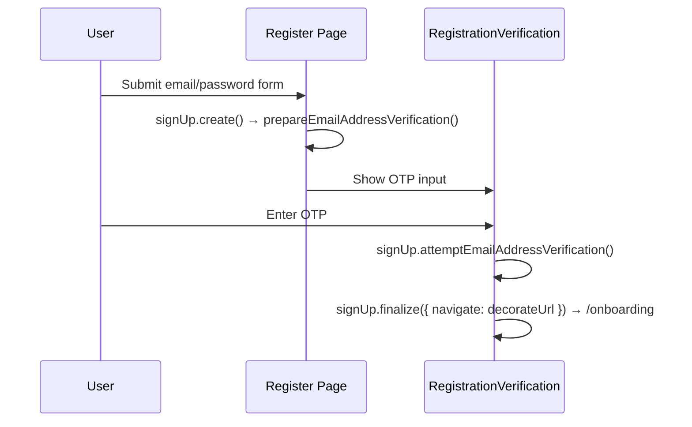
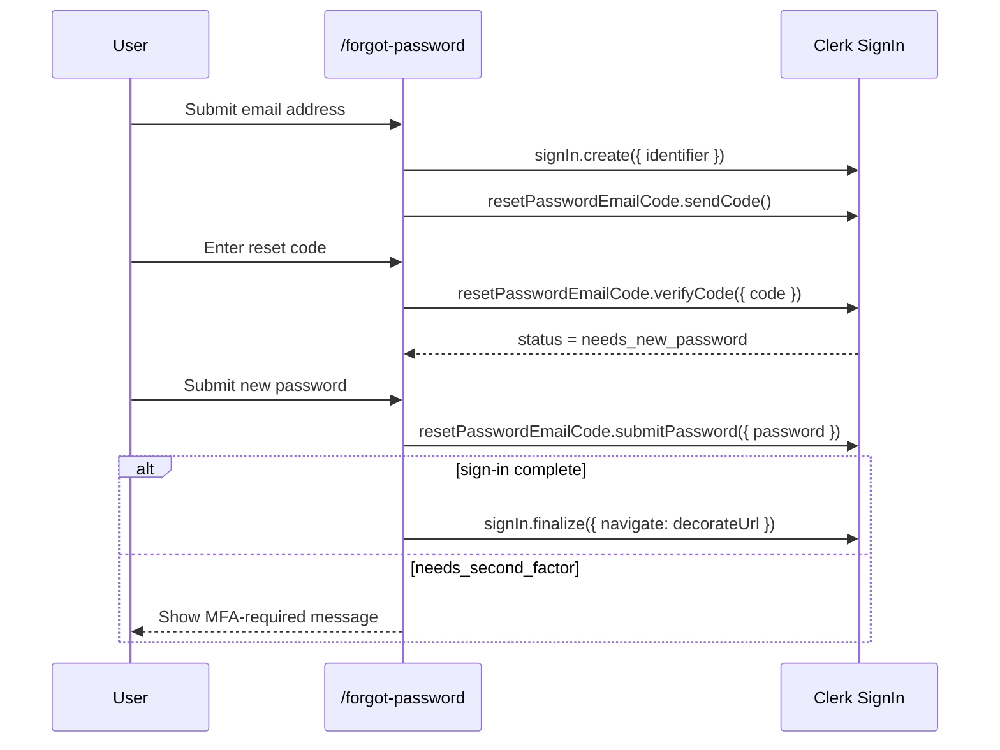

# AUTH Flows

> Email/password sign-in, sign-up verification, forgot-password, and the local controller/view boundaries that support them.

---

## 1. Core Philosophy

- Route components stay thin and select between local controllers or views
- Flow hooks own Clerk orchestration and auth state transitions
- Presentational auth views receive render-safe props only

---

## 2. Architecture Overview

### 2.1 Covered Journeys

- `/login`
- `/register`
- registration email verification
- `/forgot-password`

### 2.2 Login / Register / Reset Map

```
/login
  page.tsx -> use-login-flow.ts -> LoginFormView / VerificationView

/register
  page.tsx -> RegisterForm -> use-register-flow.ts -> RegistrationVerificationView

/forgot-password
  page.tsx -> use-forgot-password-flow.ts
           -> ForgotPasswordEmailEntry -> EmailEntryView
           -> ForgotPasswordReset -> ResetPasswordView
```

---

## 3. Key Files & Entry Points

| File | Purpose | When to Read |
| ---- | ------- | ------------ |
| `apps/frontend/app/(auth)/login/page.tsx` | Thin login route controller that switches between password sign-in and Client Trust verification views | Any login page composition change |
| `apps/frontend/app/components/auth/login/use-login-flow.ts` | Login controller hook — Clerk sign-in orchestration, auth notices, Client Trust, and SSO start handlers | Any login behavior or redirect change |
| `apps/frontend/app/components/auth/register/register-form.tsx` | Register form — email/password + Google/Apple SSO handlers | Any register change |
| `apps/frontend/app/components/auth/register/use-register-flow.ts` | Register controller hook for email/password sign-up, SSO initiation, and OTP verification | Register controller changes |
| `apps/frontend/app/components/auth/registration-verification-view.tsx` | Render-only email OTP verification view | Email verification UI changes |
| `apps/frontend/app/components/auth/registration-verification.tsx` | Thin registration verification controller | Email verification composition changes |
| `apps/frontend/app/components/auth/use-registration-verification-flow.ts` | Email OTP verification flow hook | Verification behavior changes |
| `apps/frontend/app/(auth)/forgot-password/page.tsx` | Thin forgot-password route controller | Forgot-password page composition changes |
| `apps/frontend/app/components/auth/forgot-password/use-forgot-password-flow.ts` | Forgot-password page controller hook that owns Clerk reset state transitions | App-layer forgot-password controller changes |
| `apps/frontend/app/components/auth/forgot-password/forgot-password-email-entry.tsx` | Local email-step form controller that owns RHF wiring for the forgot-password entry step | Forgot-password form-structure changes |
| `apps/frontend/app/components/auth/forgot-password/forgot-password-reset.tsx` | Local reset-step form controller that owns RHF wiring for code verification / password reset UI | Forgot-password form-structure changes |
| `apps/frontend/lib/auth/clerk-flow.ts` | Small Clerk-status decision helpers for login and forgot-password custom flows | Auditing or changing Clerk state handling |
| `apps/frontend/lib/schemas/auth.ts` | Zod schemas: login, register, forgotPassword, ssoContinue | Adding/changing form fields |

---

## 4. Data Flow

### 4.1 Email Sign-Up Verification Flow



### 4.2 Forgot-Password Flow



---

## 5. Component / Module Structure

```
app/components/auth/
├── login/
│   ├── use-login-flow.ts
│   ├── login-form-view.tsx
│   ├── verification-view.tsx
│   └── branding-view.tsx
├── register/
│   ├── use-register-flow.ts
│   ├── register-form.tsx
│   └── register-form-view.tsx
├── registration-verification.tsx
├── use-registration-verification-flow.ts
└── forgot-password/
    ├── use-forgot-password-flow.ts
    ├── forgot-password-email-entry.tsx
    ├── forgot-password-reset.tsx
    ├── email-entry-view.tsx
    └── reset-password-view.tsx
```

---

## 6. Patterns & Conventions

### 6.1 finalize() with decorateUrl

```typescript
await signUp.finalize({
  navigate: async ({ session, decorateUrl }) => {
    if (session?.currentTask) return;
    const url = decorateUrl(config.auth.afterSignUpUrl);
    if (url.startsWith('http')) {
      window.location.href = url;
    } else {
      router.push(url);
    }
  },
});
```

### 6.2 Forgot-Password State Progression

```typescript
await signIn.create({ identifier: emailAddress });
await signIn.resetPasswordEmailCode.sendCode();

const verifyResult = await signIn.resetPasswordEmailCode.verifyCode({ code });
if (verifyResult.error) {
  // Render the returned ClerkError via getClerkErrorMessage()
}

if (signIn.status === 'needs_new_password') {
  // Show the new-password form only after Clerk advances to this state.
}

const passwordResult = await signIn.resetPasswordEmailCode.submitPassword({
  password,
});
if (passwordResult.error) {
  // Render the returned ClerkError via getClerkErrorMessage().
} else if (signIn.status === 'complete') {
  await signIn.finalize({ navigate: decorateUrl });
} else if (signIn.status === 'needs_second_factor') {
  // Surface an explicit MFA-required state.
}
```

### 6.3 Login Client Trust vs MFA

```typescript
if (signIn.status === 'needs_client_trust') {
  await signIn.mfa.sendEmailCode();
}
```

- `needs_client_trust`: trusted-device verification for password sign-in; use `signIn.mfa.sendEmailCode()` / `signIn.mfa.verifyEmailCode()`
- `needs_second_factor`: account-level MFA; do not route this through the Client Trust email-code UI unless the product adds dedicated MFA support

### 6.4 Login Redirect Context

```typescript
router.push(buildLoginUrl({ reason: 'second_factor_required' }));
```

- `primary_required`: OAuth is not the account's primary sign-in method here
- `second_factor_required`: Clerk requires MFA / email-code verification after password sign-in
- `reset_password_required`: Clerk requires a password reset before sign-in can complete

---

## 7. Integration Points

| Domain | Relationship | Key Interface |
| ------ | ------------ | ------------- |
| Middleware (`proxy.ts`) | Auth determines public/protected route access | `isPublicRoute`, `isAuthRoute`, `isProtectedRoute` matchers |
| Dashboard | After sign-in, user is sent to dashboard | `config.auth.afterSignInUrl` |
| Onboarding | After sign-up, user is sent to onboarding | `config.auth.afterSignUpUrl` |
| SSO | OAuth flows can redirect back into login with `auth_reason` context | `buildLoginUrl()` |

---

## 8. Implementation Status

- [x] Login controller/view split
- [x] Register controller/view split
- [x] Registration verification controller/view split
- [x] Forgot-password controller/view split
- [x] Clerk status helper coverage for login and forgot-password

---

## 9. Risks & Mitigations

| Risk | Mitigation |
| ---- | ---------- |
| Client Trust incorrectly handled as generic second factor | Treat `needs_client_trust` as its own Clerk state and use `signIn.mfa.*` email-code APIs |
| Forgot-password silently stalls after successful Clerk calls | Treat returned `{ error }` payloads and unexpected post-submit statuses as first-class UI states |
| View files start re-owning RHF setup | Keep RHF/schema wiring in flow hooks or local controllers, not render-only view files |

---

## 10. Development Log

### [2026-04-20] - Register-Owned Verification Callbacks

- **Decision:** Keep Clerk's `signUp` resource inside `useRegisterFlow()` for the active register journey and return only render-safe OTP view props from `verificationViewProps`.
- **Problem:** `verificationViewProps` still included the Clerk `signUp` resource, so the register controller boundary exposed implementation details even though the rendered verification view only needed state and callbacks.
- **Solution:**
  1. **`apps/frontend/app/components/auth/register/use-register-flow.ts`**: Added OTP code/error/loading state plus resend and submit callbacks that call Clerk internally and finalize navigation.
  2. **`apps/frontend/app/components/auth/register/register-form.tsx`**: Renders `RegistrationVerificationView` directly from render-safe `verificationViewProps`.
  3. **`apps/frontend/app/components/auth/registration-verification-view.tsx` + register boundary tests**: Exported the view prop contract and updated coverage so no Clerk resource is required by the register verification branch.
- **Outcome:** The register flow now keeps Clerk orchestration inside the flow hook while the verification view receives only primitives and event handlers.

### [2026-04-13] - Registration Verification View Prop Contract

- **Decision:** Make `useRegistrationVerificationFlow()` return the complete `viewProps` object consumed by `RegistrationVerificationView`.
- **Problem:** `RegistrationVerification` still knew every verification hook field and manually remapped them into the view, which duplicated the controller/view prop-mapping pattern that register had just moved out of the component.
- **Solution:**
  1. **`apps/frontend/app/components/auth/use-registration-verification-flow.ts`**: Added `email` and `onGoBack` as hook inputs and returned a grouped `viewProps` object with OTP state, loading state, and handlers.
  2. **`apps/frontend/app/components/auth/registration-verification.tsx`**: Reduced the component to hook invocation plus one intentional `RegistrationVerificationView` prop spread.
  3. **`apps/frontend/app/components/auth/registration-verification-boundary.test.tsx`**: Added boundary coverage proving the grouped view props flow through the controller.
- **Outcome:** Registration verification now follows the same grouped view-props contract as the register form controller, keeping view prop changes localized to the flow hook.

### [2026-04-13] - Register View Prop Contract

- **Decision:** Make `useRegisterFlow()` return explicit `formViewProps` and `verificationViewProps` branches instead of a flat field bag consumed manually by `RegisterForm`.
- **Problem:** The register controller had to know every internal hook field and remap handlers by hand, which made the route boundary noisier and easier to drift from the auth controller/view pattern.
- **Solution:**
  1. **`apps/frontend/app/components/auth/register/use-register-flow.ts`**: Replaced the flat return object with a discriminated `mode` result that exposes only the active view's render-safe props.
  2. **`apps/frontend/app/components/auth/register/register-form.tsx`**: Reduced the controller to a mode switch that intentionally spreads the matching view-props object.
  3. **`apps/frontend/app/components/auth/register/register-form.test.tsx`**: Updated boundary coverage to prove the grouped props are forwarded to the correct view.
- **Outcome:** Register composition now matches the preferred flow-controller shape, so future register view prop changes can stay localized to the hook and target view.

### [2026-04-07] - Forgot-Password View Purification

- **Decision:** Keep `useForgotPasswordFlow()` as the Clerk/state-machine hook, but move the remaining RHF and schema wiring out of the forgot-password view files into local controller components so the views become render-only.
- **Problem:** The forgot-password route already had the main controller hook, but `email-entry-view.tsx` and `reset-password-view.tsx` still owned `react-hook-form` and Zod setup, which made them inconsistent with the newer auth controller/view pattern used by login, register, and SSO continuation.
- **Solution:**
  1. **`apps/frontend/app/components/auth/forgot-password/forgot-password-email-entry.tsx` + `apps/frontend/app/components/auth/forgot-password/forgot-password-reset.tsx`**: Added thin local form controllers that own RHF + schema setup and adapt submitted values back into the existing flow hook callbacks.
  2. **`apps/frontend/app/components/auth/forgot-password/email-entry-view.tsx` + `apps/frontend/app/components/auth/forgot-password/reset-password-view.tsx`**: Removed RHF ownership so both files now render only from passed control/submit props.
  3. **`apps/frontend/app/(auth)/forgot-password/page.tsx` + focused Vitest specs**: Switched the route to render the new local controllers and added page-boundary plus controller submission tests.
- **Outcome:** The forgot-password flow now matches the rest of the auth stack's controller/view split, with Clerk logic in `useForgotPasswordFlow()`, form wiring in small local controllers, and render-only view files.

### [2026-04-07] - Login Controller Hook Extraction

- **Decision:** Move the login page's Clerk orchestration into a dedicated hook so the route component matches the controller/view boundaries already used by register and registration verification.
- **Problem:** `apps/frontend/app/(auth)/login/page.tsx` still mixed RHF setup, auth-reason URL cleanup, password sign-in state handling, Client Trust verification, SSO initiation, and view switching in one route file, which made the last major auth controller harder to test and reason about.
- **Solution:**
  1. **`apps/frontend/app/components/auth/login/use-login-flow.ts`**: Extracted the login controller state, Clerk sign-in handlers, Client Trust resend/verify handlers, auth-notice cleanup, and finalize navigation into a dedicated hook.
  2. **`apps/frontend/app/(auth)/login/page.tsx`**: Reduced the route component to a thin render boundary that selects between `LoginFormView` and `VerificationView`.
  3. **`apps/frontend/app/components/auth/login/use-login-flow.test.tsx` + `apps/frontend/app/(auth)/login/page.test.tsx`**: Added focused regression coverage for the extracted login flow and the route-level render switch.
- **Outcome:** The login route now follows the same controller/view split as the rest of the auth stack, and the most important password-sign-in branches have fast, direct coverage without relying on browser automation.

### [2026-04-07] - Clerk v7 Auth Parity Audit And Smoke Coverage

- **Decision:** Align the custom auth controllers with Clerk v7's documented state machine instead of relying on implicit status handling, and lock the public-route guard behavior down with smoke coverage.
- **Problem:** The login flow still finalized without `decorateUrl`, treated Client Trust as a generic second-factor email flow, the forgot-password flow assumed every successful password submission could finalize immediately, `/sso-continue` was missing Clerk's required captcha mount, and middleware redirected authenticated auth-route visits to a stale `/test` path.
- **Solution:**
  1. **`apps/frontend/lib/auth/clerk-flow.ts` + `apps/frontend/lib/auth/clerk-flow.test.ts`**: Added focused Clerk-status decision helpers and regression tests for login and forgot-password state handling.
  2. **`apps/frontend/app/(auth)/login/page.tsx`**: Switched successful sign-in completion to `finalize({ navigate })`, split `needs_client_trust` from `needs_second_factor`, and moved trusted-device verification to `signIn.mfa.sendEmailCode()` / `signIn.mfa.verifyEmailCode()`.
  3. **`apps/frontend/app/components/auth/forgot-password/use-forgot-password-flow.ts`**: Added explicit post-password handling for `complete`, `needs_second_factor`, and unexpected statuses instead of always finalizing.
  4. **`apps/frontend/app/components/auth/register/register-form.tsx` + `apps/frontend/app/components/auth/registration-verification.tsx`**: Tightened sign-up and email-verification error handling so unexpected Clerk statuses surface explicitly instead of stalling silently.
- **Outcome:** The custom auth stack now matches Clerk v7's documented login and recovery states more closely, trusted-device verification uses the correct API surface, and auth redirects are consistent with the configured post-sign-in destination.

### [2026-04-06] - Forgot-Password State Alignment

- **Decision:** Model forgot-password as a staged Clerk sign-in flow that verifies the reset code before accepting a new password.
- **Problem:** The reset page submitted `verifyCode()` and `submitPassword()` in the same handler, which left the flow in `needs_first_factor` and blocked users from completing password resets reliably.
- **Solution:**
  1. **`apps/frontend/app/(auth)/forgot-password/page.tsx`**: Split the controller into `email`, `verify-code`, and `set-password` phases and handled Clerk statuses explicitly.
  2. **`apps/frontend/app/components/auth/forgot-password/reset-password-view.tsx`**: Converted the reset screen into a staged single-screen UI that only reveals password fields after Clerk returns `needs_new_password`.
  3. **`docs/architecture/auth/flows.md`**: Documented the forgot-password state progression and required handler split for future auth work.
- **Outcome:** The reset flow now follows Clerk's documented state machine, invalid codes stay in the verification step, and successful resets finalize with the same redirect behavior as the rest of the auth system.
