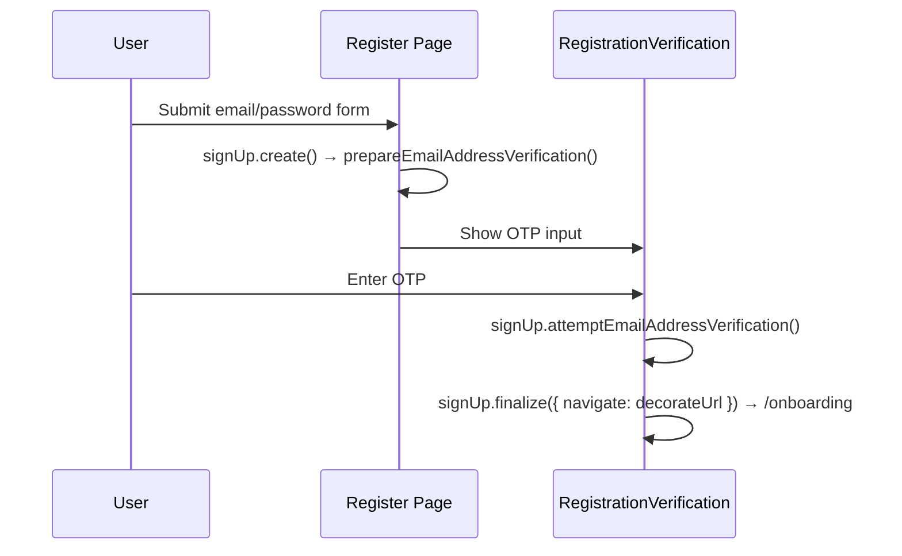
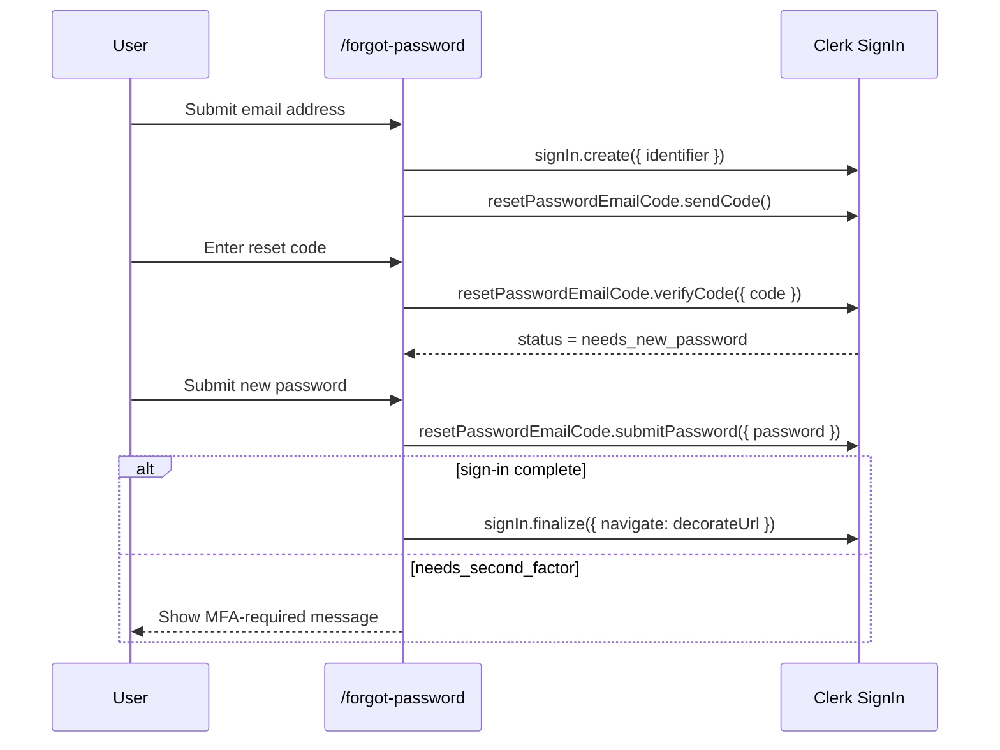

# AUTH Flows

> Email/password sign-in, sign-up verification, forgot-password, and the local controller/view boundaries that support them.

---

## 1. Core Philosophy

- Route components stay thin and select between local controllers or views
- Flow hooks own Clerk orchestration and auth state transitions
- Presentational auth views receive render-safe props only

---

## 2. Architecture Overview

### 2.1 Covered Journeys

- `/login`
- `/register`
- registration email verification
- `/forgot-password`

### 2.2 Login / Register / Reset Map

```
/login
  page.tsx -> use-login-flow.ts -> LoginFormView / VerificationView

/register
  page.tsx -> RegisterForm -> use-register-flow.ts -> RegistrationVerificationView

/forgot-password
  page.tsx -> use-forgot-password-flow.ts
           -> ForgotPasswordEmailEntry -> EmailEntryView
           -> ForgotPasswordReset -> ResetPasswordView
```

---

## 3. Key Files & Entry Points

| File | Purpose | When to Read |
| ---- | ------- | ------------ |
| `apps/frontend/app/(auth)/login/page.tsx` | Thin login route controller that switches between password sign-in and Client Trust verification views | Any login page composition change |
| `apps/frontend/app/components/auth/login/use-login-flow.ts` | Login controller hook — Clerk sign-in orchestration, auth notices, Client Trust, and SSO start handlers | Any login behavior or redirect change |
| `apps/frontend/app/components/auth/register/register-form.tsx` | Register form — email/password + Google/Apple SSO handlers | Any register change |
| `apps/frontend/app/components/auth/register/use-register-flow.ts` | Register controller hook for email/password sign-up, SSO initiation, and OTP verification | Register controller changes |
| `apps/frontend/app/components/auth/registration-verification-view.tsx` | Render-only email OTP verification view | Email verification UI changes |
| `apps/frontend/app/components/auth/registration-verification.tsx` | Thin registration verification controller | Email verification composition changes |
| `apps/frontend/app/components/auth/use-registration-verification-flow.ts` | Email OTP verification flow hook | Verification behavior changes |
| `apps/frontend/app/(auth)/forgot-password/page.tsx` | Thin forgot-password route controller | Forgot-password page composition changes |
| `apps/frontend/app/components/auth/forgot-password/use-forgot-password-flow.ts` | Forgot-password page controller hook that owns Clerk reset state transitions | App-layer forgot-password controller changes |
| `apps/frontend/app/components/auth/forgot-password/forgot-password-email-entry.tsx` | Local email-step form controller that owns RHF wiring for the forgot-password entry step | Forgot-password form-structure changes |
| `apps/frontend/app/components/auth/forgot-password/forgot-password-reset.tsx` | Local reset-step form controller that owns RHF wiring for code verification / password reset UI | Forgot-password form-structure changes |
| `apps/frontend/lib/auth/clerk-flow.ts` | Small Clerk-status decision helpers for login and forgot-password custom flows | Auditing or changing Clerk state handling |
| `apps/frontend/lib/schemas/auth.ts` | Zod schemas: login, register, forgotPassword, and resetPassword | Adding/changing form fields |

---

## 4. Data Flow

### 4.1 Email Sign-Up Verification Flow



### 4.2 Forgot-Password Flow



---

## 5. Component / Module Structure

```
app/components/auth/
├── login/
│   ├── use-login-flow.ts
│   ├── login-form-view.tsx
│   ├── verification-view.tsx
│   └── branding-view.tsx
├── register/
│   ├── use-register-flow.ts
│   ├── register-form.tsx
│   └── register-form-view.tsx
├── registration-verification.tsx
├── use-registration-verification-flow.ts
└── forgot-password/
    ├── use-forgot-password-flow.ts
    ├── forgot-password-email-entry.tsx
    ├── forgot-password-reset.tsx
    ├── email-entry-view.tsx
    └── reset-password-view.tsx
```

---

## 6. Patterns & Conventions

### 6.1 finalize() with decorateUrl

```typescript
await signUp.finalize({
  navigate: async ({ session, decorateUrl }) => {
    if (session?.currentTask) return;
    const url = decorateUrl(config.auth.afterSignUpUrl);
    if (url.startsWith('http')) {
      window.location.href = url;
    } else {
      router.push(url);
    }
  },
});
```

### 6.2 Forgot-Password State Progression

```typescript
await signIn.create({ identifier: emailAddress });
await signIn.resetPasswordEmailCode.sendCode();

const verifyResult = await signIn.resetPasswordEmailCode.verifyCode({ code });
if (verifyResult.error) {
  // Render the returned ClerkError via getClerkErrorMessage()
}

if (signIn.status === 'needs_new_password') {
  // Show the new-password form only after Clerk advances to this state.
}

const passwordResult = await signIn.resetPasswordEmailCode.submitPassword({
  password,
});
if (passwordResult.error) {
  // Render the returned ClerkError via getClerkErrorMessage().
} else if (signIn.status === 'complete') {
  await signIn.finalize({ navigate: decorateUrl });
} else if (signIn.status === 'needs_second_factor') {
  // Surface an explicit MFA-required state.
}
```

### 6.3 Login Client Trust vs MFA

```typescript
if (signIn.status === 'needs_client_trust') {
  await signIn.mfa.sendEmailCode();
}
```

- `needs_client_trust`: trusted-device verification for password sign-in; use `signIn.mfa.sendEmailCode()` / `signIn.mfa.verifyEmailCode()`
- `needs_second_factor`: account-level MFA; do not route this through the Client Trust email-code UI unless the product adds dedicated MFA support

### 6.4 Login Redirect Context

```typescript
router.push(buildLoginUrl({ reason: 'second_factor_required' }));
```

- `primary_required`: OAuth is not the account's primary sign-in method here
- `second_factor_required`: Clerk requires MFA / email-code verification after password sign-in
- `reset_password_required`: Clerk requires a password reset before sign-in can complete

### 6.5 Register Password Confirmation

Email/password registration validates `password` and `confirmPassword` locally in `registerSchema` before Clerk submission. `useRegisterFlow()` still sends only `emailAddress` and `password` to `signUp.password()`, so confirmation remains a local guard and is never sent to Clerk or the backend.

---

## 7. Integration Points

| Domain | Relationship | Key Interface |
| ------ | ------------ | ------------- |
| Middleware (`proxy.ts`) | Auth determines public/protected route access | `isPublicRoute`, `isAuthRoute`, `isProtectedRoute` matchers |
| Dashboard | After sign-in, user is sent to dashboard | `config.auth.afterSignInUrl` |
| Onboarding | After sign-up, user is sent to onboarding | `config.auth.afterSignUpUrl` |
| SSO | OAuth flows can redirect back into login with `auth_reason` context | `buildLoginUrl()` |

---

## 8. Implementation Status

- [x] Login controller/view split
- [x] Register controller/view split
- [x] Registration verification controller/view split
- [x] Forgot-password controller/view split
- [x] Clerk status helper coverage for login and forgot-password

---

## 9. Risks & Mitigations

| Risk | Mitigation |
| ---- | ---------- |
| Client Trust incorrectly handled as generic second factor | Treat `needs_client_trust` as its own Clerk state and use `signIn.mfa.*` email-code APIs |
| Forgot-password silently stalls after successful Clerk calls | Treat returned `{ error }` payloads and unexpected post-submit statuses as first-class UI states |
| View files start re-owning RHF setup | Keep RHF/schema wiring in flow hooks or local controllers, not render-only view files |

---

---

## 10. History & Decisions

- **Changelog:** [changelog.md](changelog.md)
- **Architecture decisions:** [adr/](adr/)
- Historical domain-level entries may also live in the parent changelog.
