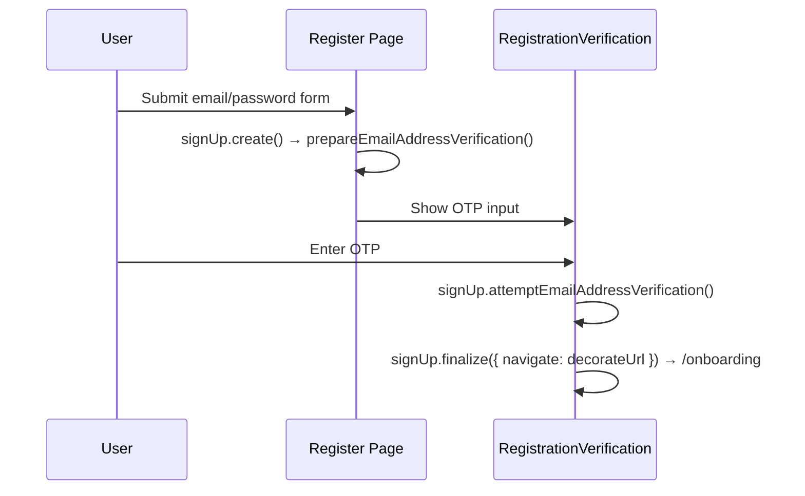
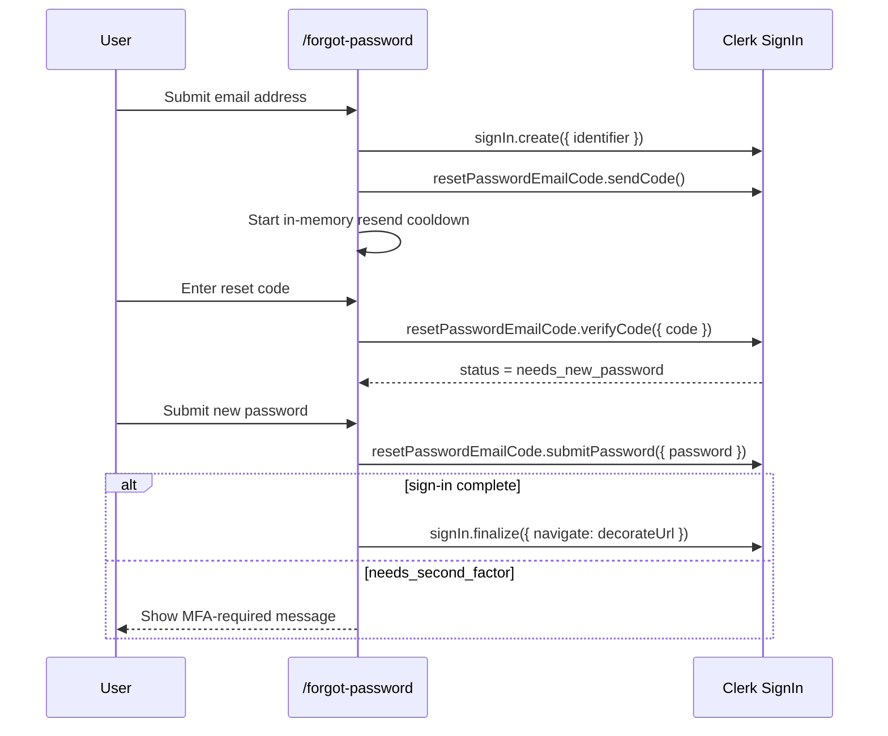

# AUTH Flows

> Email/password sign-in, sign-up verification, forgot-password, and the local controller/view boundaries that support them.

---

## 1. Core Philosophy

- Route components stay thin and select between local controllers or views
- Flow hooks own Clerk orchestration and auth state transitions
- Presentational auth views receive render-safe props only

---

## 2. Architecture Overview

### 2.1 Covered Journeys

- `/login`
- `/register`
- registration email verification
- `/forgot-password`

### 2.2 Login / Register / Reset Map

```
/login
  page.tsx -> use-login-flow.ts -> LoginFormView / VerificationView

/register
  page.tsx -> RegisterForm -> use-register-flow.ts -> RegistrationVerificationView

/forgot-password
  page.tsx -> use-forgot-password-flow.ts
           -> ForgotPasswordEmailEntry -> EmailEntryView
           -> ForgotPasswordReset -> ResetPasswordView
```

---

## 3. Key Files & Entry Points

| File                                                                                | Purpose                                                                                                        | When to Read                                                   |
| ----------------------------------------------------------------------------------- | -------------------------------------------------------------------------------------------------------------- | -------------------------------------------------------------- |
| `apps/frontend/app/(auth)/login/page.tsx`                                           | Thin login route controller that switches between password sign-in and Client Trust verification views         | Any login page composition change                              |
| `apps/frontend/app/components/auth/login/use-login-flow.ts`                         | Login controller hook — Clerk sign-in orchestration, auth notices, Client Trust, and SSO start handlers        | Any login behavior or redirect change                          |
| `apps/frontend/app/components/auth/register/register-form.tsx`                      | Register form — email/password + Google/Apple SSO handlers                                                     | Any register change                                            |
| `apps/frontend/app/components/auth/register/use-register-flow.ts`                   | Register controller hook for email/password sign-up, SSO initiation, and OTP verification                      | Register controller changes                                    |
| `apps/frontend/app/components/auth/register/register-terms-field.tsx`               | Controlled, accessible HeroUI terms agreement with independently reachable legal links                         | Registration terms or Checkbox composition changes             |
| `apps/frontend/app/components/auth/registration-verification-view.tsx`              | Render-only email OTP verification view                                                                        | Email verification UI changes                                  |
| `apps/frontend/app/components/auth/registration-verification.tsx`                   | Thin registration verification controller                                                                      | Email verification composition changes                         |
| `apps/frontend/app/components/auth/use-registration-verification-flow.ts`           | Email OTP verification flow hook                                                                               | Verification behavior changes                                  |
| `apps/frontend/app/(auth)/forgot-password/page.tsx`                                 | Thin forgot-password route controller                                                                          | Forgot-password page composition changes                       |
| `apps/frontend/app/components/auth/forgot-password/use-forgot-password-flow.ts`     | Forgot-password page controller hook that owns Clerk reset state transitions and the in-memory resend cooldown | App-layer forgot-password controller changes                   |
| `apps/frontend/app/components/auth/forgot-password/forgot-password-email-entry.tsx` | Local email-step form controller that owns RHF wiring for the forgot-password entry step                       | Forgot-password form-structure changes                         |
| `apps/frontend/app/components/auth/forgot-password/forgot-password-reset.tsx`       | Local reset-step form controller that owns RHF wiring for code verification / password reset UI                | Forgot-password form-structure changes                         |
| `apps/frontend/app/components/auth/auth-logo.tsx`                                   | Shared accessible home-link wordmark with explicit contrast variants and supported auth display sizes          | Auth logo behavior, variants, sizing, or accessibility changes |
| `apps/frontend/app/components/auth/auth-brand-panel.tsx`                            | Shared desktop auth brand panel with fixed branding, decorative grid treatment, and route-content composition   | Desktop auth brand-panel composition or styling changes        |
| `apps/frontend/app/components/auth/login/login-brand-panel-content.tsx`              | Login-only miniature resume reminder and returning-user copy                                                    | Desktop login brand storytelling changes                       |
| `apps/frontend/app/components/auth/auth-marketing-panel.tsx`                        | Shared desktop registration brand panel and inverse logo treatment                                             | Register branding or marketing-panel changes                   |
| `apps/frontend/public/brand/tailorcv-mark-*.svg`                                    | Primary, inverse, and monochrome variants of the shared TailorCV shield/T mark                                 | Auth logo geometry, color, or contrast changes                 |
| `apps/frontend/lib/config/constants.ts`                                             | Stable public paths for the shared logo variants                                                               | Adding or renaming brand assets                                |
| `apps/frontend/lib/auth/clerk-flow.ts`                                              | Small Clerk-status decision helpers for login and forgot-password custom flows                                 | Auditing or changing Clerk state handling                      |
| `apps/frontend/lib/schemas/auth.ts`                                                 | Zod schemas: login, register, forgotPassword, and resetPassword                                                | Adding/changing form fields                                    |

---

## 4. Data Flow

### 4.1 Email Sign-Up Verification Flow



### 4.2 Forgot-Password Flow



---

## 5. Component / Module Structure

```
app/components/auth/
├── login/
│   ├── use-login-flow.ts
│   ├── login-form-view.tsx
│   ├── login-brand-panel-content.tsx
│   ├── verification-view.tsx
│   └── branding-view.tsx
├── register/
│   ├── use-register-flow.ts
│   ├── register-form.tsx
│   └── register-form-view.tsx
├── registration-verification.tsx
├── use-registration-verification-flow.ts
└── forgot-password/
    ├── use-forgot-password-flow.ts
    ├── forgot-password-email-entry.tsx
    ├── forgot-password-reset.tsx
    ├── email-entry-view.tsx
    └── reset-password-view.tsx
```

---

## 6. Patterns & Conventions

### 6.1 finalize() with decorateUrl

```typescript
await signUp.finalize({
  navigate: async ({ session, decorateUrl }) => {
    if (session?.currentTask) return;
    const url = decorateUrl(config.auth.afterSignUpUrl);
    if (url.startsWith('http')) {
      window.location.href = url;
    } else {
      router.push(url);
    }
  },
});
```

### 6.2 Forgot-Password State Progression

```typescript
await signIn.create({ identifier: emailAddress });
await signIn.resetPasswordEmailCode.sendCode();

const verifyResult = await signIn.resetPasswordEmailCode.verifyCode({ code });
if (verifyResult.error) {
  // Render the returned ClerkError via getClerkErrorMessage()
}

if (signIn.status === 'needs_new_password') {
  // Show the new-password form only after Clerk advances to this state.
}

const passwordResult = await signIn.resetPasswordEmailCode.submitPassword({
  password,
});
if (passwordResult.error) {
  // Render the returned ClerkError via getClerkErrorMessage().
} else if (signIn.status === 'complete') {
  await signIn.finalize({ navigate: decorateUrl });
} else if (signIn.status === 'needs_second_factor') {
  // Surface an explicit MFA-required state.
}
```

### 6.3 Login Client Trust vs MFA

```typescript
if (signIn.status === 'needs_client_trust') {
  await signIn.mfa.sendEmailCode();
}
```

- `needs_client_trust`: trusted-device verification for password sign-in; use `signIn.mfa.sendEmailCode()` / `signIn.mfa.verifyEmailCode()`
- `needs_second_factor`: account-level MFA; do not route this through the Client Trust email-code UI unless the product adds dedicated MFA support

### 6.4 Login Redirect Context

```typescript
router.push(buildLoginUrl({ reason: 'second_factor_required' }));
```

- `primary_required`: OAuth is not the account's primary sign-in method here
- `second_factor_required`: Clerk requires MFA / email-code verification after password sign-in
- `reset_password_required`: Clerk requires a password reset before sign-in can complete

### 6.5 Register Password Confirmation

Email/password registration validates `password` and `confirmPassword` locally in `registerSchema` before Clerk submission. `useRegisterFlow()` still sends only `emailAddress` and `password` to `signUp.password()`, so confirmation remains a local guard and is never sent to Clerk or the backend.

### 6.6 Responsive Auth Brand Marks

Auth surfaces use one shield/T silhouette from `apps/frontend/public/brand/`
with contrast-specific variants:

- `tailorcv-mark-primary.svg` on light backgrounds
- `tailorcv-mark-inverse.svg` on the dark desktop marketing panels
- `tailorcv-mark-monochrome.svg` when a neutral one-color treatment is required

`AuthLogo` owns the variant-to-asset mapping, the 32px and 40px auth display
sizes, and the accessible home-link contract. Its default is the primary mark;
authentication marketing panels request the inverse variant explicitly for the
white-on-accent treatment.

The adjacent `TailorCV` text supplies the accessible link name, so decorative
mark images use empty alternative text and do not repeat the brand name.

Login and registration retain a centered mobile brand link. Password recovery
intentionally omits the mobile/reset-card logo to keep the narrow recovery task
focused; the desktop email-entry marketing panel still uses the inverse mark.

### 6.7 Split-Layout Form Panel

Login, registration, and the forgot-password email-entry screen use the shared
`auth-form-panel` utility from `apps/frontend/app/globals.css`. It owns the
responsive form-column background, flex centering, small-viewport minimum
height, width, and padding contract used beside the desktop auth marketing
panel. Their inner containers use the companion `auth-form-content` utility,
which owns the centered full-width constraint, `27.5rem` maximum width through
Tailwind's spacing scale, and shared vertical rhythm. Animation, branding, and
page-specific content remain owned by each view.

Login and registration also use `auth-form-mobile-logo` for their shared
small-screen logo positioning. Forgot-password email entry deliberately does
not use that utility because it no longer renders a mobile logo.

On desktop, login, registration, and forgot-password email entry render the
shared `AuthBrandPanel`. The inset panel uses the fixed `w-122` spacing token,
while `auth-form-panel` fills the remaining row width and keeps its constrained
form content centered. Mobile hides the brand panel and retains the existing
single-column form layouts.

#### 6.7.1 Login Resume Reminder Composition

`AuthBrandPanel` owns the invariant inverse logo, canonical HeroUI `accent`
surface, white-derived faded grid, and desktop visibility. Its optional child
region lets an auth route add non-essential brand storytelling without coupling
the shared shell to a route.

The login route composes `LoginBrandPanelContent` into that region. The content
uses one flat, miniature resume page with familiar experience, project, and
skills structure, followed by a short welcome-back message. The preview avoids
scores, workflow states, and speculative product behavior because returning
users only need a recognizable reminder of the document they work on in
TailorCV. It uses an inverse translucent frame over the canonical accent surface
and semantic surface, neutral, and separator roles for the document itself. It
has no actions, state, user data, or authentication responsibility. Registration
and forgot-password currently omit route-specific panel content and retain only
the shared logo and background treatment.

### 6.8 Password-Recovery Email Privacy

`ResetPasswordView` masks the submitted email with `maskdata` before including
it in verification and new-password guidance. The flow hook retains the real
email because Clerk resend calls still require the active reset attempt; only
the user-facing description receives the masked value.

### 6.9 In-Memory Resend Cooldown

After Clerk successfully sends the initial reset code,
`useForgotPasswordFlow()` records one absolute resend-availability timestamp in
React state and initializes the visible remaining seconds. A dependent effect
recalculates the countdown from that timestamp every second and clears both
values when the cooldown expires.

The cooldown is deliberately not persisted. Reloading `/forgot-password`
restarts the local flow at email entry, so restoring only the timer would not
restore a usable Clerk reset attempt or verification screen. Clerk remains the
authoritative security rate limiter if a reload or other client-controlled action
discards this UI state.

`handleResend()` rejects calls while the timestamp is still in the future or a
resend request is already pending. A successful resend renews the full cooldown
and shows confirmation feedback; a failed resend leaves both cooldown values
`null` so the user can retry. The route passes `remainingSeconds` through the
reset controller to `ResetPasswordView`, which disables the resend control and
renders either the countdown, the pending-request state, or the available action.

### 6.10 Fresh Forgot-Password Attempts

The route does not resume a Clerk password-reset attempt after its local React
state has been discarded. It always renders the email-entry step after a reload.
Before submitting that email, `handleEmailSubmit()` calls `signIn.reset()` and
then creates a new Clerk sign-in attempt, preventing a persisted
`needs_new_password` status from silently restoring the password-entry screen.

Choosing **Use a different email** also attempts to reset Clerk before returning
to email entry. Local email, code, and cooldown state are cleared even when that
best-effort reset reports or throws an error; the next email submission retries
the reset before creating its fresh attempt.

### 6.11 Toast-Only Forgot-Password Feedback

The forgot-password flow reports Clerk and flow-level failures through HeroUI
toasts owned by `useForgotPasswordFlow()`. The route, form controllers, and views
do not carry a separate `globalError` value or render a duplicate global-error
surface. React Hook Form and Zod validation errors remain inline beside their
corresponding fields because they identify input the user can correct directly.

Retryable failures use the standard toast duration. Terminal failures that occur
after password submission, including MFA-required, unexpected Clerk status, and
session-finalization outcomes, use persistent toasts so the explanation remains
available until the user dismisses it.

---

## 7. Integration Points

| Domain                  | Relationship                                                        | Key Interface                                               |
| ----------------------- | ------------------------------------------------------------------- | ----------------------------------------------------------- |
| Middleware (`proxy.ts`) | Auth determines public/protected route access                       | `isPublicRoute`, `isAuthRoute`, `isProtectedRoute` matchers |
| Dashboard               | After sign-in, user is sent to dashboard                            | `config.auth.afterSignInUrl`                                |
| Onboarding              | After sign-up, user is sent to onboarding                           | `config.auth.afterSignUpUrl`                                |
| SSO                     | OAuth flows can redirect back into login with `auth_reason` context | `buildLoginUrl()`                                           |

---

## 8. Implementation Status

- [x] Login controller/view split
- [x] Register controller/view split
- [x] Registration verification controller/view split
- [x] Forgot-password controller/view split
- [x] Clerk status helper coverage for login and forgot-password
- [x] Shared primary/inverse shield mark across login and registration, plus the desktop password-recovery marketing panel
- [x] Login-only desktop resume reminder composed into the shared brand panel
- [x] Masked email context in password-recovery verification and password entry
- [x] In-memory resend timestamp and ticking countdown state
- [x] Success feedback after Clerk confirms a reset-code resend
- [x] Cooldown-aware resend disabling, successful renewal, failure retry, and duplicate-request protection
- [x] Fresh Clerk reset attempt before a new email submission and when abandoning the active flow
- [x] Toast-only Clerk and flow feedback with inline field validation retained

---

## 9. Risks & Mitigations

| Risk                                                          | Mitigation                                                                                                         |
| ------------------------------------------------------------- | ------------------------------------------------------------------------------------------------------------------ |
| Client Trust incorrectly handled as generic second factor     | Treat `needs_client_trust` as its own Clerk state and use `signIn.mfa.*` email-code APIs                           |
| Forgot-password silently stalls after successful Clerk calls  | Treat returned `{ error }` payloads and unexpected post-submit statuses as first-class UI states                   |
| In-memory cooldown is mistaken for security enforcement       | Treat the countdown as mounted-flow feedback and leave authoritative abuse protection to Clerk                     |
| Reload leaves Clerk's prior reset attempt available locally   | Ignore status restoration, reset Clerk before the next email submission, and restart the local flow at email entry |
| Duplicate reset-code requests overlap                         | Disable the view while pending and guard both active cooldown and in-flight state inside the flow hook             |
| Terminal reset outcome disappears before it can be understood | Keep terminal HeroUI error toasts visible until the user dismisses them                                            |
| View files start re-owning RHF setup                          | Keep RHF/schema wiring in flow hooks or local controllers, not render-only view files                              |

---

---

## 10. History & Decisions

- **Changelog:** [changelog.md](changelog.md)
- **Active architecture decision:** [ADR 0002: Keep UI Resend Cooldown In Memory](adr/0002-keep-ui-resend-cooldown-in-memory.md)
- **Superseded decision:** [ADR 0001: Use Session Storage For UI Resend Cooldown](adr/0001-use-session-storage-for-ui-resend-cooldown.md)
- Historical domain-level entries may also live in the parent changelog.
