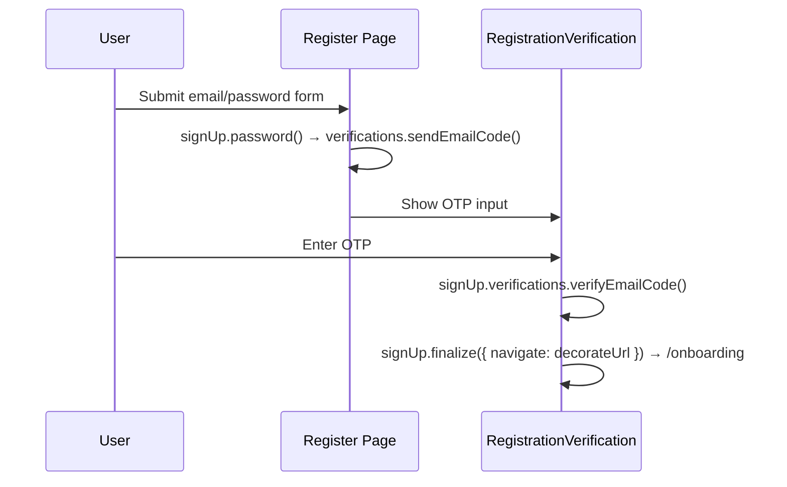
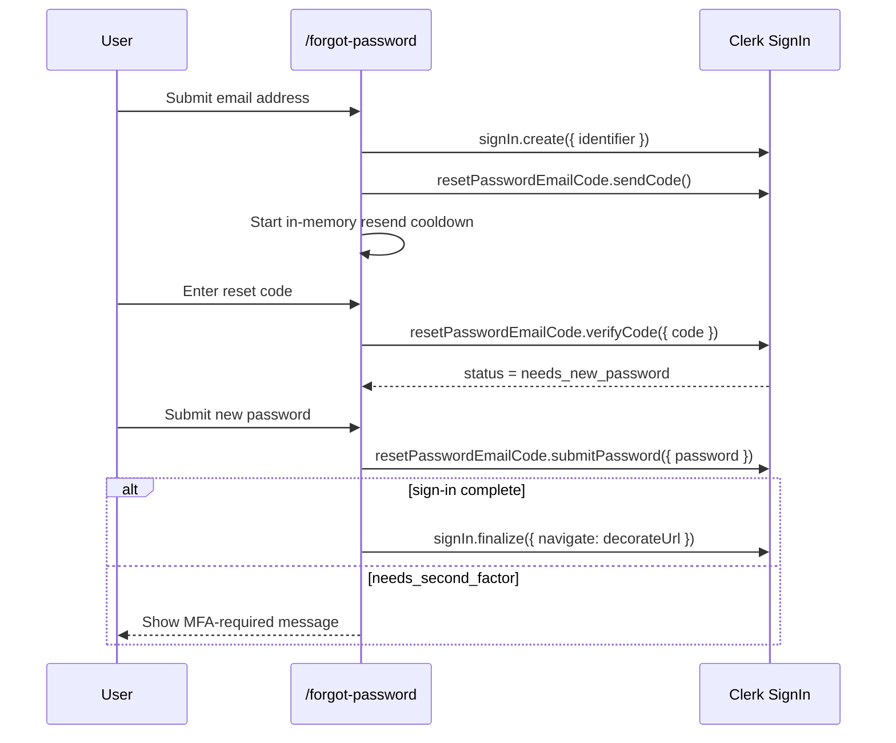

# AUTH Flows

> Email/password sign-in, sign-up verification, forgot-password, and the local controller/view boundaries that support them.

---

## 1. Core Philosophy

- Route components stay thin and select between local controllers or views
- Flow hooks own Clerk orchestration and auth state transitions
- Presentational auth views receive render-safe props only

---

## 2. Architecture Overview

### 2.1 Covered Journeys

- `/login`
- `/register`
- registration email verification
- `/forgot-password`

### 2.2 Login / Register / Reset Map

```
/login
  page.tsx -> use-login-flow.ts -> LoginFormView / VerificationView

/register
  page.tsx -> RegisterForm -> use-register-flow.ts -> RegistrationVerificationView

/forgot-password
  page.tsx -> use-forgot-password-flow.ts
           -> ForgotPasswordEmailEntry -> EmailEntryView
           -> ForgotPasswordReset -> ResetPasswordView
```

---

## 3. Key Files & Entry Points

| File                                                                                        | Purpose                                                                                                                        | When to Read                                                   |
| ------------------------------------------------------------------------------------------- | ------------------------------------------------------------------------------------------------------------------------------ | -------------------------------------------------------------- |
| `apps/frontend/app/(auth)/login/page.tsx`                                                   | Thin login route controller that switches between password sign-in and Client Trust verification views                         | Any login page composition change                              |
| `apps/frontend/app/components/auth/login/use-login-flow.ts`                                 | Login controller hook — Clerk sign-in orchestration, auth notices, Client Trust, and SSO start handlers                        | Any login behavior or redirect change                          |
| `apps/frontend/app/components/auth/login/login-form-view.tsx`                               | Presentational login form with browser field semantics, watched-email recovery handoff, and entrance targets                   | Login form structure, accessibility, or presentation changes   |
| `apps/frontend/app/components/auth/register/register-form.tsx`                              | Register form — email/password + Google/Apple SSO handlers                                                                     | Any register change                                            |
| `apps/frontend/app/components/auth/register/register-brand-panel-content.tsx`               | Register-only resume illustration and new-user brand copy                                                                      | Desktop register brand storytelling changes                    |
| `apps/frontend/app/components/auth/register/use-register-flow.ts`                           | Register controller hook for email/password sign-up, SSO initiation, and OTP verification                                      | Register controller changes                                    |
| `apps/frontend/app/components/auth/register/register-terms-field.tsx`                       | Controlled, accessible HeroUI terms agreement with independently reachable legal links                                         | Registration terms or Checkbox composition changes             |
| `apps/frontend/app/components/auth/registration-verification-view.tsx`                      | Render-only email OTP verification view                                                                                        | Email verification UI changes                                  |
| `apps/frontend/app/components/auth/registration-verification.tsx`                           | Thin registration verification controller                                                                                      | Email verification composition changes                         |
| `apps/frontend/app/components/auth/use-registration-verification-flow.ts`                   | Email OTP verification flow hook                                                                                               | Verification behavior changes                                  |
| `apps/frontend/app/(auth)/forgot-password/page.tsx`                                         | Thin forgot-password route controller that selects the active flow step                                                        | Forgot-password page composition changes                       |
| `apps/frontend/app/components/auth/forgot-password/use-forgot-password-flow.ts`             | Forgot-password page controller hook that owns Clerk reset state, one-shot email prefill cleanup, and the resend cooldown       | App-layer forgot-password controller changes                   |
| `apps/frontend/app/components/auth/forgot-password/forgot-password-email-entry.tsx`         | Local email-step form controller that owns RHF wiring for the forgot-password entry step                                       | Forgot-password form-structure changes                         |
| `apps/frontend/app/components/auth/forgot-password/forgot-password-reset.tsx`               | Local reset-step form controller that owns RHF wiring for code verification / password reset UI                                | Forgot-password form-structure changes                         |
| `apps/frontend/app/components/auth/forgot-password/forgot-password-brand-panel-content.tsx` | Forgot-password recovery illustration and desktop reassurance copy                                                             | Desktop recovery brand storytelling changes                    |
| `apps/frontend/app/components/auth/forgot-password/email-entry-view.tsx`                    | Presentational recovery email form with responsive heading and CSS entrance targets                                            | Forgot-password email-entry presentation changes               |
| `apps/frontend/app/components/auth/forgot-password/reset-password-view.tsx`                 | Presentational reset-code and new-password card with CSS entrance targets                                                      | Reset-card presentation or OTP composition changes             |
| `apps/frontend/app/components/auth/auth-logo.tsx`                                           | Shared accessible home-link wordmark with explicit contrast variants and supported auth display sizes                          | Auth logo behavior, variants, sizing, or accessibility changes |
| `apps/frontend/app/components/auth/auth-brand-panel.tsx`                                    | Shared desktop auth brand panel with fixed branding, decorative grid treatment, and route-content composition                  | Desktop auth brand-panel composition or styling changes        |
| `apps/frontend/app/components/auth/login/login-brand-panel-content.tsx`                     | Login-only resume-tailoring illustration and returning-user copy                                                               | Desktop login brand storytelling changes                       |
| `apps/frontend/public/images/auth/login-illustration.webp`                                  | Transparent login-panel illustration of a resume being tailored                                                                | Login illustration artwork or delivery changes                 |
| `apps/frontend/public/images/auth/register-illustration.webp`                               | Transparent register-panel illustration of a new resume taking shape                                                           | Register illustration artwork or delivery changes              |
| `apps/frontend/public/images/auth/forgot-password-illustration.webp`                        | Transparent recovery-panel illustration of secured resume access                                                               | Forgot-password illustration artwork or delivery changes       |
| `apps/frontend/app/components/auth/auth-marketing-panel.tsx`                                | Shared desktop registration brand panel and inverse logo treatment                                                             | Register branding or marketing-panel changes                   |
| `apps/frontend/public/brand/tailorcv-mark-*.svg`                                            | Primary, inverse, and monochrome variants of the shared TailorCV shield/T mark                                                 | Auth logo geometry, color, or contrast changes                 |
| `apps/frontend/lib/config/constants.ts`                                                     | Stable public paths for the shared logo variants                                                                               | Adding or renaming brand assets                                |
| `apps/frontend/lib/auth/clerk-flow.ts`                                                      | Small Clerk-status decision helpers for login and forgot-password custom flows                                                 | Auditing or changing Clerk state handling                      |
| `apps/frontend/lib/schemas/auth.ts`                                                         | Zod schemas: login, register, forgotPassword, and resetPassword                                                                | Adding/changing form fields                                    |

---

## 4. Data Flow

### 4.1 Email Sign-Up Verification Flow



### 4.2 Forgot-Password Flow



---

## 5. Component / Module Structure

```
app/components/auth/
├── login/
│   ├── use-login-flow.ts
│   ├── login-form-view.tsx
│   ├── login-brand-panel-content.tsx
│   ├── verification-view.tsx
│   └── branding-view.tsx
├── register/
│   ├── use-register-flow.ts
│   ├── register-form.tsx
│   ├── register-form-view.tsx
│   └── register-brand-panel-content.tsx
├── registration-verification.tsx
├── use-registration-verification-flow.ts
└── forgot-password/
    ├── use-forgot-password-flow.ts
    ├── forgot-password-email-entry.tsx
    ├── forgot-password-reset.tsx
    ├── forgot-password-brand-panel-content.tsx
    ├── email-entry-view.tsx
    └── reset-password-view.tsx
```

---

## 6. Patterns & Conventions

### 6.1 finalize() with decorateUrl

```typescript
await signUp.finalize({
  navigate: async ({ session, decorateUrl }) => {
    if (session?.currentTask) return;
    const url = decorateUrl(config.auth.afterSignUpUrl);
    if (url.startsWith('http')) {
      window.location.href = url;
    } else {
      router.push(url);
    }
  },
});
```

### 6.2 Forgot-Password State Progression

```typescript
await signIn.create({ identifier: emailAddress });
await signIn.resetPasswordEmailCode.sendCode();

const verifyResult = await signIn.resetPasswordEmailCode.verifyCode({ code });
if (verifyResult.error) {
  // Render the returned ClerkError via getClerkErrorMessage()
}

if (signIn.status === 'needs_new_password') {
  // Show the new-password form only after Clerk advances to this state.
}

const passwordResult = await signIn.resetPasswordEmailCode.submitPassword({
  password,
  signOutOfOtherSessions: true,
});
if (passwordResult.error) {
  // Render the returned ClerkError via getClerkErrorMessage().
} else if (signIn.status === 'complete') {
  await signIn.finalize({ navigate: decorateUrl });
} else if (signIn.status === 'needs_second_factor') {
  // Surface an explicit MFA-required state.
}
```

The code-verification handler advances only when Clerk reports
`needs_new_password`. Any other successful response remains on the code step;
the current implementation does not yet surface a dedicated unexpected-status
message at this boundary.

### 6.3 Login Client Trust vs MFA

```typescript
if (signIn.status === 'needs_client_trust') {
  await signIn.mfa.sendEmailCode();
}
```

- `needs_client_trust`: trusted-device verification for password sign-in; use `signIn.mfa.sendEmailCode()` / `signIn.mfa.verifyEmailCode()`
- `needs_second_factor`: account-level MFA; do not route this through the Client Trust email-code UI unless the product adds dedicated MFA support

### 6.4 Login Redirect Context

```typescript
router.push(buildLoginUrl({ reason: 'second_factor_required' }));
```

- `primary_required`: OAuth is not the account's primary sign-in method here
- `second_factor_required`: Clerk requires MFA / email-code verification after password sign-in
- `reset_password_required`: Clerk requires a password reset before sign-in can complete

### 6.5 Register Password Confirmation

Email/password registration validates `password` and `confirmPassword` locally in `registerSchema` before Clerk submission. `useRegisterFlow()` still sends only `emailAddress` and `password` to `signUp.password()`, so confirmation remains a local guard and is never sent to Clerk or the backend.

The verification screen's change-email action calls `signUp.reset()` before
returning to the form. A returned or thrown reset failure leaves verification
active and reports the Clerk failure through a HeroUI danger toast so the UI
never claims that Clerk abandoned the pending attempt when it did not.

### 6.6 Responsive Auth Brand Marks

Auth surfaces use one shield/T silhouette from `apps/frontend/public/brand/`
with contrast-specific variants:

- `tailorcv-mark-primary.svg` on light backgrounds
- `tailorcv-mark-inverse.svg` on the dark desktop marketing panels
- `tailorcv-mark-monochrome.svg` when a neutral one-color treatment is required

`AuthLogo` owns the variant-to-asset mapping, the 32px and 40px auth display
sizes, and the accessible home-link contract. Its default is the primary mark;
authentication marketing panels request the inverse variant explicitly for the
white-on-accent treatment.

The adjacent `TailorCV` text supplies the accessible link name, so decorative
mark images use empty alternative text and do not repeat the brand name.

Login and registration retain a centered mobile brand link. Password recovery
intentionally omits the mobile/reset-card logo to keep the narrow recovery task
focused; the desktop email-entry marketing panel still uses the inverse mark.

### 6.7 Split-Layout Form Panel

Login, registration, and the forgot-password email-entry screen use the shared
`auth-form-panel` utility from `apps/frontend/app/globals.css`. It owns the
responsive form-column background, flex centering, small-viewport minimum
height, width, and padding contract used beside the desktop auth marketing
panel. Their inner containers use the companion `auth-form-content` utility,
which owns the centered full-width constraint, `27.5rem` maximum width through
Tailwind's spacing scale, and shared vertical rhythm. Animation, branding, and
page-specific content remain owned by each view.

Login and registration also use `auth-form-mobile-logo` for their shared
small-screen logo positioning. Forgot-password email entry deliberately does
not use that utility because it no longer renders a mobile logo.

Login, registration, and forgot-password entrance motion is implemented with
CSS keyframes scoped beneath their route-specific form parents and attached to
shared layout classes plus semantic item targets. Repeated vertical and fade
treatments reuse shared keyframes while element classes own their individual
delays. Registration verification and the recovery reset card use dedicated
targets so their shorter scale and vertical treatments remain unchanged. This
keeps the static auth views free of JavaScript animation wrappers, prevents
sequences from leaking into other routes, and disables decorative motion for
reduced-motion users.

The login email field identifies itself to browser autofill and disables
spellchecking, while the password field requests the existing account password
through `current-password`. These hints do not change Clerk validation or
submission ownership.

All three entry forms use `auth-form-mobile-intro` for their route title and
description. The introduction remains visible and centered on smaller screens.
Login and registration remove their form introductions from layout and the
accessibility tree on desktop because their route-specific brand-panel headings
own that context there. Forgot-password currently keeps its form introduction
visually hidden but accessible on desktop while also rendering recovery copy in
the brand panel.

On desktop, login, registration, and forgot-password email entry render the
shared `AuthBrandPanel`. The inset panel uses the fixed `w-122` spacing token,
while `auth-form-panel` fills the remaining row width and keeps its constrained
form content centered. Mobile hides the brand panel and retains the existing
single-column form layouts.

#### 6.7.1 Login Resume Reminder Composition

`AuthBrandPanel` owns the invariant inverse logo pinned to its top-left corner,
canonical HeroUI `accent` surface, white-derived faded grid, and desktop
visibility. Its optional child region lets an auth route add non-essential
brand storytelling without coupling the shared shell to a route.

The login route composes `LoginBrandPanelContent` into that region. The content
uses a transparent WebP illustration of a resume being tailored, followed by a
short welcome-back message. The artwork gives returning users a recognizable
reminder of the document they work on without presenting scores, workflow
states, or speculative product behavior. Its colors remain fixed across
application themes because it is displayed on the theme-independent accent
panel. The illustration is decorative, eagerly loaded for the desktop entrance
sequence, and rendered without Next.js re-encoding to preserve its intended
quality. The accompanying copy provides the accessible login heading on
desktop. On smaller screens, the entire brand panel is hidden and the visible
form introduction provides that heading instead. It has no actions, state, user
data, or authentication responsibility.

#### 6.7.2 Register Resume Beginning Composition

The registration route composes `RegisterBrandPanelContent` into the shared
panel. Its transparent WebP presents a new resume taking shape and pairs that
new-user story with the “Start with your story.” heading. The image is
decorative, eagerly loaded into the same square presentation slot as login,
contained without distorting its portrait source, and delivered without Next.js
re-encoding. The desktop copy owns the page heading while the mobile form
introduction becomes the visible heading when the panel is hidden.

Registration keeps its original form and verification timings through
route-scoped CSS classes. The form sequence reuses shared entrance keyframes;
the verification card and code input retain their shorter scale and vertical
treatments through dedicated classes. The verification code uses HeroUI's
`secondary` `InputOTP` treatment so its slots remain distinct from the Card
surface. These presentation layers have no Clerk, form-state, CAPTCHA,
navigation, or verification-flow responsibility.

#### 6.7.3 Forgot-Password Recovery Composition

The forgot-password email-entry route composes
`ForgotPasswordBrandPanelContent` into the shared desktop panel. Its transparent
WebP presents a secured resume-access metaphor beside concise recovery copy. The
decorative image is eagerly loaded, delivered without Next.js re-encoding, and
fades in through the route's reduced-motion-aware CSS sequence.

The email form and staged reset card replace fixed Framer Motion wrappers with
semantic CSS targets while preserving their original durations, delays,
translations, and card scale entrance. The reset-code control uses HeroUI's
`secondary` `InputOTP` treatment, and the new-password fields use the matching
`secondary` `Input` treatment, because they sit on a Card surface. This keeps
the controls distinct in both light and dark themes without changing the global
field tokens. These presentation changes do not alter Clerk reset state, resend
cooldowns, password validation, or navigation.

### 6.8 Password-Recovery Email Privacy

`ResetPasswordView` masks the submitted email with `maskdata` before including
it in verification and new-password guidance. The flow hook retains the real
email because Clerk resend calls still require the active reset attempt; only
the user-facing description receives the masked value.

### 6.9 In-Memory Resend Cooldown

After Clerk successfully sends the initial reset code,
`useForgotPasswordFlow()` records one absolute resend-availability timestamp in
React state and initializes the visible remaining seconds. A dependent effect
recalculates the countdown from that timestamp every second and clears both
values when the cooldown expires.

The cooldown is deliberately not persisted. Reloading `/forgot-password`
restarts the local flow at email entry, so restoring only the timer would not
restore a usable Clerk reset attempt or verification screen. Clerk remains the
authoritative security rate limiter if a reload or other client-controlled action
discards this UI state.

`handleResend()` rejects calls while the timestamp is still in the future or a
resend request is already pending. A successful resend renews the full cooldown
and shows confirmation feedback; a failed resend leaves both cooldown values
`null` so the user can retry. The route passes `remainingSeconds` through the
reset controller to `ResetPasswordView`, which disables the resend control and
renders either the countdown, the pending-request state, or the available action.

### 6.10 Fresh Forgot-Password Attempts

The route does not resume a Clerk password-reset attempt after its local React
state has been discarded. It always renders the email-entry step after a reload.
Before submitting that email, `handleEmailSubmit()` calls `signIn.reset()` and
then creates a new Clerk sign-in attempt, preventing a persisted
`needs_new_password` status from silently restoring the password-entry screen.

Choosing **Use a different email** also attempts to reset Clerk before returning
to email entry. Local email, code, and cooldown state are cleared even when that
best-effort reset reports or throws an error; the next email submission retries
the reset before creating its fresh attempt.

### 6.11 Toast-Only Auth Flow Feedback

The login, registration, and forgot-password flows report Clerk and flow-level
failures through HeroUI toasts owned by their controller hooks. Registration
uses the same feedback surface during email-code verification, so its OTP view
contract does not carry a separate `globalError` value or render an
`AnimatedError` surface. React Hook Form and Zod validation errors remain inline
beside their corresponding fields because they identify input the user can
correct directly.

Registration verification failures use the standard toast duration while the
active OTP screen remains mounted for correction or retry. Controllers that
classify an outcome as terminal can opt into persistent toasts so the
explanation remains available until the user dismisses it.

### 6.12 Login-To-Recovery Email Handoff

`LoginFormView` watches the current email field and adds it to the forgot-password
link as an encoded `email` query parameter. On `/forgot-password`,
`useForgotPasswordFlow()` exposes that value as a one-shot form prefill and removes
only the `email` parameter with `router.replace()`. The mounted local RHF
controller receives the prefill before the cleaned search params propagate and
retains its field value after the query disappears.

This keeps the email out of the visible URL after initialization while preserving
unrelated query parameters. If the user later returns from the active reset flow,
the email controller remounts without the already-consumed prefill, so the old
login email is not restored. Query parsing and cleanup remain inside the feature
flow hook, while the route only selects the active controller.

---

## 7. Integration Points

| Domain                  | Relationship                                                        | Key Interface                                               |
| ----------------------- | ------------------------------------------------------------------- | ----------------------------------------------------------- |
| Middleware (`proxy.ts`) | Auth determines public/protected route access                       | `isPublicRoute`, `isAuthRoute`, `isProtectedRoute` matchers |
| Dashboard               | After sign-in, user is sent to dashboard                            | `config.auth.afterSignInUrl`                                |
| Onboarding              | After sign-up, user is sent to onboarding                           | `config.auth.afterSignUpUrl`                                |
| SSO                     | OAuth flows can redirect back into login with `auth_reason` context | `buildLoginUrl()`                                           |

---

## 8. Implementation Status

- [x] Login controller/view split
- [x] Register controller/view split
- [x] Registration verification controller/view split
- [x] Forgot-password controller/view split
- [x] Clerk status helper coverage for login and forgot-password
- [x] Shared primary/inverse shield mark across login and registration, plus the desktop password-recovery marketing panel
- [x] Login-only desktop resume reminder composed into the shared brand panel
- [x] Register-only desktop resume beginning composed into the shared brand panel
- [x] Masked email context in password-recovery verification and password entry
- [x] In-memory resend timestamp and ticking countdown state
- [x] Success feedback after Clerk confirms a reset-code resend
- [x] Cooldown-aware resend disabling, successful renewal, failure retry, and duplicate-request protection
- [x] Fresh Clerk reset attempt before a new email submission and when abandoning the active flow
- [x] Clerk reset before registration email correction; fresh social entry delegates directly to `signUp.sso()`
- [x] Toast-only login, registration, and forgot-password flow feedback with inline field validation retained
- [x] Login email handoff into forgot-password with immediate query cleanup
- [x] Reset-code status gate before password entry and other-session sign-out after password replacement

---

## 9. Risks & Mitigations

| Risk                                                          | Mitigation                                                                                                         |
| ------------------------------------------------------------- | ------------------------------------------------------------------------------------------------------------------ |
| Client Trust incorrectly handled as generic second factor     | Treat `needs_client_trust` as its own Clerk state and use `signIn.mfa.*` email-code APIs                           |
| Forgot-password silently stalls after successful Clerk calls  | Treat returned `{ error }` payloads and unexpected post-submit statuses as first-class UI states                   |
| Successful code verification returns an unexpected status     | Keep the code step active and report the explicit status through a HeroUI danger toast                              |
| In-memory cooldown is mistaken for security enforcement       | Treat the countdown as mounted-flow feedback and leave authoritative abuse protection to Clerk                     |
| Reload leaves Clerk's prior reset attempt available locally   | Ignore status restoration, reset Clerk before the next email submission, and restart the local flow at email entry |
| Duplicate reset-code requests overlap                         | Disable the view while pending and guard both active cooldown and in-flight state inside the flow hook             |
| Terminal reset outcome disappears before it can be understood | Keep terminal HeroUI error toasts visible until the user dismisses them                                            |
| Registration returns to email entry without clearing Clerk    | Require a successful `signUp.reset()` before leaving the OTP screen                                                   |
| View files start re-owning RHF setup                          | Keep RHF/schema wiring in flow hooks or local controllers, not render-only view files                              |

---

---

## 10. History & Decisions

- **Changelog:** [changelog.md](changelog.md)
- **Active architecture decision:** [ADR 0002: Keep UI Resend Cooldown In Memory](adr/0002-keep-ui-resend-cooldown-in-memory.md)
- **Superseded decision:** [ADR 0001: Use Session Storage For UI Resend Cooldown](adr/0001-use-session-storage-for-ui-resend-cooldown.md)
- Historical domain-level entries may also live in the parent changelog.
