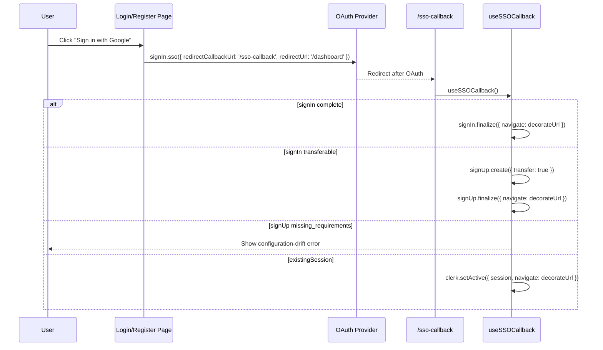

# AUTH SSO

> Google and Apple OAuth start flows, Clerk callback handling, transfer logic, and retired `/sso-continue` guard behavior.

---

## 1. Core Philosophy

- Treat OAuth as a separate state machine from password auth
- Let Clerk state determine OAuth outcome instead of relying on local intent markers
- Fail closed on public callback and retired continuation routes
- Keep OAuth start pages thin and put Clerk orchestration in hooks

---

## 2. Architecture Overview

```
User clicks "Continue with Google/Apple"
  -> signIn.sso() / signUp.sso()
  -> /sso-callback
  -> useSSOCallback()
     -> finalize sign-in
     -> transfer sign-in/sign-up
     -> redirect to /login with auth_reason
     -> surface configuration drift if Clerk still reports missing requirements
     -> setActive(existingSession)

/sso-continue
  -> redirect('/register') defensive route only
```

---

## 3. Key Files & Entry Points

| File | Purpose | When to Read |
| ---- | ------- | ------------ |
| `apps/frontend/app/components/auth/sso-callback/use-sso-callback.ts` | Core v7 SSO callback hook — all OAuth finalization logic | Any SSO flow change |
| `apps/frontend/app/sso-callback/page.tsx` | SSO callback page — delegates to `useSSOCallback` | SSO flow changes |
| `apps/frontend/app/(auth)/sso-continue/page.tsx` | Retired continuation route that redirects to registration | Defensive route behavior changes |
| `apps/frontend/lib/auth/reset-clerk-auth-resource.ts` | Runtime-compatible reset helper for clearing stale Clerk sign-in/sign-up attempts before OAuth | OAuth provider switching or cancellation issues |
| `apps/frontend/lib/auth/login-auth-reason.ts` | Fallback reason codes and `/login` notice mapping for incomplete OAuth sign-in | OAuth fallback UX changes |
| `apps/frontend/proxy.ts` | Clerk middleware — public/auth/protected route matchers | Route protection changes |

---

## 4. Data Flow

### 4.1 SSO Sign-In/Sign-Up Flow



---

## 5. Component / Module Structure

```
app/components/auth/
└── sso-callback/
    └── use-sso-callback.ts
```

---

## 6. Patterns & Conventions

### 6.1 SSO Initiation (Sign-In)

```typescript
await resetClerkAuthResource({ resource: signIn });
await signIn.sso({
  strategy: 'oauth_google',
  redirectCallbackUrl: '/sso-callback',
  redirectUrl: config.auth.afterSignInUrl,
});
```

### 6.2 SSO Initiation (Sign-Up)

```typescript
await resetClerkAuthResource({ resource: signUp });
await signUp.sso({
  strategy: 'oauth_google',
  redirectCallbackUrl: '/sso-callback',
  redirectUrl: config.auth.afterSignUpUrl,
});
```

### 6.3 OAuth Fallback Redirect Context

```typescript
router.push(buildLoginUrl({ reason: 'primary_required' }));
```

- `primary_required`: OAuth is not the account's primary sign-in method here
- `second_factor_required`: Clerk requires a second step after password sign-in
- `reset_password_required`: Clerk requires a password reset before sign-in can complete

---

## 7. Integration Points

| Domain | Relationship | Key Interface |
| ------ | ------------ | ------------- |
| Login | OAuth callback can send users back to `/login` with context | `buildLoginUrl()` |
| Onboarding | OAuth sign-up finalization lands here | `config.auth.afterSignUpUrl` |
| Dashboard | OAuth sign-in finalization lands here | `config.auth.afterSignInUrl` |
| Middleware (`proxy.ts`) | `/sso-continue` remains public only so the retired route can redirect defensively | public route config + `redirect('/register')` |

---

## 8. Implementation Status

- [x] Google OAuth sign-in
- [x] Apple OAuth sign-in
- [x] Google OAuth sign-up
- [x] Apple OAuth sign-up
- [x] SSO callback hook
- [x] Retired `/sso-continue` redirect route
- [x] Direct-navigation guard for `/sso-callback`

---

## 9. Risks & Mitigations

| Risk | Mitigation |
| ---- | ---------- |
| `redirectUrl`/`redirectCallbackUrl` swapped in `sso()` | Keep the param order from the examples above; never swap them |
| Clerk still requires first/last name after app removal | Surface the missing-requirements state as configuration drift on `/sso-callback`; update Clerk dashboard so account names are optional or disabled |
| Cancelled OAuth attempt reuses the previous provider on the next click | Call `resetClerkAuthResource({ resource })` before every `signIn.sso()` and `signUp.sso()` call |
| Transferred sign-up reports `missing_requirements` while the external account is still verifying | Defer the configuration-drift error until `signUp.verifications.externalAccount.status === 'verified'` |
| React StrictMode double-execution on SSO callback | `hasRun = useRef(false)` guard in `useSSOCallback` |
| Direct navigation to `/sso-callback` with no usable Clerk callback state | Fall through to `/login` instead of relying on a local sessionStorage marker |
| Direct navigation to `/sso-continue` | Redirect to `/register`; the continuation form has been retired |

---

## 10. Development Log

### [2026-04-20] - Defer Missing Requirements Until External Verification

- **Decision:** Only surface OAuth `missing_requirements` configuration drift after Clerk reports the external account as verified.
- **Problem:** During sign-in to sign-up transfer, Clerk can temporarily report `signUp.status === 'missing_requirements'` while `signUp.verifications.externalAccount.status` is still pending. Showing the missing-fields error at that point incorrectly interrupts a valid OAuth verification.
- **Solution:**
  1. **`apps/frontend/app/components/auth/sso-callback/use-sso-callback.ts`**: Mirrored the later Case 6 gate in the transfer branch so `showMissingRequirementsError()` only runs when `externalAccount.status === 'verified'`.
  2. **`apps/frontend/app/components/auth/sso-callback/use-sso-callback.test.tsx`**: Added coverage that transfers a sign-in to sign-up with an unverified external account and confirms the callback does not show the configuration-drift error or redirect.
- **Outcome:** OAuth transfers now wait for Clerk's external-account verification state before deciding that remaining missing requirements are app configuration drift.

### [2026-04-20] - Reset OAuth Resource Before Provider Redirect

- **Decision:** Reset the active Clerk sign-in/sign-up resource before each Google or Apple SSO start.
- **Problem:** If a user cancelled one OAuth provider and then clicked the other provider, Clerk could reuse the stale provider attempt from the cancelled flow, sending Apple clicks to Google or Google clicks to Apple until browser storage was cleared.
- **Solution:**
  1. **`apps/frontend/lib/auth/reset-clerk-auth-resource.ts`**: Added a typed helper for Clerk's runtime `reset()` method, which is exposed on the resource proxy but not present in the installed future-resource typings.
  2. **`apps/frontend/app/components/auth/login/use-login-flow.ts`**: Reset the `signIn` resource immediately before `signIn.sso()`.
  3. **`apps/frontend/app/components/auth/register/use-register-flow.ts`**: Reset the `signUp` resource immediately before each social sign-up `signUp.sso()` call.
  4. **`apps/frontend/app/components/auth/login/use-login-flow.test.tsx` + `apps/frontend/app/components/auth/register/use-register-flow.test.tsx`**: Added provider-switching regressions that click Google then Apple and assert the requested provider is used after each reset.
- **Outcome:** Cancelled OAuth attempts no longer leak provider choice into the next social-login click.

### [2026-04-20] - Account Name Removal And SSO Continue Retirement

- **Decision:** Stop collecting account first/last name in auth flows and retire the SSO continuation form.
- **Problem:** OAuth from `/login` can legitimately become sign-up when Clerk reports a transferable sign-in, but requiring profile names forced unknown users into `/sso-continue`; refreshing that page could leave stale local SSO marker state and send users back into registration with confusing Clerk state.
- **Solution:**
  1. **`apps/frontend/app/components/auth/register/*` + `apps/frontend/lib/schemas/auth.ts`**: Removed first/last-name fields from registration validation, UI, and the Clerk password sign-up payload.
  2. **`apps/frontend/app/components/auth/sso-callback/use-sso-callback.ts`**: Removed tab-scoped SSO marker checks and finalized transferable OAuth sign-ups directly when Clerk reports completion.
  3. **`apps/frontend/app/(auth)/sso-continue/page.tsx`**: Replaced the name-collection continuation page with a defensive redirect to `/register`.
  4. **`apps/backend/src/utils/clerk.ts`**: Stopped writing Clerk profile names into app users while leaving nullable database columns available for future reintroduction.
- **Outcome:** OAuth sign-in/sign-up no longer depends on account profile names or sessionStorage intent markers; Clerk dashboard first/last-name requirements must remain optional or disabled.

### [2026-04-07] - SSO Continue Controller Hook Extraction

- **Decision:** Move the SSO missing-requirements page logic into a dedicated hook and keep the route component limited to rendering the existing continuation form plus Clerk captcha mount.
- **Problem:** `apps/frontend/app/(auth)/sso-continue/page.tsx` still mixed RHF setup, stale/direct-access guard logic, Clerk sign-up updates, finalize navigation, and page rendering, and the only coverage was a source-string check for the captcha div.
- **Solution:**
  1. **`apps/frontend/app/components/auth/sso-continue/use-sso-continue-flow.ts`**: Extracted the continuation controller state, prefill effect, invalid-flow guard, `clerk.client!.signUp.update()` submit handler, and finalize navigation.
  2. **`apps/frontend/app/(auth)/sso-continue/page.tsx` + `apps/frontend/app/components/auth/sso-continue/index.ts`**: Reduced the route to a thin controller that consumes the hook and renders `SSOContinueForm` plus `#clerk-captcha`.
  3. **`apps/frontend/app/(auth)/sso-continue/page.test.tsx` + `apps/frontend/app/components/auth/sso-continue/use-sso-continue-flow.test.tsx`**: Replaced the source-level captcha assertion with direct page-boundary and hook-behavior coverage.
- **Outcome:** The SSO continuation route now follows the same controller/view split as the rest of the auth stack, and its redirect, prefill, Clerk update, and finalize paths have fast regression coverage instead of relying on source inspection alone.

### [2026-04-06] - SSO Page Guards & Stale-State Fix

- **Decision:** Gate OAuth return pages on a short-lived tab-scoped SSO marker plus Clerk's external-account verification state.
- **Problem:** Both pages are public routes. A user with no active OAuth flow could visit them directly, and Clerk's persisted `signUp` object could make a stale `missing_requirements` state look valid.
- **Solution:**
  1. **OAuth entry points**: Added `beginSSOFlow()` before each Google/Apple `sso()` call in login and registration so the browser tab records that an OAuth redirect was intentionally started.
  2. **`use-sso-callback.ts`**: Rejects the callback immediately when no active SSO marker exists, clears the marker on success/fallback exits, and only treats `missing_requirements` as valid when `signUp.verifications.externalAccount.status === 'verified'`.
  3. **`sso-continue/page.tsx`**: Requires the active SSO marker, `missing_requirements`, and a verified external account before rendering the continuation form.
- **Outcome:** Direct navigation to `/sso-callback` and `/sso-continue` now fails closed, and stale persisted Clerk state no longer reopens `/sso-continue` unless the current browser tab just completed a real OAuth redirect.

### [2026-04-06] - Login Redirect Context For OAuth Fallbacks

- **Decision:** Preserve Clerk fallback reasons in the `/login` URL so users see a stable inline explanation when SSO cannot complete sign-in on its own.
- **Problem:** The SSO callback redirected users back to `/login` with no context when Clerk required the primary factor, a second factor, or a password reset, which made the fallback feel like a broken loop.
- **Solution:**
  1. **`apps/frontend/lib/auth/login-auth-reason.ts`**: Added shared login reason codes plus the canonical inline notice copy for each fallback state.
  2. **`apps/frontend/app/components/auth/sso-callback/use-sso-callback.ts`**: Redirects `/login` fallbacks with `auth_reason` query params instead of sending users back to a blank login screen.
  3. **`apps/frontend/app/(auth)/login/page.tsx` + `apps/frontend/app/components/auth/login/login-form-view.tsx`**: Reads the query param and renders a contextual inline banner, including a reset-password action when Clerk requires a password change.
- **Outcome:** OAuth fallback redirects now explain the exact next step on the login page, so users can recover without guessing why SSO stopped.

### [2026-04-04] - Clerk v7 SSO Full Implementation & Bug Fixes

- **Decision:** Implement complete Clerk v7 custom SSO flow replacing deprecated v6 `AuthenticateWithRedirectCallback` approach.
- **Problem:** Google/Apple sign-in and sign-up were broken. `redirectUrl`/`redirectCallbackUrl` were swapped in all 4 SSO call sites, no SSO callback logic existed (only deprecated component), and no `/sso-continue` page existed for handling missing OAuth fields. Additionally, `SignUpFutureResource.update()` was found to construct incorrect API URLs (missing sign_up ID → 405).
- **Solution:**
  1. **Swapped params in `login/page.tsx`**: `redirectCallbackUrl: '/sso-callback'`, `redirectUrl: config.auth.afterSignInUrl`.
  2. **Swapped params in `register-form.tsx`**: same correction for sign-up.
  3. **Created `use-sso-callback.ts`**: Custom hook with full v7 logic — handles complete, transferable, missing_requirements, existingSession, and error states.
  4. **Replaced `sso-callback/page.tsx`**: Removed `AuthenticateWithRedirectCallback`, now delegates to `useSSOCallback`.
  5. **Created `sso-continue/page.tsx`**: Controller using `clerk.client!.signUp.update()` (not `signUp.update()`) + `signUp.finalize()` with `decorateUrl`.
  6. **Created `sso-continue-form.tsx` + `index.ts`**: View component for first/last name form.
  7. **Added `ssoContinueSchema`** to `lib/schemas/auth.ts`.
  8. **Added `/sso-continue(.*)` to public routes** in `proxy.ts`.
  9. **Added `decorateUrl`** to all `finalize()` and `setActive()` navigate callbacks.
  10. **Added `signUp.status === 'missing_requirements'` branch** in `useSSOCallback` — was missing, caused infinite hang on `/sso-callback`.
- **Outcome:** Google and Apple sign-in/sign-up work end-to-end. Missing-fields case correctly lands on `/sso-continue`, collects the data, and completes registration.
