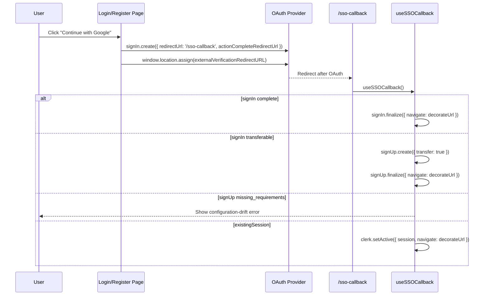

# AUTH SSO

> Google and Apple OAuth start flows, Clerk callback handling, transfer logic, and retired `/sso-continue` guard behavior.

---

## 1. Core Philosophy

- Treat OAuth as a separate state machine from password auth
- Let Clerk state determine OAuth outcome instead of relying on local intent markers
- Fail closed on public callback and retired continuation routes
- Keep OAuth start pages thin and put Clerk orchestration in hooks

---

## 2. Architecture Overview

```
User clicks "Continue with Google/Apple"
  -> signIn.create({ strategy, redirectUrl, actionCompleteRedirectUrl })
  -> window.location.assign(signIn.firstFactorVerification.externalVerificationRedirectURL)
  -> /sso-callback
  -> useSSOCallback()
     -> finalize sign-in
     -> transfer sign-in/sign-up
     -> redirect to /login with auth_reason
     -> surface configuration drift if Clerk still reports missing requirements
     -> setActive(existingSession)

/sso-continue
  -> redirect('/register') defensive route only
```

---

## 3. Key Files & Entry Points

| File | Purpose | When to Read |
| ---- | ------- | ------------ |
| `apps/frontend/app/components/auth/sso-callback/use-sso-callback.ts` | Core v7 SSO callback hook — all OAuth finalization logic | Any SSO flow change |
| `apps/frontend/app/sso-callback/page.tsx` | SSO callback page — delegates to `useSSOCallback` | SSO flow changes |
| `apps/frontend/app/(auth)/sso-continue/page.tsx` | Retired continuation route that redirects to registration | Defensive route behavior changes |
| `apps/frontend/lib/auth/reset-clerk-auth-resource.ts` | Runtime-compatible reset helper for clearing stale Clerk sign-in/sign-up attempts before OAuth | OAuth provider switching or cancellation issues |
| `apps/frontend/lib/auth/login-auth-reason.ts` | Fallback reason codes and `/login` notice mapping for incomplete OAuth sign-in | OAuth fallback UX changes |
| `apps/frontend/proxy.ts` | Clerk middleware — public/auth/protected route matchers | Route protection changes |

---

## 4. Data Flow

### 4.1 SSO Sign-In/Sign-Up Flow



---

## 5. Component / Module Structure

```
app/components/auth/
└── sso-callback/
    └── use-sso-callback.ts
```

---

## 6. Patterns & Conventions

### 6.1 SSO Initiation (Sign-In)

```typescript
await resetClerkAuthResource({ resource: signIn });
const { error } = await signIn.create({
  strategy: 'oauth_google',
  redirectUrl: '/sso-callback',
  actionCompleteRedirectUrl: config.auth.afterSignInUrl,
});

if (!error) {
  window.location.assign(signIn.firstFactorVerification.externalVerificationRedirectURL);
}
```

### 6.2 SSO Initiation (Register Social Buttons)

```typescript
const { error } = await signIn.create({
  strategy: 'oauth_google',
  redirectUrl: '/sso-callback',
  actionCompleteRedirectUrl: config.auth.afterSignUpUrl,
});

if (!error) {
  window.location.assign(signIn.firstFactorVerification.externalVerificationRedirectURL);
}
```

Registration social buttons intentionally start with `signIn.create()` instead of
`signUp.sso()`. Unknown users are transferred to sign-up by `/sso-callback`, while
existing users complete as sign-in.

### 6.3 OAuth Fallback Redirect Context

```typescript
router.push(buildLoginUrl({ reason: 'primary_required' }));
```

- `primary_required`: OAuth is not the account's primary sign-in method here
- `second_factor_required`: Clerk requires a second step after password sign-in
- `reset_password_required`: Clerk requires a password reset before sign-in can complete

---

## 7. Integration Points

| Domain | Relationship | Key Interface |
| ------ | ------------ | ------------- |
| Login | OAuth callback can send users back to `/login` with context | `buildLoginUrl()` |
| Onboarding | OAuth sign-up finalization lands here | `config.auth.afterSignUpUrl` |
| Dashboard | OAuth sign-in finalization lands here | `config.auth.afterSignInUrl` |
| Middleware (`proxy.ts`) | `/sso-continue` remains public only so the retired route can redirect defensively | public route config + `redirect('/register')` |

---

## 8. Implementation Status

- [x] Google OAuth sign-in
- [x] Apple OAuth sign-in
- [x] Google OAuth sign-up
- [x] Apple OAuth sign-up
- [x] SSO callback hook
- [x] Retired `/sso-continue` redirect route
- [x] Direct-navigation guard for `/sso-callback`

---

## 9. Risks & Mitigations

| Risk | Mitigation |
| ---- | ---------- |
| Legacy `sso()` redirect params mixed into the current `signIn.create()` flow | Current social auth uses `signIn.create({ redirectUrl, actionCompleteRedirectUrl })`, then navigates to `firstFactorVerification.externalVerificationRedirectURL`; do not confuse `externalVerificationRedirectURL` with legacy `redirectCallbackUrl`, and keep the param order shown in the examples above |
| Clerk still requires first/last name after app removal | Surface the missing-requirements state as configuration drift on `/sso-callback`; update Clerk dashboard so account names are optional or disabled |
| Cancelled OAuth attempt reuses the previous provider on the next click | Start OAuth through `signIn.create()` and manually navigate to `firstFactorVerification.externalVerificationRedirectURL`; avoid `signIn.sso()` and `signUp.sso()` for social buttons |
| Transferred sign-up reports `missing_requirements` while the external account is still verifying | Defer the configuration-drift error until `signUp.verifications.externalAccount.status === 'verified'` |
| React StrictMode double-execution on SSO callback | `hasRun = useRef(false)` guard in `useSSOCallback` |
| Direct navigation to `/sso-callback` with no usable Clerk callback state | Fall through to `/login` instead of relying on a local sessionStorage marker |
| Direct navigation to `/sso-continue` | Redirect to `/register`; the continuation form has been retired |

---

---

## 10. History & Decisions

- **Changelog:** [changelog.md](changelog.md)
- **Architecture decisions:** [adr/](adr/)
- Historical domain-level entries may also live in the parent changelog.
