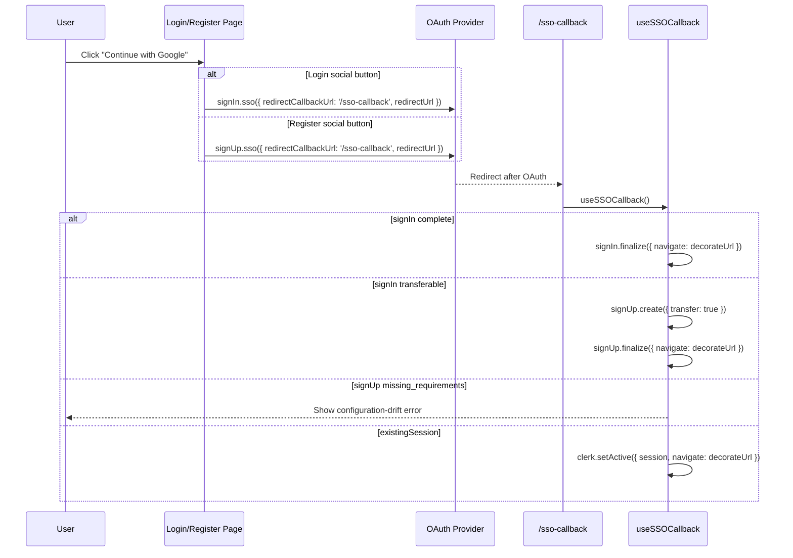

# AUTH SSO

> Google and Apple OAuth start flows, Clerk callback handling, transfer logic, and retired `/sso-continue` guard behavior.

---

## 1. Core Philosophy

- Treat OAuth as a separate state machine from password auth
- Let Clerk state determine OAuth outcome instead of relying on local intent markers
- Fail closed on public callback and retired continuation routes
- Keep OAuth start pages thin and put Clerk orchestration in hooks

---

## 2. Architecture Overview

```
User clicks "Continue with Google/Apple"
  -> login: signIn.sso({ strategy, redirectCallbackUrl, redirectUrl })
  -> register: signUp.sso({ strategy, redirectCallbackUrl, redirectUrl })
  -> /sso-callback
  -> useSSOCallback()
     -> finalize sign-in
     -> transfer sign-in/sign-up
     -> redirect to /login with auth_reason
     -> surface configuration drift if Clerk still reports missing requirements
     -> setActive(existingSession)

/sso-continue
  -> redirect('/register') defensive route only
```

---

## 3. Key Files & Entry Points

| File                                                                 | Purpose                                                                                                 | When to Read                                           |
| -------------------------------------------------------------------- | ------------------------------------------------------------------------------------------------------- | ------------------------------------------------------ |
| `apps/frontend/app/components/auth/sso-callback/use-sso-callback.ts` | Core v7 SSO callback hook — all OAuth finalization logic                                                | Any SSO flow change                                    |
| `apps/frontend/app/components/auth/register/use-register-flow.ts`   | Registration password/OTP controller and direct `signUp.sso()` provider initiation                      | Registration OAuth-entry changes                       |
| `apps/frontend/app/sso-callback/page.tsx`                            | SSO callback page — delegates to `useSSOCallback`                                                       | SSO flow changes                                       |
| `apps/frontend/app/(auth)/sso-continue/page.tsx`                     | Retired continuation route that redirects to registration                                               | Defensive route behavior changes                       |
| `apps/frontend/lib/auth/login-auth-reason.ts`                        | Fallback reason codes and `/login` notice mapping for incomplete OAuth sign-in                          | OAuth fallback UX changes                              |
| `apps/frontend/proxy.ts`                                             | Clerk middleware — public/auth/protected route matchers                                                 | Route protection changes                               |

---

## 4. Data Flow

### 4.1 SSO Sign-In/Sign-Up Flow



---

## 5. Component / Module Structure

```
app/components/auth/
└── sso-callback/
    └── use-sso-callback.ts
```

---

## 6. Patterns & Conventions

### 6.1 SSO Initiation (Sign-In)

```typescript
const { error } = await signIn.sso({
  strategy: 'oauth_google',
  redirectCallbackUrl: '/sso-callback',
  redirectUrl: config.auth.afterSignInUrl,
});
```

Clerk owns the provider redirect for login. Returned and thrown initiation
failures are shown through the login flow's HeroUI toast path.

### 6.2 SSO Initiation (Register Social Buttons)

```typescript
const { error } = await signUp.sso({
  strategy: 'oauth_google',
  redirectCallbackUrl: '/sso-callback',
  redirectUrl: config.auth.afterSignUpUrl,
});
```

Registration delegates provider navigation directly to Clerk's native
`signUp.sso()` operation. Unknown users complete as sign-up, while existing users
transfer to sign-in through `/sso-callback`. Returned or thrown SSO failures use
the register flow's HeroUI toast path. `signUp.reset()` is reserved for an
explicit restart of the password/OTP flow, such as changing the email during
verification; it is not a prerequisite for fresh social entry.

### 6.3 OAuth Fallback Redirect Context

```typescript
router.push(buildLoginUrl({ reason: 'primary_required' }));
```

- `primary_required`: OAuth is not the account's primary sign-in method here
- `second_factor_required`: Clerk requires a second step after password sign-in
- `reset_password_required`: Clerk requires a password reset before sign-in can complete

---

## 7. Integration Points

| Domain                  | Relationship                                                                      | Key Interface                                 |
| ----------------------- | --------------------------------------------------------------------------------- | --------------------------------------------- |
| Login                   | OAuth callback can send users back to `/login` with context                       | `buildLoginUrl()`                             |
| Onboarding              | OAuth sign-up finalization lands here                                             | `config.auth.afterSignUpUrl`                  |
| Dashboard               | OAuth sign-in finalization lands here                                             | `config.auth.afterSignInUrl`                  |
| Middleware (`proxy.ts`) | `/sso-continue` remains public only so the retired route can redirect defensively | public route config + `redirect('/register')` |

---

## 8. Implementation Status

- [x] Google OAuth sign-in
- [x] Apple OAuth sign-in
- [x] Google OAuth sign-up
- [x] Apple OAuth sign-up
- [x] SSO callback hook
- [x] Returned transfer errors become callback-page error state
- [x] Missing sign-up requirements stop the callback spinner with a configuration error
- [x] Retired `/sso-continue` redirect route
- [x] Direct-navigation guard for `/sso-callback`

---

## 9. Risks & Mitigations

| Risk                                                                                    | Mitigation                                                                                                                                                                                            |
| --------------------------------------------------------------------------------------- | ----------------------------------------------------------------------------------------------------------------------------------------------------------------------------------------------------- |
| Login and registration initiate against the wrong Clerk resource                       | Use `signIn.sso()` for login and `signUp.sso()` for registration, with `redirectCallbackUrl` pointing to `/sso-callback` and `redirectUrl` pointing to the flow-specific destination                 |
| Clerk still requires first/last name after app removal                                  | Surface the missing-requirements state as configuration drift on `/sso-callback`; update Clerk dashboard so account names are optional or disabled                                                    |
| Cancelled registration provider state leaks into the next attempt                       | Keep direct `signUp.sso()` aligned with Clerk's current contract and manually verify same-provider and cross-provider cancellation retries                                                              |
| Transfer mutations return an error without throwing                                     | Inspect the `{ error }` result from both transfer calls and replace the spinner with callback-page error state                                                                                        |
| Clerk reports `missing_requirements` before or after external verification settles      | Surface configuration drift for every remaining `missing_requirements` state instead of leaving the public callback pending                                                                           |
| React StrictMode double-execution on SSO callback                                       | `hasRun = useRef(false)` guard in `useSSOCallback`                                                                                                                                                    |
| Direct navigation to `/sso-callback` with no usable Clerk callback state                | Fall through to `/login` instead of relying on a local sessionStorage marker                                                                                                                          |
| Direct navigation to `/sso-continue`                                                    | Redirect to `/register`; the continuation form has been retired                                                                                                                                       |

---

---

## 10. History & Decisions

- **Changelog:** [changelog.md](changelog.md)
- **Architecture decisions:** [adr/](adr/) — no SSO ADR is currently active
- Historical domain-level entries may also live in the parent changelog.
