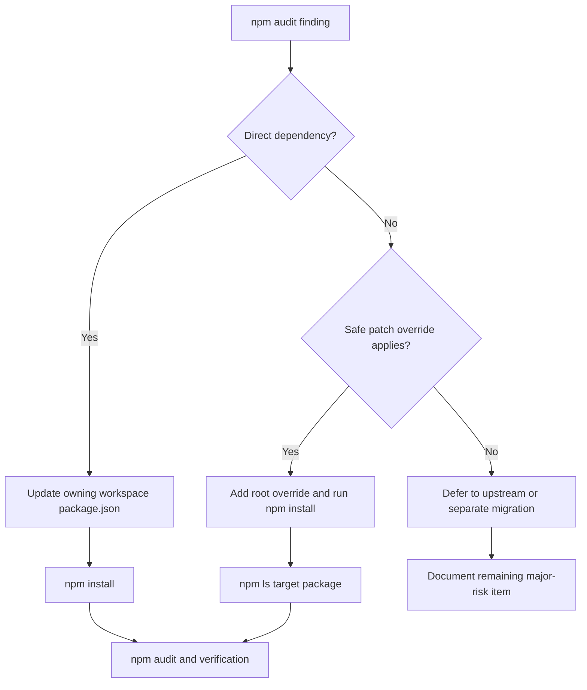

# Dependency Management: Workspace Package Ownership

> TailorCV keeps application runtime dependencies in the workspace that imports them, with the root package reserved for monorepo scripts, shared tooling, and safe global overrides.

---

## 1. Core Philosophy

### 1.1 Design Pillars

| Pillar                          | Description                                                                                                                      |
| ------------------------------- | -------------------------------------------------------------------------------------------------------------------------------- |
| **Workspace ownership**         | Each app declares the packages its source imports so installs, deploys, and audits are attributable to the correct workspace.    |
| **Root as coordinator**         | The root `package.json` owns monorepo scripts, workspaces, shared dev tooling, and rare overrides that are safe across the repo. |
| **No forced major audit fixes** | Security fixes are applied as targeted updates unless the audit fix requires a major migration.                                  |

### 1.2 Key Decisions

- **App dependencies live in apps**: Frontend packages such as React, Next.js, and date utilities belong in `apps/frontend/package.json`; backend packages such as Clerk Express and Prisma belong in `apps/backend/package.json`.
- **Overrides must be verified**: A root override is kept only when `npm ls` confirms the installed tree actually resolves to the intended version.
- **HeroUI stays exact and synchronized**: `@heroui/react` and `@heroui/styles` use the same exact version so component and CSS contracts cannot move independently or through a routine install.

---

## 2. Architecture Overview

```
package.json                 # workspace scripts, shared tooling, verified overrides
├── apps/frontend/package.json # Next.js, React, frontend-only runtime deps
├── apps/backend/package.json  # Express, Clerk backend/express, Prisma, backend deps
└── packages/shared/package.json # shared library deps used by shared source
```

---

## 3. Key Files & Entry Points

> **For AI**: When asked to work on dependency placement or audit remediation, start by reading these files.

| File                           | Purpose                                                                 | When to Read                                   |
| ------------------------------ | ----------------------------------------------------------------------- | ---------------------------------------------- |
| `package.json`                 | Root workspace scripts, shared dev dependencies, and verified overrides | Any monorepo-level dependency or audit change  |
| `apps/frontend/package.json`   | Frontend runtime and test dependencies                                  | Any dependency imported by frontend code       |
| `apps/backend/package.json`    | Backend runtime, Prisma, and backend test dependencies                  | Any dependency imported by backend code        |
| `packages/shared/package.json` | Shared package runtime and test dependencies                            | Any dependency imported by shared package code |
| `package-lock.json`            | Resolved workspace dependency tree                                      | Any audit or package resolution change         |

---

## 4. Data Flow

### 4.1 Audit Remediation Flow



---

## 5. Component / Module Structure

```
tailorcv/
├── package.json                 # root workspace coordination
├── package-lock.json            # resolved dependency graph
├── apps/
│   ├── frontend/package.json    # frontend-owned packages
│   └── backend/package.json     # backend-owned packages
└── packages/
    └── shared/package.json      # shared library packages
```

---

## 6. Patterns & Conventions

### 6.1 Direct Import Ownership

- **Rule**: If source in a workspace imports a package directly, that workspace must declare the dependency.
- **Anti-pattern**: Relying on a root dependency or transitive package for application source imports.

### 6.2 Audit Fixes

- **Rule**: Prefer patch/minor updates in the owning workspace for low-risk audit fixes.
- **Rule**: Use root `overrides` only after confirming `npm ls <package>` shows the override applied.
- **Anti-pattern**: Running `npm audit fix --force` when npm proposes major downgrades or toolchain migrations.

### 6.3 Component-Library Upgrades

- **Rule**: Update HeroUI React and Styles together at exact matching versions.
- **Rule**: Treat React Aria as lockfile-managed peer infrastructure unless frontend source imports a package directly or npm reports an unmet peer.
- **Rule**: Inspect intervening release notes and the resolved peer tree before delivery.

---

## 7. Integration Points

> How this domain connects to other domains. Update this when dependencies change.

| Domain           | Relationship                                                                    | Key Interface                                       |
| ---------------- | ------------------------------------------------------------------------------- | --------------------------------------------------- |
| Auth             | Clerk packages are split between frontend and backend workspaces                | `@clerk/nextjs`, `@clerk/express`, `@clerk/backend` |
| Auth recovery UI | Email masking is owned by the frontend workspace that renders recovery guidance | `maskdata` in `apps/frontend/package.json`          |
| Backend Data     | Prisma packages must stay aligned in the backend workspace                      | `prisma`, `@prisma/client`, `@prisma/adapter-pg`    |
| Frontend UI      | Next.js, React, HeroUI, and Tailwind packages belong to the frontend workspace   | `next`, `react`, `@heroui/react`, `@heroui/styles`  |

---

## 8. Implementation Status

### Phase 1: Dependency Ownership Cleanup

- [x] Frontend direct imports are declared in `apps/frontend/package.json`
- [x] Password-recovery email masking is declared in the frontend workspace that imports it
- [x] Backend direct imports are declared in `apps/backend/package.json`
- [x] Root app-only dependencies removed from `package.json`
- [x] High-risk `js-cookie` finding remediated through Clerk patch/update and verified override
- [x] HeroUI React and Styles pinned together at `3.2.3`

### Phase 2: Deferred Major/Upstream Items

- [ ] Resolve Prisma's pinned `@hono/node-server` when Prisma publishes a patched dependency or a safe lockfile strategy is chosen
- [ ] Resolve Next's bundled `postcss` when Next publishes a patched release
- [ ] Plan Vitest/Vite/esbuild major migration separately

---

## 9. Risks & Mitigations

| Risk                                                                               | Mitigation                                                                                                       |
| ---------------------------------------------------------------------------------- | ---------------------------------------------------------------------------------------------------------------- |
| Forced audit fixes downgrade or major-upgrade core tooling                         | Review each audit path and avoid `npm audit fix --force` unless the migration is intentional                     |
| Root overrides give a false sense of safety                                        | Keep only overrides verified by `npm ls`                                                                         |
| Workspace source relies on undeclared root dependencies                            | Search direct imports and move dependencies to the owning workspace                                              |
| Installing one package silently refreshes unrelated compatible transitive versions | Review lockfile package additions, removals, and version changes separately from the requested direct dependency |
| A component-library range admits an unreviewed UI contract change                   | Keep HeroUI packages exactly pinned and migrate them through the UI upgrade workflow                              |

---

---

## 10. History & Decisions

- **Changelog:** [changelog.md](changelog.md)
- **Architecture decisions:** [adr/](adr/)
