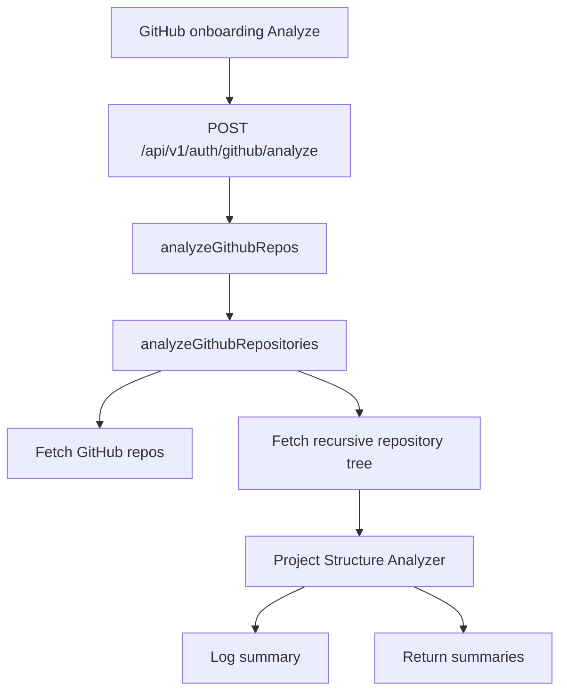
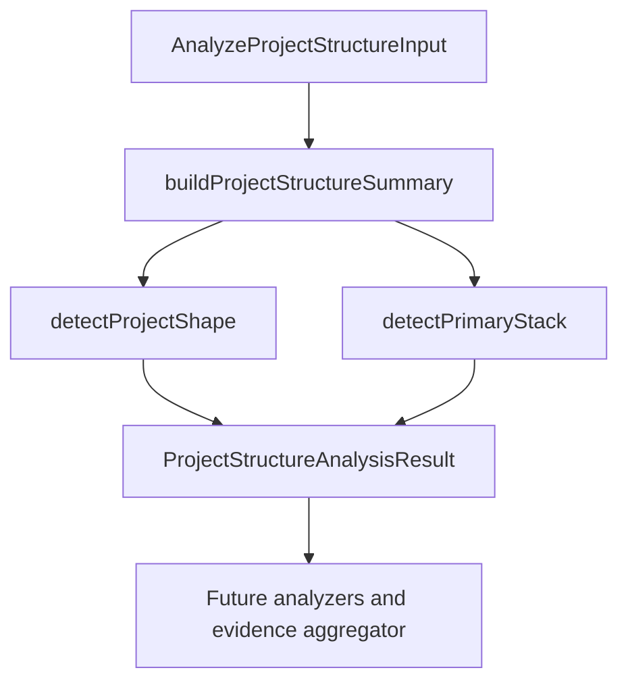

# GitHub Analysis Pipeline

> GitHub analysis turns selected repositories into structured, evidence-backed signals for future resume generation. This domain is prototype-stage and currently starts with project structure analysis only.

---

## 1. Core Philosophy

### 1.1 Design Pillars

| Pillar                            | Description                                                                                                          |
| --------------------------------- | -------------------------------------------------------------------------------------------------------------------- |
| **Evidence before prose**         | Extract structured facts from repositories before asking AI to write resume content.                                 |
| **Small number, deeper analysis** | Prefer analyzing a few selected repositories well instead of dumping many shallow repos into AI.                     |
| **Parser first, AI second**       | Use deterministic analyzers for cheap, explainable signals; use AI later for synthesis and ambiguous interpretation. |
| **Degraded but useful output**    | Weak repositories should still produce feedback explaining what is missing and how to improve.                       |

### 1.2 Key Decisions

- **Developer-first entry point**: GitHub is the first external evidence source because developer projects, code structure, tooling, and collaboration artifacts live there.
- **One analyzer per repo signal**: Keep each analyzer focused on one source of evidence, such as structure, dependencies, source code, tests, docs, CI/CD, commits, and PRs.
- **Project Structure Analyzer first**: Start by mapping the repository shape before reading file contents or invoking AI.
- **Structure-inferred stack naming**: The structure analyzer exposes `summary.inferredStack`, not `primaryStack`, because dependency/config analysis will later provide higher-confidence stack confirmation.

---

## 2. Architecture Overview

```text
GitHub repo IDs selected by user
  └─ POST /api/v1/auth/github/analyze
      ├─ fetch current GitHub connection
      ├─ fetch current repository list
      ├─ filter selected repository IDs
      ├─ fetch each selected repository tree
      ├─ Project Structure Analyzer
      │   ├─ normalize path lookups
      │   ├─ infer project shape
      │   └─ infer early stack signals
      ├─ future analyzers
      │   ├─ dependency/config
      │   ├─ source code
      │   ├─ tests
      │   ├─ README/docs
      │   ├─ CI/CD
      │   ├─ commits
      │   └─ pull requests
      └─ future evidence aggregator + AI resume synthesis
```

---

## 3. Key Files & Entry Points

> **For AI**: When asked to work on GitHub analysis, start by reading these files.

| File                                                                                              | Purpose                                                                                                       | When to Read                                |
| ------------------------------------------------------------------------------------------------- | ------------------------------------------------------------------------------------------------------------- | ------------------------------------------- |
| `apps/backend/src/routes/github.router.ts`                                                        | Registers GitHub OAuth, repo listing, connection, and temporary analysis routes.                              | GitHub endpoint changes.                    |
| `apps/backend/src/schemas/github.schema.ts`                                                       | Zod request body schema and inferred type for temporary GitHub analysis.                                      | GitHub request validation changes.          |
| `apps/backend/src/controllers/github.controller.ts`                                               | Reads validated selected repo IDs and calls GitHub analysis service.                                          | GitHub request/response changes.            |
| `apps/backend/src/services/github-analysis.service.ts`                                            | Temporary orchestration service that fetches repo trees, runs project-structure analysis, and logs summaries. | GitHub analysis orchestration changes.      |
| `apps/backend/src/services/github-analysis/github-tree-fetcher.ts`                                | Fetches recursive GitHub tree metadata for a selected repository.                                             | GitHub tree API changes.                    |
| `apps/backend/src/utils/github-utils.ts`                                                          | Shared pure GitHub helpers: raw tree types, full-name parsing, and tree entry normalization.                  | Tree normalization or repo parsing changes. |
| `apps/backend/src/services/github-analysis/project-structure/project-structure-analyzer.ts`       | Public project-structure analyzer entry point and orchestration.                                              | Any project-structure analyzer change.      |
| `apps/backend/src/services/github-analysis/project-structure/project-structure-analyzer.types.ts` | Public input/output contracts for project structure analysis.                                                 | Changing analyzer input/output shape.       |
| `apps/backend/src/services/github-analysis/project-structure/project-structure-entry-index.ts`    | Path/name/extension lookup helpers built from normalized GitHub tree entries.                                 | Adding path-based detection rules.          |
| `apps/backend/src/services/github-analysis/project-structure/project-shape-detector.ts`           | Score-based project shape detection.                                                                          | Changing `summary.projectShape`.            |
| `apps/backend/src/services/github-analysis/project-structure/primary-stack-detector.ts`           | Structure-inferred stack detection.                                                                           | Changing `summary.inferredStack`.           |
| `apps/backend/src/services/github-analysis/project-structure/project-structure-summary.ts`        | Builds the summary block from tree entries.                                                                   | Changing summary fields.                    |
| `apps/backend/src/services/github-analysis/project-structure/project-structure-analyzer.test.ts`  | Focused coverage for current project shape and inferred stack rules.                                          | Updating detection behavior.                |
| `apps/backend/src/services/github-analysis/*-analyzer.ts`                                         | Placeholder analyzer files for future repo signals.                                                           | Expanding the GitHub analysis pipeline.     |

---

## 4. Data Flow

### 4.1 Temporary Analyze Endpoint Flow



### 4.2 Current Project Structure Flow



### 4.3 Current Input Contract

The analyzer accepts already-fetched data:

- repository identity: `id`, `repositoryFullName`
- normalized tree entries: `path`, `name`, `type`, `depth`, `parentPath`, `extension`, `sizeBytes`
- GitHub tree truncation flag: `isTruncated`

The analyzer does not fetch GitHub data, read file contents, or call AI.

---

## 5. Component / Module Structure

```text
apps/backend/src/
├── utils/
│   └── github-utils.ts                   # raw tree types, name parsing, tree normalization
└── services/
    ├── github-analysis.service.ts        # temporary orchestration entry point
    └── github-analysis/
        ├── github-tree-fetcher.ts        # recursive Git tree fetch
        ├── project-structure/            # implemented project structure analyzer
        │   ├── project-structure-analyzer.ts      # public orchestration
        │   ├── project-structure-analyzer.types.ts # public contracts
        │   ├── project-structure-entry-index.ts   # path lookup helpers
        │   ├── project-shape-detector.ts          # projectShape scoring
        │   ├── primary-stack-detector.ts          # inferredStack scoring
        │   ├── project-structure-summary.ts       # summary builder
        │   └── project-structure-analyzer.test.ts # behavior tests
        ├── dependency-config-analyzer.ts # future
        ├── source-code-analyzer.ts       # future
        ├── test-quality-analyzer.ts      # future
        ├── readme-docs-analyzer.ts       # future
        ├── ci-cd-analyzer.ts             # future
        ├── commit-analyzer.ts            # future
        └── pull-request-analyzer.ts      # future
```

---

## 6. Patterns & Conventions

### 6.1 Analyzer Boundary

- **Rule**: Analyzers receive normalized data and return structured results.
- **Rule**: GitHub API calls belong in a future orchestration/service layer, not inside individual analyzers.
- **Rule**: Use one object parameter for exported functions.
- **Anti-pattern**: Do not pass repo IDs into analyzers and let each analyzer refetch the same GitHub data.

### 6.2 Project Shape Detection

- **Rule**: Use score-based path evidence, not a single exact string match.
- **Rule**: Return `unknown` when evidence is weak.
- **Rule**: Keep possible shape scores private until there is a real consumer.
- **Current labels**: `full-stack monorepo`, `monorepo`, `full-stack app`, `frontend app`, `backend api`, `library/package`, `cli tool`, `mobile app`, `documentation site`, `unknown`.

### 6.3 Inferred Stack Detection

- **Rule**: `summary.inferredStack` is structure-inferred only.
- **Rule**: Do not treat it as the final stack source of truth.
- **Rule**: Dependency/config analyzer will later confirm stack from files such as `package.json`, lockfiles, Prisma schema, Docker config, and framework config.

---

## 7. Integration Points

| Domain            | Relationship                                                                                           | Key Interface                    |
| ----------------- | ------------------------------------------------------------------------------------------------------ | -------------------------------- |
| Onboarding        | GitHub repo selection now calls the temporary analyze endpoint and shows a success/error toast.        | `AnalyzeGithubReposInput`        |
| GitHub service    | Analysis orchestration fetches repo metadata/tree once and passes normalized entries into analyzers.   | `AnalyzeProjectStructureInput`   |
| Resume generation | Future evidence aggregator and AI synthesis should consume analyzer outputs instead of raw repo dumps. | `ProjectStructureAnalysisResult` |

---

## 8. Implementation Status

### Phase 1: Project Structure Analyzer

- [x] Analyzer file structure created
- [x] Project structure input/output types defined
- [x] Path lookup helper created
- [x] Project shape detector implemented
- [x] Structure-inferred stack detector implemented
- [x] Focused tests added for current detection behavior
- [x] Temporary endpoint logs selected repository summaries
- [ ] Detected areas builder
- [ ] Architecture signals builder
- [ ] Maturity signals builder
- [ ] Candidate files builder
- [ ] Resume signal hints builder
- [ ] Feedback builder

### Phase 2: Future Repo Signal Analyzers

- [ ] Dependency/config analyzer
- [ ] Source code analyzer
- [ ] Test quality analyzer
- [ ] README/docs analyzer
- [ ] CI/CD analyzer
- [ ] Commit analyzer
- [ ] Pull request analyzer
- [ ] Evidence aggregator
- [ ] AI resume synthesis

---

## 9. Risks & Mitigations

| Risk                                               | Mitigation                                                                                             |
| -------------------------------------------------- | ------------------------------------------------------------------------------------------------------ |
| Path-based rules misclassify unusual repo layouts. | Use scoring, return `unknown` for weak evidence, and later compare against dependency/config evidence. |
| `inferredStack` is mistaken for confirmed stack.   | Keep the field name explicit and document that dependency/config analysis owns final stack confidence. |
| Analyzers refetch the same GitHub data repeatedly. | Keep analyzers pure and pass normalized tree/file data from a future orchestration layer.              |
| Weak repos produce bad resume claims.              | Feed gaps, limitations, and improvement suggestions into user-facing feedback before final synthesis.  |

---

## 10. Development Log

### [2026-05-11] - Shared GitHub Utility Placement

- **Decision:** Move pure GitHub helper utilities into the backend `utils` layer.
- **Problem:** Keeping generic GitHub parsing and tree-normalization helpers under `services/github-analysis/` made the analysis folder look like it owned utilities that are not analyzer-specific.
- **Solution:**
  1. **Utility placement:** Moved the helper module to `apps/backend/src/utils/github-utils.ts`.
  2. **Service imports:** Confirmed `github-analysis.service.ts` and `github-tree-fetcher.ts` import the helpers from the shared backend utility path.
  3. **Documentation update:** Updated this doc's key files, module tree, and dev log so future work starts from the correct path.
- **Outcome:** The GitHub analysis folder now contains analysis-specific service/analyzer modules, while reusable GitHub helper logic lives in the shared backend utility layer.

### [2026-05-11] - GitHub Analysis Utility Consolidation

- **Decision:** Consolidate pure GitHub analysis helpers into one utility module.
- **Problem:** Splitting repo-name parsing, raw tree API types, and tree normalization into separate files made the prototype feel noisier than the logic required.
- **Solution:**
  1. **Utility merge:** Added `apps/backend/src/utils/github-utils.ts` for raw tree response types, `splitRepositoryFullName`, and `normalizeTreeEntries`.
  2. **Fetcher boundary:** Kept `github-tree-fetcher.ts` separate because it performs GitHub network I/O and resilience/error handling.
  3. **Import cleanup:** Updated `github-analysis.service.ts` and `github-tree-fetcher.ts` to use the consolidated utility module.
- **Outcome:** The GitHub analysis root has fewer tiny helper files while preserving a clean boundary between pure data helpers and GitHub API fetching.

### [2026-05-11] - GitHub Analysis Service Modularization

- **Decision:** Split GitHub analysis orchestration helpers out of `github-analysis.service.ts`.
- **Problem:** The temporary service mixed repo-name parsing, GitHub tree fetching, tree normalization, analyzer invocation, and logging in one file.
- **Solution:**
  1. **Repository parsing:** Added `github-repository-name.ts` for splitting `owner/repo` full names.
  2. **Tree fetch boundary:** Added `github-tree-fetcher.ts` and `github-tree.types.ts` for recursive Git tree API calls and raw response types.
  3. **Tree normalization:** Added `github-tree-normalizer.ts` for converting raw GitHub tree entries into `RepoTreeEntry`.
  4. **Thin service:** Updated `github-analysis.service.ts` to orchestrate selected repos, fetch trees, normalize entries, run `analyzeProjectStructure`, and log summaries.
- **Outcome:** The temporary GitHub analysis service is easier to read and future tree/content fetching logic has clear module boundaries.

### [2026-05-11] - Analyze Request Body Validation Cleanup

- **Decision:** Use the GitHub Zod schema as the source of truth for temporary analyze request typing.
- **Problem:** The controller still carried request body typing separately from route validation, and the repo ID schema allowed non-integer or non-positive numbers.
- **Solution:**
  1. **Strict schema:** Updated `apps/backend/src/schemas/github.schema.ts` so `repoIds` must be 1-3 positive integers and exported the inferred request body type.
  2. **Typed controller:** Updated `apps/backend/src/controllers/github.controller.ts` to use `AnalyzeGithubReposRequestBody` and trust `validateBody`.
  3. **Route imports:** Updated `apps/backend/src/routes/github.router.ts` to use local relative imports for validation middleware and schema.
- **Outcome:** The temporary analyze endpoint has one validation/type source and no duplicate manual parsing in the controller.

### [2026-05-09] - Temporary GitHub Analyze Endpoint

- **Decision:** Wire the GitHub repo picker Analyze button to a minimal backend endpoint that logs project-structure summaries.
- **Problem:** The project-structure analyzer existed only in tests, so there was no quick way to run it against selected real GitHub repositories from onboarding.
- **Solution:**
  1. **Backend route:** Added `POST /api/v1/auth/github/analyze` in `apps/backend/src/routes/github.router.ts`.
  2. **Controller validation:** Added `analyzeGithubRepos` in `apps/backend/src/controllers/github.controller.ts` to validate selected repo IDs and call the analysis service.
  3. **Analysis orchestration:** Added `apps/backend/src/services/github-analysis.service.ts` to fetch the user's repos, fetch each selected repo tree, normalize tree entries, run `analyzeProjectStructure`, and log `summary`.
  4. **Frontend action:** Added `apps/frontend/lib/actions/github.actions.ts` and updated `github-step.tsx` so Analyze calls the temporary endpoint.
- **Outcome:** Selecting repositories in onboarding can now exercise the project-structure analyzer against live GitHub repo trees and log summary output for prototype testing.

### [2026-05-09] - Project Structure Analyzer Folder Boundary

- **Decision:** Move implemented project-structure analyzer files under `apps/backend/src/services/github-analysis/project-structure/`.
- **Problem:** `github-analysis/` was becoming noisy because implemented project-structure files lived beside empty future analyzer placeholders.
- **Solution:**
  1. **Feature-local folder:** Moved project structure orchestration, types, summary, entry index, detectors, and tests into `project-structure/`.
  2. **Documentation update:** Updated this doc's key files and module tree to point at the new folder boundary.
- **Outcome:** The GitHub analysis root now shows future analyzer placeholders clearly, while the implemented project-structure analyzer has its own local module boundary.

### [2026-05-09] - GitHub Analysis Architecture Doc

- **Decision:** Document the GitHub analysis domain and add it to the architecture index.
- **Problem:** GitHub analysis files were added before this architecture doc existed, so future agents had no domain entry point and the documentation protocol could be missed again.
- **Solution:**
  1. **Instruction gate:** Updated `CLAUDE.md` with a top-level work gate requiring architecture docs before completion.
  2. **Domain documentation:** Added `docs/architecture/github-analysis.md` and updated the architecture index.
- **Outcome:** Future GitHub analysis work has a first-read domain doc and daily progress history.

### [2026-05-09] - Structure-Inferred Stack Naming

- **Decision:** Rename `summary.primaryStack` to `summary.inferredStack`.
- **Problem:** `primaryStack` sounded like a final source of truth, but the Project Structure Analyzer only infers stack from paths and config-like filenames.
- **Solution:**
  1. **Contract rename:** Updated `ProjectStructureSummary` in `project-structure-analyzer.types.ts`.
  2. **Summary output:** Updated `project-structure-summary.ts` to return `inferredStack`.
  3. **Test update:** Updated `project-structure-analyzer.test.ts` expectations.
- **Outcome:** The output now communicates that stack values are structure-inferred until dependency/config analysis confirms them.

### [2026-05-08] - Project Shape and Inferred Stack Prototype

- **Decision:** Implement project shape and structure-inferred stack detection using deterministic score-based rules, not AI.
- **Problem:** A single exact path match would be too brittle, while AI would be too uncontrolled for the first routing/classification stage.
- **Solution:**
  1. **Path index:** Added `project-structure-entry-index.ts` to centralize normalized path, filename, directory, and extension lookups.
  2. **Shape detector:** Added `project-shape-detector.ts` to score project labels such as full-stack monorepo, frontend app, backend API, library/package, CLI, mobile app, and docs site.
  3. **Stack detector:** Added `primary-stack-detector.ts` to conservatively infer stack signals from structure and config-like paths.
  4. **Summary builder:** Added `project-structure-summary.ts` to compose file counts, top-level folders, max depth, truncation, project shape, and inferred stack.
  5. **Behavior tests:** Added `project-structure-analyzer.test.ts` to lock current detection behavior.
- **Outcome:** Project structure analysis now returns useful early classification without reading file contents or calling AI.

### [2026-05-08] - Project Structure Analyzer Modularization

- **Decision:** Split the large project structure analyzer into feature-local modules.
- **Problem:** Keeping types, path indexing, shape scoring, stack scoring, summary building, and orchestration in one file made the prototype hard to read and extend.
- **Solution:**
  1. **Types split:** Moved public analyzer contracts to `project-structure-analyzer.types.ts`.
  2. **Detector split:** Moved shape and stack rules into focused detector files.
  3. **Thin entry point:** Kept `project-structure-analyzer.ts` as the public orchestrator and type re-export surface.
- **Outcome:** Future analyzer sections can grow independently without turning the entry point into a large mixed-responsibility file.

### [2026-05-07] - GitHub Analysis Analyzer Scaffold

- **Decision:** Create one feature-local analyzer file per planned GitHub repo signal.
- **Problem:** The new GitHub analysis direction needed clear backend entry points without committing to queueing, AI prompts, or final service orchestration yet.
- **Solution:**
  1. **Analyzer directory:** Created `apps/backend/src/services/github-analysis/`.
  2. **Signal placeholders:** Added analyzer placeholders for project structure, dependency/config, source code, tests, README/docs, CI/CD, commits, and pull requests.
  3. **Scope boundary:** Kept files empty until each analyzer has a defined input/output and implementation plan.
- **Outcome:** The backend now has a clear place to build the GitHub analyzer pipeline incrementally.
