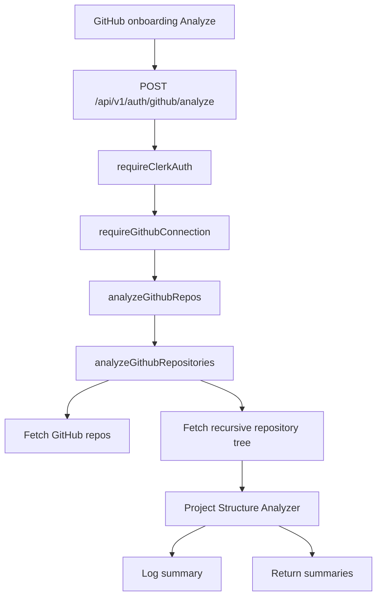
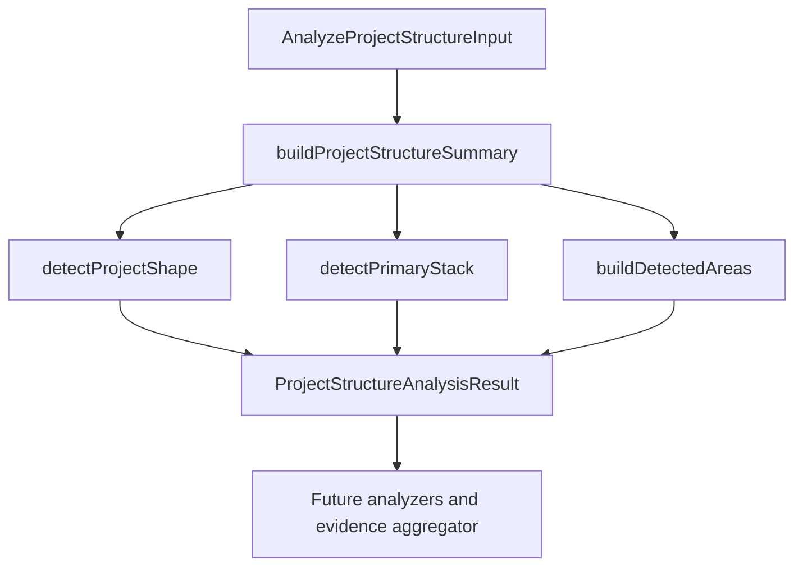

# GitHub Analysis Pipeline

> GitHub analysis turns selected repositories into structured, evidence-backed signals for future resume generation. This domain is prototype-stage and currently starts with project structure analysis only.

---

## 1. Core Philosophy

### 1.1 Design Pillars

| Pillar                            | Description                                                                                                          |
| --------------------------------- | -------------------------------------------------------------------------------------------------------------------- |
| **Evidence before prose**         | Extract structured facts from repositories before asking AI to write resume content.                                 |
| **Small number, deeper analysis** | Prefer analyzing a few selected repositories well instead of dumping many shallow repos into AI.                     |
| **Parser first, AI second**       | Use deterministic analyzers for cheap, explainable signals; use AI later for synthesis and ambiguous interpretation. |
| **Degraded but useful output**    | Weak repositories should still produce feedback explaining what is missing and how to improve.                       |

### 1.2 Key Decisions

- **Developer-first entry point**: GitHub is the first external evidence source because developer projects, code structure, tooling, and collaboration artifacts live there.
- **One analyzer per repo signal**: Keep each analyzer focused on one source of evidence, such as structure, dependencies, source code, tests, docs, CI/CD, commits, and PRs.
- **Project Structure Analyzer first**: Start by mapping the repository shape before reading file contents or invoking AI.
- **Structure-inferred stack naming**: The structure analyzer exposes `summary.inferredStack`, not `primaryStack`, because dependency/config analysis will later provide higher-confidence stack confirmation.

---

## 2. Architecture Overview

```text
GitHub repo IDs selected by user
  └─ POST /api/v1/auth/github/analyze
      ├─ require Clerk authentication
      ├─ require saved GitHub connection
      ├─ fetch current repository list
      ├─ filter selected repository IDs
      ├─ fetch each selected repository tree
      ├─ Project Structure Analyzer
      │   ├─ normalize path lookups
      │   ├─ infer project shape
      │   ├─ infer early stack signals
      │   └─ detect meaningful repo areas
      ├─ future analyzers
      │   ├─ dependency/config
      │   ├─ source code
      │   ├─ tests
      │   ├─ README/docs
      │   ├─ CI/CD
      │   ├─ commits
      │   └─ pull requests
      └─ future evidence aggregator + AI resume synthesis
```

---

## 3. Key Files & Entry Points

> **For AI**: When asked to work on GitHub analysis, start by reading these files.

| File                                                                                                | Purpose                                                                                                       | When to Read                                |
| --------------------------------------------------------------------------------------------------- | ------------------------------------------------------------------------------------------------------------- | ------------------------------------------- |
| `apps/backend/src/routes/github.router.ts`                                                          | Registers GitHub OAuth, repo listing, connection, and temporary analysis routes.                              | GitHub endpoint changes.                    |
| `apps/backend/src/schemas/github.schema.ts`                                                         | Zod request body schema and inferred type for temporary GitHub analysis.                                      | GitHub request validation changes.          |
| `apps/backend/src/controllers/github.controller.ts`                                                 | Reads validated selected repo IDs and calls GitHub analysis service.                                          | GitHub request/response changes.            |
| `apps/backend/src/mappers/github.mapper.ts`                                                         | Maps internal GitHub models into client-safe response DTOs with explicit field allowlists.                    | GitHub response DTO changes.                |
| `apps/backend/src/middleware/github-auth.ts`                                                        | Requires a saved GitHub connection after Clerk auth and attaches it to `res.locals.githubConnection`.         | GitHub-protected route changes.             |
| `packages/shared/src/types/github.ts`                                                               | Defines full backend GitHub connection and client-safe public connection response types.                      | GitHub API contract changes.                |
| `apps/backend/src/services/github-analysis.service.ts`                                              | Temporary orchestration service that fetches repo trees, runs project-structure analysis, and logs summaries. | GitHub analysis orchestration changes.      |
| `apps/backend/src/services/github-analysis/github-tree-fetcher.ts`                                  | Fetches recursive GitHub tree metadata for a selected repository.                                             | GitHub tree API changes.                    |
| `apps/backend/src/utils/github-utils.ts`                                                            | Shared pure GitHub helpers: raw tree types, full-name parsing, and tree entry normalization.                  | Tree normalization or repo parsing changes. |
| `apps/backend/src/services/github-analysis/project-structure/project-structure-analyzer.ts`         | Public project-structure analyzer entry point and orchestration.                                              | Any project-structure analyzer change.      |
| `apps/backend/src/services/github-analysis/project-structure/project-structure-analyzer.types.ts`   | Public input/output contracts for project structure analysis.                                                 | Changing analyzer input/output shape.       |
| `apps/backend/src/services/github-analysis/project-structure/project-structure-entry-index.ts`      | Path/name/extension lookup helpers built from normalized GitHub tree entries.                                 | Adding path-based detection rules.          |
| `apps/backend/src/services/github-analysis/project-structure/project-shape-detector.ts`             | Score-based project shape detection.                                                                          | Changing `summary.projectShape`.            |
| `apps/backend/src/services/github-analysis/project-structure/primary-stack-detector.ts`             | Structure-inferred stack detection.                                                                           | Changing `summary.inferredStack`.           |
| `apps/backend/src/services/github-analysis/project-structure/project-structure-summary.ts`          | Builds the summary block from tree entries.                                                                   | Changing summary fields.                    |
| `apps/backend/src/services/github-analysis/project-structure/project-structure-detected-areas.ts`   | Orchestrates score-based detected area generation from path evidence.                                         | Changing `detectedAreas` output.            |
| `apps/backend/src/services/github-analysis/project-structure/project-structure-detected-area-*.ts`  | Detected-area rule, candidate, and internal type helpers.                                                     | Changing detected-area scoring internals.   |
| `apps/backend/src/services/github-analysis/project-structure/project-structure-path-utils.ts`       | Shared path normalization and owner-path helpers for project-structure detectors.                             | Adding reusable path helpers.               |
| `apps/backend/src/services/github-analysis/project-structure/project-structure-score-candidates.ts` | Shared score candidate helpers for deterministic structure detectors.                                         | Adding score-based detector helpers.        |
| `apps/backend/src/services/github-analysis/project-structure/project-structure-analyzer.test.ts`    | Focused coverage for current project shape and inferred stack rules.                                          | Updating detection behavior.                |
| `apps/backend/src/services/github-analysis/*-analyzer.ts`                                           | Placeholder analyzer files for future repo signals.                                                           | Expanding the GitHub analysis pipeline.     |

---

## 4. Data Flow

### 4.1 Temporary Analyze Endpoint Flow



### 4.2 Current Project Structure Flow



### 4.3 Current Input Contract

The analyzer accepts already-fetched data:

- repository identity: `id`, `repositoryFullName`
- normalized tree entries: `path`, `name`, `type`, `depth`, `parentPath`, `extension`, `sizeBytes`
- GitHub tree truncation flag: `isTruncated`

The analyzer does not fetch GitHub data, read file contents, or call AI.

---

## 5. Component / Module Structure

```text
apps/backend/src/
├── utils/
│   └── github-utils.ts                   # raw tree types, name parsing, tree normalization
├── middleware/
│   └── github-auth.ts                    # require saved GitHub connection
├── mappers/
│   └── github.mapper.ts                  # client-safe GitHub response DTO mapping
└── services/
    ├── github-analysis.service.ts        # temporary orchestration entry point
    └── github-analysis/
        ├── github-tree-fetcher.ts        # recursive Git tree fetch
        ├── project-structure/            # implemented project structure analyzer
        │   ├── project-structure-analyzer.ts      # public orchestration
        │   ├── project-structure-analyzer.types.ts # public contracts
        │   ├── project-structure-entry-index.ts   # path lookup helpers
        │   ├── project-shape-detector.ts          # projectShape scoring
        │   ├── primary-stack-detector.ts          # inferredStack scoring
        │   ├── project-structure-summary.ts       # summary builder
        │   ├── project-structure-detected-areas.ts # detectedAreas orchestration
        │   ├── project-structure-detected-area-rules.ts # detectedAreas rules
        │   ├── project-structure-detected-area-candidates.ts # detectedAreas scoring helpers
        │   ├── project-structure-detected-areas.types.ts # detectedAreas internal contracts
        │   ├── project-structure-path-utils.ts    # shared path helpers
        │   ├── project-structure-score-candidates.ts # shared score helpers
        │   └── project-structure-analyzer.test.ts # behavior tests
        ├── dependency-config-analyzer.ts # future
        ├── source-code-analyzer.ts       # future
        ├── test-quality-analyzer.ts      # future
        ├── readme-docs-analyzer.ts       # future
        ├── ci-cd-analyzer.ts             # future
        ├── commit-analyzer.ts            # future
        └── pull-request-analyzer.ts      # future
```

---

## 6. Patterns & Conventions

### 6.1 Analyzer Boundary

- **Rule**: Analyzers receive normalized data and return structured results.
- **Rule**: GitHub API calls belong in a future orchestration/service layer, not inside individual analyzers.
- **Rule**: Use one object parameter for exported functions.
- **Anti-pattern**: Do not pass repo IDs into analyzers and let each analyzer refetch the same GitHub data.

### 6.2 GitHub Connection Boundary

- **Rule**: GitHub-token routes must run `requireClerkAuth` before `requireGithubConnection`.
- **Rule**: `requireGithubConnection` attaches `res.locals.githubConnection` so controllers/services do not refetch the connection.
- **Rule**: `/connection` remains Clerk-only because it is the status endpoint used to detect whether the user is connected.
- **Rule**: `/connection` must return `GitHubConnectionResponse | null` and must never expose the stored OAuth `accessToken` to the browser.
- **Rule**: Any client response derived from a token-bearing/internal GitHub object must use a response DTO mapper with an explicit field allowlist.

### 6.3 Project Shape Detection

- **Rule**: Use score-based path evidence, not a single exact string match.
- **Rule**: Return `unknown` when evidence is weak.
- **Rule**: Keep possible shape scores private until there is a real consumer.
- **Rule**: Monorepo evidence includes common workspace config files such as `turbo.json`, `pnpm-workspace.yaml`, `nx.json`, `workspace.json`, `project.json`, and `lerna.json`, plus owner roots such as `apps/`, `packages/`, `libs/`, and weak `services/` evidence.
- **Rule**: Frontend monorepo paths should match generalized owners such as `apps/*/app` or `apps/*/pages`, not only `apps/frontend`.
- **Current labels**: `full-stack monorepo`, `monorepo`, `full-stack app`, `frontend app`, `backend api`, `library/package`, `cli tool`, `mobile app`, `documentation site`, `unknown`.

### 6.4 Inferred Stack Detection

- **Rule**: `summary.inferredStack` is structure-inferred only.
- **Rule**: Do not treat it as the final stack source of truth.
- **Rule**: Dependency/config analyzer will later confirm stack from files such as `package.json`, lockfiles, Prisma schema, Docker config, and framework config.

### 6.5 Detected Area Generation

- **Rule**: `detectedAreas` identifies meaningful repository regions from path evidence only.
- **Rule**: Score concrete `(name, path)` candidates where `path` is the area owner root, not the individual evidence path.
- **Rule**: Evidence arrays must contain actual repository paths, not prose explanations.
- **Rule**: Root-level app or config evidence uses `path: "."`; monorepo evidence uses owners such as `apps/frontend`, `apps/backend`, or `packages/shared`.
- **Rule**: Known tool conventions should merge related evidence under one owner, such as Prisma `schema.prisma`/`migrations` or conservative Drizzle paths like `drizzle.config.ts`, `drizzle/`, and `src/db/schema.ts`.
- **Rule**: Backend API areas require strong backend structure such as `routes`, `controllers`, and `services` under the same owner, or an explicit backend entry file; frontend `src/routes` plus `src/services` alone is not enough.
- **Rule**: The temporary analyze endpoint can keep returning summaries while later pipeline stages consume the full internal analyzer result.

---

## 7. Integration Points

| Domain            | Relationship                                                                                                                                       | Key Interface                    |
| ----------------- | -------------------------------------------------------------------------------------------------------------------------------------------------- | -------------------------------- |
| Onboarding        | GitHub repo selection now calls the temporary analyze endpoint and shows a success/error toast.                                                    | `AnalyzeGithubReposInput`        |
| GitHub service    | Protected GitHub routes receive a saved connection from middleware, then fetch repo metadata/tree once and pass normalized entries into analyzers. | `AnalyzeProjectStructureInput`   |
| Resume generation | Future evidence aggregator and AI synthesis should consume analyzer outputs instead of raw repo dumps.                                             | `ProjectStructureAnalysisResult` |

---

## 8. Implementation Status

### Phase 1: Project Structure Analyzer

- [x] Analyzer file structure created
- [x] Project structure input/output types defined
- [x] Path lookup helper created
- [x] Project shape detector implemented
- [x] Structure-inferred stack detector implemented
- [x] Focused tests added for current detection behavior
- [x] Temporary endpoint logs selected repository summaries
- [x] GitHub connection middleware protects repo/analyze routes
- [x] Detected areas builder
- [ ] Architecture signals builder
- [ ] Maturity signals builder
- [ ] Candidate files builder
- [ ] Resume signal hints builder
- [ ] Feedback builder

### Phase 2: Future Repo Signal Analyzers

- [ ] Dependency/config analyzer
- [ ] Source code analyzer
- [ ] Test quality analyzer
- [ ] README/docs analyzer
- [ ] CI/CD analyzer
- [ ] Commit analyzer
- [ ] Pull request analyzer
- [ ] Evidence aggregator
- [ ] AI resume synthesis

---

## 9. Risks & Mitigations

| Risk                                               | Mitigation                                                                                             |
| -------------------------------------------------- | ------------------------------------------------------------------------------------------------------ |
| Path-based rules misclassify unusual repo layouts. | Use scoring, return `unknown` for weak evidence, and later compare against dependency/config evidence. |
| `inferredStack` is mistaken for confirmed stack.   | Keep the field name explicit and document that dependency/config analysis owns final stack confidence. |
| Analyzers refetch the same GitHub data repeatedly. | Keep analyzers pure and pass normalized tree/file data from a future orchestration layer.              |
| Weak repos produce bad resume claims.              | Feed gaps, limitations, and improvement suggestions into user-facing feedback before final synthesis.  |

---

## 10. Development Log

### [2026-05-14] - Conservative Backend Area Evidence

- **Decision:** Require complete backend structure before emitting a `Backend API` detected area from folder evidence.
- **Problem:** Frontend projects can have `src/routes` for client routing and `src/services` for API clients, which caused false `Backend API` areas in Vite repositories.
- **Solution:**
  1. **Regression coverage:** Updated `apps/backend/src/services/github-analysis/project-structure/project-structure-analyzer.test.ts` with a Vite + Drizzle repo that has frontend `src/routes` and `src/services`.
  2. **Evidence aggregation:** Updated `project-structure-detected-area-rules.ts` to collect backend structure by owner and emit `Backend API` only when `routes`, `controllers`, and `services` are all present.
  3. **Entry-file fallback:** Kept explicit `server.ts` and `app.ts` files as backend evidence, while dropping broad `src/main.ts` backend detection.
- **Outcome:** Frontend routing/service folders no longer produce backend API areas without stronger backend proof.

### [2026-05-14] - Project Shape Rule Readability Cleanup

- **Decision:** Keep project-shape signal groups as constants, but call `EntryIndex` helpers directly inside `detectProjectShape`.
- **Problem:** Extra private wrapper helpers around simple `.some()` and `.filter()` calls made `project-shape-detector.ts` harder to read than the rules required.
- **Solution:**
  1. **Inline index checks:** Updated `apps/backend/src/services/github-analysis/project-structure/project-shape-detector.ts` to remove thin helper functions and use constants directly with `index`.
  2. **Behavior preservation:** Kept the same monorepo, frontend, backend, and full-stack scoring rules.
- **Outcome:** Project-shape rules are shorter and closer to the scoring logic without changing analyzer behavior.

### [2026-05-14] - Generalized Monorepo Shape Signals

- **Decision:** Detect common Nx/Turborepo-style monorepos through reusable rule groups instead of hardcoded frontend/backend folder names.
- **Problem:** The project shape detector recognized `apps/frontend` well, but layouts such as `apps/web`, `services/api`, and `libs/shared` are common in Nx and other workspace repos and could be under-scored.
- **Solution:**
  1. **Rule constants:** Updated `apps/backend/src/services/github-analysis/project-structure/project-shape-detector.ts` with grouped monorepo config files, root directories, frontend paths, and backend path signals.
  2. **Generalized app paths:** Updated `project-shape-detector.ts` and `primary-stack-detector.ts` to match `apps/*/app` and `apps/*/pages` instead of only `apps/frontend/*`.
  3. **Library area support:** Updated `project-structure-detected-area-rules.ts` so `libs/*` can emit `Shared package` evidence alongside `packages/*`.
  4. **Regression coverage:** Updated `project-structure-analyzer.test.ts` with an Nx-style `apps/web`, `services/api`, and `libs/shared` repository shape.
- **Outcome:** Project structure analysis now handles more common monorepo layouts without relying on AI or file-content parsing.

### [2026-05-14] - Detected Area Owner Path Grouping

- **Decision:** Treat `detectedAreas[].path` as the owner root for an area, while keeping exact proof paths in `evidence`.
- **Problem:** Root-level repositories could emit duplicate areas for the same category, such as `Frontend app` at `next.config.js` and another `Frontend app` at `app`, because raw evidence paths were used as candidate paths.
- **Solution:**
  1. **Owner-path helpers:** Updated `apps/backend/src/services/github-analysis/project-structure/project-structure-path-utils.ts` with separate owner helpers for application, backend, and root config areas.
  2. **Rule ownership:** Updated `apps/backend/src/services/github-analysis/project-structure/project-structure-detected-area-rules.ts` so root app/config evidence groups under `.` while monorepo evidence still groups under owners such as `apps/frontend`.
  3. **Regression coverage:** Updated `apps/backend/src/services/github-analysis/project-structure/project-structure-analyzer.test.ts` to assert root frontend and root containerization evidence merge into one owner area.
- **Outcome:** Detected areas now distinguish where an area lives from which paths proved it, preventing duplicate same-category areas in root-level repositories.

### [2026-05-14] - Prisma Database Area Grouping

- **Decision:** Group Prisma schema and migration evidence under the same database owner path.
- **Problem:** Repositories with both `prisma/schema.prisma` and `prisma/migrations` emitted two `Database schema` areas, even though both paths describe the same Prisma database area.
- **Solution:**
  1. **Database owner helper:** Added `ownerPathForDatabaseArea` in `apps/backend/src/services/github-analysis/project-structure/project-structure-path-utils.ts`.
  2. **Rule update:** Updated `apps/backend/src/services/github-analysis/project-structure/project-structure-detected-area-rules.ts` so schema and migration evidence use the same owner path.
  3. **Regression coverage:** Updated `apps/backend/src/services/github-analysis/project-structure/project-structure-analyzer.test.ts` to assert Prisma schema and migrations merge into one detected database area.
- **Outcome:** Prisma-backed repositories now emit one `Database schema` area with both schema and migration evidence.

### [2026-05-14] - Conservative Drizzle Database Detection

- **Decision:** Add Drizzle support only for strong path conventions in the project-structure detected area analyzer.
- **Problem:** Drizzle-backed repositories did not emit a database area, but broad `schema.ts` matching would create noisy false positives for validation, GraphQL, or API schemas.
- **Solution:**
  1. **Strong conventions:** Updated `apps/backend/src/services/github-analysis/project-structure/project-structure-detected-area-rules.ts` to detect `drizzle.config.*`, `drizzle/`, and explicit `db/schema.ts` or `src/db/schema.ts` paths.
  2. **Owner grouping:** Updated `apps/backend/src/services/github-analysis/project-structure/project-structure-path-utils.ts` so Drizzle and `db` evidence groups under stable owner paths.
  3. **Regression coverage:** Updated `apps/backend/src/services/github-analysis/project-structure/project-structure-analyzer.test.ts` to cover Drizzle evidence while confirming ambiguous `src/schema.ts` is ignored.
- **Outcome:** Common Drizzle projects now produce database-area evidence without turning every schema-like filename into a database claim.

### [2026-05-13] - Shared Project Structure Score Helpers

- **Decision:** Reuse a generic score-candidate helper across Step 1.1 project shape and inferred stack detectors.
- **Problem:** `project-shape-detector.ts` and `primary-stack-detector.ts` duplicated fixed-candidate map creation and score increment logic, which made future score-based analyzers more repetitive than necessary.
- **Solution:**
  1. **Shared scoring:** Added `apps/backend/src/services/github-analysis/project-structure/project-structure-score-candidates.ts` for candidate creation, score increments, score reads, and score sorting.
  2. **Shape detector cleanup:** Updated `project-shape-detector.ts` to keep project-shape labels and rules local while delegating candidate bookkeeping to the shared helper.
  3. **Stack detector cleanup:** Updated `primary-stack-detector.ts` to keep stack labels and rules local while reusing the same score helper.
- **Outcome:** Step 1.1 and Step 1.2 now share the same score bookkeeping style without changing analyzer output.

### [2026-05-13] - Detected Area Module Cleanup

- **Decision:** Split detected-area path normalization, candidate scoring, internal types, and rule groups into focused project-structure modules.
- **Problem:** `project-structure-detected-areas.ts` mixed reusable path helpers, mutable candidate bookkeeping, area-specific rules, sorting, and public orchestration, making the Step 1.2 implementation harder to extend safely.
- **Solution:**
  1. **Shared paths:** Added `apps/backend/src/services/github-analysis/project-structure/project-structure-path-utils.ts` and updated `project-structure-entry-index.ts` to reuse the same path normalizer.
  2. **Detected-area internals:** Added `project-structure-detected-areas.types.ts` and `project-structure-detected-area-candidates.ts` for fixed area labels, candidate state, score accumulation, and public result conversion.
  3. **Rule grouping:** Added `project-structure-detected-area-rules.ts` so `project-structure-detected-areas.ts` stays focused on orchestration and ordering.
- **Outcome:** Detected-area rules are easier to scan and extend while the analyzer output contract remains unchanged.

### [2026-05-13] - Project Structure Detected Areas

- **Decision:** Implement detected areas as deterministic `(name, path)` candidates scored from repository tree paths.
- **Problem:** Step 1.1 produced useful repository summaries, but later analyzers still had no structured map of where important repo regions such as frontend, backend, database, tests, docs, and tooling lived.
- **Solution:**
  1. **Focused builder:** Added `apps/backend/src/services/github-analysis/project-structure/project-structure-detected-areas.ts` to score fixed v1 area names from path evidence.
  2. **Analyzer wiring:** Updated `apps/backend/src/services/github-analysis/project-structure/project-structure-analyzer.ts` so the public analyzer result now includes populated `detectedAreas` while the temporary endpoint remains summary-only.
  3. **Behavior coverage:** Updated `apps/backend/src/services/github-analysis/project-structure/project-structure-analyzer.test.ts` to cover monorepo app/package/database areas, root backend/database areas, support tooling areas, and weak README-only repos.
- **Outcome:** Project structure analysis now produces an internal, evidence-backed repo area map that future analyzers can use before reading file contents or invoking AI.

### [2026-05-13] - Standardized GitHub Response DTO Mapper

- **Decision:** Standardize GitHub client-safe responses around explicit response DTO mapping.
- **Problem:** The first public connection mapper lived inside `github.service.ts`, which mixed response serialization with GitHub business/API service logic.
- **Solution:**
  1. **DTO naming:** Renamed the shared client-safe type to `GitHubConnectionResponse` so it describes the API response contract.
  2. **Mapper boundary:** Added `apps/backend/src/mappers/github.mapper.ts` with `mapGitHubConnectionToResponse`.
  3. **Allowlist safety:** Kept response mapping explicit so future private fields are not accidentally exposed through object spreading or omit-style filtering.
- **Outcome:** GitHub response shaping now has a repeatable backend pattern: internal model to response DTO through a dedicated mapper.

### [2026-05-13] - Public GitHub Connection Response

- **Decision:** Split the stored GitHub connection from the client-safe connection response.
- **Problem:** The `/connection` status endpoint returned the full stored GitHub connection, including the OAuth access token, to the browser.
- **Solution:**
  1. **Public contract:** Added `GitHubConnectionResponse` in `packages/shared/src/types/github.ts` without `accessToken` or backend user foreign key.
  2. **Backend mapper:** Added a response mapper so `fetchGithubConnection` returns only the public shape or `null`.
  3. **Frontend typing:** Updated GitHub connection query and repo selection components to consume `GitHubConnectionResponse | null`.
- **Outcome:** The frontend can still detect/display GitHub connection state while OAuth tokens remain backend-only.

### [2026-05-12] - GitHub Connection Middleware Boundary

- **Decision:** Add a dedicated middleware boundary for routes that require a saved GitHub access token.
- **Problem:** GitHub-token routes were individually fetching the connection, which duplicated DB reads and mixed route authorization with controller/service logic.
- **Solution:**
  1. **Middleware:** Added `apps/backend/src/middleware/github-auth.ts` to load the current user's GitHub connection after Clerk auth and attach it to `res.locals.githubConnection`.
  2. **Route protection:** Updated `/repos` and `/analyze` to use `requireClerkAuth` followed by `requireGithubConnection`; kept `/connection` Clerk-only for connection status checks.
  3. **Service contract:** Updated analysis orchestration to receive the access token from the controller instead of refetching the connection.
- **Outcome:** GitHub-protected endpoints now enforce backend connection state once at the route boundary and downstream code can reuse the loaded connection.

### [2026-05-11] - Shared GitHub Utility Placement

- **Decision:** Move pure GitHub helper utilities into the backend `utils` layer.
- **Problem:** Keeping generic GitHub parsing and tree-normalization helpers under `services/github-analysis/` made the analysis folder look like it owned utilities that are not analyzer-specific.
- **Solution:**
  1. **Utility placement:** Moved the helper module to `apps/backend/src/utils/github-utils.ts`.
  2. **Service imports:** Confirmed `github-analysis.service.ts` and `github-tree-fetcher.ts` import the helpers from the shared backend utility path.
  3. **Documentation update:** Updated this doc's key files, module tree, and dev log so future work starts from the correct path.
- **Outcome:** The GitHub analysis folder now contains analysis-specific service/analyzer modules, while reusable GitHub helper logic lives in the shared backend utility layer.

### [2026-05-11] - GitHub Analysis Utility Consolidation

- **Decision:** Consolidate pure GitHub analysis helpers into one utility module.
- **Problem:** Splitting repo-name parsing, raw tree API types, and tree normalization into separate files made the prototype feel noisier than the logic required.
- **Solution:**
  1. **Utility merge:** Added `apps/backend/src/utils/github-utils.ts` for raw tree response types, `splitRepositoryFullName`, and `normalizeTreeEntries`.
  2. **Fetcher boundary:** Kept `github-tree-fetcher.ts` separate because it performs GitHub network I/O and resilience/error handling.
  3. **Import cleanup:** Updated `github-analysis.service.ts` and `github-tree-fetcher.ts` to use the consolidated utility module.
- **Outcome:** The GitHub analysis root has fewer tiny helper files while preserving a clean boundary between pure data helpers and GitHub API fetching.

### [2026-05-11] - GitHub Analysis Service Modularization

- **Decision:** Split GitHub analysis orchestration helpers out of `github-analysis.service.ts`.
- **Problem:** The temporary service mixed repo-name parsing, GitHub tree fetching, tree normalization, analyzer invocation, and logging in one file.
- **Solution:**
  1. **Repository parsing:** Added `github-repository-name.ts` for splitting `owner/repo` full names.
  2. **Tree fetch boundary:** Added `github-tree-fetcher.ts` and `github-tree.types.ts` for recursive Git tree API calls and raw response types.
  3. **Tree normalization:** Added `github-tree-normalizer.ts` for converting raw GitHub tree entries into `RepoTreeEntry`.
  4. **Thin service:** Updated `github-analysis.service.ts` to orchestrate selected repos, fetch trees, normalize entries, run `analyzeProjectStructure`, and log summaries.
- **Outcome:** The temporary GitHub analysis service is easier to read and future tree/content fetching logic has clear module boundaries.

### [2026-05-11] - Analyze Request Body Validation Cleanup

- **Decision:** Use the GitHub Zod schema as the source of truth for temporary analyze request typing.
- **Problem:** The controller still carried request body typing separately from route validation, and the repo ID schema allowed non-integer or non-positive numbers.
- **Solution:**
  1. **Strict schema:** Updated `apps/backend/src/schemas/github.schema.ts` so `repoIds` must be 1-3 positive integers and exported the inferred request body type.
  2. **Typed controller:** Updated `apps/backend/src/controllers/github.controller.ts` to use `AnalyzeGithubReposRequestBody` and trust `validateBody`.
  3. **Route imports:** Updated `apps/backend/src/routes/github.router.ts` to use local relative imports for validation middleware and schema.
- **Outcome:** The temporary analyze endpoint has one validation/type source and no duplicate manual parsing in the controller.

### [2026-05-09] - Temporary GitHub Analyze Endpoint

- **Decision:** Wire the GitHub repo picker Analyze button to a minimal backend endpoint that logs project-structure summaries.
- **Problem:** The project-structure analyzer existed only in tests, so there was no quick way to run it against selected real GitHub repositories from onboarding.
- **Solution:**
  1. **Backend route:** Added `POST /api/v1/auth/github/analyze` in `apps/backend/src/routes/github.router.ts`.
  2. **Controller validation:** Added `analyzeGithubRepos` in `apps/backend/src/controllers/github.controller.ts` to validate selected repo IDs and call the analysis service.
  3. **Analysis orchestration:** Added `apps/backend/src/services/github-analysis.service.ts` to fetch the user's repos, fetch each selected repo tree, normalize tree entries, run `analyzeProjectStructure`, and log `summary`.
  4. **Frontend action:** Added `apps/frontend/lib/actions/github.actions.ts` and updated `github-step.tsx` so Analyze calls the temporary endpoint.
- **Outcome:** Selecting repositories in onboarding can now exercise the project-structure analyzer against live GitHub repo trees and log summary output for prototype testing.

### [2026-05-09] - Project Structure Analyzer Folder Boundary

- **Decision:** Move implemented project-structure analyzer files under `apps/backend/src/services/github-analysis/project-structure/`.
- **Problem:** `github-analysis/` was becoming noisy because implemented project-structure files lived beside empty future analyzer placeholders.
- **Solution:**
  1. **Feature-local folder:** Moved project structure orchestration, types, summary, entry index, detectors, and tests into `project-structure/`.
  2. **Documentation update:** Updated this doc's key files and module tree to point at the new folder boundary.
- **Outcome:** The GitHub analysis root now shows future analyzer placeholders clearly, while the implemented project-structure analyzer has its own local module boundary.

### [2026-05-09] - GitHub Analysis Architecture Doc

- **Decision:** Document the GitHub analysis domain and add it to the architecture index.
- **Problem:** GitHub analysis files were added before this architecture doc existed, so future agents had no domain entry point and the documentation protocol could be missed again.
- **Solution:**
  1. **Instruction gate:** Updated `CLAUDE.md` with a top-level work gate requiring architecture docs before completion.
  2. **Domain documentation:** Added `docs/architecture/github-analysis.md` and updated the architecture index.
- **Outcome:** Future GitHub analysis work has a first-read domain doc and daily progress history.

### [2026-05-09] - Structure-Inferred Stack Naming

- **Decision:** Rename `summary.primaryStack` to `summary.inferredStack`.
- **Problem:** `primaryStack` sounded like a final source of truth, but the Project Structure Analyzer only infers stack from paths and config-like filenames.
- **Solution:**
  1. **Contract rename:** Updated `ProjectStructureSummary` in `project-structure-analyzer.types.ts`.
  2. **Summary output:** Updated `project-structure-summary.ts` to return `inferredStack`.
  3. **Test update:** Updated `project-structure-analyzer.test.ts` expectations.
- **Outcome:** The output now communicates that stack values are structure-inferred until dependency/config analysis confirms them.

### [2026-05-08] - Project Shape and Inferred Stack Prototype

- **Decision:** Implement project shape and structure-inferred stack detection using deterministic score-based rules, not AI.
- **Problem:** A single exact path match would be too brittle, while AI would be too uncontrolled for the first routing/classification stage.
- **Solution:**
  1. **Path index:** Added `project-structure-entry-index.ts` to centralize normalized path, filename, directory, and extension lookups.
  2. **Shape detector:** Added `project-shape-detector.ts` to score project labels such as full-stack monorepo, frontend app, backend API, library/package, CLI, mobile app, and docs site.
  3. **Stack detector:** Added `primary-stack-detector.ts` to conservatively infer stack signals from structure and config-like paths.
  4. **Summary builder:** Added `project-structure-summary.ts` to compose file counts, top-level folders, max depth, truncation, project shape, and inferred stack.
  5. **Behavior tests:** Added `project-structure-analyzer.test.ts` to lock current detection behavior.
- **Outcome:** Project structure analysis now returns useful early classification without reading file contents or calling AI.

### [2026-05-08] - Project Structure Analyzer Modularization

- **Decision:** Split the large project structure analyzer into feature-local modules.
- **Problem:** Keeping types, path indexing, shape scoring, stack scoring, summary building, and orchestration in one file made the prototype hard to read and extend.
- **Solution:**
  1. **Types split:** Moved public analyzer contracts to `project-structure-analyzer.types.ts`.
  2. **Detector split:** Moved shape and stack rules into focused detector files.
  3. **Thin entry point:** Kept `project-structure-analyzer.ts` as the public orchestrator and type re-export surface.
- **Outcome:** Future analyzer sections can grow independently without turning the entry point into a large mixed-responsibility file.

### [2026-05-07] - GitHub Analysis Analyzer Scaffold

- **Decision:** Create one feature-local analyzer file per planned GitHub repo signal.
- **Problem:** The new GitHub analysis direction needed clear backend entry points without committing to queueing, AI prompts, or final service orchestration yet.
- **Solution:**
  1. **Analyzer directory:** Created `apps/backend/src/services/github-analysis/`.
  2. **Signal placeholders:** Added analyzer placeholders for project structure, dependency/config, source code, tests, README/docs, CI/CD, commits, and pull requests.
  3. **Scope boundary:** Kept files empty until each analyzer has a defined input/output and implementation plan.
- **Outcome:** The backend now has a clear place to build the GitHub analyzer pipeline incrementally.
