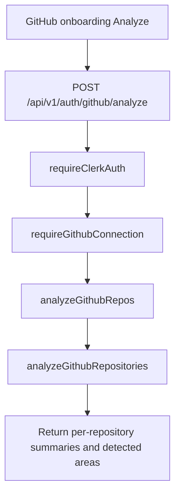

# GitHub Analysis Pipeline Orchestration

> Endpoint, service, GitHub connection, and tree-fetching boundaries for repository analysis.

---

## 1. Core Philosophy

- GitHub API access belongs at the route/service boundary.
- Individual analyzers receive normalized data and do not fetch remote data.
- Client-facing GitHub responses must be mapped through explicit DTO mappers.

---

## 2. Architecture Overview

```text
GitHub repo IDs selected by user
  └─ POST /api/v1/auth/github/analyze
      ├─ require Clerk authentication
      ├─ require saved GitHub connection
      └─ invokes analyzeGithubRepositories and returns project-structure summaries and detected areas

GitHub App installation
  └─ callback verifies user access to installation
      └─ stores installation ID and short-lived installation token
          └─ protected GitHub routes refresh token before use
```

---

## 3. Key Files & Entry Points

| File                                                               | Purpose                                                                                                                                                  | When to Read                                 |
| ------------------------------------------------------------------ | -------------------------------------------------------------------------------------------------------------------------------------------------------- | -------------------------------------------- |
| `apps/backend/src/routes/github.router.ts`                         | Registers GitHub OAuth, repo listing, connection, and temporary analysis routes.                                                                         | GitHub endpoint changes                      |
| `apps/backend/src/schemas/github.schema.ts`                        | Zod request body schema and inferred type for temporary GitHub analysis.                                                                                 | GitHub request validation changes            |
| `apps/backend/src/controllers/github.controller.ts`                | Reads validated selected repo IDs and calls GitHub analysis service.                                                                                     | GitHub request/response changes              |
| `apps/backend/src/mappers/github.mapper.ts`                        | Maps internal GitHub models into client-safe response DTOs with explicit field allowlists.                                                               | GitHub response DTO changes                  |
| `apps/backend/src/middleware/github-auth.ts`                       | Requires a saved GitHub connection after Clerk auth and attaches it to `res.locals.githubConnection`.                                                    | GitHub-protected route changes               |
| `packages/shared/src/types/github.ts`                              | Defines full backend GitHub connection and client-safe public connection response types.                                                                 | GitHub API contract changes                  |
| `apps/backend/prisma/schema.prisma`                                | Persists the installation ID plus the cached, expiring installation token for each Clerk user.                                                           | GitHub connection persistence changes        |
| `apps/backend/src/services/github.service.ts`                      | Initiates the installation flow, verifies callbacks, manages installation tokens, and fetches repositories.                                              | GitHub connection or token lifecycle changes |
| `apps/backend/src/services/github-analysis.service.ts`             | Runs the temporary analyze orchestration: fetches selected repos and trees, normalizes entries, and returns per-repository summaries and detected areas. | GitHub analysis orchestration changes        |
| `apps/backend/src/services/github-analysis/github-tree-fetcher.ts` | Fetches recursive GitHub tree metadata for a selected repository.                                                                                        | GitHub tree API changes                      |
| `apps/backend/src/utils/github-utils.ts`                           | Shared pure GitHub helpers: raw tree types, full-name parsing, and tree entry normalization.                                                             | Tree normalization or repo parsing changes   |

---

## 4. Data Flow

### 4.1 Temporary Analyze Endpoint Flow



---

## 5. Component / Module Structure

```text
apps/backend/src/
├── routes/
│   └── github.router.ts
├── controllers/
│   └── github.controller.ts
├── middleware/
│   └── github-auth.ts
├── mappers/
│   └── github.mapper.ts
├── utils/
│   └── github-utils.ts
└── services/
    ├── github-analysis.service.ts
    └── github-analysis/
        ├── github-tree-fetcher.ts
        ├── project-structure/            # implemented
        ├── dependency-config-analyzer.ts # future
        ├── source-code-analyzer.ts       # future
        ├── test-quality-analyzer.ts      # future
        ├── readme-docs-analyzer.ts       # future
        ├── ci-cd-analyzer.ts             # future
        ├── commit-analyzer.ts            # future
        └── pull-request-analyzer.ts      # future
```

---

## 6. Patterns & Conventions

### 6.1 Analyzer Boundary

- **Rule**: Analyzers receive normalized data and return structured results.
- **Rule**: GitHub API calls belong in orchestration/service code, not inside individual analyzers.
- **Rule**: Use one object parameter for exported functions.
- **Anti-pattern**: Do not pass repo IDs into analyzers and let each analyzer refetch the same GitHub data.

### 6.2 GitHub Connection Boundary

- **Rule**: GitHub-token routes must run `requireClerkAuth` before `requireGithubConnection`.
- **Rule**: `requireGithubConnection` refreshes an installation token that is within five minutes of expiration before attaching `res.locals.githubConnection`.
- **Rule**: `/connection` remains Clerk-only because it is the status endpoint used to detect whether the user is connected.
- **Rule**: `/connection` must return `GitHubConnectionResponse | null` and must never expose the installation ID or stored installation token to the browser.
- **Rule**: Any client response derived from a token-bearing/internal GitHub object must use a response DTO mapper with an explicit field allowlist.

---

## 7. Integration Points

| Domain                     | Relationship                                                                   | Key Interface                                 |
| -------------------------- | ------------------------------------------------------------------------------ | --------------------------------------------- |
| Onboarding                 | GitHub repo selection calls the temporary analyze endpoint.                    | `AnalyzeGithubReposInput`                     |
| Auth                       | GitHub-token routes require Clerk auth and saved GitHub connection middleware. | `requireClerkAuth`, `requireGithubConnection` |
| Project structure analysis | Service normalizes GitHub tree entries before invoking the analyzer.           | `AnalyzeProjectStructureInput`                |

### 7.1 GitHub App Connection & Environment Configuration

The backend connects to GitHub through a repository-scoped GitHub App. The installation is the durable connection boundary; a GitHub user authorization token is used only during the callback to verify that the authenticated user can access the selected installation.

1. **Initiation (`POST /api/v1/auth/github`)**: Generates a cryptographically random 32-byte Base64URL `state`, stores `github_oauth_state:<state> -> clerkUserId` in Redis with a 15-minute TTL, and returns `{ authUrl }` pointing to `https://github.com/apps/<GITHUB_APP_SLUG>/installations/new?state=<state>` for the client to navigate to. The frontend calls this through `initiateGithubAuthAction` rather than a direct browser redirect, so installation-precondition failures surface as a normal action error instead of a raw page.
2. **Callback (`GET /api/v1/auth/github/callback`)**: Atomically consumes the state with Redis `GETDEL`, confirms the matching Clerk user, exchanges the callback code for a user token, and verifies that the user can access the returned installation.
3. **Connection persistence**: The callback signs an app JWT, obtains a short-lived installation token, and upserts `installationId`, `installationAccessToken`, and its expiration. GitHub-protected routes refresh the token with a five-minute buffer before using it.
4. **Migration boundary**: The migration deletes legacy OAuth connection records because they cannot be converted into GitHub App installations; affected users reconnect through the installation flow.

The backend validates GitHub App configuration through `apps/backend/src/config/env.ts` (`GITHUB_APP_SLUG`, `GITHUB_APP_ID`, `GITHUB_APP_CLIENT_ID`, `GITHUB_APP_CLIENT_SECRET`, `GITHUB_APP_CALLBACK_URL`, and normalized PEM `GITHUB_APP_PRIVATE_KEY`). Temporary legacy aliases stay confined to the configuration boundary while call sites transition.

---

## 8. Implementation Status

- [x] Temporary analyze endpoint accepts selected repository IDs and returns project-structure summaries and detected areas
- [x] Resumed temporary analyze endpoint orchestration and project-structure summaries
- [x] GitHub connection middleware boundary
- [x] GitHub App installation connection and installation-token refresh
- [x] Client-safe GitHub response mapper
- [x] Recursive GitHub tree fetcher
- [x] Tree entry normalization
- [ ] Multi-analyzer orchestration beyond project structure
- [ ] Evidence aggregator
- [ ] AI resume synthesis integration

---

## 9. Risks & Mitigations

| Risk                                                             | Mitigation                                                                             |
| ---------------------------------------------------------------- | -------------------------------------------------------------------------------------- |
| OAuth token leaks into client response                           | Always map internal GitHub connection models through `github.mapper.ts`.               |
| Legacy OAuth connections are treated as GitHub App installations | Delete incompatible records in the migration and require affected users to reconnect.  |
| An installation token expires during a protected request         | Refresh cached tokens five minutes before expiry in `requireGithubConnection`.         |
| Analyzers refetch the same GitHub data repeatedly                | Keep analyzers pure and pass normalized tree/file data from the service layer.         |
| Temporary endpoint response becomes a final contract too early   | Keep temporary analyze output explicit and document future pipeline stages separately. |

---

## 10. History & Decisions

- **Changelog:** [changelog.md](changelog.md)
- **Architecture decisions:** [adr/](adr/)
- Historical domain-level entries may also live in the parent changelog.
