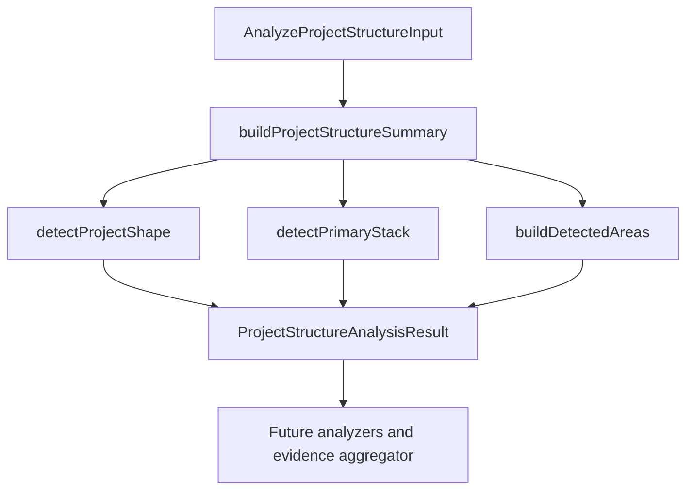

# GitHub Project Structure Analyzer

> Implemented path-only analyzer that summarizes repository shape, infers early stack/tool signals, and detects meaningful repository areas.

---

## 1. Core Philosophy

- Use deterministic path evidence before reading file contents.
- Keep stack inference conservative: structure-inferred stack is not the final source of truth.
- Emit evidence-backed areas that future analyzers can use as a cheap map.

---

## 2. Architecture Overview



The analyzer accepts already-fetched data:

- repository identity: `id`, `repositoryFullName`
- normalized tree entries: `path`, `name`, `type`, `depth`, `parentPath`, `extension`, `sizeBytes`
- GitHub tree truncation flag: `isTruncated`

The analyzer does not fetch GitHub data, read file contents, or call AI.

---

## 3. Key Files & Entry Points

| File                                                                                                | Purpose                                                                           | When to Read                             |
| --------------------------------------------------------------------------------------------------- | --------------------------------------------------------------------------------- | ---------------------------------------- |
| `apps/backend/src/services/github-analysis/project-structure/project-structure-analyzer.ts`         | Public project-structure analyzer entry point and orchestration.                  | Any project-structure analyzer change    |
| `apps/backend/src/services/github-analysis/project-structure/project-structure-analyzer.types.ts`   | Public input/output contracts for project structure analysis.                     | Changing analyzer input/output shape     |
| `apps/backend/src/services/github-analysis/project-structure/project-structure-entry-index.ts`      | Path/name/extension lookup helpers built from normalized GitHub tree entries.     | Adding path-based detection rules        |
| `apps/backend/src/services/github-analysis/project-structure/project-shape-detector.ts`             | Score-based project shape detection.                                              | Changing `summary.projectShape`          |
| `apps/backend/src/services/github-analysis/project-structure/primary-stack-detector.ts`             | Structure-inferred stack detection.                                               | Changing `summary.inferredStack`         |
| `apps/backend/src/services/github-analysis/project-structure/project-structure-summary.ts`          | Builds the summary block from tree entries.                                       | Changing summary fields                  |
| `apps/backend/src/services/github-analysis/project-structure/project-structure-detected-areas.ts`   | Orchestrates score-based detected area generation from path evidence.             | Changing `detectedAreas` output          |
| `apps/backend/src/services/github-analysis/project-structure/project-structure-detected-area-*.ts`  | Detected-area rule, candidate, and internal type helpers.                         | Changing detected-area scoring internals |
| `apps/backend/src/services/github-analysis/project-structure/project-structure-path-utils.ts`       | Shared path normalization and owner-path helpers for project-structure detectors. | Adding reusable path helpers             |
| `apps/backend/src/services/github-analysis/project-structure/project-structure-score-candidates.ts` | Shared score candidate helpers for deterministic structure detectors.             | Adding score-based detector helpers      |
| `apps/backend/src/services/github-analysis/project-structure/project-structure-analyzer.test.ts`    | Focused coverage for current project shape and inferred stack rules.              | Updating detection behavior              |

---

## 4. Data Flow

```text
RepoTreeEntry[]
  -> buildEntryIndex()
  -> buildProjectStructureSummary()
       -> detectProjectShape()
       -> detectPrimaryStack()
  -> buildDetectedAreas()
  -> ProjectStructureAnalysisResult
```

---

## 5. Component / Module Structure

```text
apps/backend/src/services/github-analysis/project-structure/
├── project-structure-analyzer.ts
├── project-structure-analyzer.types.ts
├── project-structure-entry-index.ts
├── project-shape-detector.ts
├── primary-stack-detector.ts
├── project-structure-summary.ts
├── project-structure-detected-areas.ts
├── project-structure-detected-area-rules.ts
├── detected-area-rules/
│   ├── project-structure-area-rule-candidates.ts
│   └── frontend/
│       ├── angular-frontend-area-rules.ts
│       ├── astro-frontend-area-rules.ts
│       ├── frontend-area-competing-proof.ts
│       ├── frontend-area-rules.ts
│       ├── generic-frontend-area-rules.ts
│       ├── next-frontend-area-rules.ts
│       ├── nuxt-frontend-area-rules.ts
│       ├── react-frontend-area-rules.ts
│       ├── react-router-frontend-area-rules.ts
│       ├── static-frontend-area-rules.ts
│       ├── sveltekit-frontend-area-rules.ts
│       └── vue-frontend-area-rules.ts
├── project-structure-detected-area-candidates.ts
├── project-structure-detected-areas.types.ts
├── project-structure-path-utils.ts
├── project-structure-score-candidates.ts
└── project-structure-analyzer.test.ts
```

---

## 6. Patterns & Conventions

### 6.1 Project Shape Detection

- **Rule**: Use score-based path evidence, not a single exact string match.
- **Rule**: Return `unknown` when evidence is weak.
- **Rule**: Keep possible shape scores private until there is a real consumer.
- **Rule**: Monorepo evidence includes common workspace config files such as `turbo.json`, `pnpm-workspace.yaml`, `nx.json`, `workspace.json`, `project.json`, and `lerna.json`, plus owner roots such as `apps/`, `packages/`, `libs/`, and weak `services/` evidence.
- **Rule**: Frontend monorepo paths should match generalized owners such as `apps/*/app` or `apps/*/pages`, not only `apps/frontend`.
- **Current labels**: `full-stack monorepo`, `monorepo`, `full-stack app`, `frontend app`, `backend api`, `library/package`, `cli tool`, `mobile app`, `documentation site`, `unknown`.

### 6.2 Inferred Stack Detection

- **Rule**: `summary.inferredStack` is structure-inferred only.
- **Rule**: Do not treat it as the final stack source of truth.
- **Rule**: Do not infer dependency-specific backend frameworks such as Express from generic folders alone; dependency/config analysis should confirm those later.
- **Rule**: Path-only stack inference may include distinctive config or structure signals such as Next.js, Vite, Prisma, Docker, Turborepo, Nx, NestJS, Expo, React Native, native Android/iOS, and Flutter.
- **Rule**: Dependency/config analyzer will later confirm stack from files such as `package.json`, lockfiles, Prisma schema, Docker config, and framework config.

### 6.3 Detected Area Generation

- **Rule**: `detectedAreas` identifies meaningful repository regions from path evidence only.
- **Rule**: Score concrete `(name, path)` candidates where `path` is the area owner root, not the individual evidence path.
- **Rule**: Evidence arrays must contain actual repository paths, not prose explanations.
- **Rule**: Root-level app or config evidence uses `path: "."`; monorepo evidence uses owners such as `apps/frontend`, `apps/backend`, or `packages/shared`.
- **Rule**: Reusable detected-area rule infrastructure such as `AreaRuleCandidate<Signal>`, owner candidate map creation, once-per-owner signal counting, and adding local owner candidates to the shared candidate map lives in `detected-area-rules/project-structure-area-rule-candidates.ts`; all active owner-scoped frontend detectors use it while still owning their signal unions, scores, finder variables, and output gates.
- **Rule**: Known tool conventions should merge related evidence under one owner, such as Prisma `schema.prisma`/`migrations` or conservative Drizzle paths like `drizzle.config.ts`, `drizzle/`, and `src/db/schema.ts`.
- **Rule**: Backend API areas require strong backend structure such as `routes`, `controllers`, and `services` under the same owner, or an explicit backend entry file; frontend `src/routes` plus `src/services` alone is not enough.
- **Rule**: Next.js frontend area evidence is grouped by owner path and scored once per signal type: `next.config.*`, App Router convention files, Pages Router files, and weaker `app`/`pages` directory hints.
- **Rule**: Nuxt frontend area evidence is grouped by owner path and scored once per signal type: `nuxt.config.*`, `app.vue`/`app/app.vue`, Vue page/layout files, weaker script pages and server routes, and weak `pages` directory hints; Nuxt areas emit only from config or Nuxt app-entry proof.
- **Rule**: Vue frontend area evidence is grouped by owner path and scored once per signal type: `src/App.vue`, `src/main.*`, Vue Router files, Vue view/page components, Vue CLI config, and Vite config support; Vue areas emit only from root app component combinations and skip owners with Nuxt proof.
- **Rule**: React Router frontend area evidence is grouped by owner path and scored once per signal type: `react-router.config.*`, `app/root.*`, `app/routes.*`, optional `app/entry.client.*`/`app/entry.server.*`, route files under `app/routes`, and weak `app/routes`/Vite support hints; this first version relies only on the global minimum area score for output filtering.
- **Rule**: React frontend area evidence is grouped by owner path and scored once per signal type: Vite config, root/public index HTML, `src/main.*`, `src/index.*`, `src/App.*`, starter CSS files, JSX/TSX components, and page/view component hints; broad React output skips owners with stronger same-owner Next.js or React Router proof.
- **Rule**: Broad frontend detectors can use blocker-grade proof helpers from `frontend-area-competing-proof.ts`; those helpers return only strong competing framework evidence, not weak support files.
- **Rule**: Static frontend area evidence is grouped by owner path and scored once per signal type: root `index.html`, non-index root HTML pages, root CSS/JS files, `css`/`js` directory files, Vite config, and `src/main.js`/`src` CSS support; static areas emit only from supported static page shapes such as index+CSS, directory CSS, Vite static, or multi-page HTML with CSS evidence.
- **Rule**: Angular frontend area evidence is grouped by owner path and scored once per signal type: `angular.json`, root component/module files, `src/main.ts`, and weak `project.json`/`src/app` support hints.
- **Rule**: SvelteKit frontend area evidence is grouped by owner path and scored once per signal type: `svelte.config.*`, `src/routes/+page.*`, `src/routes/+layout.*`, `src/routes/+server.*`, `src/app.html`, and weak `src/routes` support hints.
- **Rule**: Astro frontend area evidence is grouped by owner path and scored once per signal type: `astro.config.*`, strong `src/pages/*.astro` page files, weak `src/pages/*.{md,mdx,html}` content page hints, endpoint files, `src/layouts/*.astro`, `src/components/*.astro`, and weak `src/pages` support hints; weak-only Astro hints do not emit an area.
- **Rule**: Generic frontend area evidence includes Vite-style `vite.config.*`, `index.html`, `src/main.*`, `src/App.*`, and React SPA `src/index.*` while still emitting role-based `Frontend app` areas.
- **Rule**: The temporary analyze endpoint can keep returning summaries while later pipeline stages consume the full internal analyzer result.

---

## 7. Integration Points

| Domain                     | Relationship                                                                          | Key Interface                    |
| -------------------------- | ------------------------------------------------------------------------------------- | -------------------------------- |
| GitHub pipeline            | Service fetches and normalizes tree data before invoking the analyzer.                | `AnalyzeProjectStructureInput`   |
| Resume generation          | Future evidence aggregator should consume analyzer outputs instead of raw repo dumps. | `ProjectStructureAnalysisResult` |
| Dependency/config analyzer | Later confirms stack from file contents and dependency manifests.                     | Future dependency/config result  |

---

## 8. Implementation Status

- [x] Analyzer file structure created
- [x] Project structure input/output types defined
- [x] Path lookup helper created
- [x] Project shape detector implemented
- [x] Structure-inferred stack detector implemented
- [x] Focused tests added for current detection behavior
- [x] Detected areas builder
- [ ] Architecture signals builder
- [ ] Maturity signals builder
- [ ] Candidate files builder
- [ ] Resume signal hints builder
- [ ] Feedback builder

---

## 9. Risks & Mitigations

| Risk                                              | Mitigation                                                                                             |
| ------------------------------------------------- | ------------------------------------------------------------------------------------------------------ |
| Path-based rules misclassify unusual repo layouts | Use scoring, return `unknown` for weak evidence, and later compare against dependency/config evidence. |
| `inferredStack` is mistaken for confirmed stack   | Keep the field name explicit and document that dependency/config analysis owns final stack confidence. |
| Weak repos produce bad resume claims              | Feed gaps, limitations, and improvement suggestions into user-facing feedback before final synthesis.  |

---

## 10. Development Log

See [changelog.md](changelog.md) for historical project-structure implementation entries.
