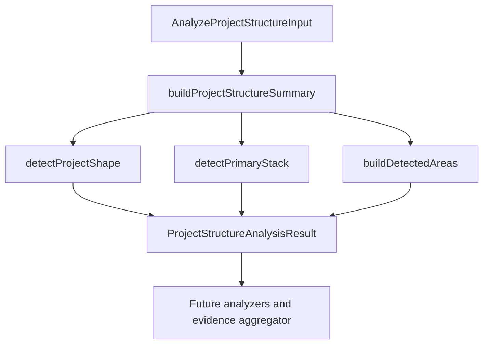

# GitHub Project Structure Analyzer

> Implemented path-only analyzer that summarizes repository shape, infers early stack/tool signals, and detects meaningful repository areas.

---

## 1. Core Philosophy

- Use deterministic path evidence before reading file contents.
- Keep stack inference conservative: structure-inferred stack is not the final source of truth.
- Emit evidence-backed areas that future analyzers can use as a cheap map.

---

## 2. Architecture Overview



The analyzer accepts already-fetched data:

- repository identity: `id`, `repositoryFullName`
- normalized tree entries: `path`, `name`, `type`, `depth`, `parentPath`, `extension`, `sizeBytes`
- GitHub tree truncation flag: `isTruncated`

The analyzer does not fetch GitHub data, read file contents, or call AI.

---

## 3. Key Files & Entry Points

| File                                                                                                             | Purpose                                                                           | When to Read                             |
| ---------------------------------------------------------------------------------------------------------------- | --------------------------------------------------------------------------------- | ---------------------------------------- |
| `apps/backend/src/services/github-analysis/project-structure/project-structure-analyzer.ts`                      | Public project-structure analyzer entry point and orchestration.                  | Any project-structure analyzer change    |
| `apps/backend/src/services/github-analysis/project-structure/project-structure-analyzer.types.ts`                | Public input/output contracts for project structure analysis.                     | Changing analyzer input/output shape     |
| `apps/backend/src/services/github-analysis/project-structure/project-structure-entry-index.ts`                   | Path/name/extension lookup helpers built from normalized GitHub tree entries.     | Adding path-based detection rules        |
| `apps/backend/src/services/github-analysis/project-structure/project-shape-detector.ts`                          | Score-based project shape detection.                                              | Changing `summary.projectShape`          |
| `apps/backend/src/services/github-analysis/project-structure/primary-stack-detector.ts`                          | Structure-inferred stack detection.                                               | Changing `summary.inferredStack`         |
| `apps/backend/src/services/github-analysis/project-structure/project-structure-summary.ts`                       | Builds the summary block from tree entries.                                       | Changing summary fields                  |
| `apps/backend/src/services/github-analysis/project-structure/project-structure-detected-areas.ts`                | Orchestrates score-based detected area generation from path evidence.             | Changing `detectedAreas` output          |
| `apps/backend/src/services/github-analysis/project-structure/project-structure-detected-area-*.ts`               | Detected-area rule, candidate, and internal type helpers.                         | Changing detected-area scoring internals |
| `apps/backend/src/services/github-analysis/project-structure/detected-area-rules/declarative-area-rule-engine.ts` | Generic schema-driven detector runner used by 22 of the framework, database, containerization, and test detectors; supports `gateBlocker` shape checks, `competingProofSchemas` file-evidence vetoes, a `checkForExistingCandidate` shared-candidate-map veto, and a `dynamicRelatedTechMap` per-signal related-technology union (see the 2026-08-27, 2026-08-28, and 2026-08-29 changelog entries). Two detectors remain permanently hand-written -- see Risks & Mitigations below. | Changing shared detector matching/gating/veto behavior |
| `apps/backend/src/services/github-analysis/project-structure/project-structure-path-utils.ts`                    | Shared path normalization plus the single generic application-area owner-path resolver used as the default across every detected-area detector. | Adding reusable path helpers             |
| `apps/backend/src/services/github-analysis/project-structure/project-structure-score-candidates.ts`              | Shared score candidate helpers for deterministic structure detectors.             | Adding score-based detector helpers      |
| `apps/backend/src/services/github-analysis/project-structure/project-structure-analyzer.test.ts`                 | Focused coverage for current project shape and inferred stack rules.              | Updating detection behavior              |
| `apps/backend/src/services/github-analysis/project-structure/project-structure-detected-area-candidates.test.ts` | Candidate merge and inferred-technology contract coverage.                        | Updating candidate accumulation behavior |

---

## 4. Data Flow

```text
RepoTreeEntry[]
  -> buildEntryIndex()
  -> buildProjectStructureSummary()
       -> detectProjectShape()
       -> detectPrimaryStack()
  -> buildDetectedAreas()
  -> ProjectStructureAnalysisResult
```

---

## 5. Component / Module Structure

```text
apps/backend/src/services/github-analysis/project-structure/
├── project-structure-analyzer.ts
├── project-structure-analyzer.types.ts
├── project-structure-entry-index.ts
├── project-shape-detector.ts
├── primary-stack-detector.ts
├── project-structure-summary.ts
├── project-structure-detected-areas.ts
├── project-structure-detected-area-rules.ts
├── detected-area-rules/
│   ├── project-structure-area-rule-candidates.ts
│   ├── backend/
│   │   ├── asp-net-core-backend-area-rules.ts
│   │   ├── backend-area-rules.ts
│   │   ├── django-backend-area-rules.ts
│   │   ├── express-backend-area-rules.ts
│   │   ├── generic-backend-area-rules.ts
│   │   ├── laravel-backend-area-rules.ts
│   │   ├── nest-backend-area-rules.ts
│   │   ├── rails-backend-area-rules.ts
│   │   └── spring-boot-backend-area-rules.ts
│   ├── database/
│   │   ├── database-area-rules.ts
│   │   ├── drizzle-database-area-rules.ts
│   │   ├── knex-database-area-rules.ts
│   │   ├── prisma-database-area-rules.ts
│   │   ├── sequelize-database-area-rules.ts
│   │   ├── sqlalchemy-database-area-rules.ts
│   │   └── typeorm-database-area-rules.ts
│   ├── shared-package/
│   │   ├── js-ts-shared-package-area-rules.ts
│   │   └── shared-package-area-rules.ts
│   ├── containerization/
│   │   ├── containerization-area-rules.ts
│   │   ├── docker-containerization-area-rules.ts
│   │   └── podman-oci-containerization-area-rules.ts
│   ├── frontend/
│   │   ├── angular-frontend-area-rules.ts
│   │   ├── astro-frontend-area-rules.ts
│   │   ├── frontend-area-competing-proof.ts
│   │   ├── frontend-area-rules.ts
│   │   ├── next-frontend-area-rules.ts
│   │   ├── nuxt-frontend-area-rules.ts
│   │   ├── react-frontend-area-rules.ts
│   │   ├── react-router-frontend-area-rules.ts
│   │   ├── static-frontend-area-rules.ts
│   │   ├── svelte-frontend-area-rules.ts
│   │   ├── sveltekit-frontend-area-rules.ts
│   │   └── vue-frontend-area-rules.ts
│   └── test/
│       ├── cypress-test-area-rules.ts
│       ├── jest-test-area-rules.ts
│       ├── mocha-test-area-rules.ts
│       ├── playwright-test-area-rules.ts
│       ├── test-area-rules.ts
│       └── vitest-test-area-rules.ts
├── project-structure-detected-area-candidates.ts
├── project-structure-detected-area-candidates.test.ts
├── project-structure-detected-areas.types.ts
├── project-structure-path-utils.ts
├── project-structure-score-candidates.ts
└── project-structure-analyzer.test.ts
```

---

## 6. Patterns & Conventions

### 6.1 Project Shape Detection

- **Rule**: Use score-based path evidence, not a single exact string match.
- **Rule**: Return `unknown` when evidence is weak.
- **Rule**: Keep possible shape scores private until there is a real consumer.
- **Rule**: Monorepo evidence includes common workspace config files such as `turbo.json`, `pnpm-workspace.yaml`, `nx.json`, `workspace.json`, `project.json`, and `lerna.json`, plus owner roots such as `apps/`, `packages/`, `libs/`, and weak `services/` evidence.
- **Rule**: Frontend monorepo paths should match generalized owners such as `apps/*/app` or `apps/*/pages`, not only `apps/frontend`.
- **Current labels**: `full-stack monorepo`, `monorepo`, `full-stack app`, `frontend app`, `backend api`, `library/package`, `cli tool`, `mobile app`, `documentation site`, `unknown`.

### 6.2 Inferred Stack Detection

- **Rule**: `summary.inferredStack` is structure-inferred only.
- **Rule**: Do not treat it as the final stack source of truth.
- **Rule**: Do not infer dependency-specific backend frameworks such as Express from generic folders alone. The detected-area Express.js detector only accepts conservative generator or layered API path clusters; dependency/config analysis should confirm package-level proof later.
- **Rule**: Path-only stack inference may include distinctive config or structure signals such as Next.js, Vite, Prisma, Docker, Turborepo, Nx, NestJS, Expo, React Native, native Android/iOS, and Flutter.
- **Rule**: Dependency/config analyzer will later confirm stack from files such as `package.json`, lockfiles, Prisma schema, Docker config, and framework config.

### 6.3 Detected Area Generation

- **Rule**: `detectedAreas` identifies meaningful repository regions from path evidence only.
- **Rule**: Score concrete `(name, path)` candidates where `path` is the area owner root, not the individual evidence path.
- **Rule**: Evidence arrays must contain actual repository paths, not prose explanations.
- **Rule**: Root-level app or config evidence uses `path: "."`; monorepo app evidence uses owners such as `apps/frontend` or `apps/backend`; shared-package evidence uses container owners such as `packages`, `libs`, `modules`, `shared`, or `common`.
- **Rule**: Every emitted detected area includes path-inferred technology metadata with one required `primary` technology and zero or more deduplicated `related` technologies. The primary is excluded from related values; internal candidates use a `Set` and public output converts it to a stable sorted array.
- **Rule**: `DetectedAreaTechnology` is composed from frontend, backend, containerization, runtime/platform, template, database, and test technology unions in `project-structure-analyzer.types.ts`; keep the public union stable while adding new labels to the narrow category that owns them.
- **Rule**: The first detector that creates an `(area name, owner path)` candidate owns its primary technology; later score additions preserve that primary and may only accumulate score, evidence, and related technologies.
- **Rule**: Reusable detected-area rule infrastructure such as `AreaRuleCandidate<Signal>`, owner candidate map creation, once-per-owner signal counting, and adding local owner candidates to the shared candidate map lives in `detected-area-rules/project-structure-area-rule-candidates.ts`; all active owner-scoped frontend detectors use it while still owning their signal unions, scores, finder variables, and output gates.
- **Rule**: Backend detected-area rules are dispatched from `detected-area-rules/backend/backend-area-rules.ts`. NestJS, Django, Spring Boot, ASP.NET Core, Laravel, Ruby on Rails, and Express.js run first with implemented path rules before the scaffolded generic backend fallback.
- **Rule**: Shared package detected-area rules are dispatched from `detected-area-rules/shared-package/shared-package-area-rules.ts`. Language-specific shared-package detectors live in separate modules, starting with the implemented JavaScript/TypeScript workspace-package detector.
- **Rule**: Containerization detected-area rules are dispatched from `detected-area-rules/containerization/containerization-area-rules.ts`. Runtime-specific containerization detectors live in separate modules: Docker and the Podman/OCI combination gate are implemented. Podman/OCI collects basename-only Quadlet unit, `Containerfile`, and `.containerignore` evidence and counts each signal once per provisional application owner, then resolves it through the shared generic `ownerPathForApplicationArea` resolver (see the owner-resolution rule below); no fixture/example/test path exclusions are applied, consistent with the general directory-name-exclusion policy below.
- **Rule**: Podman/OCI emission requires a coherent multi-signal shape because basename-only extensions such as `.container` and `.build` can collide with unrelated formats. A `.container`, `.pod`, or `.kube` runtime unit must be paired with another runtime unit, a Quadlet build/image/network/volume/artifact unit, or a `Containerfile`. A `.build` unit must be paired with a `Containerfile`, runtime unit, or `.image` unit. No single signal, support-resource-only group, `Containerfile` plus `.containerignore`, runtime unit plus only `.containerignore`, or `.build` plus only network/volume/artifact evidence can unlock emission. See [ADR 0002](adr/0002-podman-oci-containerization-gate.md).
- **Rule**: Podman/OCI core `.container`, `.pod`, `.kube`, and `.build` signals score `3`; `.image` scores `2`; `.network`, `.volume`, `.artifact`, `Containerfile`, and `.containerignore` score `1`. Scores affect confidence only after the combination gate passes and never replace its semantic requirements.
- **Rule (2026-08-24):** Podman/OCI, Docker, every database schema detector, and the JS/TS shared-package detector no longer use dedicated owner resolvers. All of them now resolve owners through the single shared `ownerPathForApplicationArea` in `project-structure-path-utils.ts`: `apps/<name>` or `packages/<name>` for monorepo evidence under those roots, the path up to (not including) a `src` segment for other `src`-relative evidence, and `.` otherwise. The Podman/OCI-specific deep-nested config-directory scan and the Docker-specific monorepo/config-folder contract described in earlier changelog entries and [ADR 0002](adr/0002-podman-oci-containerization-gate.md) were removed; see [Containerization and Database Owner Resolvers Removed](changelog.md#containerization-and-database-owner-resolvers-removed).
- **Rule**: `project-structure-path-utils.test.ts` no longer contains dedicated owner-resolver unit coverage; it was emptied when the Podman/OCI- and Docker-specific resolvers it tested were removed.
- **Rule**: Docker containerization matching recognizes basename-only Dockerfile variants, `.dockerignore` variants, Compose files such as `compose.yaml`, `compose.prod.yaml`, `docker-compose.yml`, and `docker-compose.prod.yml`, Docker Bake files such as `docker-bake.hcl` and `docker-bake.override.json`, and path-scoped `.devcontainer/devcontainer.json`.
- **Rule**: Dockerfile, Compose, and Bake signals independently unlock `Containerization` emission because each defines a Docker build or runtime workflow. `.dockerignore` and devcontainer signals remain support-only: they can increase score and evidence for an anchored owner but cannot unlock emission alone or together. See [ADR 0001](adr/0001-docker-containerization-gate.md).
- **Rule**: Docker containerization owner resolution uses the shared generic `ownerPathForApplicationArea` resolver (see the 2026-08-24 owner-resolution rule above), not a Docker-specific monorepo/config-folder contract.
- **Rule**: Docker detector confidence coverage includes Dockerfile-only, Compose-only, Bake-only, support-only rejection, anchored support evidence, and monorepo owner-isolation fixtures through the public analyzer output.
- **Rule (2026-08-24):** JavaScript/TypeScript shared-package owner resolution uses the shared generic `ownerPathForApplicationArea` resolver, not a dedicated shared-package container resolver; it no longer groups evidence at the repo-level `packages`/`libs`/`modules` container.
- **Rule**: JavaScript/TypeScript shared-package output emits `Shared package` with primary technology `Node.js`. It requires a shared-looking package/container name plus either a workspace manifest (`package.json` or `project.json`) or a public entrypoint (`index.*` or `src/index.*`). Package name alone, manifest alone, entrypoint alone, app-internal `src/shared`, and top-level `utils` remain non-emitting.
- **Rule**: JavaScript/TypeScript shared-package detector confidence coverage uses `packages`, scoped `packages/@scope/*`, `libs`, `modules`, root `shared`, root `common`, repeated signal counting, and weak-signal rejection fixtures through the public analyzer output.
- **Rule**: NestJS evidence is grouped by owner and scored once per signal type across CLI config, main entry, root/default modules, controllers, services, gateways, and resolvers. Standard `src/app.*` files use dedicated buckets instead of also counting as broad feature signals.
- **Rule**: NestJS output requires an anchored application shape: CLI config plus another gate-capable signal, main entry plus root module, main entry plus feature module and transport handler, or root module plus transport handler. Standard and feature services remain score-only evidence.
- **Rule**: NestJS output uses `NestJS` as its primary technology and `Node.js` as related runtime context; it does not infer Express because path-only NestJS evidence cannot prove the configured HTTP adapter.
- **Rule**: NestJS detector confidence coverage uses official-starter, canonical, REST/microservice, WebSocket, GraphQL, backend-package, Nx-style, monorepo-isolation, weak-hint, Angular-interference, unanchored-cluster, and repeated-signal fixtures through the public analyzer output.
- **Rule**: Django evidence is grouped by owner and scored once per signal type across `manage.py`, classic `settings.py`, split `settings/{base,local,production,test}.py`, root URL config, WSGI/ASGI entries, app config, models, migrations, admin, views, and app URL config.
- **Rule**: Django output requires a project-level anchor: `manage.py` plus settings/root URL/server entry, settings plus root URL and server entry, `manage.py` plus app config and models or migration, or settings plus app config and migration. Generic app files such as `models.py`, `views.py`, and `admin.py` never emit Django alone.
- **Rule**: Django output uses `Django` as its primary technology and `Python` as related runtime/language context; dependency files such as `requirements.txt`, `pyproject.toml`, and `Pipfile` are left for later dependency/config analysis.
- **Rule**: Django detector confidence coverage uses official startproject, manage-backed, split-settings, app-supported, settings-backed, monorepo-isolation, repeated-signal, isolated-signal, reusable-package, and Flask/FastAPI-like fixtures through the public analyzer output.
- **Rule**: Spring Boot evidence is grouped by owner and scored once per signal type across Maven/Gradle build files, `src/main/java` or `src/main/kotlin` `*Application` entry classes, `src/main/resources` application config files, profile config files, web controllers, REST resources, repositories, services, and configuration classes.
- **Rule**: Spring Boot output requires an anchored application shape: main application plus base application config, main application plus controller/resource and config or Java/Kotlin support, or application config plus controller/resource and Java/Kotlin support. Build files, `*Application` classes, config files, and generic controller/service/repository clusters never emit Spring Boot alone.
- **Rule**: Spring Boot output uses `Spring Boot` as its primary technology and exposes `Java`, `Kotlin`, or both as related language context based on matched source file extensions; dependency files are left for later dependency/config analysis.
- **Rule**: Spring Boot detector confidence coverage uses official/simple, Gradle-backed web, JHipster-style REST, config-backed web, Kotlin, mixed Java/Kotlin, monorepo-isolation, repeated-signal, isolated-signal, and weak-cluster fixtures through the public analyzer output.
- **Rule**: ASP.NET Core evidence is grouped by owner and scored once per signal type across `.csproj` files, `Program.cs`, `Startup.cs`, server `appsettings*.json`, `Properties/launchSettings.json`, controllers, minimal endpoint folders, Razor Pages, MVC views, and `wwwroot`. `wwwroot/appsettings*.json` is treated as client config rather than server appsettings proof.
- **Rule**: ASP.NET Core output requires a web-host application shape: host entry plus project file and controller, program entry plus project file and endpoint folder, project file plus appsettings and a transport/server UI signal, program entry plus project file/config/launch settings, or host entry plus project file and Razor/MVC server UI with config or `wwwroot`. Generic `.NET` project files, `Program.cs`, appsettings, launch settings, controllers, endpoints, views, and `wwwroot` never emit ASP.NET Core alone.
- **Rule**: ASP.NET Core output uses `ASP.NET Core` as its primary technology and exposes `.NET` and `C#` as related platform/language context; `.csproj` contents, package references, and C# annotations are left for later dependency/config or source analysis.
- **Rule**: ASP.NET Core detector confidence coverage uses controller Web API, minimal endpoint API, legacy Startup, launch-settings backed host, Razor Pages, MVC Views, monorepo-isolation, repeated-signal, isolated-signal, weak .NET project, and client-config fixtures through the public analyzer output.
- **Rule**: Laravel evidence is grouped by owner and scored once per signal type across `artisan`, `bootstrap/app.php`, modern bootstrap providers, application and route service providers, the legacy HTTP kernel, standard route files, the public entry, controllers, Blade views, models, migrations, seeders, `config/app.php`, and Composer manifests.
- **Rule**: Laravel output requires an anchored application shape: `artisan` plus `bootstrap/app.php`, modern bootstrap app/providers plus an application provider or standard route, legacy bootstrap app/HTTP kernel plus a route provider or standard route, or `artisan` plus the application service provider and a standard route. Controllers, Blade views, models, migrations, seeders, config, the public entry, broadcast routes, and Composer manifests remain score-only evidence.
- **Rule**: Laravel output uses `Laravel` as its primary technology and `PHP` as related language context. `Blade` is added as related technology only when the same owner contains `resources/views/**/*.blade.php`; package dependencies and source contents are left for later analyzers.
- **Rule**: Laravel detector confidence coverage uses current, canonical, modern, legacy, API, Blade, monorepo-isolation, reusable-package, repeated-signal, isolated-anchor, route-only, support-cluster, and generic PHP fixtures through the public analyzer output.
- **Rule**: Ruby on Rails evidence is grouped by owner and scored once per signal type across the Rails executable, application/boot/environment configs, routes, Rack entry, application and feature controllers, application and feature models, ERB views, migrations, schemas, database config, base jobs/mailers, Gemfile, and Rakefile.
- **Rule**: Ruby on Rails output always requires `config/application.rb` plus two independent application signals: `bin/rails` plus boot config or the environment entry, the environment entry plus `config.ru`, routes plus `ApplicationController`, or boot config plus routes. Models, feature controllers, views, migrations, schemas, database config, jobs, mailers, Gemfile, and Rakefile remain score-only.
- **Rule**: Rails matchers accept only repository-root, `apps/*`, and `packages/*` application paths. This prevents complete nested test applications such as `test/rails_app` and Rails generator templates from being promoted to their repository root without introducing a generic ignored-folder policy.
- **Rule**: Ruby on Rails output uses `Ruby on Rails` as its primary technology and `Ruby` as related language context. `ERB` is added only when the proven owner contains `app/views/**/*.html.erb`; dependency-specific Rails technologies remain for later analyzers.
- **Rule**: Ruby on Rails detector confidence coverage uses Rails 8-style, canonical boot, Rack boot, routed, configured, API-only, ERB, legacy, schema/structure, monorepo-isolation, repeated-signal, engine, nested-dummy, generator-template, sibling-isolation, isolated-anchor, generic Rack, and score-only fixtures through the public analyzer output.
- **Rule**: Express.js evidence is grouped by owner and scored once per signal type across Express-generator `bin/www`, root or `src/app.*` entries, `server.*` entries, package manifests, route directories and route files, generator default routes, controller directories and files, middleware directories and files, service directories and files, `public`, and `views`.
- **Rule**: Express.js output requires a conservative application shape: generator `bin/www` plus root app entry, route file, and generator support; app entry plus route, controller, and middleware/service support; or server entry plus route, controller, support, and package manifest. Generic Node entry files, package manifests, route/controller/middleware folders, `public`, and `views` never emit Express.js alone.
- **Rule**: Express.js runs after stronger backend framework detectors and skips an owner that already has a `Backend API` candidate (declared through the engine's `checkForExistingCandidate` flag), preventing weak Express-like folder structure from polluting NestJS or other framework metadata.
- **Rule**: Express.js output uses `Express.js` as its primary technology and `Node.js` as related runtime context. JavaScript and TypeScript backend extensions are supported, but `.tsx`, package contents, and source calls such as `express()` or `express.Router()` are left for later analyzers.
- **Rule**: Express.js detector confidence coverage uses generator, generator-without-views, TypeScript layered, JavaScript unsuffixed, TailorCV-style server-owned, services-backed, monorepo-isolation, repeated-signal, stronger-framework-interference, isolated-signal, frontend-like, and generic Node fixtures through the public analyzer output.
- **Rule**: Database detected-area rules are dispatched from `detected-area-rules/database/database-area-rules.ts` after frontend and backend application detectors. Database areas describe persistent schema and migration ownership separately from the application owner that contains them.
- **Rule (2026-08-24):** No database detector passes a custom owner resolver into `countAreaRuleSignal` anymore. Every database detector -- Prisma, Drizzle, Knex, SQLAlchemy, TypeORM, and Sequelize -- resolves owners through the shared generic `ownerPathForApplicationArea` in `project-structure-path-utils.ts`, the same resolver every other detector falls back to; see [Containerization and Database Owner Resolvers Removed](changelog.md#containerization-and-database-owner-resolvers-removed). Schema evidence no longer emits at a precise sub-application path such as `apps/backend/prisma`; it emits at the broader application owner such as `apps/backend`.
- **Rule**: Prisma evidence is grouped by the generic application owner (see the 2026-08-24 owner-resolution rule above, not a dedicated database owner) and scored once per signal type across `schema.prisma`, `.prisma` schema fragments under `prisma/`, `prisma.config.*` or `.config/prisma.*`, `prisma/migrations`, Prisma `migration.sql` files, and `migration_lock.toml`.
- **Rule**: Prisma output emits `Database schema` with primary technology `Prisma`. It requires `schema.prisma`, a Prisma migration file, config plus schema fragment, or config plus migration lock. Config alone, fragments alone, migration directories alone, migration locks alone, and generic SQL migrations outside `prisma/migrations` do not emit Prisma.
- **Rule**: Prisma detector confidence coverage uses conventional schema folders, root schema files, migration-history-only folders, config-backed schema fragments, monorepo owner isolation, repeated-signal evidence, and weak-signal rejection fixtures through the public analyzer output.
- **Rule**: Drizzle evidence is grouped by the generic application owner (see the 2026-08-24 owner-resolution rule above), not a dedicated database-aware owner resolver, even though Drizzle config, schema, SQL migrations, journal, and snapshots may live in separate folders.
- **Rule**: Drizzle output emits `Database schema` with primary technology `Drizzle`. It requires config plus schema, config plus a migration artifact, or generated migration SQL plus journal/snapshot metadata. Standard config alone, custom config alone, schema alone, SQL alone, journal alone, snapshot alone, metadata-only migrations, and generic SQL outside recognized migration output folders do not emit Drizzle.
- **Rule**: Drizzle detector confidence coverage uses root config plus `src/db/schema`, colocated `db/schema`, custom config plus `src/lib/db/schema`, package-owned `db/src/schema`, generated `drizzle/meta` migrations, custom `migrations/meta` output, app/service/lib monorepo owner isolation, and weak-signal rejection fixtures through the public analyzer output.
- **Rule**: Knex evidence is grouped by the generic application owner (see the 2026-08-24 owner-resolution rule above), not `db`/`database`-aware folder logic, even though `knexfile.*`, migration files, and seed files can be configured into separate locations.
- **Rule**: Knex output emits `Database schema` with primary technology `Knex`. It requires canonical or custom Knex config evidence plus migration or seed evidence under the same owner. Config alone, custom config alone, migration alone, seed alone, migration-plus-seed without Knex config, and generic database connection files do not emit Knex.
- **Rule**: Knex detector confidence coverage uses canonical root migrations, root seeds, nested `src/db` migrations, `database/migrations`, custom Knex config files, monorepo owner isolation, repeated signal counting, and weak-signal rejection fixtures through the public analyzer output.
- **Rule**: SQLAlchemy evidence is grouped by the generic application owner (see the 2026-08-24 owner-resolution rule above), not the nearest shared SQLAlchemy/Alembic code owner or individual artifact folder.
- **Rule**: SQLAlchemy output emits `Database schema` with primary technology `SQLAlchemy` and related technologies `Alembic` and `Python`. It requires Alembic env plus version history, or Alembic config/env/version evidence paired with SQLAlchemy model/session/database files. Models alone, database/session files alone, config alone, env alone, generic version folders, and SQL migration files do not emit SQLAlchemy.
- **Rule**: SQLAlchemy detector confidence coverage uses root Alembic, FastAPI-style app-local Alembic, Superset/Airflow-style `migrations` plus `models`, Prefect-style `_migrations/versions/{dialect}`, monorepo isolation, repeated version files, and weak-signal rejection fixtures through the public analyzer output.
- **Rule**: TypeORM evidence is grouped by the generic application owner (see the 2026-08-24 owner-resolution rule above), not a dedicated database-folder-aware owner, even though TypeORM config, data-source files, entities, and migrations often live across sibling `src` folders.
- **Rule**: TypeORM output emits `Database schema` with primary technology `TypeORM`. It requires legacy config or data-source evidence paired with entity or migration evidence, example config paired with entity evidence, or entity plus migration evidence under one owner. Config alone, data-source alone, example config alone, entity-only folders, migration-only folders, generic timestamp files outside migration folders, and broad `*.schema.*` files do not emit TypeORM.
- **Rule**: TypeORM detector confidence coverage uses legacy `ormconfig.*` plus entities, data-source plus generated migrations, entity plus migration without config, example config support, monorepo isolation, package-level entities and migrations, explicit database-folder ownership, repeated signal counting, and weak-signal rejection fixtures through the public analyzer output.
- **Rule**: Sequelize evidence is grouped by the generic application owner (see the 2026-08-24 owner-resolution rule above), not a dedicated database-folder-aware owner, even though Sequelize CLI config, model files, migrations, and seeders may live in split root folders or under explicit `sequelize`, `db`, or `database` folders.
- **Rule**: Sequelize output emits `Database schema` with primary technology `Sequelize`. It requires `.sequelizerc` plus model, migration, or seeder evidence; config plus model and migration evidence; model plus migration evidence; or config plus migration and seeder evidence. CLI config alone, config alone, model alone, migration alone, seeder alone, generic model-plus-seeder clusters, and timestamp files outside recognized migration folders do not emit Sequelize.
- **Rule**: Sequelize detector confidence coverage uses default CLI root folders, dedicated `sequelize/` folders, `src/infra/sequelize` folders, split DDD database/sequelize folders, monorepo isolation, repeated signal counting, and weak-signal rejection fixtures through the public analyzer output.
- **Rule**: Framework detectors do not discard evidence solely because it appears under generic `docs`, `test`, `tests`, or `fixtures` paths. Framework-specific signal combinations remain responsible for precision; directory exclusions should be introduced only from demonstrated false-positive repository shapes.
- **Rule**: Known tool conventions should merge related evidence under one owner, such as Prisma `schema.prisma`/`migrations` under a `prisma` database owner or Drizzle split artifacts under the owning app/package/repository path.
- **Rule**: Backend API areas require strong backend structure such as `routes`, `controllers`, and `services` under the same owner, or an explicit backend entry file; frontend `src/routes` plus `src/services` alone is not enough.
- **Rule**: Next.js frontend area evidence is grouped by owner path and scored once per signal type: `next.config.*`, App Router convention files, Pages Router files, and weaker `app`/`pages` directory hints; Next.js areas emit only from config, App Router core, or Pages Router special proof.
- **Rule**: Next.js detector confidence coverage uses realistic App Router, Pages Router, config-only, monorepo owner-isolation, and same-owner fallback-interference fixtures through the public analyzer output.
- **Rule**: Nuxt frontend area evidence is grouped by owner path and scored once per signal type: `nuxt.config.*`, `app.vue`/`app/app.vue`, Vue page/layout files, weaker script pages and server routes, and weak `pages` directory hints; Nuxt areas emit only from config or Nuxt app-entry proof.
- **Rule**: Nuxt detector confidence coverage uses realistic Nuxt 4 app-directory, Nuxt 3 root-directory, config-only, monorepo owner-isolation, same-owner Vue fallback-interference, and weak-hint fixtures through the public analyzer output.
- **Rule**: Vue frontend area evidence is grouped by owner path and scored once per signal type: `src/App.vue`, `src/main.*`, Vue Router files, Vue view/page components, Vue CLI config, and Vite config support; Vue areas emit only from root app component combinations and skip owners with stronger same-owner Nuxt proof.
- **Rule**: Vue detector confidence coverage uses realistic Vite Vue, Vue Router, file-based Vue Router, Vue CLI, monorepo owner-isolation, same-owner Nuxt fallback-interference, and weak-hint fixtures through the public analyzer output.
- **Rule**: React Router frontend area evidence is grouped by owner path and scored once per signal type: `react-router.config.*`, `app/root.*`, `app/routes.*`, optional `app/entry.client.*`/`app/entry.server.*`, route files under `app/routes`, and weak `app/routes`/Vite support hints; React Router areas emit only from explicit config or root-route combinations with routes config, file routes, or custom entry files.
- **Rule**: React Router detector confidence coverage uses realistic Framework Mode route-config, file-route, custom-entry, monorepo owner-isolation, same-owner React fallback-interference, and weak-hint fixtures through the public analyzer output.
- **Rule**: React frontend area evidence is grouped by owner path and scored once per signal type: Vite config, root/public index HTML, `src/main.*`, `src/index.*`, `src/App.*`, starter CSS files, JSX/TSX components, and page/view component hints; broad React output skips owners with stronger same-owner Next.js or React Router proof and emits only from Vite React, CRA-style, or structured React app shapes.
- **Rule**: React detector confidence coverage uses realistic Vite React, CRA-style, structured React, framework-interference, monorepo owner-isolation, and weak-hint fixtures through the public analyzer output.
- **Rule**: Broad frontend detectors can use blocker-grade proof helpers from `frontend-area-competing-proof.ts`; those helpers return only strong competing framework evidence, not weak support files.
- **Rule**: Static frontend area evidence is grouped by owner path and scored once per signal type: root `index.html`, non-index root HTML pages, root CSS/JS files, `css`/`js` directory files, Vite config, and `src/main.js`/`src` CSS support; static areas emit only from supported static page shapes such as index+CSS, directory CSS, Vite static, or multi-page HTML with CSS evidence.
- **Rule**: Static is the final broad frontend fallback. All stronger frontend detectors run first, and static skips an owner when the shared candidate map already contains a `Frontend app` claim for that owner (declared through the engine's `checkForExistingCandidate` flag); weak framework hints and proof from sibling owners do not block static output.
- **Rule**: Static frontend detector confidence coverage uses realistic root static, directory asset, multi-page static, Vite vanilla static, monorepo owner-isolation, same-owner framework-interference, and weak-hint fixtures through the public analyzer output.
- **Rule**: Angular frontend area evidence is grouped by owner path and scored once per signal type: `angular.json`, root component TypeScript/view files, `app.module.ts`, standalone `app.config.ts`, `src/main.ts`, and weak `project.json`/`src/app` support hints; Angular areas emit only from workspace config or root component/module/standalone app shapes.
- **Rule**: Angular detector confidence coverage uses realistic CLI workspace, standalone, classic NgModule, config-only, monorepo owner-isolation, and weak-hint fixtures through the public analyzer output.
- **Rule**: SvelteKit frontend area evidence is grouped by owner path and scored once per signal type: shared `svelte.config.*` support, strong `+page.svelte`/`+layout.svelte` route components, support `+page.*`/`+layout.*` load files, `+server.*` routes, `src/app.html`, and weak `src/routes` hints; SvelteKit areas emit only from route components or load/server evidence paired with the app template because standalone Svelte projects may also contain `svelte.config.*`.
- **Rule**: SvelteKit detector confidence coverage uses realistic full-app, load/server support, monorepo owner-isolation, config-only non-emission, and weak-hint fixtures through the public analyzer output.
- **Rule**: Standalone Svelte frontend evidence is grouped by owner path and scored once per signal type: `src/App.svelte`, `src/main.*`, Vite or Rollup config, shared `svelte.config.*`, root/public HTML entry files, and nested `src/components`/`src/lib` components; Svelte areas emit only from the root component plus main entry shape.
- **Rule**: SvelteKit runs before standalone Svelte. Strong same-owner SvelteKit route proof blocks the standalone detector, while sibling owners remain independent.
- **Rule**: Standalone Svelte detector confidence coverage uses current Vite JavaScript/TypeScript, legacy Rollup, structured component, SvelteKit interference, monorepo owner-isolation, technology metadata, and weak-hint fixtures through the public analyzer output.
- **Rule**: Astro frontend area evidence is grouped by owner path and scored once per signal type: `astro.config.*`, strong `src/pages/*.astro` page files, weak `src/pages/*.{md,mdx,html}` content page hints, endpoint files, support `src/layouts/*.astro`/`src/components/*.astro`, and weak `src/pages` hints; Astro areas emit only from config or `.astro` page proof.
- **Rule**: Astro detector confidence coverage uses realistic content-site, endpoint/content-rich, config-only, monorepo owner-isolation, and weak-hint fixtures through the public analyzer output.
- **Rule**: Test suite detected-area rules are dispatched from `detected-area-rules/test/test-area-rules.ts`, run last after containerization. Only the Jest detector is implemented; Vitest, Cypress, Mocha, and Playwright detectors (`detected-area-rules/test/vitest-test-area-rules.ts`, `cypress-test-area-rules.ts`, `mocha-test-area-rules.ts`, `playwright-test-area-rules.ts`) are wired into dispatch as empty stub functions that never add candidates.
- **Rule**: Jest evidence is grouped by owner (the generic `ownerPathForApplicationArea` resolver) and scored once per signal type across `jest.config.*`, `jest[.-]setup.*`, `setupTests.*`, `__tests__`, `__mocks__`, and `__snapshots__` directories, and `*.test.*`/`*.spec.*` files.
- **Rule**: Jest output emits `Test suite` with primary technology `Jest`. `jest.config.*` unlocks emission alone; every other signal is shared with at least one other test runner (Vitest, AVA, or CRA-with-Vitest reuse `__tests__`, `*.test.*`, and `setupTests.*`; Vitest also mirrors `__snapshots__`) and cannot unlock alone. A named `jest[.-]setup.*` file unlocks only alongside other test evidence, and `__mocks__` plus `__snapshots__` together unlock as a Jest-specific pairing.
- **Rule**: Emission gating for Vitest, Cypress, Mocha, and Playwright is not implemented yet; their stub detectors exist only so `addTestAreas` has a stable dispatch surface to fill in.
- **Rule**: The temporary analyze endpoint can keep returning summaries while later pipeline stages consume the full internal analyzer result.

---

## 7. Integration Points

| Domain                     | Relationship                                                                          | Key Interface                    |
| -------------------------- | ------------------------------------------------------------------------------------- | -------------------------------- |
| GitHub pipeline            | Service fetches and normalizes tree data before invoking the analyzer.                | `AnalyzeProjectStructureInput`   |
| Resume generation          | Future evidence aggregator should consume analyzer outputs instead of raw repo dumps. | `ProjectStructureAnalysisResult` |
| Dependency/config analyzer | Later confirms stack from file contents and dependency manifests.                     | Future dependency/config result  |

---

## 8. Implementation Status

- [x] Analyzer file structure created
- [x] Project structure input/output types defined
- [x] Path lookup helper created
- [x] Project shape detector implemented
- [x] Structure-inferred stack detector implemented
- [x] Focused tests added for current detection behavior
- [x] Detected areas builder
- [x] Backend detector module scaffold
- [x] NestJS backend detector path rules
- [x] Django backend detector path rules
- [x] Spring Boot backend detector path rules
- [x] ASP.NET Core backend detector path rules
- [x] Laravel backend detector path rules
- [x] Ruby on Rails backend detector path rules
- [x] Express.js backend detector path rules
- [x] Prisma database schema detector path rules
- [x] Drizzle database schema detector path rules
- [x] Knex database schema detector path rules
- [x] SQLAlchemy database schema detector path rules
- [x] TypeORM database schema detector path rules
- [x] Sequelize database schema detector path rules
- [x] Shared package detector path rules
- [x] Docker containerization detector path rules
- [x] Podman/OCI containerization detector path rules (gate implemented; owner resolution now uses the generic `ownerPathForApplicationArea` resolver, see 2026-08-24 changelog entry)
- [x] Jest test suite detector path rules
- [ ] Vitest test suite detector path rules (dispatched stub only)
- [ ] Cypress test suite detector path rules (dispatched stub only)
- [ ] Mocha test suite detector path rules (dispatched stub only)
- [ ] Playwright test suite detector path rules (dispatched stub only)
- [ ] Generic backend fallback path rules
- [x] Declarative area-rule engine for framework detectors (22 detectors migrated across four waves with gate, competing-proof, shared-candidate-map veto, and dynamic related-tech support; ASP.NET Core and React remain permanently hand-written, see the 2026-08-27, 2026-08-28, and 2026-08-29 changelog entries)
- [ ] Architecture signals builder
- [ ] Maturity signals builder
- [ ] Candidate files builder
- [ ] Resume signal hints builder
- [ ] Feedback builder

---

## 9. Risks & Mitigations

| Risk                                              | Mitigation                                                                                             |
| ------------------------------------------------- | ------------------------------------------------------------------------------------------------------ |
| Path-based rules misclassify unusual repo layouts | Use scoring, return `unknown` for weak evidence, and later compare against dependency/config evidence. |
| `inferredStack` is mistaken for confirmed stack   | Keep the field name explicit and document that dependency/config analysis owns final stack confidence. |
| Weak repos produce bad resume claims              | Feed gaps, limitations, and improvement suggestions into user-facing feedback before final synthesis.  |
| Consolidated generic owner resolver (2026-08-24) is less precise than the removed per-technology resolvers, so schema/containerization areas may now group under a broader application owner than before | Revisit `project-structure-path-utils.ts` if repository evidence shows the generic resolver misattributing schema or containerization ownership; `project-structure-analyzer.test.ts` fixtures asserting the old precise owner paths were not re-verified against this change. |
| Two detectors (ASP.NET Core, React) cannot be expressed in the declarative schema as it exists today -- a per-entry exclusion predicate (ASP.NET Core) and two independent OR-of-AND groups ANDed in one gate node (React) are unsupported | Keep these two detectors hand-written; only extend `applyDeclarativeAreaDetector` if a concrete need arises, see the 2026-08-27, 2026-08-28, and 2026-08-29 changelog entries. |

---

## 10. History & Decisions

- **Changelog:** [changelog.md](changelog.md)
- **Architecture decisions:** [adr/](adr/)
- Historical domain-level entries may also live in the parent changelog.
