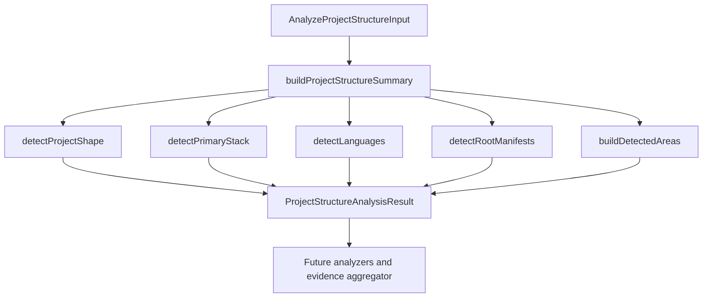

# GitHub Project Structure Analyzer

> Implemented path-only analyzer that summarizes repository shape, infers early stack/tool signals, and detects meaningful repository areas.

---

## 1. Core Philosophy

- Use deterministic path evidence before reading file contents.
- Keep stack inference conservative: structure-inferred stack is not the final source of truth.
- Emit evidence-backed areas that future analyzers can use as a cheap map.

---

## 2. Architecture Overview


```mermaid
flowchart TD
  Input[AnalyzeProjectStructureInput] --> Summary[buildProjectStructureSummary]
  Summary --> Shape[detectProjectShape]
  Summary --> Stack[detectPrimaryStack]
  Summary --> Languages[detectLanguages]
  Summary --> Manifests[detectRootManifests]
  Summary --> Areas[buildDetectedAreas]
  Shape --> Result[ProjectStructureAnalysisResult]
  Stack --> Result
  Languages --> Result
  Manifests --> Result
  Areas --> Result
  Result --> Future[Future analyzers and evidence aggregator]
```

The analyzer accepts already-fetched data:

- repository identity: `id`, `repositoryFullName`
- normalized tree entries: `path`, `name`, `type`, `depth`, `parentPath`, `extension` (lowercased at normalization), `sizeBytes`
- GitHub tree truncation flag: `isTruncated`

The analyzer does not fetch GitHub data, read file contents, or call AI.

---

## 3. Key Files & Entry Points

| File                                                                                                              | Purpose                                                                                                                                                                                                                                                                                                                                                                                                                                                                                                                                                                                                                                                                                      | When to Read                                           |
| ----------------------------------------------------------------------------------------------------------------- | -------------------------------------------------------------------------------------------------------------------------------------------------------------------------------------------------------------------------------------------------------------------------------------------------------------------------------------------------------------------------------------------------------------------------------------------------------------------------------------------------------------------------------------------------------------------------------------------------------------------------------------------------------------------------------------------- | ------------------------------------------------------ |
| `apps/backend/src/services/github-analysis/project-structure/project-structure-analyzer.ts`                       | Public project-structure analyzer entry point and orchestration.                                                                                                                                                                                                                                                                                                                                                                                                                                                                                                                                                                                                                             | Any project-structure analyzer change                  |
| `apps/backend/src/services/github-analysis/project-structure/project-structure-analyzer.types.ts`                 | Public input/output contracts for project structure analysis.                                                                                                                                                                                                                                                                                                                                                                                                                                                                                                                                                                                                                                | Changing analyzer input/output shape                   |
| `apps/backend/src/services/github-analysis/project-structure/project-structure-entry-index.ts`                    | Path/name/extension lookup helpers built from normalized GitHub tree entries.                                                                                                                                                                                                                                                                                                                                                                                                                                                                                                                                                                                                                | Adding path-based detection rules                      |
| `apps/backend/src/services/github-analysis/project-structure/project-shape-detector.ts`                           | Score-based project shape detection.                                                                                                                                                                                                                                                                                                                                                                                                                                                                                                                                                                                                                                                         | Changing `summary.projectShape`                        |
| `apps/backend/src/services/github-analysis/project-structure/primary-stack-detector.ts`                           | Structure-inferred stack detection.                                                                                                                                                                                                                                                                                                                                                                                                                                                                                                                                                                                                                                                          | Changing `summary.inferredStack`                       |
| `apps/backend/src/services/github-analysis/project-structure/language-detector.ts`                                | File-extension to programming-language mapping.                                                                                                                                                                                                                                                                                                                                                                                                                                                                                                                                                                                                                                              | Changing `summary.detectedLanguages`                   |
| `apps/backend/src/services/github-analysis/project-structure/root-manifest-detector.ts`                           | Root dependency-manifest filename to ecosystem mapping.                                                                                                                                                                                                                                                                                                                                                                                                                                                                                                                                                                                                                                      | Changing `summary.rootManifests`                       |
| `apps/backend/src/services/github-analysis/project-structure/project-structure-summary.ts`                        | Builds the summary block from tree entries.                                                                                                                                                                                                                                                                                                                                                                                                                                                                                                                                                                                                                                                  | Changing summary fields                                |
| `apps/backend/src/services/github-analysis/project-structure/project-structure-detected-areas.ts`                 | Orchestrates score-based detected area generation from path evidence.                                                                                                                                                                                                                                                                                                                                                                                                                                                                                                                                                                                                                        | Changing `detectedAreas` output                        |
| `apps/backend/src/services/github-analysis/project-structure/project-structure-detected-area-*.ts`                | Detected-area rule, candidate, and internal type helpers.                                                                                                                                                                                                                                                                                                                                                                                                                                                                                                                                                                                                                                    | Changing detected-area scoring internals               |
| `apps/backend/src/services/github-analysis/project-structure/project-structure-reconcile-candidates.ts` | Post-detection reconciliation (2026-09-24): drops a parent framework's candidate when a meta-framework candidate has the same area name and owner path, driven by the private `META_PARENT_PAIRS` table. | Changing which same-owner claim survives |
| `apps/backend/src/services/github-analysis/project-structure/detected-area-rules/declarative-area-rule-engine.ts` | Generic schema-driven detector runner used by every framework, database, containerization, and CI/CD detector (the Jest detector was removed with the Test-suite category, the shared-package detector on 2026-09-08; the ASP.NET Core (2026-08-29) and NestJS (2026-09-04) conversions leave none hand-written); supports `gateBlocker` shape checks with nested `and`/`or` condition nodes, a `checkForExistingCandidate` shared-candidate-map veto, a `dynamicRelatedTechMap` per-signal related-technology union (see the 2026-08-27, 2026-08-28, and 2026-08-29 changelog entries), and an optional `ownerAdapter` -- an anchor-signal two-pass resolver for framework/tool shapes, or a plain per-entry resolver as containerization uses. Every `ownerAdapter` also receives the repository `index` (2026-09-24), for resolvers that must look at other entries. The `competingProofSchemas` veto and `hasCompetingAreaProof` were removed on 2026-09-24; same-owner conflicts are resolved after detection by `reconcileCandidates`. | Changing shared detector matching/gating/veto behavior |
| `apps/backend/src/services/github-analysis/project-structure/detected-area-rules/owner-adapters/`                 | Per-shape owner resolvers passed to the engine as `ownerAdapter`. `resolve-unit-root-owner.ts` anchors on the framework or tool config file at the unit root and is shared by sixteen detectors (Next.js, Nuxt, Angular, Astro, React Router, SvelteKit, Django, ASP.NET Core, Laravel, Prisma, Drizzle, SQLAlchemy, Sequelize, Knex, Jenkins, Docusaurus). Two Expo anchors sit at the unit root like every other detector on this adapter; the third (`app/_layout.*`, Expo Router's nested route root) does not, so the anchor branch strips that fixed suffix -- and any enclosing `src` segment -- instead of taking the plain dirname. A non-anchor signal takes the longest non-root enclosing anchor owner; when none encloses it and `.` is an anchor owner, the root claims it (2026-10-07), ahead of the generic resolver's workspace-folder and `src` guesses. `resolve-native-platform-unit-root-owner.ts` (2026-10-07) is the Expo, React Native and Flutter adapter: the resolver as it stood before the root claim, so a root anchor never claims a path, plus two more fallback branches before the generic resolver -- an `android`/`ios` path segment resolves to everything before it, and a `metro.config.(js|cjs|mjs|ts)` file resolves to its own parent directory -- for React Native's unanchored example apps (e.g. `FabricExample/`). Those two branches no longer run for the other detectors. An optional `extraRootDirectories` parameter, forwarded to the non-anchor fallback, lets a caller recognize a library-demo-app convention without widening workspace-root recognition for every other caller -- Expo passes `['example']` for `create-expo-module`'s convention, and React Native passes the same `['example']` for the identical convention in RN native-module libraries (react-native-webview and peers) -- see [ADR 0003](adr/0003-pluggable-owner-adapters-anchor-signals.md). `resolve-nearest-marker-owner.ts` (2026-09-24) is the native Android and iOS detectors' adapter: an anchor walks up from its own directory to the nearest ancestor that directly holds a cross-platform host marker file (Flutter, React Native, Expo, Metro, Capacitor, Ionic), looked up through the `index` the engine passes to every adapter, and falls back to its own directory; a non-anchor signal takes the longest enclosing anchor owner, with `.` enclosing every path -- see [ADR 0003](adr/0003-pluggable-owner-adapters-anchor-signals.md) and [ADR 0005](adr/0005-same-owner-candidate-reconciliation.md). `resolve-container-root-owner.ts` is the Docker and Podman/OCI detectors' shared non-anchor adapter: an infra-folder denylist plus a one-directory-deep rule over the widened generic resolver, with a second denylist (`PODMAN_OCI_NON_UNIT_TOP_LEVEL_DIRECTORIES`) and a Quadlet/`Containerfile` basename matcher for the Podman/OCI arm -- see [ADR 0004](adr/0004-containerization-owner-resolution.md). `resolve-terraform-root-owner.ts` (2026-09-26) is the Terraform/OpenTofu/Terragrunt detector's non-anchor adapter: a folder-name resolver plus a per-repo `rootHasTerraform` flag -- see [ADR 0006](adr/0006-terraform-owner-resolution.md). `resolve-manifest-directory-owner.ts` (Helm 2026-09-30 as `resolve-helm-chart-owner.ts`; renamed and shared with Pulumi 2026-10-01, Ansible 2026-10-02 and AWS CDK 2026-10-02) is the Helm, Pulumi, Ansible and AWS CDK detectors' non-anchor adapter: it takes the directory of every counted manifest (`Chart.yaml`, `Pulumi.yaml` or `cdk.json`, computed once per repo; Ansible has no single manifest, so it derives its list from four anchors -- see its rule below) and resolves a nested manifest into its enclosing unit, sibling units into their shared parent, and a workspace unit above both -- see [ADR 0007](adr/0007-helm-chart-owner-resolution.md) and [ADR 0008](adr/0008-shared-manifest-directory-owner-adapter.md). `resolve-bicep-root-owner.ts` (2026-10-01) is the Bicep detector's non-anchor adapter: the same folder-name rules as the Terraform adapter with its own single home-folder set and a per-repo `rootHasBicep` flag, kept as a separate module so the Terraform resolver is unchanged; the detector imports it from the adapters barrel (until 2026-10-01 it imported the file directly and was not exported from the barrel).                                                                                                                                                                                                                                                                          | Adding an owner adapter for a new framework or tool shape      |
| `apps/backend/src/services/github-analysis/project-structure/project-structure-path-utils.ts`                     | Shared path normalization plus the generic application-area owner-path resolver used as the default and the fallback for every detected-area detector. Its workspace-root match on the first path segment is case-insensitive (2026-09-30).                                                                                                                                                                                                                                                                                                                                                                                                                                                                                                                                       | Adding reusable path helpers                           |
| `apps/backend/src/services/github-analysis/project-structure/project-structure-score-candidates.ts`               | Shared score candidate helpers for deterministic structure detectors.                                                                                                                                                                                                                                                                                                                                                                                                                                                                                                                                                                                                                        | Adding score-based detector helpers                    |
| `apps/backend/src/services/github-analysis/project-structure/project-structure-detected-area-candidates.test.ts`  | Candidate merge and inferred-technology contract coverage.                                                                                                                                                                                                                                                                                                                                                                                                                                                                                                                                                                                                                                   | Updating candidate accumulation behavior               |

---

## 4. Data Flow

```text
RepoTreeEntry[]
  -> buildEntryIndex()
  -> buildProjectStructureSummary()
       -> detectProjectShape()
       -> detectPrimaryStack()
       -> detectLanguages()
       -> detectRootManifests()
  -> buildDetectedAreas()
       -> applyDetectedAreaRules()
       -> reconcileCandidates()
  -> ProjectStructureAnalysisResult
```

---

## 5. Component / Module Structure

```text
apps/backend/src/services/github-analysis/project-structure/
├── project-structure-analyzer.ts
├── project-structure-analyzer.types.ts
├── project-structure-entry-index.ts
├── project-shape-detector.ts
├── primary-stack-detector.ts
├── language-detector.ts
├── root-manifest-detector.ts
├── project-structure-summary.ts
├── project-structure-detected-areas.ts
├── project-structure-detected-area-rules.ts
├── detected-area-rules/
│   ├── project-structure-area-rule-candidates.ts
│   ├── declarative-area-rule-engine.ts
│   ├── declarative-area-rule-engine.test.ts
│   ├── owner-adapters/
│   │   ├── index.ts
│   │   ├── resolve-unit-root-owner.ts
│   │   ├── resolve-unit-root-owner.test.ts
│   │   ├── resolve-container-root-owner.ts
│   │   ├── resolve-container-root-owner.test.ts
│   │   ├── resolve-container-root-owner.podman-oci.test.ts
│   │   ├── resolve-unit-root-owner.expo.test.ts
│   │   ├── resolve-unit-root-owner.react-native.test.ts
│   │   ├── resolve-unit-root-owner.flutter.test.ts
│   │   ├── resolve-unit-root-owner.docusaurus.test.ts
│   │   ├── resolve-native-platform-unit-root-owner.ts
│   │   ├── resolve-native-platform-unit-root-owner.test.ts
│   │   ├── resolve-nearest-marker-owner.ts
│   │   ├── resolve-nearest-marker-owner.test.ts
│   │   ├── resolve-terraform-root-owner.ts
│   │   ├── resolve-terraform-root-owner.test.ts
│   │   ├── resolve-manifest-directory-owner.ts
│   │   ├── resolve-manifest-directory-owner.helm.test.ts
│   │   ├── resolve-manifest-directory-owner.pulumi.test.ts
│   │   ├── resolve-manifest-directory-owner.ansible.test.ts
│   │   ├── resolve-manifest-directory-owner.aws-cdk.test.ts
│   │   ├── resolve-manifest-directory-owner.mkdocs.test.ts
│   │   ├── resolve-bicep-root-owner.ts
│   │   ├── resolve-bicep-root-owner.test.ts
│   │   ├── resolve-sphinx-project-owner.ts
│   │   └── resolve-sphinx-project-owner.test.ts
│   ├── backend/
│   │   ├── asp-net-core-backend-area-rules.ts
│   │   ├── backend-area-rules.ts
│   │   ├── django-backend-area-rules.ts
│   │   ├── express-backend-area-rules.ts
│   │   ├── generic-backend-area-rules.ts
│   │   ├── laravel-backend-area-rules.ts
│   │   ├── nest-backend-area-rules.ts
│   │   ├── rails-backend-area-rules.ts
│   │   └── spring-boot-backend-area-rules.ts
│   ├── database/
│   │   ├── database-area-rules.ts
│   │   ├── drizzle-database-area-rules.ts
│   │   ├── knex-database-area-rules.ts
│   │   ├── prisma-database-area-rules.ts
│   │   ├── sequelize-database-area-rules.ts
│   │   ├── sqlalchemy-database-area-rules.ts
│   │   └── typeorm-database-area-rules.ts
│   ├── containerization/
│   │   ├── containerization-area-rules.ts
│   │   ├── docker-containerization-area-rules.ts
│   │   └── podman-oci-containerization-area-rules.ts
│   ├── ci-cd/
│   │   ├── ci-cd-area-rules.ts
│   │   ├── github-actions-ci-cd-area-rules.ts
│   │   ├── gitlab-ci-cd-area-rules.ts
│   │   ├── circleci-ci-cd-area-rules.ts
│   │   ├── jenkins-ci-cd-area-rules.ts
│   │   ├── azure-pipelines-ci-cd-area-rules.ts
│   │   ├── buildkite-ci-cd-area-rules.ts
│   │   ├── travis-ci-cd-area-rules.ts
│   │   ├── bitbucket-ci-cd-area-rules.ts
│   │   ├── drone-woodpecker-ci-cd-area-rules.ts
│   │   ├── appveyor-ci-cd-area-rules.ts
│   │   └── teamcity-ci-cd-area-rules.ts
│   ├── mobile/
│   │   ├── mobile-area-rules.ts
│   │   ├── expo-mobile-area-rules.ts
│   │   ├── react-native-mobile-area-rules.ts
│   │   ├── flutter-mobile-area-rules.ts
│   │   ├── android-mobile-area-rules.ts
│   │   └── ios-mobile-area-rules.ts
│   ├── infrastructure-as-code/
│   │   ├── infrastructure-as-code-area-rules.ts
│   │   ├── demo-and-test-folders.ts
│   │   ├── terraform-infrastructure-as-code-area-rules.ts
│   │   ├── helm-infrastructure-as-code-area-rules.ts
│   │   ├── aws-cdk-infrastructure-as-code-area-rules.ts
│   │   ├── pulumi-infrastructure-as-code-area-rules.ts
│   │   ├── bicep-infrastructure-as-code-area-rules.ts
│   │   └── ansible-infrastructure-as-code-area-rules.ts
│   ├── documentation/
│   │   ├── documentation-area-rules.ts
│   │   ├── non-documentation-folders.ts
│   │   ├── sphinx-documentation-area-rules.ts
│   │   ├── mkdocs-documentation-area-rules.ts
│   │   ├── docusaurus-documentation-area-rules.ts
│   │   ├── mdbook-documentation-area-rules.ts
│   │   ├── starlight-documentation-area-rules.ts
│   │   ├── docfx-documentation-area-rules.ts
│   │   ├── antora-documentation-area-rules.ts
│   │   ├── fumadocs-documentation-area-rules.ts
│   │   ├── vitepress-documentation-area-rules.ts
│   │   ├── vuepress-documentation-area-rules.ts
│   │   ├── dumi-documentation-area-rules.ts
│   │   └── rspress-documentation-area-rules.ts
│   └── frontend/
│       ├── angular-frontend-area-rules.ts
│       ├── astro-frontend-area-rules.ts
│       ├── frontend-area-rules.ts
│       ├── next-frontend-area-rules.ts
│       ├── nuxt-frontend-area-rules.ts
│       ├── react-frontend-area-rules.ts
│       ├── react-router-frontend-area-rules.ts
│       ├── static-frontend-area-rules.ts
│       ├── svelte-frontend-area-rules.ts
│       ├── sveltekit-frontend-area-rules.ts
│       └── vue-frontend-area-rules.ts
├── project-structure-detected-area-candidates.ts
├── project-structure-detected-area-candidates.test.ts
├── project-structure-reconcile-candidates.ts
├── project-structure-reconcile-candidates.test.ts
├── project-structure-detected-areas.types.ts
├── project-structure-path-utils.ts
└── project-structure-score-candidates.ts
```

---

## 6. Patterns & Conventions

### 6.1 Project Shape Detection

- **Rule**: Use score-based path evidence, not a single exact string match.
- **Rule**: Return `unknown` when evidence is weak.
- **Rule**: Keep possible shape scores private until there is a real consumer.
- **Rule**: Monorepo evidence includes common workspace config files such as `turbo.json`, `pnpm-workspace.yaml`, `nx.json`, `workspace.json`, `project.json`, and `lerna.json`, plus owner roots such as `apps/`, `packages/`, `libs/`, and weak `services/` evidence.
- **Rule**: Frontend monorepo paths should match generalized owners such as `apps/*/app` or `apps/*/pages`, not only `apps/frontend`.
- **Current labels**: `full-stack monorepo`, `monorepo`, `full-stack app`, `frontend app`, `backend api`, `library/package`, `cli tool`, `mobile app`, `documentation site`, `unknown`.

### 6.2 Inferred Stack Detection

- **Rule**: `summary.inferredStack` is structure-inferred only.
- **Rule**: Do not treat it as the final stack source of truth.
- **Rule**: Do not infer dependency-specific backend frameworks such as Express from generic folders alone. The detected-area Express.js detector only accepts conservative generator or layered API path clusters; dependency/config analysis should confirm package-level proof later.
- **Rule**: Path-only stack inference may include distinctive config or structure signals such as Next.js, Vite, Prisma, Docker, Turborepo, Nx, NestJS, Expo, React Native, native Android/iOS, and Flutter.
- **Rule**: Dependency/config analyzer will later confirm stack from files such as `package.json`, lockfiles, Prisma schema, Docker config, and framework config.

### 6.3 Language Detection

- **Rule**: `summary.detectedLanguages` is presence-only from file extensions -- no file counts and no primary-language ranking. Output is de-duplicated and sorted by name, matching `inferredStack`.
- **Rule**: The extension-to-language map in `language-detector.ts` keeps lowercase keys; lookups lowercase the entry extension defensively even though normalization already lowercases it.
- **Rule**: Keep the language union intentionally small (widely used languages); add new languages as demand appears rather than exhaustively up front.
- **Rule**: `.h` is always attributed to C; no vendored or generated directory exclusion is applied.

### 6.4 Root Manifest Detection

- **Rule**: `summary.rootManifests` records dependency manifests at the repository root (`depth === 0`) only, by presence and ecosystem, without reading file contents.
- **Rule**: Per-package manifests inside a monorepo are intentionally out of scope and left for the dependency/config analyzer.
- **Rule**: The manifest-filename-to-ecosystem map in `root-manifest-detector.ts` keeps lowercase keys; unmapped manifest filenames are ignored.

### 6.5 Detected Area Generation

> **Coverage note (2026-09-03):** the per-detector "confidence coverage uses ... fixtures through the public analyzer output" rules below describe fixtures that lived in `project-structure-analyzer.test.ts`, which was deleted. They record the intended fixture matrix, not tests that currently run, until that coverage is rebuilt (see Risks & Mitigations).

- **Rule**: `detectedAreas` identifies meaningful repository regions from path evidence only.
- **Rule**: Score concrete `(name, path)` candidates where `path` is the area owner root, not the individual evidence path.
- **Rule**: Evidence arrays must contain actual repository paths, not prose explanations.
- **Rule**: Root-level app or config evidence uses `path: "."`; monorepo app evidence uses owners such as `apps/frontend` or `apps/backend`.
- **Rule**: Every emitted detected area includes path-inferred technology metadata with one required `primary` technology and zero or more deduplicated `related` technologies. The primary is excluded from related values; internal candidates use a `Set` and public output converts it to a stable sorted array.
- **Rule**: `DetectedAreaTechnology` is composed from frontend, backend, containerization, runtime/platform, template, database, test, CI/CD, mobile, infrastructure-as-code, and documentation technology unions in `project-structure-analyzer.types.ts`; keep the public union stable while adding new labels to the narrow category that owns them.
- **Rule (amended 2026-09-24):** Candidates are keyed `${name}::${normalizePath(path)}::${primaryTech}`, so two detectors that claim the same area name and owner path with different primary technologies leave two separate candidates instead of one (previously the first detector owned `primary` and later score additions accumulated onto it). Score, evidence, and related technologies still accumulate per key. `reconcileCandidates` (`project-structure-reconcile-candidates.ts`) runs right after `applyDetectedAreaRules` in `buildDetectedAreas` and deletes a parent framework's candidate when a meta-framework candidate exists with the same area name and owner path. It is driven by the private `META_PARENT_PAIRS` table (area name, parent, list of metas): React under Next.js and React Router; Vue under Nuxt; Svelte under SvelteKit; React Native under Expo; Express.js under NestJS; native Android and native iOS each under Flutter, React Native, and Expo. Only an exact owner-path match competes; a parent on a nested path is kept. See [ADR 0005](adr/0005-same-owner-candidate-reconciliation.md).
- **Rule**: Reusable detected-area rule infrastructure such as `AreaRuleCandidate<Signal>`, owner candidate map creation, once-per-owner signal counting, and adding local owner candidates to the shared candidate map lives in `detected-area-rules/project-structure-area-rule-candidates.ts`; all active owner-scoped frontend detectors use it while still owning their signal unions, scores, finder variables, and output gates.
- **Rule**: The declarative engine (`detected-area-rules/declarative-area-rule-engine.ts`) resolves every signal's owner through the generic `ownerPathForApplicationArea` unless the detector passes an `ownerAdapter`. With an anchor-based adapter, the engine evaluates anchor schemas (`isAnchorSignal: true`) first, collects each anchor signal's resolved owner into an `anchorOwners` set, then resolves non-anchor signals against that completed set in a second pass; a detector with no anchor schema just has its adapter called once per matched entry. Seven adapters exist:
  - `detected-area-rules/owner-adapters/resolve-unit-root-owner.ts`, passed by sixteen detectors -- Next.js, Nuxt, Angular, Astro, React Router, SvelteKit (frontend); Django, ASP.NET Core, Laravel (backend); Prisma, Drizzle, SQLAlchemy, Sequelize, Knex (database); Jenkins (CI/CD); Docusaurus (documentation). Expo, React Native and Flutter (mobile) pass the sibling `resolve-native-platform-unit-root-owner.ts` instead (see below). An anchor signal is the framework or tool config file that sits at the unit root by that tool's contract (`next.config.*`, `nuxt.config.*`, `angular.json`, `astro.config.*`, `react-router.config.*`, `svelte.config.*`, `manage.py`, `*.csproj`, `artisan`, `prisma.config.*`, `drizzle.config.*`, `alembic.ini`, `.sequelizerc`, `knexfile.*`, `Jenkinsfile`, `docusaurus.config.*`, `expo-env.d.ts`, `app.config.(ts|js)`, and `react-native.config.js`); it resolves to the directory holding that file or bundle. A non-anchor signal resolves to the longest non-root `anchorOwners` entry that encloses it (a path with no directory segment resolves to `.`); when none does and `.` is an anchor owner it resolves to `.` (2026-10-07: a root anchor owns whatever no deeper anchor claims, including paths under `src` or an anchor-less `apps/<name>`); otherwise it falls back to `ownerPathForApplicationArea`, forwarding an optional per-call `extraRootDirectories` array when the caller passes one. Jenkins is one exception to "sits at the unit root": a `Jenkinsfile` can live at any depth (a root single-pipeline repo, or one per service in a multibranch monorepo), so every matched `Jenkinsfile` is itself an anchor and resolves to its own containing directory -- the only CI/CD provider that can emit more than one `CI/CD workflows` candidate per repository. Expo's third anchor, `expo-router-root-layout` (`app/_layout.*`), is a second exception: Expo Router requires a directory literally named `app` (or, since SDK 55's default template, `src/app`) to hold it, so the file sits one or two directories inside its actual project root rather than at it. The anchor branch special-cases this exact path shape by testing it against the same regex the entry schema uses, stripping the matched `app/_layout.*` suffix and any enclosing `src` segment instead of taking the plain dirname. Expo passes `extraRootDirectories: ['example']`, so a library repo's demo app (the `create-expo-module` convention, e.g. a nested `example/basic/eas.json`) resolves to `example/basic` rather than the repository root when no anchor nearby already claims it (a file directly under `example/` with no anchor, `example/eas.json`, resolves to its own path because `ownerPathForApplicationArea` returns `<root>/<second segment>` for a file as well as a directory; with an anchor in `example/` it resolves to `example`); React Native passes the identical `extraRootDirectories: ['example']` for the same convention in RN native-module library repos (react-native-webview and peers) -- `example` is not added to the shared `MONOREPO_OWNER_ROOT_DIRECTORIES` list since it is not a general monorepo convention every caller should inherit. React Native's own anchor, `react-native-cli-config` (`react-native.config.js`), sits at the unit root with no special stripping needed, unlike Expo's third anchor -- it reuses the adapter's original anchor-dirname behavior unchanged. `resolve-native-platform-unit-root-owner.ts` (2026-10-07) holds what Expo, React Native and Flutter need beyond this: when no anchor owner encloses a path, two further fallback branches run before the generic resolver -- a path containing an `android`/`ios` path segment resolves to everything before that segment, and a path ending in `metro.config.(js|cjs|mjs|ts)` resolves to its own immediate parent directory -- so React Native's non-anchor signals own bare example-app directories (e.g. `FabricExample/`) that carry no anchor of their own and are not nested under any workspace root `ownerPathForApplicationArea` recognizes. It never lets a root `.` anchor claim a path, because the library root would then win before those branches run (the `FabricExample/` case). Until 2026-10-07 both branches lived in `resolveUnitRootOwner` and ran for every caller. See [ADR 0003](adr/0003-pluggable-owner-adapters-anchor-signals.md) (extended 2026-09-04, 2026-09-11, 2026-09-12, 2026-09-14, 2026-09-16, 2026-09-18, 2026-10-07).
  - `detected-area-rules/owner-adapters/resolve-nearest-marker-owner.ts` (2026-09-24), passed by the native Android and iOS detectors with a host-marker list (`pubspec.yaml`, `.metadata`, `react-native.config.js`, `app.config.(ts|js)`, `metro.config.(js|cjs|mjs|ts)`, `capacitor.config.(ts|js|json)`, `ionic.config.json`; Cordova's `config.xml` is deliberately omitted as too generic a filename). It receives the repository `index` from the engine. An anchor signal (a module-root `build.gradle(.kts)`, or a `*.xcodeproj`/`*.xcworkspace` bundle directory) walks up from its own directory to the repository root and resolves to the first ancestor whose direct children include a marker file (the marker entry's `parentPath` equals the ancestor, `null` for the root, which resolves to `.`); with no marker it resolves to the anchor's own directory. A non-anchor signal resolves to the deepest `anchorOwners` entry (most path segments, `.` counting as 0) that encloses it, treating `.` as enclosing every path (unlike `resolveUnitRootOwner`, whose set-membership check never matches a root owner), then falls back to `ownerPathForApplicationArea`. It has no `extraRootDirectories` option and none of `resolveUnitRootOwner`'s `android`/`ios`/`metro.config` fallbacks. Markers are matched against each file's lowercased basename with `findFilesByNameMatching` (2026-09-25; on 2026-09-24 they were tested against the full path, which found only a root-level marker), so a nested host such as `apps/field/pubspec.yaml` is recognized; the index is scanned once per marker on each anchor call and not cached across calls. Known limitation: the walk does not require an `android`/`ios` segment. See [ADR 0003](adr/0003-pluggable-owner-adapters-anchor-signals.md) and [ADR 0005](adr/0005-same-owner-candidate-reconciliation.md).
  - `detected-area-rules/owner-adapters/resolve-container-root-owner.ts`, passed by the Docker and Podman/OCI detectors with no anchor schema. A bare root-level file resolves to `.`; a container file one directory deep resolves to that directory unless the directory is a known infra/tooling/workspace-container name, in which case `.`; every deeper path delegates to `ownerPathForApplicationArea` with the containerization roots added as workspace roots for that call. Docker file names (`Dockerfile`/`*.dockerfile` variants, `.dockerignore`, Compose, Bake) check `NON_UNIT_TOP_LEVEL_DIRECTORIES` and add `products`/`plugins`/`providers`; Quadlet unit and `Containerfile`/`.containerignore` names check the wider `PODMAN_OCI_NON_UNIT_TOP_LEVEL_DIRECTORIES` (adds `systemd`, `containers`, `.quadlet`, `quadlet`, `quadlets`, `kube`, `sysadmin`) and also add `quadlet`/`quadlets` as collection roots, so `quadlet/<svc>/<svc>.container` resolves to `quadlet/<svc>`. See [ADR 0004](adr/0004-containerization-owner-resolution.md) (extended 2026-09-10).
  - `detected-area-rules/owner-adapters/resolve-terraform-root-owner.ts` (2026-09-26), passed by the Terraform detector with no anchor schema. It takes one object, `{ path, rootHasTerraform }`; the detector computes `rootHasTerraform` once per repository (a `.tf`, `.tf.json`, `.tofu`, `terragrunt.hcl`, or `root.hcl` file directly at the repo root). Rules, first match wins: a single-segment path resolves to `.`; when `rootHasTerraform` is true every path resolves to `.`; a path whose first segment is a workspace container (compared case-insensitively) is decided next, before the home and environment folder rules, so a workspace unit keeps its Terraform: a two-segment path (`apps/main.tf`) and any `modules/...` path resolve to `.`, and anything else delegates to `ownerPathForApplicationArea`; a path containing a Terraform home folder (`terraform`, `opentofu`, `terragrunt`, `infra`, `infrastructure`, `iac`, `deploy`, `deployment`, `tf`, `tofu`) resolves to the path through the first such segment; a path containing `envs` or `environments` resolves through the first such segment; a path whose first segment is `modules` or `wrappers` resolves to `.`; anything else delegates to `ownerPathForApplicationArea`. Folder names are matched case-insensitively and the returned owner keeps the path's casing. See [ADR 0006](adr/0006-terraform-owner-resolution.md).
  - `detected-area-rules/owner-adapters/resolve-manifest-directory-owner.ts` (2026-09-30 as `resolve-helm-chart-owner.ts`; renamed and shared with the Pulumi detector 2026-10-01, the Ansible detector 2026-10-02, the AWS CDK detector 2026-10-02 and the MkDocs detector 2026-10-07), passed by the Helm, Pulumi, Ansible, AWS CDK and MkDocs detectors with no anchor schema. It takes one object, `{ path, manifestDirectories }`; each detector computes `manifestDirectories` once per repository as the directory of every counted manifest (`Chart.yaml` for Helm, `Pulumi.yaml` for Pulumi, `cdk.json` for AWS CDK, `mkdocs.yml` or `mkdocs.yaml` for MkDocs, and for Ansible the project directories derived from its four anchors; `.` for a root manifest; demo/test folders and `.github/` are already excluded by the entry schema, and Pulumi's also drops provider stubs). Rules, first match wins: a single-segment path resolves to `.`; a path whose first segment is a workspace container (case-insensitive) resolves through `ownerPathForApplicationArea`, so a workspace unit beats even a root manifest; when a root manifest exists every other path resolves to `.`; otherwise the nearest owner is the shortest manifest directory that encloses the path (so a subchart or a nested Pulumi project folds into its enclosing unit), and when another manifest directory shares that owner's parent the owner is that parent (`.` for a root-level parent), else the manifest directory itself; a path enclosed by no manifest directory resolves to its own directory. Enclosing and sibling checks are case-sensitive. See [ADR 0007](adr/0007-helm-chart-owner-resolution.md) and [ADR 0008](adr/0008-shared-manifest-directory-owner-adapter.md).
  - `detected-area-rules/owner-adapters/resolve-bicep-root-owner.ts` (2026-10-01), passed by the Bicep detector with no anchor schema. It takes one object, `{ path, rootHasBicep }`; the detector computes `rootHasBicep` once per repository (a `.bicep` file directly at the repo root). Rules, first match wins, in the same order as the Terraform adapter: a single-segment path resolves to `.`; when `rootHasBicep` is true every path resolves to `.`; a path whose first segment is a workspace container (case-insensitive) is decided next (two segments or `modules/...` resolve to `.`, anything else through `ownerPathForApplicationArea`); a path containing a home folder (`bicep`, `terraform`, `bicep-devcenter`, `infra`, `infrastructure`, `iac`, `deploy`, `deployment`) resolves to the path up to and including the first such segment; then an environment folder (`envs`, `environments`) the same way; a first segment of `modules` or `wrappers` resolves to `.`; anything else falls to `ownerPathForApplicationArea`. Demo and test paths are dropped by the Bicep entry schemas before the adapter runs.
  - `detected-area-rules/owner-adapters/resolve-sphinx-project-owner.ts` (2026-10-06), passed by the Sphinx detector with no anchor schema (it ignores `anchorOwners`). It takes one object, `{ path, projectDirectories }`; the detector computes `projectDirectories` once per repository (`deriveSphinxProjectDirectories`: the folder of every non-blocked `conf.py` that also has a direct-child index file; `.` for a root project; original case kept). Rules: a project folder owns itself, except that a folder whose last segment is exactly `source` is owned by its parent (`docs/source` is `docs`, a root `source` is `.`); a root owner `.` owns every path; otherwise a path belongs to the shortest owner folder that holds it (the path starts with the owner followed by `/`), so a nested project folds into the enclosing one; a path no owner holds resolves to its own folder, or `.` for a single-segment path. Unlike `resolveManifestDirectoryOwner` it has no workspace-unit rule and does not collapse sibling projects into their parent. It uses `parentOf`, exported from `project-structure-path-utils.ts`. The expected behavior is pinned in `resolve-sphinx-project-owner.test.ts` (the author reported it passing; not re-run in this reconciliation).

  All six are the bounded, per-shape exception to the 2026-08-24 generic-resolver rules below.
- **Rule**: Backend detected-area rules are dispatched from `detected-area-rules/backend/backend-area-rules.ts`. NestJS, Django, Spring Boot, ASP.NET Core, Laravel, Ruby on Rails, and Express.js run first with implemented path rules before the scaffolded generic backend fallback.
- **Rule (2026-09-08):** There is no `Shared package` detected-area detector. The `detected-area-rules/shared-package/` modules and their `addSharedPackageAreas` dispatch were removed (low-signal output -- reusable-package path shapes overlapped too heavily with ordinary monorepo packages); see the changelog. `'Shared package'` remains in the `DetectedAreaName` union and priority orderings but is never emitted.
- **Rule**: Containerization detected-area rules are dispatched from `detected-area-rules/containerization/containerization-area-rules.ts`. Runtime-specific containerization detectors live in separate modules: Docker and the Podman/OCI combination gate are implemented. Podman/OCI collects basename-only Quadlet unit, `Containerfile`, and `.containerignore` evidence and counts each signal once per provisional owner, then resolves it through `resolveContainerRootOwner` (the shared containerization adapter, see the owner-resolution rule above and [ADR 0004](adr/0004-containerization-owner-resolution.md)); no fixture/example/test path exclusions are applied, consistent with the general directory-name-exclusion policy below.
- **Rule**: Podman/OCI emission requires a coherent multi-signal shape because basename-only extensions such as `.container` and `.build` can collide with unrelated formats. A `.container`, `.pod`, or `.kube` runtime unit must be paired with another runtime unit, a Quadlet build/image/network/volume/artifact unit, or a `Containerfile`. A `.build` unit must be paired with a `Containerfile`, runtime unit, or `.image` unit. No single signal, support-resource-only group, `Containerfile` plus `.containerignore`, runtime unit plus only `.containerignore`, or `.build` plus only network/volume/artifact evidence can unlock emission. See [ADR 0002](adr/0002-podman-oci-containerization-gate.md).
- **Rule**: Podman/OCI core `.container`, `.pod`, `.kube`, and `.build` signals score `3`; `.image` scores `2`; `.network`, `.volume`, `.artifact`, `Containerfile`, and `.containerignore` score `1`. Scores affect confidence only after the combination gate passes and never replace its semantic requirements.
- **Rule (2026-08-24):** Podman/OCI, Docker, every database schema detector, and the JS/TS shared-package detector dropped their dedicated owner resolvers and resolved owners through the single shared `ownerPathForApplicationArea` in `project-structure-path-utils.ts`: `apps/<name>` or `packages/<name>` for monorepo evidence under those roots, the path up to (not including) a `src` segment for other `src`-relative evidence, and `.` otherwise. The Podman/OCI-specific deep-nested config-directory scan and the Docker-specific monorepo/config-folder contract described in earlier changelog entries and [ADR 0002](adr/0002-podman-oci-containerization-gate.md) were removed; see [Containerization and Database Owner Resolvers Removed](changelog.md#containerization-and-database-owner-resolvers-removed). **Amended 2026-09-04:** the Prisma, Drizzle, SQLAlchemy, Sequelize, and Knex database detectors regained bounded owner resolution through the engine's `ownerAdapter` (`resolveUnitRootOwner`), anchored on each tool's root-level config file -- see the owner-resolution rule in section 6.5 and [ADR 0003](adr/0003-pluggable-owner-adapters-anchor-signals.md). **Amended 2026-09-08:** Docker moved to its own non-anchor `ownerAdapter` (`resolveContainerRootOwner`) and `ownerPathForApplicationArea` was widened -- see [ADR 0004](adr/0004-containerization-owner-resolution.md); the JS/TS shared-package detector was removed. **Amended 2026-09-10:** Podman/OCI moved onto the same `resolveContainerRootOwner` adapter (Quadlet basename matcher, `PODMAN_OCI_NON_UNIT_TOP_LEVEL_DIRECTORIES` denylist, `quadlet`/`quadlets` collection roots) -- see [ADR 0004](adr/0004-containerization-owner-resolution.md)'s 2026-09-10 update. TypeORM, Spring Boot, and Rails still use the generic resolver only.
- **Rule**: `project-structure-path-utils.test.ts` no longer contains dedicated owner-resolver unit coverage; it was emptied when the Podman/OCI- and Docker-specific resolvers it tested were removed.
- **Rule**: Docker containerization matching recognizes basename-only Dockerfile variants, `.dockerignore` variants, Compose files such as `compose.yaml`, `compose.prod.yaml`, `docker-compose.yml`, and `docker-compose.prod.yml`, Docker Bake files such as `docker-bake.hcl` and `docker-bake.override.json`, and path-scoped `.devcontainer/devcontainer.json`.
- **Rule**: Dockerfile, Compose, and Bake signals independently unlock `Containerization` emission because each defines a Docker build or runtime workflow. `.dockerignore` and devcontainer signals remain support-only: they can increase score and evidence for an anchored owner but cannot unlock emission alone or together. See [ADR 0001](adr/0001-docker-containerization-gate.md).
- **Rule (2026-09-08):** Docker containerization owner resolution uses `resolve-container-root-owner.ts` (a non-anchor `ownerAdapter`), not the generic resolver directly: a bare root-level container file resolves to `.`; a container file one directory deep resolves to that directory unless it is a known infra/tooling/workspace-container name; deeper paths delegate to the widened `ownerPathForApplicationArea` with `products`/`plugins`/`providers` added as roots. This is not a return to the pre-2026-08-24 Docker-specific monorepo/config-folder contract -- there is no config-folder scan and no upward walk. See [ADR 0004](adr/0004-containerization-owner-resolution.md).
- **Rule (2026-09-10):** Podman/OCI containerization owner resolution uses the same `resolve-container-root-owner.ts` adapter. Its Quadlet unit (`.container`, `.pod`, `.kube`, `.build`, `.image`, `.network`, `.volume`, `.artifact`), `Containerfile`, and `.containerignore` names go through the one-directory-deep rule against `PODMAN_OCI_NON_UNIT_TOP_LEVEL_DIRECTORIES` (the Docker denylist plus `systemd`, `containers`, `.quadlet`, `quadlet`, `quadlets`, `kube`, `sysadmin`), so `n8n/n8n.container -> n8n` but `containers/systemd/x.container -> .` and `.quadlet/x.container -> .`. Deeper paths add `quadlet`/`quadlets` as collection roots, so `quadlet/valkey/valkey.container -> quadlet/valkey`. `containers/` is deliberately not a collection root (`containers/ldap/Containerfile -> .`, an `it.fails` case) because `containers/systemd/` must stay `.` and the rule is name-only. See [ADR 0004](adr/0004-containerization-owner-resolution.md)'s 2026-09-10 update.
- **Rule**: Docker detector confidence coverage includes Dockerfile-only, Compose-only, Bake-only, support-only rejection, anchored support evidence, and monorepo owner-isolation fixtures through the public analyzer output.
- **Rule (2026-09-11):** `'CI/CD workflows'` was a placeholder in the `DetectedAreaName` union with no dispatched detector (like `'Test suite'` and `'Shared package'` before their own implementations); it is now implemented. CI/CD detected-area rules are dispatched from `detected-area-rules/ci-cd/ci-cd-area-rules.ts`, last in `applyDetectedAreaRules` (after frontend, backend, database, and containerization). Eleven single-purpose provider detectors run in a fixed precedence order -- GitHub Actions, GitLab CI/CD, CircleCI, Jenkins, Azure Pipelines, Buildkite, Travis CI, Bitbucket Pipelines, Drone/Woodpecker CI, AppVeyor, TeamCity -- so when two providers' config both resolve to the same owner, each now leaves its own `CI/CD workflows` candidate keyed by its primary technology (2026-09-24, see the candidate-keying rule above); before that the first dispatched kept `primary` and the rest were carried in `related`. No `META_PARENT_PAIRS` row covers CI/CD, so `reconcileCandidates` keeps them all.
- **Rule**: Every CI/CD provider except Jenkins and TeamCity gates emission on a single decisive root-config-file signal (`.github/workflows/*.yml`, `.gitlab-ci.yml`, `.circleci/config.yml`, `azure-pipelines.yml`, `.buildkite/pipeline.yml`/`buildkite.yml`, `.travis.yml`, `bitbucket-pipelines.yml`, `.drone.yml`/`.woodpecker.yml`/`.woodpecker/*`, `appveyor.yml`/`.appveyor.yml`) and resolves its owner to the repository root through the generic resolver -- no `ownerAdapter`. TeamCity gates on either its Kotlin DSL or legacy XML entrypoint under `.teamcity/`, also at the repository root. Split-config or template files (`.gitlab/ci/**`, `.circleci/src/**`, `eng/pipelines/**`, `.buildkite/pipelines/**`, TeamCity `buildTypes/`/`vcsRoots/`) are corroborating evidence only and never unlock emission alone. Jenkins is the sole exception: see the owner-resolution rule above.
- **Rule**: Deliberately undetectable CI/CD shapes, each documented as an accepted gap in its detector's own Limitations rather than treated as a bug: Azure Pipelines' per-directory `<dir>/ci.yml` multi-owner convention (the azure-sdk repos) has no reliable path-only corroboration; GitLab's project-level custom CI config path override (Settings -> CI/CD) is invisible from the tree; TeamCity's Versioned Settings and Buildkite's/AppVeyor's pipeline definitions are commonly UI-only with nothing committed to the repository.
- **Rule (2026-09-12, amended 2026-09-14, 2026-09-18, 2026-09-19, 2026-09-24):** `'Mobile app'` was a placeholder in the `DetectedAreaName` union with no dispatched detector (like `'CI/CD workflows'` before its own implementation); it is now reachable via Expo, React Native (bare CLI), Flutter, native Android, or native iOS evidence. Mobile detected-area rules are dispatched from `detected-area-rules/mobile/mobile-area-rules.ts`, last in `applyDetectedAreaRules` (after frontend, backend, database, containerization, and CI/CD). Dispatch order is Expo (the meta-framework, built on React Native) first, then React Native, Flutter, Android, and iOS; it no longer decides which claim survives on a shared owner. All five providers (`addExpoMobileAreas`, `addReactNativeMobileAreas`, `addFlutterMobileAreas`, `addAndroidMobileAreas`, `addIosMobileAreas`) are implemented; Android and iOS were side-effect-free scaffolds until 2026-09-19. Candidates are keyed per primary technology, so an owner that both Expo and React Native claim leaves two candidates, and `reconcileCandidates` drops the React Native one (2026-09-24; React Native's `competingProofSchemas` veto was removed). Flutter shares no file-level signals with Expo or React Native, so no cross-detector overlap exists in that direction; the collision it does share with native Android's and iOS's bundled-host shells is handled by `resolveNearestMarkerOwner` redirecting the shell's owner to the host's root and `reconcileCandidates` dropping the native candidate (see the 2026-09-24 rules below).
- **Rule (2026-09-12):** Expo evidence is grouped by owner through `resolveUnitRootOwner` (see the owner-resolution rule above) and scored once per signal type across three anchors (`expo-router-typed-env` / `expo-env.d.ts`, `expo-dynamic-config` / `app.config.(ts|js)`, `expo-router-root-layout` / `app/_layout.*`) and three supportive signals (`metro-bundler-config` / `metro.config.js`, `eas-build-config` / `eas.json`, `expo-static-config` / `app.json`), based on a GitHub code-search sample of ~90 real repositories.
- **Rule (2026-09-12):** Expo output requires at least one anchor, and no anchor can clear the gate alone -- it must pair with a second anchor or a supportive signal. This closes the sample's highest false-positive risk: Nuxt 3 ships an identically named, identically placed `app.config.ts` (13 of 28 sampled `app.config.*` hits), so a lone `app.config.ts` with nothing else now fails the gate, while every sampled real Expo repo still clears it. `expo-router-root-layout` had zero false positives across 30 sampled hits; `expo-env.d.ts` is commonly gitignored by `create-expo-app`, so it may be absent from a real tracked tree even on a genuine Expo project.
- **Rule (2026-09-12, amended 2026-09-14, 2026-09-24):** Expo output uses `Expo` as its primary technology and `React Native` as related context. Reconciling multiple Expo signals across different owner paths in a monorepo is still deferred to a separate research pass; when Expo and React Native both claim the same owner, both candidates are kept and `reconcileCandidates` drops the React Native one (2026-09-24; React Native's 2026-09-14 `competingProofSchemas` veto was removed).
- **Rule (2026-09-14):** React Native (bare CLI, no meta-framework) evidence is grouped by owner through `resolveUnitRootOwner`, anchored on `react-native-cli-config` (`react-native.config.js`), with `extraRootDirectories: ['example']` for the same library-demo-app convention Expo needed (confirmed in react-native-webview's `example/`). Scored once per signal type across one anchor (`react-native-cli-config`) and four supportive signals: `android-native-shell` (`android/{build.gradle,settings.gradle,gradlew}`), `ios-native-shell` (`ios/Podfile`), `react-native-application-bootstrap` (`android/app/src/main/{java,kotlin}/**/MainApplication.{java,kt}`), and `metro-bundler-config` (`metro.config.js`) -- grounded in the official `react-native-community/template` scaffold plus six real production repositories (Mattermost, Expensify, Zulip, Rainbow, Gutenberg Mobile, Ledger Live) and a ~13k-hit GitHub code search. A seventh signal, `expo-modules-coexistence` (`app.config.(ts|js)`, `eas.json`; deliberately excludes `app.json`, which the official RN CLI template ships too), scores `0` and never participates in the gate -- it exists solely to feed `dynamicRelatedTechMap`, adding `Expo` to `related` when present.
- **Rule (2026-09-14):** React Native output requires one of three gate branches, since no single signal is a clean exclusive anchor the way `next.config.js` is for Next.js: (A) `react-native-cli-config` plus at least one of `android-native-shell`/`ios-native-shell`/`react-native-application-bootstrap`/`metro-bundler-config` (closes the false positive where an RN native-module library's root has the config file but no committed native shell); (B) `android-native-shell` and `ios-native-shell` together, no config file required (covers repos scaffolded after the config file dropped out of the official template); (C) `react-native-application-bootstrap` and `ios-native-shell` together. Two weak tiebreakers (`.watchmanconfig`, `app.json`) were researched and rejected: `AREA_CONFIDENCE_MAX_SCORE` is 6 and every branch above already scores exactly 6 with only its required signals, so confidence is saturated before either could move it.
- **Rule (2026-09-14, amended 2026-09-24):** React Native no longer carries a `competingProofSchemas` veto against Expo Router (`app/_layout.*`) or typed-env (`expo-env.d.ts`) shapes; the veto was removed with the engine's competing-proof mechanism. An owner carrying that Expo evidence that also clears React Native's gate now keeps its own `React Native` candidate beside Expo's, and `reconcileCandidates` drops it. The weaker `app.config.*`/`app.json`/`eas.json` shapes never counted as Expo proof: rainbow-me/rainbow is a real, large, bare React Native wallet app (confirmed via its `package.json`, not path evidence) that carries `app.config.ts` solely because it individually installs Expo SDK modules (`expo-image-picker`, `expo-web-browser`, etc.) via the `install-expo-modules` pattern, without adopting Expo Router or the managed workflow, so those files only feed the `dynamicRelatedTechMap` hedge. An Expo owner that only React Native's gate clears (for example an Expo *bare workflow* app too weakly evidenced for Expo's own gate) still surfaces as a plain `React Native` candidate with the Expo relationship lost, since there is no Expo candidate for `reconcileCandidates` to keep. Not observed in any sampled repository -- a documented, unobserved residual risk (see Risks & Mitigations).
- **Rule (2026-09-18):** Flutter evidence is grouped by owner through `resolveUnitRootOwner`, unmodified -- no new anchor shape or fallback branch was needed -- with `extraRootDirectories: ['example']` for the same library-demo-app convention Expo and React Native already needed (confirmed in AppFlowy's `packages/appflowy_ui/example/pubspec.yaml`). Scored once per signal type across two anchors (`flutter-metadata` / `.metadata`, `flutter-pubspec-manifest` / `pubspec.yaml`) and six supportive signals (`flutter-ios-platform-dir`, `flutter-macos-platform-dir`, `flutter-desktop-cmake`, `flutter-entrypoint` / `lib/main.dart`, `flutter-android-splash` / the `launch_background.xml` splash drawable, `flutter-integration-test-dir` / `integration_test/`), based on a GitHub-tree survey of ten real repositories (flutter/samples, fluffychat, cake_wallet, invoiceninja/admin-portal, immich, ente, AppFlowy, stack_wallet, plus dart-lang/http and dart-lang/args as plain-Dart negative controls). `flutter-ios-platform-dir` (a directory literally named `Flutter` inside `ios/`, evidenced by `debug.xcconfig`/`release.xcconfig`/`appframeworkinfo.plist`) and `flutter-macos-platform-dir` (the same shape one platform over) had zero false positives in the sample; `flutter-desktop-cmake` matches `{linux,windows}/flutter/cmakelists.txt`, more reliable in-sample than the neighboring `generated_plugin_registrant.cc`, which was missing on roughly 30% of the same directories.
- **Rule (2026-09-18):** Flutter output requires one of three gate branches, since `pubspec.yaml` is Dart's manifest (not Flutter-exclusive -- every plain-Dart package in the sample's control repos has one too) and no lone platform-directory signal proves Flutter either: (A) `flutter-metadata` plus `flutter-pubspec-manifest` -- the clean, complete unit, clearing alone in 6 of 8 sampled repos; (B) `flutter-metadata` plus one platform-directory signal (iOS, macOS, or desktop) -- covers a real, confirmed case (`cypherstack/stack_wallet`) where `pubspec.yaml` is gitignored and generated at build time from a template but `.metadata` survives; (C) `flutter-pubspec-manifest` plus one platform-directory signal -- the symmetric hedge for a team that scrubs `.metadata` but keeps the manifest, not observed in this sample.
- **Rule (2026-09-18):** Flutter output uses `Flutter` as its primary technology and `Dart` as related context. Flutter shares no file-level signals with Expo or React Native (different manifest, different native bootstrap), so no cross-detector overlap exists in that direction. It deliberately scores no Android-shell signal: `android/app/src/main/{kotlin,java}/**/MainActivity.*` plus `AndroidManifest.xml` is structurally identical to a fully native Android app's host project, with no path-only feature to tell them apart, unlike React Native which does score one. The native Android and iOS detectors (implemented 2026-09-19) redirect a bundled shell's owner to Flutter's root through `resolveNearestMarkerOwner`, and `reconcileCandidates` drops the native candidate -- see the 2026-09-24 rules below. `resolveUnitRootOwner`'s existing `android`/`ios` path-segment fallback (added 2026-09-16 for React Native) already resolves `flutter-ios-platform-dir` and `flutter-android-splash` correctly with no anchor present nearby; the remaining non-anchor signals depend on an anchor already having claimed the enclosing owner or the generic resolver's one-segment-deep default (see Risks & Mitigations).
- **Rule (2026-09-19, amended 2026-09-24):** Native Android evidence is grouped by owner through `resolveNearestMarkerOwner` (`resolveUnitRootOwner` until 2026-09-24) with no `extraRootDirectories`, anchored on `android-gradle-module-root` (a module-root `build.gradle(.kts)`, no path exclusion). Deliberately not `settings.gradle`: `stripe/stripe-android` and `firebase/quickstart-android` declare several independently-meaningful app modules under one shared root settings file, so a settings-only anchor would collapse all of them into one owner. Consequence: a single-app repo (`google/grafika`, `googlearchive/android-topeka`) resolves to its `app` module directory rather than repo root, because the more specific `app` anchor is the deeper enclosing owner once both coexist. Scored once per signal type across that anchor (2) and seven supportive signals: `android-manifest` (`AndroidManifest.xml`, 3), `android-gradle-settings`, `android-gradle-wrapper`, `android-resource-density` (`res/mipmap-*dpi/`), `android-proguard`, `android-firebase-config`, `android-gradle-properties` (1 each). Based on a GitHub-tree survey of eight real repositories (grafika, android-topeka, nowinandroid, firefox-android, quickstart-android, stripe-android, plus Expensify/App and flutter/flutter as bundled-host controls). The gate is a single branch, `android-manifest` AND `android-gradle-module-root`: every sampled repository carries the pair together. `settings.gradle` is scoring-only, not a gate requirement, since stripe-android's per-example modules have none of their own. Output uses `Android` as primary technology with `Kotlin` and `Java` as related.
- **Rule (2026-09-19, amended 2026-09-24):** Native iOS evidence is grouped by owner through `resolveNearestMarkerOwner` (`resolveUnitRootOwner` until 2026-09-24), anchored on the `*.xcodeproj` and `*.xcworkspace` bundle directories matched as directories (via `findDirectoriesByPathMatching`), not a file inside them -- a one-segment dirname of `SomeApp.xcodeproj/project.pbxproj` would resolve to the bundle itself rather than the directory containing it. Scored once per signal type: `ios-xcodeproj` (3), `ios-xcworkspace` (2), `ios-appdelegate` (2, matched as a filename suffix -- WordPress-iOS's is `WordPressAppDelegate.swift`), and `ios-scenedelegate`, `ios-podfile`, `ios-assets-catalog`, `ios-shared-scheme`, `ios-entitlements`, `ios-info-plist` (1 each), from a survey of nine real repositories (Signal-iOS, duckduckgo/iOS, Nuke, WordPress-iOS, shared-hn-android-ios-backend, stripe-ios, firefox-ios, plus capacitor-test and bitrise's Flutter sample as bundled-host controls). The gate is `ios-xcodeproj` AND (`ios-appdelegate` OR `ios-scenedelegate`); the workspace is not required (`duckduckgo/iOS` is SPM-only), and `Package.swift` was researched and left out entirely -- SPM cannot produce a signable iOS app, and both sampled SPM-root repos (Nuke, firebase-ios-sdk) build their demo apps through a separate `.xcodeproj`. `Info.plist` is the weakest signal since apps, extensions, and frameworks are indistinguishable by path. Output uses `iOS` as primary technology with `Swift` as related; macOS/tvOS-only Xcode projects are indistinguishable by path alone.
- **Rule (2026-09-24):** Neither native detector excludes a competing framework's bundled host by anchor regex or carries a `competingProofSchemas` veto anymore (both were the 2026-09-19 design). The anchors keep only the `Pods/` exclusion for `.xcodeproj`/`.xcworkspace` and skip a workspace nested inside an `.xcodeproj` (Xcode's own internal state). A bundled `android/`/`ios/` shell therefore still produces a native candidate, but `resolveNearestMarkerOwner` resolves its owner to the nearest ancestor that directly holds a host marker (Flutter, React Native, Expo, Metro, Capacitor, Ionic), the host's root, instead of a directory nested inside the wrapper, and `reconcileCandidates` then drops the native candidate when a Flutter, React Native, or Expo candidate shares that owner and area name. Confirmed shapes: Expensify/App, flutter/flutter, gitpoint/git-point, capacitor-test, and bitrise's Flutter sample. Capacitor, Ionic, and Cordova have no detector, so their shells are redirected but not dropped; Cordova has no marker at all (its `config.xml` was deliberately left out as too generic), so a `platforms/android|ios` host surfaces as a standalone native candidate. A genuinely native repository under `android/`/`ios/` with no marker in any ancestor (FirebaseExtended/analytics-webview) is now kept as a native candidate, where the 2026-09-19 exclusion dropped it. Kotlin Multiplatform is deliberately not treated as a host: its `app/` module (confirmed on `touchlab/KaMPKit`) is a real native Android app and no KMM detector exists. Known defect as of this reconciliation: the marker patterns are matched against the full path, so only a marker at the repository root is found and a nested host is not redirected; the walk also requires no `android`/`ios` segment, so any native anchor under a marker-holding directory is absorbed. NativeScript, .NET MAUI's modern layout, and Unity's export were left out since they are documented conventions only, not matched against a live public repository.
- **Rule (2026-09-24):** The engine's `competingProofSchemas` option, `hasCompetingAreaProof`, and the `CompetingProofSchema` type were removed, and the 2026-09-19 change that resolved competing-proof owners through the caller's `ownerAdapter` went with them. The React, Vue, Svelte, and React Native detectors no longer veto on Next.js, React Router, Nuxt, SvelteKit, or Expo file evidence; each emits its own candidate and `reconcileCandidates` resolves the same-owner pair afterward. See [ADR 0005](adr/0005-same-owner-candidate-reconciliation.md).
- **Rule**: NestJS evidence is grouped by owner and scored once per signal type across CLI config, main entry, root/default modules, controllers, services, gateways, and resolvers. Standard `src/app.*` files use dedicated buckets instead of also counting as broad feature signals.
- **Rule**: NestJS output requires an anchored application shape: CLI config plus another gate-capable signal, main entry plus root module, main entry plus feature module and transport handler, or root module plus transport handler. Standard and feature services remain score-only evidence.
- **Rule**: NestJS output uses `NestJS` as its primary technology and `Node.js` as related runtime context; it does not infer Express because path-only NestJS evidence cannot prove the configured HTTP adapter.
- **Rule**: NestJS detector confidence coverage uses official-starter, canonical, REST/microservice, WebSocket, GraphQL, backend-package, Nx-style, monorepo-isolation, weak-hint, Angular-interference, unanchored-cluster, and repeated-signal fixtures through the public analyzer output.
- **Rule**: Django evidence is grouped by owner -- resolved through `resolve-unit-root-owner` anchored on `manage.py` (the project root), otherwise the generic resolver -- and scored once per signal type across `manage.py`, classic `settings.py`, split `settings/{base,local,production,test}.py`, root URL config, WSGI/ASGI entries, app config, models, migrations, admin, views, and app URL config. A Django project in a bare subdirectory or sibling Django projects in one repo resolve to their own owner instead of collapsing to the repository root.
- **Rule**: Django output requires a project-level anchor: `manage.py` plus settings/root URL/server entry, settings plus root URL and server entry, `manage.py` plus app config and models or migration, or settings plus app config and migration. Generic app files such as `models.py`, `views.py`, and `admin.py` never emit Django alone.
- **Rule**: Django output uses `Django` as its primary technology and `Python` as related runtime/language context; dependency files such as `requirements.txt`, `pyproject.toml`, and `Pipfile` are left for later dependency/config analysis.
- **Rule**: Django detector confidence coverage uses official startproject, manage-backed, split-settings, app-supported, settings-backed, monorepo-isolation, repeated-signal, isolated-signal, reusable-package, and Flask/FastAPI-like fixtures through the public analyzer output.
- **Rule**: Spring Boot evidence is grouped by owner and scored once per signal type across Maven/Gradle build files, `src/main/java` or `src/main/kotlin` `*Application` entry classes, `src/main/resources` application config files, profile config files, web controllers, REST resources, repositories, services, and configuration classes.
- **Rule**: Spring Boot output requires an anchored application shape: main application plus base application config, main application plus controller/resource and config or Java/Kotlin support, or application config plus controller/resource and Java/Kotlin support. Build files, `*Application` classes, config files, and generic controller/service/repository clusters never emit Spring Boot alone.
- **Rule**: Spring Boot output uses `Spring Boot` as its primary technology and exposes `Java`, `Kotlin`, or both as related language context based on matched source file extensions; dependency files are left for later dependency/config analysis.
- **Rule**: Spring Boot detector confidence coverage uses official/simple, Gradle-backed web, JHipster-style REST, config-backed web, Kotlin, mixed Java/Kotlin, monorepo-isolation, repeated-signal, isolated-signal, and weak-cluster fixtures through the public analyzer output.
- **Rule**: ASP.NET Core evidence is grouped by owner -- resolved through `resolve-unit-root-owner` anchored on the project's `*.csproj` (the .NET project root by SDK contract), otherwise the generic resolver -- and scored once per signal type across `.csproj` files, `Program.cs`, `Startup.cs`, server `appsettings*.json`, `Properties/launchSettings.json`, controllers, minimal endpoint folders, Razor Pages, MVC views, and `wwwroot`. `wwwroot/appsettings*.json` is treated as client config rather than server appsettings proof. Non-web `.csproj` owners (class libraries, test projects) collect only the project-file signal and never pass the gate; multi-project solutions and sibling web hosts split by owner instead of collapsing to `.`.
- **Rule**: ASP.NET Core output requires a web-host application shape: host entry plus project file and controller, program entry plus project file and endpoint folder, project file plus appsettings and a transport/server UI signal, program entry plus project file/config/launch settings, or host entry plus project file and Razor/MVC server UI with config or `wwwroot`. Generic `.NET` project files, `Program.cs`, appsettings, launch settings, controllers, endpoints, views, and `wwwroot` never emit ASP.NET Core alone.
- **Rule**: ASP.NET Core output uses `ASP.NET Core` as its primary technology and exposes `.NET` and `C#` as related platform/language context; `.csproj` contents, package references, and C# annotations are left for later dependency/config or source analysis.
- **Rule**: ASP.NET Core detector confidence coverage uses controller Web API, minimal endpoint API, legacy Startup, launch-settings backed host, Razor Pages, MVC Views, monorepo-isolation, repeated-signal, isolated-signal, weak .NET project, and client-config fixtures through the public analyzer output.
- **Rule**: Laravel evidence is grouped by owner -- resolved through `resolve-unit-root-owner` anchored on `artisan` (the Laravel project root), otherwise the generic resolver -- and scored once per signal type across `artisan`, `bootstrap/app.php`, modern bootstrap providers, application and route service providers, the legacy HTTP kernel, standard route files, the public entry, controllers, Blade views, models, migrations, seeders, `config/app.php`, and Composer manifests.
- **Rule**: Laravel output requires an anchored application shape: `artisan` plus `bootstrap/app.php`, modern bootstrap app/providers plus an application provider or standard route, legacy bootstrap app/HTTP kernel plus a route provider or standard route, or `artisan` plus the application service provider and a standard route. Controllers, Blade views, models, migrations, seeders, config, the public entry, broadcast routes, and Composer manifests remain score-only evidence.
- **Rule**: Laravel output uses `Laravel` as its primary technology and `PHP` as related language context. `Blade` is added as related technology only when the same owner contains `resources/views/**/*.blade.php`; package dependencies and source contents are left for later analyzers.
- **Rule**: Laravel detector confidence coverage uses current, canonical, modern, legacy, API, Blade, monorepo-isolation, reusable-package, repeated-signal, isolated-anchor, route-only, support-cluster, and generic PHP fixtures through the public analyzer output.
- **Rule**: Ruby on Rails evidence is grouped by owner and scored once per signal type across the Rails executable, application/boot/environment configs, routes, Rack entry, application and feature controllers, application and feature models, ERB views, migrations, schemas, database config, base jobs/mailers, Gemfile, and Rakefile.
- **Rule**: Ruby on Rails output always requires `config/application.rb` plus two independent application signals: `bin/rails` plus boot config or the environment entry, the environment entry plus `config.ru`, routes plus `ApplicationController`, or boot config plus routes. Models, feature controllers, views, migrations, schemas, database config, jobs, mailers, Gemfile, and Rakefile remain score-only.
- **Rule**: Rails matchers accept only repository-root, `apps/*`, and `packages/*` application paths. This prevents complete nested test applications such as `test/rails_app` and Rails generator templates from being promoted to their repository root without introducing a generic ignored-folder policy.
- **Rule**: Ruby on Rails output uses `Ruby on Rails` as its primary technology and `Ruby` as related language context. `ERB` is added only when the proven owner contains `app/views/**/*.html.erb`; dependency-specific Rails technologies remain for later analyzers.
- **Rule**: Ruby on Rails detector confidence coverage uses Rails 8-style, canonical boot, Rack boot, routed, configured, API-only, ERB, legacy, schema/structure, monorepo-isolation, repeated-signal, engine, nested-dummy, generator-template, sibling-isolation, isolated-anchor, generic Rack, and score-only fixtures through the public analyzer output.
- **Rule**: Express.js evidence is grouped by owner and scored once per signal type across Express-generator `bin/www`, root or `src/app.*` entries, `server.*` entries, package manifests, route directories and route files, generator default routes, controller directories and files, middleware directories and files, service directories and files, `public`, and `views`.
- **Rule**: Express.js output requires a conservative application shape: generator `bin/www` plus root app entry, route file, and generator support; app entry plus route, controller, and middleware/service support; or server entry plus route, controller, support, and package manifest. Generic Node entry files, package manifests, route/controller/middleware folders, `public`, and `views` never emit Express.js alone.
- **Rule**: Express.js runs after stronger backend framework detectors and skips an owner that already has a `Backend API` candidate (declared through the engine's `checkForExistingCandidate` flag), preventing weak Express-like folder structure from polluting NestJS or other framework metadata. The guard did not fire from 2026-09-24 until 2026-09-25, because `hasAreaCandidate` built its lookup key without the primary technology and never matched the per-technology candidate keys; it now matches the `${name}::${normalizePath(path)}::` key prefix across primary technologies.
- **Rule**: Express.js output uses `Express.js` as its primary technology and `Node.js` as related runtime context. JavaScript and TypeScript backend extensions are supported, but `.tsx`, package contents, and source calls such as `express()` or `express.Router()` are left for later analyzers.
- **Rule**: Express.js detector confidence coverage uses generator, generator-without-views, TypeScript layered, JavaScript unsuffixed, TailorCV-style server-owned, services-backed, monorepo-isolation, repeated-signal, stronger-framework-interference, isolated-signal, frontend-like, and generic Node fixtures through the public analyzer output.
- **Rule**: Database detected-area rules are dispatched from `detected-area-rules/database/database-area-rules.ts` after frontend and backend application detectors. Database areas describe persistent schema and migration ownership separately from the application owner that contains them.
- **Rule (2026-08-24, amended 2026-09-04):** The 2026-08-24 consolidation removed the per-database owner resolvers (see [Containerization and Database Owner Resolvers Removed](changelog.md#containerization-and-database-owner-resolvers-removed)). On 2026-09-04 the Prisma, Drizzle, SQLAlchemy, Sequelize, and Knex detectors regained bounded owner resolution through the engine's `ownerAdapter` (`resolveUnitRootOwner`), anchored on each tool's root-level config file (`prisma.config.*`, `drizzle.config.*`, `alembic.ini`, `.sequelizerc`, `knexfile.*`); see the owner-resolution rule above and [ADR 0003](adr/0003-pluggable-owner-adapters-anchor-signals.md). TypeORM still resolves owners through the shared generic `ownerPathForApplicationArea`, the same resolver every non-anchored detector falls back to. An anchored database detector emits at the config file's directory (e.g. `apps/backend` for `apps/backend/prisma.config.ts`), and a schema in a bare subdirectory such as `backend/prisma/` no longer collapses to `.`; a non-anchored detector still emits at the broader generic application owner.
- **Rule**: Prisma evidence is grouped by owner -- resolved through `resolve-unit-root-owner` anchored on a root-level `prisma.config.*` (the `.config/prisma.*` variant stays a non-anchor match and only feeds the gate and score), otherwise the generic resolver -- and scored once per signal type across `schema.prisma`, `.prisma` schema fragments under `prisma/`, `prisma.config.*` or `.config/prisma.*`, `prisma/migrations`, Prisma `migration.sql` files, and `migration_lock.toml`.
- **Rule**: Prisma output emits `Database schema` with primary technology `Prisma`. It requires `schema.prisma`, a Prisma migration file, config plus schema fragment, or config plus migration lock. Config alone, fragments alone, migration directories alone, migration locks alone, and generic SQL migrations outside `prisma/migrations` do not emit Prisma.
- **Rule**: Prisma detector confidence coverage uses conventional schema folders, root schema files, migration-history-only folders, config-backed schema fragments, monorepo owner isolation, repeated-signal evidence, and weak-signal rejection fixtures through the public analyzer output.
- **Rule**: Drizzle evidence is grouped by owner -- resolved through `resolve-unit-root-owner` anchored on `drizzle.config.*` (or a `drizzle-<name>.config.*` variant), otherwise the generic resolver -- even though Drizzle schema, SQL migrations, journal, and snapshots may live in separate folders below that config.
- **Rule**: Drizzle output emits `Database schema` with primary technology `Drizzle`. It requires config plus schema, config plus a migration artifact, or generated migration SQL plus journal/snapshot metadata. Standard config alone, custom config alone, schema alone, SQL alone, journal alone, snapshot alone, metadata-only migrations, and generic SQL outside recognized migration output folders do not emit Drizzle.
- **Rule**: Drizzle detector confidence coverage uses root config plus `src/db/schema`, colocated `db/schema`, custom config plus `src/lib/db/schema`, package-owned `db/src/schema`, generated `drizzle/meta` migrations, custom `migrations/meta` output, app/service/lib monorepo owner isolation, and weak-signal rejection fixtures through the public analyzer output.
- **Rule**: Knex evidence is grouped by owner -- resolved through `resolve-unit-root-owner` anchored on `knexfile.*` (or a `_knexfile`/`knex.config`/`knexfile.<env>` variant), otherwise the generic resolver -- even though migration and seed files can be configured into separate locations below that config. The gate always requires a config signal, so a Knex owner never emits without its anchor present.
- **Rule**: Knex output emits `Database schema` with primary technology `Knex`. It requires canonical or custom Knex config evidence plus migration or seed evidence under the same owner. Config alone, custom config alone, migration alone, seed alone, migration-plus-seed without Knex config, and generic database connection files do not emit Knex.
- **Rule**: Knex detector confidence coverage uses canonical root migrations, root seeds, nested `src/db` migrations, `database/migrations`, custom Knex config files, monorepo owner isolation, repeated signal counting, and weak-signal rejection fixtures through the public analyzer output.
- **Rule**: SQLAlchemy evidence is grouped by owner -- resolved through `resolve-unit-root-owner` anchored on `alembic.ini`, otherwise the generic resolver. A single repository-root `alembic.ini` that fans out to several services via `version_locations` anchors the repository root, whose `.` owner does not claim the sub-service paths, so those still fall back to the generic resolver; a per-service `alembic.ini` resolves each service to its own owner.
- **Rule**: SQLAlchemy output emits `Database schema` with primary technology `SQLAlchemy` and related technologies `Alembic` and `Python`. It requires Alembic env plus version history, or Alembic config/env/version evidence paired with SQLAlchemy model/session/database files. Models alone, database/session files alone, config alone, env alone, generic version folders, and SQL migration files do not emit SQLAlchemy.
- **Rule**: SQLAlchemy detector confidence coverage uses root Alembic, FastAPI-style app-local Alembic, Superset/Airflow-style `migrations` plus `models`, Prefect-style `_migrations/versions/{dialect}`, monorepo isolation, repeated version files, and weak-signal rejection fixtures through the public analyzer output.
- **Rule**: TypeORM evidence is grouped by the generic application owner (see the 2026-08-24 owner-resolution rule above), not a dedicated database-folder-aware owner, even though TypeORM config, data-source files, entities, and migrations often live across sibling `src` folders. Unlike the other database detectors, TypeORM keeps the generic resolver: `ormconfig.*` is deprecated and being removed, and `data-source.ts` has no contract location (the CLI requires an explicit `-d` path), so there is no reliable root anchor.
- **Rule**: TypeORM output emits `Database schema` with primary technology `TypeORM`. It requires legacy config or data-source evidence paired with entity or migration evidence, example config paired with entity evidence, or entity plus migration evidence under one owner. Config alone, data-source alone, example config alone, entity-only folders, migration-only folders, generic timestamp files outside migration folders, and broad `*.schema.*` files do not emit TypeORM.
- **Rule**: TypeORM detector confidence coverage uses legacy `ormconfig.*` plus entities, data-source plus generated migrations, entity plus migration without config, example config support, monorepo isolation, package-level entities and migrations, explicit database-folder ownership, repeated signal counting, and weak-signal rejection fixtures through the public analyzer output.
- **Rule**: Sequelize evidence is grouped by owner -- resolved through `resolve-unit-root-owner` anchored on `.sequelizerc`, otherwise the generic resolver. sequelize-cli places `config/`, `models/`, `migrations/`, and `seeders/` at the project root rather than under `src/`, so without the anchor the generic resolver has no boundary to group them by; when no `.sequelizerc` is committed, the config-plus-model gate branches still apply through the generic resolver.
- **Rule**: Sequelize output emits `Database schema` with primary technology `Sequelize`. It requires `.sequelizerc` plus model, migration, or seeder evidence; config plus model and migration evidence; model plus migration evidence; or config plus migration and seeder evidence. CLI config alone, config alone, model alone, migration alone, seeder alone, generic model-plus-seeder clusters, and timestamp files outside recognized migration folders do not emit Sequelize.
- **Rule**: Sequelize detector confidence coverage uses default CLI root folders, dedicated `sequelize/` folders, `src/infra/sequelize` folders, split DDD database/sequelize folders, monorepo isolation, repeated signal counting, and weak-signal rejection fixtures through the public analyzer output.
- **Rule**: Framework detectors do not discard evidence solely because it appears under generic `docs`, `test`, `tests`, or `fixtures` paths. Framework-specific signal combinations remain responsible for precision; directory exclusions should be introduced only from demonstrated false-positive repository shapes.
- **Rule**: Known tool conventions should merge related evidence under one owner, such as Prisma `schema.prisma`/`migrations` under a `prisma` database owner or Drizzle split artifacts under the owning app/package/repository path.
- **Rule**: Backend API areas require strong backend structure such as `routes`, `controllers`, and `services` under the same owner, or an explicit backend entry file; frontend `src/routes` plus `src/services` alone is not enough.
- **Rule**: Next.js frontend area evidence is grouped by owner path (resolved through `resolve-unit-root-owner`, anchored on `next.config.*`) and scored once per signal type: `next.config.*`, App Router convention files, Pages Router files, and weaker `app`/`pages` directory hints; Next.js areas emit only from config, App Router core, or Pages Router special proof.
- **Rule**: Next.js detector confidence coverage uses realistic App Router, Pages Router, config-only, monorepo owner-isolation, and same-owner fallback-interference fixtures through the public analyzer output.
- **Rule**: Nuxt frontend area evidence is grouped by owner path (resolved through `resolve-unit-root-owner`, anchored on `nuxt.config.*`) and scored once per signal type: `nuxt.config.*`, `app.vue`/`app/app.vue`, Vue page/layout files, weaker script pages and server routes, and weak `pages` directory hints; Nuxt areas emit only from config or Nuxt app-entry proof.
- **Rule**: Nuxt detector confidence coverage uses realistic Nuxt 4 app-directory, Nuxt 3 root-directory, config-only, monorepo owner-isolation, same-owner Vue fallback-interference, and weak-hint fixtures through the public analyzer output.
- **Rule**: Vue frontend area evidence is grouped by owner path and scored once per signal type: `src/App.vue`, `src/main.*`, Vue Router files, Vue view/page components, Vue CLI config, and Vite config support; Vue areas emit only from root app component combinations and skip owners with stronger same-owner Nuxt proof.
- **Rule**: Vue detector confidence coverage uses realistic Vite Vue, Vue Router, file-based Vue Router, Vue CLI, monorepo owner-isolation, same-owner Nuxt fallback-interference, and weak-hint fixtures through the public analyzer output.
- **Rule**: React Router frontend area evidence is grouped by owner path (resolved through `resolve-unit-root-owner`, anchored on `react-router.config.*`) and scored once per signal type: `react-router.config.*`, `app/root.*`, `app/routes.*`, optional `app/entry.client.*`/`app/entry.server.*`, route files under `app/routes`, and weak `app/routes`/Vite support hints; React Router areas emit only from explicit config or root-route combinations with routes config, file routes, or custom entry files.
- **Rule**: React Router detector confidence coverage uses realistic Framework Mode route-config, file-route, custom-entry, monorepo owner-isolation, same-owner React fallback-interference, and weak-hint fixtures through the public analyzer output.
- **Rule**: React frontend area evidence is grouped by owner path and scored once per signal type: Vite config, root/public index HTML, `src/main.*`, `src/index.*`, `src/App.*`, starter CSS files, JSX/TSX components, and page/view component hints; broad React output skips owners with stronger same-owner Next.js or React Router proof and emits only from Vite React, CRA-style, or structured React app shapes. The CRA shape (`public/index.html` plus an `src/index.{js,jsx}` entry plus an `src/App.{js,jsx}` root) is expressed with the engine's `and` condition node, which ANDs the two independent entry/root `hasOneOf` groups together.
- **Rule**: React detector confidence coverage uses realistic Vite React, CRA-style, structured React, framework-interference, monorepo owner-isolation, and weak-hint fixtures through the public analyzer output.
- **Rule (amended 2026-09-24):** Broad frontend detectors (React, Vue, Svelte) no longer declare competing-framework evidence: the engine's `competingProofSchemas` was removed, so each emits its own candidate even on an owner Next.js, React Router, Nuxt, or SvelteKit also claims, and `reconcileCandidates` drops the parent afterward (see the candidate-keying rule above).
- **Rule**: Static frontend area evidence is grouped by owner path and scored once per signal type: root `index.html`, non-index root HTML pages, root CSS/JS files, `css`/`js` directory files, Vite config, and `src/main.js`/`src` CSS support; static areas emit only from supported static page shapes such as index+CSS, directory CSS, Vite static, or multi-page HTML with CSS evidence.
- **Rule**: Static is the final broad frontend fallback. All stronger frontend detectors run first, and static skips an owner when the shared candidate map already contains a `Frontend app` claim for that owner (declared through the engine's `checkForExistingCandidate` flag); weak framework hints and proof from sibling owners do not block static output. The shared-map skip did not fire from 2026-09-24 until 2026-09-25, for the same `hasAreaCandidate` key reason described for Express.js above; it now matches any primary technology at that owner.
- **Rule**: Static frontend detector confidence coverage uses realistic root static, directory asset, multi-page static, Vite vanilla static, monorepo owner-isolation, same-owner framework-interference, and weak-hint fixtures through the public analyzer output.
- **Rule**: Angular frontend area evidence is grouped by owner path (resolved through `resolve-unit-root-owner`, anchored on `angular.json`) and scored once per signal type: `angular.json`, root component TypeScript/view files, `app.module.ts`, standalone `app.config.ts`, `src/main.ts`, and weak `project.json`/`src/app` support hints; Angular areas emit only from workspace config or root component/module/standalone app shapes.
- **Rule**: Angular detector confidence coverage uses realistic CLI workspace, standalone, classic NgModule, config-only, monorepo owner-isolation, and weak-hint fixtures through the public analyzer output.
- **Rule**: SvelteKit frontend area evidence is grouped by owner path (resolved through `resolve-unit-root-owner`, anchored on `svelte.config.*`) and scored once per signal type: shared `svelte.config.*` support, strong `+page.svelte`/`+layout.svelte` route components, support `+page.*`/`+layout.*` load files, `+server.*` routes, `src/app.html`, and weak `src/routes` hints; SvelteKit areas emit only from route components or load/server evidence paired with the app template because standalone Svelte projects may also contain `svelte.config.*`. The gate still rejects a standalone Svelte project even when `svelte.config.*` anchors an owner, so anchoring on a non-SvelteKit-exclusive file does not cause false emission.
- **Rule**: SvelteKit detector confidence coverage uses realistic full-app, load/server support, monorepo owner-isolation, config-only non-emission, and weak-hint fixtures through the public analyzer output.
- **Rule**: Standalone Svelte frontend evidence is grouped by owner path and scored once per signal type: `src/App.svelte`, `src/main.*`, Vite or Rollup config, shared `svelte.config.*`, root/public HTML entry files, and nested `src/components`/`src/lib` components; Svelte areas emit only from the root component plus main entry shape.
- **Rule**: SvelteKit runs before standalone Svelte. Strong same-owner SvelteKit route proof blocks the standalone detector, while sibling owners remain independent.
- **Rule**: Standalone Svelte detector confidence coverage uses current Vite JavaScript/TypeScript, legacy Rollup, structured component, SvelteKit interference, monorepo owner-isolation, technology metadata, and weak-hint fixtures through the public analyzer output.
- **Rule**: Astro frontend area evidence is grouped by owner path (resolved through `resolve-unit-root-owner`, anchored on `astro.config.*`) and scored once per signal type: `astro.config.*`, strong `src/pages/*.astro` page files, weak `src/pages/*.{md,mdx,html}` content page hints, endpoint files, support `src/layouts/*.astro`/`src/components/*.astro`, and weak `src/pages` hints; Astro areas emit only from config or `.astro` page proof.
- **Rule**: Astro detector confidence coverage uses realistic content-site, endpoint/content-rich, config-only, monorepo owner-isolation, and weak-hint fixtures through the public analyzer output.
- **Rule**: There is no `Test suite` detected-area detector. The `detected-area-rules/test/` modules (Jest implemented; Vitest, Cypress, Mocha, Playwright stubs) and their `addTestAreas` dispatch were removed; see the changelog. `'Test suite'` remains in the `DetectedAreaName` union and the priority orderings but is never emitted.
- **Rule (2026-10-03):** There is no `CLI tooling` detected-area detector, and none was ever dispatched. It was evaluated and not built because the analyzer is path-only and the popular CLI libraries (commander, yargs, click, typer, clap) are declared in manifest contents, not in paths; generic CLI path signals either miss real CLIs or fire on web apps (Rails `bin/dev`, `src/main.rs` in web services). `'CLI tooling'` remains in the `DetectedAreaName` union and the priority orderings but is never emitted. The oclif, Cobra and Laravel Zero layout fingerprints were not validated; see the 2026-10-03 changelog entry before reopening.
- **Rule**: The temporary analyze endpoint can keep returning summaries while later pipeline stages consume the full internal analyzer result.

- **Rule (2026-09-26):** `'Infrastructure as code'` replaces the `'Infrastructure/config'` placeholder in the `DetectedAreaName` union and the three `sortPriority` orderings (`project-structure-detected-areas.ts`); like `'CI/CD workflows'` and `'Mobile app'` before their implementations, it had no dispatched detector. Infrastructure-as-code rules are dispatched from `detected-area-rules/infrastructure-as-code/infrastructure-as-code-area-rules.ts`, last in `applyDetectedAreaRules` (after mobile), and fan out to six provider modules: Terraform (2026-09-26), Helm (2026-09-30), Bicep (2026-10-01), Pulumi (2026-10-01), Ansible (2026-10-02), and AWS CDK (2026-10-02) are implemented. Technology labels live in `InfrastructureAsCodeDetectedAreaTechnology`, and `AWS`, `Azure`, and `Kubernetes` were added to the runtime/platform union for the placeholders' planned related technologies. Only `Terraform` (primary) with `OpenTofu` (related), `Helm` (primary) with `Kubernetes` (related), `Bicep` (primary) with `Azure` (related), `AWS CDK` (primary) with `AWS` (related), `Pulumi` (primary, no related technology), and `Ansible` (primary, no related technology) are emitted today.
- **Rule (2026-09-26):** The Terraform detector (`terraform-infrastructure-as-code-area-rules.ts`) is declarative. Signals and scores: `*.tf`/`*.tf.json`, `terragrunt.hcl`/`root.hcl`, and `*.tofu` score `3`; `.terraform.lock.hcl` scores `2`; `*.tfvars(.json)` and `*.tfstate(.backup)` score `1`. The gate is `hasOneOf` the three config signals, so any single config file is enough. `OpenTofu` is added as a related technology only when `*.tofu` evidence is counted for the owner (`dynamicRelatedTechMap`). Every schema matches on the full path with a negative lookahead that rejects any directory segment named `examples`, `example`, `tests`, `test`, `testdata`, `fixtures`, or `spec` at any depth, so files there add no signal, score, or evidence and a repository whose only Terraform lives there emits no area. This applies the exception in the directory-exclusion rule above ("directory exclusions should be introduced only from demonstrated false-positive repository shapes"), the shape being the 177 of 1,802 surveyed repositories whose only Terraform is under those names. It lives in the entry schemas because an owner adapter can only return a path. The regex builder and the seven-name list moved to `infrastructure-as-code/demo-and-test-folders.ts` on 2026-09-30 and are shared with the Helm detector.
- **Rule (2026-09-26):** Terraform evidence resolves its owner through `resolveTerraformRootOwner` (see the owner-resolution rule above and [ADR 0006](adr/0006-terraform-owner-resolution.md)). A repository with a Terraform config file at its root is one area at `.`; otherwise a listed home folder, environment folder, or workspace unit owns its Terraform, and a folder with an unlisted name falls back to the generic resolver and usually resolves to `.`.
- **Rule (2026-09-30):** The Helm detector (`helm-infrastructure-as-code-area-rules.ts`) is declarative. Signals and scores: `Chart.yaml` scores `3` (the anchor; rejected under `.github/` because a GitHub Actions workflow named `chart.yaml` exists in real repositories, and Helm's case-sensitive filename cannot be checked because paths are lowercased before matching), any file under a `templates/` directory scores `2`, and `values.yaml`, `.helmignore`, and `Chart.lock` score `1` each. The gate is `helm-chart-manifest` AND at least one of the four companions: unlike Terraform's plain `hasOneOf`, a lone `Chart.yaml` never emits, and companions alone never emit. Every schema reuses the demo/test directory exclusion from `infrastructure-as-code/demo-and-test-folders.ts`, which also covers helm/helm's `testdata` charts. The emitted candidate has primary technology `Helm` and related technology `Kubernetes`. Candidates are keyed per primary technology, and no `META_PARENT_PAIRS` row covers infrastructure as code, so a Terraform and a Helm candidate on the same owner coexist. Owner resolution goes through `resolveManifestDirectoryOwner` (named `resolveHelmChartOwner` until 2026-10-01; see the owner-resolution rule above, [ADR 0007](adr/0007-helm-chart-owner-resolution.md) and [ADR 0008](adr/0008-shared-manifest-directory-owner-adapter.md)). The signal contract and scores come from a survey of about 130 GitHub repositories.
- **Rule (2026-10-01):** The Bicep detector (`bicep-infrastructure-as-code-area-rules.ts`) is declarative. Signals and scores: `*.bicep` scores `3` (the anchor; the stem needs at least one character because the entry index also matches directories, and Azure/ResourceModules contains a directory named `.bicep`), `*.bicepparam` scores `2`, and `main.bicep`, `bicepconfig.json`, and `main.parameters.json` score `1` each. The gate is `bicep-source-file` alone: one `.bicep` file is enough and support signals only add confidence, because an anchor-plus-support gate dropped 17 of 148 surveyed Bicep repositories and removed none of the false positives. `azure.yaml` is deliberately unscored (azd also fronts Terraform and infrastructure-free projects). Every schema reuses the demo/test directory exclusion from `infrastructure-as-code/demo-and-test-folders.ts`, which matters because Azure/bicep-registry-modules keeps 1,546 of its 2,375 `.bicep` files under `tests/`. The emitted candidate has primary technology `Bicep` and related technology `Azure`, and coexists with a Terraform or Helm candidate on the same owner. Owner resolution goes through `resolveBicepRootOwner` (see the owner-resolution rule above); no ADR was written because the adapter reuses the Terraform rules with its own folder list. The signal contract comes from a search-biased survey of 226 repositories, tuned and checked on the same repositories.
- **Rule (2026-10-01):** The Pulumi detector (`pulumi-infrastructure-as-code-area-rules.ts`) is declarative. Signals and scores: `Pulumi.yaml` scores `3` (the anchor, and the owner anchor: Pulumi defines a project as the nearest parent folder holding one) and `Pulumi.<stack>.yaml` scores `2`. Only `.yaml` is matched: `Pulumi.yml` is valid but used by 2 of 372 surveyed repositories with a project file, and paths are lowercased before matching, so `pulumi.yml` scanner rules and CI workflows cannot be told from it. The gate is `pulumi-project-file` alone, because requiring a stack file lost 91 of 289 emitting repositories to remove 5 tool repositories. The project-file regex rejects `.github/` and the empty provider stubs that Pulumi provider repositories generate under root `sdk/<language>/` and `provider/{cmd,pkg,test-programs}/` (48 repositories in the survey); every schema reuses the demo/test directory exclusion from `infrastructure-as-code/demo-and-test-folders.ts`. Language entry files, `PulumiPolicy.yaml`, and `.pulumi/` are deliberately unscored. The emitted candidate has primary technology `Pulumi` and no related technology, because Pulumi is multi-cloud and the path does not say which cloud; it coexists with a Terraform, Helm, or Bicep candidate on the same owner. Owner resolution goes through the shared `resolveManifestDirectoryOwner` with the directory of every counted `Pulumi.yaml` (see the owner-resolution rule above and [ADR 0008](adr/0008-shared-manifest-directory-owner-adapter.md)). The signal contract comes from a search-biased survey of 448 repositories, tuned and checked on the same repositories.

- **Rule (2026-10-02):** The Ansible detector (`ansible-infrastructure-as-code-area-rules.ts`) is declarative. Ansible has no single file every project has, so four exclusive names are anchors that score `3`: `ansible.cfg` (rejected under `.github/` and under any `etc/` segment, where it is the documented system-wide config and not a project), `tasks/main.yml` or `.yaml` (a role), anything inside `group_vars/` or `host_vars/`, and `galaxy.yml` (rejected under `.github/` and when its parent folder ends in `.info`, the install metadata `ansible-galaxy install` writes). Support signals never open the gate: `.ansible-lint` and `molecule/<scenario>/molecule.yml` score `2`; `handlers|defaults|meta|vars/main.yml` and `site.yml`, `playbook.yml` or `playbooks/*.yml` score `1`, because those names also occur outside Ansible (Antora's `playbooks/site.yml`). The gate is `hasOneOf` the four anchors; requiring two lost 204 of 515 emitting repositories, mostly small role repositories. `inventory/`, `hosts`, `roles/` alone, `requirements.yml`, `*.j2`, vault files and `execution-environment.yml` are deliberately unscored. Every schema reuses the demo/test directory exclusion from `infrastructure-as-code/demo-and-test-folders.ts`, and the four anchor regexes are shared constants used by both the schemas and the directory derivation. The emitted candidate has primary technology `Ansible` and no related technology. Owner resolution goes through the shared `resolveManifestDirectoryOwner` (see the owner-resolution rule above and [ADR 0008](adr/0008-shared-manifest-directory-owner-adapter.md)) with a list that `deriveManifestDirectories` builds once per repository, one rule per anchor: the folder holding `ansible.cfg` or `galaxy.yml`; for `tasks/main.yml` the folder above the first `roles/` segment, or the folder above `tasks/` for a standalone role; for `group_vars/` or `host_vars/` the folder above the earliest of the first `roles/` segment, the first `inventory` or `inventories` segment and the variables folder, so an `inventory/<env>/` layout resolves to the project. The list keeps the tree's original case because the engine passes the adapter original-case paths and the adapter compares case-sensitively. `molecule/` is not used: in the survey it would have added a directory for 5 paths in 4 of 133 repositories with a molecule scenario. The signal contract comes from a search-biased survey of 876 repositories, tuned and checked on the same repositories.

- **Rule (2026-10-02):** The AWS CDK detector (`aws-cdk-infrastructure-as-code-area-rules.ts`) is declarative and path-only. `cdk.json` is the anchor and scores `3`: the CDK CLI reads it from the working directory only, so its folder is the project root, and it is exclusive to AWS CDK (CDK for Terraform uses `cdktf.json`, cdk8s uses `cdk8s.yaml`; the exact name skips the `cdk init` template `cdk.template.json` and the per-user `~/.cdk.json`). Support signals: `cdk.context.json` scores `2` and `cdk.out/manifest.json` scores `1`. The gate is `cdk.json` alone, which matters because the two supports add up to exactly the emission floor of `3`; requiring a support file as well lost 143 of 712 emitting repositories, and adding `cdk.out/manifest.json` as a second anchor gained 7 clones of one tutorial and would need it scored `3`. Conventional stack files (`lib/*-stack.ts`, `*_stack.py`, `*Stack.cs`, `*Stack.java`, `*_stack.go`), `bin/<name>.ts`, `app.py`, `cdktf.json`, `cdk8s.yaml`, `sst.config.ts`, `amplify/backend.ts`, `*.template.json`, `*.assets.json`, `bootstrap*.yaml`, `.projenrc.*` and dependency names are deliberately unscored: they are generic, shared with CDKTF and cdk8s, or content rather than paths. Every schema reuses the demo/test directory exclusion from `infrastructure-as-code/demo-and-test-folders.ts`, and the `cdk.json` regex is a shared constant used by both its schema and the directory lookup. The emitted candidate has primary technology `AWS CDK` and related technology `AWS`. Owner resolution goes through the shared `resolveManifestDirectoryOwner` (see the owner-resolution rule above and [ADR 0008](adr/0008-shared-manifest-directory-owner-adapter.md)) with the directory of every counted `cdk.json`; `cdk.context.json` and `cdk.out/` sit in that folder, so they resolve to the project's owner. The signal contract comes from a search-biased survey of 975 repositories (712 with a counted `cdk.json`, plus 100 cdktf and cdk8s negative controls), tuned and checked on the same repositories.
- **Rule (2026-10-06):** `'Documentation'` (already in the `DetectedAreaName` union and the priority orderings, never emitted until now) is dispatched from `detected-area-rules/documentation/documentation-area-rules.ts`, last in `applyDetectedAreaRules` (after infrastructure as code), and fans out to twelve framework modules in expected-popularity order. Only Sphinx was implemented on that date (MkDocs and Docusaurus followed on 2026-10-07, see the rules below); mdBook, Starlight, DocFX, Antora, Fumadocs, VitePress, VuePress, Dumi and Rspress are empty scaffolds that emit nothing. Technology labels live in `DocumentationDetectedAreaTechnology` (`Sphinx` on that date, `MkDocs` and `Docusaurus` added 2026-10-07). The Sphinx detector (`sphinx-documentation-area-rules.ts`) is declarative and path-only. `conf.py` is the anchor and scores `2`, but the name is generic (settings modules, nginx or ceph configs, test fixtures), so it never opens the gate alone. Support signals: an index file (`index.rst|md|txt`, `contents.rst|md|txt`, `index.rst.template`) scores `2`, and `Makefile` and `.readthedocs.yml|yaml` score `1` each. The gate is `conf.py` AND an index file. `_static/` and `_templates/` are deliberately unscored: beside an index file they add nothing, and as the only companion they rescued 2 of 241 real projects. Every schema goes through `excludingNonDocumentationFolders` (`documentation/non-documentation-folders.ts`), which rejects any directory segment that is a delimited `test` word (`tests`, `rtd_tests`, `test-resources`), `demo`/`demos`, `example(s)`, `testdata`, `fixtures`, `spec`, or a vendored tree (`vendor`, `third_party`, `3rdparty`, `external`, `extern`, `node_modules`, `site-packages`); it is separate from the infrastructure-as-code list so widening it never changes the finished infrastructure detectors. The detector derives its project folders once per repository (`deriveSphinxProjectDirectories`) and resolves owners through `resolveSphinxProjectOwner` (see the owner-resolution rule above). The emitted candidate has primary technology `Sphinx` and related technology `Python`. The signal contract comes from a research pass over 330 repositories and 1,420 `conf.py` files (572 hand-classified): 565 of the `conf.py` files sit in blocked folders, so the blocklist is required, and the gate kept 232 of 241 real projects (96.3%) while passing none of 176 non-Sphinx files. Those figures are from a search-biased sample, tuned and checked on the same repositories with no held-out set, and come from the research's own simulation rather than from running the TypeScript.
- **Rule (2026-10-07):** The MkDocs detector (`mkdocs-documentation-area-rules.ts`) is declarative and path-only. `mkdocs.yml` or `mkdocs.yaml` is the anchor and scores `3` (the emission floor) and opens the gate alone: the filename is exclusive to MkDocs and its forks, and requiring a companion would drop 15.7% of real repositories in the research sample (every `docs_dir`-elsewhere layout). Support signals, which never open the gate: `overrides/*.html` scores `2` (the Material `custom_dir`), and `docs/stylesheets/` or `docs/javascripts/`, `docs/index.md` and `.pages` (awesome-pages) score `1` each. Every schema goes through `excludingMkDocsNonDocumentationFolders` (`documentation/non-documentation-folders.ts`), which applies the shared `excludingNonDocumentationFolders` list first and then MkDocs-only folder names (`.github` at any depth, `templates?`, `cookiecutter`, `skeleton`, `boilerplate`, `scaffold`, `archetypes?`, `vendors`, `third-party`, `includes`, `wiki`, `__fixtures__`, `samples?`, `playground`, `sandbox`, names that start with `demo-`, `sample-` or `example-`, names that end with `-demo`, `-sample` or `-example`) and any path containing `{{`; the extra names are kept out of the shared list so the Sphinx detector is unchanged. Owner resolution reuses `resolveManifestDirectoryOwner` unchanged, with `manifestDirectories` computed once from the same config regex: a config owns its folder, a root config owns the repository, nested configs fold into the enclosing one, sibling configs collapse into their shared parent (fastapi's `docs/en` and `docs/hi` become `docs`), and a workspace unit owns the configs below it. The emitted candidate has primary technology `MkDocs` and related technology `Python`; `'MkDocs'` was added to `DocumentationDetectedAreaTechnology`. The signal contract comes from a research pass over 1,227 repositories with a `mkdocs.yml` (the exclusions reject 583 of 5,162 config files and leave 1,059 repositories with an anchor); that sample is search-biased, was tuned and checked on the same repositories with no held-out set, and the figures come from the research, not from running the TypeScript. Candidates are keyed per primary technology, so a Sphinx and a MkDocs candidate on the same owner are kept side by side.
- **Rule (2026-10-07):** The Docusaurus detector (`docusaurus-documentation-area-rules.ts`) is declarative and path-only. `docusaurus.config.(js|ts|mjs|cjs|mts|cts)` is the anchor (`isAnchorSignal`), scores `3` (the emission floor) and is the whole gate: without it `sidebars`, `docs` and `blog` content alone reach the floor and the fallback owner resolves them to `.` (9 of 232 anchorless repositories in the research). Support signals score `1` each and never open the gate: a sidebars file (any file whose name starts with `sidebar`, including inside a `sidebars/` folder), `docs/**.md|mdx`, `blog/**.md|mdx`, `i18n/<locale>/docusaurus-plugin-content-*` or `docusaurus-theme-classic`, and versioning (`versions.json`, `versioned_docs/`, `versioned_sidebars/`, with an optional `<id>_` prefix for multi-instance sites). Every schema goes through `excludingDocusaurusNonDocumentationFolders` (`documentation/non-documentation-folders.ts`), which applies the shared list first and then Docusaurus-only names (`__fixtures__`, `__mocks__`, `templates?`, `create-docusaurus`, `samples?`, `playground`, `sandbox`, `starters?`, `e2e`, and the generated `.docusaurus*` cache); `wiki` is deliberately not blocked. The MkDocs and Docusaurus builders now share a private `excludingWithExtraFolders`. Owner resolution is `resolveUnitRootOwner` with the config as the anchor: a config owns its own directory, a support file takes the longest non-root enclosing config directory, a root config owns the rest, and sibling sites are not folded; a support file that no config encloses (a repo-root `docs/` beside `website/`) resolves to a folder with no config and is dropped by the gate. The emitted candidate has primary technology `Docusaurus` and related technology `React`; `'Docusaurus'` was added to `DocumentationDetectedAreaTechnology`. The signal contract comes from a research pass over 2,413 repositories (2,181 with a raw anchor; the exclusions turn 2,689 bare-anchor candidates into 2,221); that sample is search-biased, was tuned and checked on the same repositories with no held-out set, and the figures come from the research, not from running the TypeScript.

---

## 7. Integration Points

| Domain                     | Relationship                                                                          | Key Interface                    |
| -------------------------- | ------------------------------------------------------------------------------------- | -------------------------------- |
| GitHub pipeline            | Service fetches and normalizes tree data before invoking the analyzer.                | `AnalyzeProjectStructureInput`   |
| Resume generation          | Future evidence aggregator should consume analyzer outputs instead of raw repo dumps. | `ProjectStructureAnalysisResult` |
| Dependency/config analyzer | Later confirms stack from file contents and dependency manifests.                     | Future dependency/config result  |

---

## 8. Implementation Status

- [x] Analyzer file structure created
- [x] Project structure input/output types defined
- [x] Path lookup helper created
- [x] Project shape detector implemented
- [x] Structure-inferred stack detector implemented
- [x] Structure-inferred language detector implemented (`summary.detectedLanguages`)
- [x] Root dependency-manifest detector implemented (`summary.rootManifests`)
- [ ] End-to-end analyzer tests (`project-structure-analyzer.test.ts` deleted 2026-09-03; only candidate-merge, `resolve-unit-root-owner`, and `evaluateCondition` unit coverage remain)
- [x] Detected areas builder
- [x] Backend detector module scaffold
- [x] NestJS backend detector path rules
- [x] Django backend detector path rules
- [x] Spring Boot backend detector path rules
- [x] ASP.NET Core backend detector path rules
- [x] Laravel backend detector path rules
- [x] Ruby on Rails backend detector path rules
- [x] Express.js backend detector path rules
- [x] Prisma database schema detector path rules
- [x] Drizzle database schema detector path rules
- [x] Knex database schema detector path rules
- [x] SQLAlchemy database schema detector path rules
- [x] TypeORM database schema detector path rules
- [x] Sequelize database schema detector path rules
- [ ] ~~Shared package detector path rules~~ removed 2026-09-08 (low-signal output); see changelog
- [x] Docker containerization detector path rules
- [x] Podman/OCI containerization detector path rules (gate implemented; owner resolution uses the `resolveContainerRootOwner` adapter, see [ADR 0004](adr/0004-containerization-owner-resolution.md) and the 2026-09-10 changelog entry)
- [x] CI/CD workflows detector path rules (11 providers: GitHub Actions, GitLab CI/CD, CircleCI, Jenkins, Azure Pipelines, Buildkite, Travis CI, Bitbucket Pipelines, Drone CI/Woodpecker CI, AppVeyor, TeamCity; `'CI/CD workflows'` was a placeholder area name until this 2026-09-11 implementation)
- [x] Mobile app detector path rules (Expo, 2026-09-12; React Native (bare CLI), 2026-09-14; Flutter, 2026-09-18; native Android and native iOS, 2026-09-19; `'Mobile app'` was a placeholder area name until the Expo implementation -- see the 2026-09-12, 2026-09-14, 2026-09-18, 2026-09-19, and 2026-09-24 changelog entries)
- [x] Infrastructure as code detector path rules (Terraform/OpenTofu/Terragrunt implemented 2026-09-26, Helm 2026-09-30, Bicep 2026-10-01, Pulumi 2026-10-01, Ansible 2026-10-02, and AWS CDK 2026-10-02; `'Infrastructure as code'` was the `'Infrastructure/config'` placeholder area name until this implementation -- see the 2026-09-26, 2026-09-30, 2026-10-01, and 2026-10-02 changelog entries)
- [ ] Documentation detector path rules (Sphinx implemented 2026-10-06, MkDocs and Docusaurus 2026-10-07; the other nine framework modules are empty scaffolds that emit nothing -- see the 2026-10-06 and 2026-10-07 changelog entries; the `'Documentation'` area name was in the union but never emitted until 2026-10-06)
- [ ] Generic backend fallback path rules
- [x] Declarative area-rule engine for framework detectors (every framework, database, containerization, and CI/CD detector is declarative after the ASP.NET Core (2026-08-29) and NestJS (2026-09-04) conversions; gate, nested `and`/`or` condition nodes, shared-candidate-map veto, and dynamic related-tech support, see the 2026-08-27 through 2026-09-04 changelog entries; the competing-proof veto was removed on 2026-09-24); `evaluateCondition` shape evaluation has direct unit coverage (`declarative-area-rule-engine.test.ts`)
- [x] Per-shape owner adapters for the declarative engine (`ownerAdapter` param, anchor-signal two-pass, `resolveUnitRootOwner` wired into sixteen detectors -- Next.js, Nuxt, Angular, Astro, React Router, SvelteKit, Django, ASP.NET Core, Laravel, Prisma, Drizzle, SQLAlchemy, Sequelize, Knex, Jenkins, Docusaurus -- `resolveNativePlatformUnitRootOwner` into Expo, React Native and Flutter (split out 2026-10-07), and `resolveNearestMarkerOwner` wired into native Android and iOS; see [ADR 0003](adr/0003-pluggable-owner-adapters-anchor-signals.md) and the 2026-09-04, 2026-09-11, 2026-09-12, 2026-09-14, 2026-09-18, 2026-09-19, 2026-09-24, and 2026-10-07 changelog entries). Expo's `app/_layout.*` anchor introduced the adapter's first below-the-unit-root anchor shape and a per-call `extraRootDirectories` parameter; React Native (2026-09-14) reuses both the plain anchor-dirname behavior and `extraRootDirectories: ['example']` unchanged, and Flutter (2026-09-18) reuses both identically -- no new adapter logic. Native Android and iOS were first wired onto `resolveUnitRootOwner` on 2026-09-19 and moved to the dedicated `resolveNearestMarkerOwner` adapter on 2026-09-24 (see the owner-resolution rule above). The Docker and Podman/OCI detectors share a non-anchor `resolveContainerRootOwner` adapter -- see [ADR 0004](adr/0004-containerization-owner-resolution.md) and the 2026-09-08 and 2026-09-10 changelog entries. The Terraform detector uses a non-anchor `resolveTerraformRootOwner` adapter (2026-09-26, see [ADR 0006](adr/0006-terraform-owner-resolution.md)), and the Helm, Pulumi and Ansible detectors a shared non-anchor `resolveManifestDirectoryOwner` adapter (Helm 2026-09-30, Pulumi 2026-10-01, Ansible 2026-10-02, see [ADR 0007](adr/0007-helm-chart-owner-resolution.md) and [ADR 0008](adr/0008-shared-manifest-directory-owner-adapter.md)).
- [x] Same-owner candidate reconciliation (`reconcileCandidates` and the `META_PARENT_PAIRS` table, 2026-09-24): candidates keyed per primary technology, and a parent framework's claim dropped when its meta-framework claims the same area name and owner path; see [ADR 0005](adr/0005-same-owner-candidate-reconciliation.md) and the 2026-09-24 changelog entries. Its own unit tests (`project-structure-reconcile-candidates.test.ts`) passed when the author ran them.
- [ ] ~~Test suite detectors (Jest / Vitest / Cypress / Mocha / Playwright)~~ removed; see changelog
- [ ] ~~CLI tooling detector path rules~~ evaluated 2026-10-03 and not built (path-only cannot name the CLI library); see changelog
- [ ] Architecture signals builder
- [ ] Maturity signals builder
- [ ] Candidate files builder
- [ ] Resume signal hints builder
- [ ] Feedback builder

---

## 9. Risks & Mitigations

| Risk                                                                                                                                                                                                                                                                                                                            | Mitigation                                                                                                                                                                            |
| ------------------------------------------------------------------------------------------------------------------------------------------------------------------------------------------------------------------------------------------------------------------------------------------------------------------------------- | ------------------------------------------------------------------------------------------------------------------------------------------------------------------------------------- |
| Path-based rules misclassify unusual repo layouts                                                                                                                                                                                                                                                                               | Use scoring, return `unknown` for weak evidence, and later compare against dependency/config evidence.                                                                                |
| `inferredStack` is mistaken for confirmed stack                                                                                                                                                                                                                                                                                 | Keep the field name explicit and document that dependency/config analysis owns final stack confidence.                                                                                |
| Weak repos produce bad resume claims                                                                                                                                                                                                                                                                                            | Feed gaps, limitations, and improvement suggestions into user-facing feedback before final synthesis.                                                                                 |
| Consolidated generic owner resolver (2026-08-24) is less precise than the removed per-technology resolvers, so schema/containerization areas may group under a broader application owner than the tool's own root. The Prisma, Drizzle, SQLAlchemy, Sequelize, Knex, Django, ASP.NET Core, Laravel, and config-anchored frontend detectors regained config-anchored precision on 2026-09-04 (ADR 0003); Docker gained the `resolveContainerRootOwner` adapter on 2026-09-08 and Podman/OCI on 2026-09-10 (ADR 0004). The risk remains for TypeORM, Spring Boot, and Rails. | Revisit `project-structure-path-utils.ts` if repository evidence shows the generic resolver misattributing ownership for a still-unanchored detector.                                  |
| `resolveContainerRootOwner`'s one-directory-deep rule is a heuristic: a single app split into sibling `frontend/` + `backend/` folders resolves to two `Containerization` owners, and a versioned nested sub-service (`apps/api/v2`) collapses to its parent. `NON_UNIT_TOP_LEVEL_DIRECTORIES`, `PODMAN_OCI_NON_UNIT_TOP_LEVEL_DIRECTORIES`, and the widened `MONOREPO_OWNER_ROOT_DIRECTORIES` are hand-maintained lists that must track `project-shape-detector.ts`. On the Podman/OCI side `containers/<name>/Containerfile` collapses to `.` because `containers/` cannot be a collection root without breaking `containers/systemd/`. | Unit coverage in `resolve-container-root-owner.test.ts` (36-repo scan) and `resolve-container-root-owner.podman-oci.test.ts` (~25-repo Quadlet/OCI scan) pins each known gap as `it.fails`; move to manifest-aware detection if false splits are observed. |
| `project-structure-analyzer.test.ts` was deleted, removing the end-to-end coverage that asserted `(area, owner)` output across detectors; only `project-structure-detected-area-candidates.ts`, `resolve-unit-root-owner.test.ts`, `resolve-unit-root-owner.expo.test.ts`, `resolve-unit-root-owner.react-native.test.ts`, `project-structure-reconcile-candidates.test.ts`, `resolve-container-root-owner.test.ts`, `resolve-container-root-owner.podman-oci.test.ts`, `declarative-area-rule-engine.test.ts` (`evaluateCondition`), `resolve-terraform-root-owner.test.ts` (2026-09-26; passing in a 2026-09-30 run), `resolve-manifest-directory-owner.helm.test.ts` (2026-09-30 as `resolve-helm-chart-owner.test.ts`, renamed 2026-10-01; not confirmed passing), `resolve-manifest-directory-owner.pulumi.test.ts` (2026-10-01, not run), `resolve-manifest-directory-owner.ansible.test.ts` (2026-10-02, not run), and `resolve-bicep-root-owner.test.ts` (2026-10-01, not run) retain unit coverage. The Android and iOS owner-resolver test files added 2026-09-19 were removed on 2026-09-24 with the exclusion design they exercised. `resolve-nearest-marker-owner.test.ts` (2026-09-25) unit-tests `resolveNearestMarkerOwner`, and the `hasAreaCandidate` cases in `project-structure-detected-area-candidates.test.ts` cover the guard's key match; the nested-host cases in `project-structure-detected-area-rules.test.ts` (now including one nested-marker case) have not been confirmed passing, and neither has anything added on 2026-09-25 -- no test drives Static frontend or Express through the guard end to end. `project-structure-reconcile-candidates.test.ts` (2026-09-24) covers `reconcileCandidates` at the key level and passed when the author ran it. `project-structure-path-utils.test.ts` gained direct `ownerPathForApplicationArea` cases on 2026-09-30 (workspace roots, `@scope`, `extraRootDirectories`, the case-insensitive first segment, `src` and root fallbacks; passing in that run), but before that the 2026-09-08 widening of `ownerPathForApplicationArea` (`@scope` depth, workspace-root array, `extraRootDirectories`) had only indirect coverage through the `resolve-container-root-owner` specs and, for `extraRootDirectories` specifically, the `resolve-unit-root-owner.expo.test.ts` `example/` fallback cases (which also cover React Native's identical `extraRootDirectories: ['example']` call, since both pass through the same resolver code path). The 2026-09-16 android/ios/metro-config fallback branches added to `resolveUnitRootOwner` are covered by `resolve-unit-root-owner.react-native.test.ts`'s unanchored-example-app cases, but that file's non-`.only` cases have not been confirmed passing as of this reconciliation pass. `resolve-unit-root-owner.flutter.test.ts` (added 2026-09-18) also retains unit coverage, independently re-confirming the 2026-09-16 `android`/`ios` fallback against fresh evidence (a federated plugin monorepo, `flutter/packages`) and adding a dedicated case demonstrating the `anchorOwners` set-membership check can never match a root (`'.'`) owner for any real path -- a resolver property discovered during this pass, not fixed, since the two possible defaults each break a different existing real-repository test (see the Flutter risk entry below). It does not exercise `extraRootDirectories`, despite Flutter's own detector passing `['example']`, so that parameter's coverage remains limited to the Expo and React Native cases noted above. | Rebuild analyzer-level fixtures per detector before further behavior changes; keep the new direct `ownerPathForApplicationArea` cases in step with the resolver. `resolve-unit-root-owner`/`resolve-container-root-owner` and `evaluateCondition` are unit-covered, but no analyzer-output fixture exercises the two-pass, the Expo or React Native detectors' gates (including React Native's `dynamicRelatedTechMap` hedge), or the containerization owner path end to end -- a documented, consistent gap across every implemented detector in this domain, not unique to mobile. Re-run the owner-adapter suite (with any `.only` removed) before this detector ships. |
| All five mobile providers are implemented (Expo, React Native (bare CLI), Flutter, native Android, native iOS -- the last two on 2026-09-19). React Native's `dynamicRelatedTechMap` adds `Expo` to `related` when the weaker `expo-modules-coexistence` evidence (`app.config.*`/`eas.json`) is present -- grounded in a rainbow-me/rainbow case study showing those weaker files appear on real bare-RN apps that individually install Expo SDK modules. An Expo owner that only React Native's gate clears (for example an Expo *bare workflow* app too weakly evidenced for Expo's own gate) surfaces as a plain `React Native` candidate with the Expo relationship lost, since there is no Expo candidate for `reconcileCandidates` to keep. Not observed in any sampled repository -- a documented, unobserved residual risk. Both Expo's and React Native's signal scores and gate shapes are research-stage (a ~90-repository GitHub code-search sample for Expo; the official RN CLI template plus six real production repos and a ~13k-hit code search for React Native), and neither has been cross-checked against Flutter, Android, or iOS. Flutter's own signal scores and gate shape are similarly research-stage: a GitHub-tree survey of 8 real Flutter repositories plus 2 plain-Dart negative controls (smaller than Expo's or React Native's sample), later widened for owner-resolution shapes specifically against `flutter/packages` (a 6-sibling federated plugin family) and `fluttercommunity/plus_plugins` (a melos workspace). Flutter shares no file-level signals with Expo or React Native, but its bundled Android and iOS hosts are structurally identical to a fully native app's, with no path-only signal to tell them apart. The native Android and iOS detectors close this from their own side (2026-09-24, replacing the 2026-09-19 anchor exclusions and `competingProofSchemas` veto): `resolveNearestMarkerOwner` redirects a bundled shell's owner to the nearest ancestor that directly holds a host marker, and `reconcileCandidates` drops the native candidate when a Flutter, React Native, or Expo candidate shares that owner. Residual risks of that design: (a) the walk does not require an `android`/`ios` segment, so any native anchor nested under a marker-holding directory resolves to that directory; (b) Capacitor, Ionic, and Cordova have no detector, so their redirected shells are not dropped, and Cordova has no marker at all (`config.xml` was deliberately left out as too generic), so its `platforms/android|ios` hosts surface as standalone native candidates; `app.config.(ts|js)` is also Nuxt 3's config filename, so a Nuxt project with a nested native app could be absorbed; (c) an `AndroidManifest.xml` cannot distinguish an application module from a library module by path, so a library module (confirmed on nowinandroid's `core/analytics`) resolves an owner and can clear the gate; (d) macOS/tvOS-only Xcode projects share the iOS shape; (e) NativeScript, .NET MAUI's modern layout, and Unity's export have no veto (documented conventions only, not repository-confirmed); (f) the Android and iOS research samples (8 and 9 real repositories) are smaller than Expo's or React Native's. Two additional residual risks surfaced during owner-resolution research, neither observed in a real repository: (1) a root-anchored Flutter app whose own top-level directory happened to be named exactly `apps`, `packages`, `libs`, `services`, or `modules` would misattribute a `flutter-macos-platform-dir`/`flutter-desktop-cmake`/`flutter-entrypoint`/`flutter-integration-test-dir` signal to `<name>/<child>` instead of `.`, since `resolveUnitRootOwner`'s `anchorOwners` set-membership check can never match a root (`'.'`) owner for any real path; (2) the opposite fix (letting `.` match unconditionally) was tried and rejected during this pass because it breaks an existing, real, confirmed test (`software-mansion/react-native-screens`' `FabricExample/` case) by short-circuiting the `android`/`ios` path-shape fallback before it can run -- no available fix resolves both directions of this ambiguity from path evidence alone. Same-owner reconciliation across providers is `reconcileCandidates` (2026-09-24); reconciling multiple claims across different owner paths in a monorepo remains deferred. | Revisit any mobile provider's gate/scores if broader sampling surfaces new false positives or cross-provider collisions. Extend `META_PARENT_PAIRS` when a new meta/parent relation appears. Revisit the root-owner `anchorOwners` ambiguity only if a real repository is found hitting either failure direction. |
| Terraform owner resolution is a path-only heuristic built from hand-maintained folder-name lists (`terraform`, `infra`, `infrastructure`, `iac`, `deploy`, `deployment`, `tf`, `tofu`, `opentofu`, `terragrunt`, `envs`, `environments`, `modules`, `wrappers`) plus a per-repo root flag, and the demo/test exclusion is a fixed seven-name list. A Terraform folder with an unlisted name (`aws/`, `cluster-setup/`) resolves to `.` and loses its location (about 8% of the 1,802 surveyed repositories); several sibling stacks under an unlisted parent collapse into one area; a repository whose only Terraform is under `examples/` or `tests/` emits nothing. The rules come from a GitHub search sample that likely over-represents registry modules and tutorial repositories, and the lists were tuned on the same repositories rather than a held-out set. The survey data itself is not committed. `resolve-terraform-root-owner.test.ts` and seven Terraform cases in `project-structure-detected-area-rules.test.ts` were written 2026-09-26; the resolver spec passed in a 2026-09-30 run (after the `rootHasTerraform` change and the early workspace-container branch, with mixed-case cases added), while the seven detector cases have not been confirmed passing; three `it.todo` cases record the known gaps (unrecognized folder names, multi-stack repositories, mostly-Terraform folders with unlisted names). | Revisit the lists if broader or private-repository sampling shows misattribution. A tree-based rule (climb while a folder is mostly Terraform) would remove the unlisted-name gap and can use the `index` every adapter already receives; it was deferred for cost. Re-run the Terraform resolver and detector tests before this detector ships. |
| Helm owner resolution is a path-only heuristic: sibling top-level charts under one parent collapse into that parent whatever its name, so independent apps under one folder (`helm/api` and `helm/web` in an application repository) become one area, and a large collection with several unrelated parents (`tetratelabs/helm-charts`) still yields many owners. `Chart.yaml` casing cannot be checked because paths are lowercased before matching, and the signal contract and scores come from a search-biased survey of about 130 repositories tuned on the same repositories, with no held-out set. `resolve-manifest-directory-owner.helm.test.ts` (six `it.todo` cases record the undecided layouts) and eleven Helm test declarations in `project-structure-detected-area-rules.test.ts` were added 2026-09-30 and have not been confirmed passing. | Decide the `it.todo` layouts (nested sibling-holding parents, unrelated parents, independent apps under one parent, an orphan at `.`, a chart directly in a workspace container, a lone chart under a home folder) before relying on Helm owners downstream; re-run the Helm resolver and detector tests before this detector ships. |
| Bicep owner resolution is a path-only heuristic built from a hand-maintained home-folder list (`bicep`, `terraform`, `bicep-devcenter`, `infra`, `infrastructure`, `iac`, `deploy`, `deployment`) plus environment, workspace, and `modules`/`wrappers` rules and a per-repo root flag. A project folder with an unlisted name (`.github/azFunction/AzFunctionInfrastructure`) resolves to `.` and loses its location; a registry module folder named like a home folder (`avm/res/cognitive-services/account/deployment`) becomes a stray owner; about 5 of 156 surveyed repositories (Azure/bicep and forks, azure-dev, AVM docs) are Bicep tool or fixture repositories that still emit a false-positive area. The signal contract and folder list come from a search-biased survey of 226 repositories tuned and checked on the same repositories, with no held-out set, and the survey data is not committed. `resolve-bicep-root-owner.test.ts` (2026-10-01) has not been run. Three known gaps (`.github/azFunction/AzFunctionInfrastructure/...` and a registry module folder named `deployment`) are pinned with `it.fails.each`. No Bicep cases exist in `project-structure-detected-area-rules.test.ts`, and one `it.todo` records an undecided layout (independent templates under an unlisted parent such as Azure/azure-quickstart-templates). | Decide the `it.todo` layout and run the Bicep resolver spec before this detector ships. An anchor-folder design (the folder of `main.bicep` or `bicepconfig.json`, nearest enclosing anchor for other files) would remove the unlisted-name gap; it was discussed but not measured on the survey trees. |
| Pulumi owner resolution is a path-only heuristic shared with Helm: sibling projects under one parent collapse into that parent whatever its name, so unrelated projects side by side at the repo root (`deploy-lambda` and `infrastructure`) become one area at `.`, and a workspace container as the first segment hides the real project folder (`packages/templates/src/project/potionx/deployment` resolves to `packages/templates`). Documentation and test-program corpora under unlisted folder names still emit (`pulumi/docs` keeps 444 snippet projects under `static/programs/`), and about 8 of 289 surveyed repositories are Pulumi tool repositories that emit a false-positive area. `Pulumi.yml` is not matched, which costs about 0.5% of projects. The signal contract comes from a search-biased survey of 448 repositories tuned and checked on the same repositories, with no held-out set, and the survey data is not committed. `resolve-manifest-directory-owner.pulumi.test.ts` (2026-10-01) has not been run; the workspace-container case is pinned with `it.fails.each` and one `it.todo` records the undecided root-level layout. No Pulumi cases exist in `project-structure-detected-area-rules.test.ts`. | Decide the `it.todo` layout and run the Pulumi and Helm resolver specs before this detector ships; the adapter is shared, so a change for one must be checked against the other. |
| Ansible owner resolution is a path-only heuristic shared with Helm and Pulumi: sibling projects under one parent collapse into that parent whatever its name, so unrelated projects side by side fold together and course or lab repositories with one project per exercise can still produce many areas. A project inside a folder literally named `inventory` is cut to that folder's parent, a workspace container as the first segment can hide the real project folder (one of the two `it.todo` cases in the Ansible resolver spec), and an `ansible.cfg` kept in a folder named `etc` is dropped as system config. Repositories made only of free-form playbooks (`security.yml`) have no path signal and emit nothing (recall was 49 of 51 on role and collection repositories and 14 of 23 on `ansible-playbook` topic repositories), and Ansible tool repositories (ansible-lint, molecule, AWX, galaxy_ng) emit. The survey counts (876 repositories, 515 emitting, 636 areas) come from Python replicas of the detector, not from running the TypeScript; the signal contract is search-biased and tuned and checked on the same repositories, with no held-out set, and the survey data is not committed. `deriveManifestDirectories` is covered only through the analyzer-level Ansible cases in `project-structure-detected-area-rules.test.ts` (2026-10-02), and those and `resolve-manifest-directory-owner.ansible.test.ts` (2026-10-02) have not been run. | Run the Ansible cases and the Ansible, Pulumi and Helm resolver specs before this detector ships; the adapter is shared, so a change for one must be checked against the others. |
| AWS CDK owner resolution is a path-only heuristic shared with Helm, Pulumi and Ansible: sibling projects under one parent collapse into that parent whatever its name, so independent apps side by side (`authorization-service`, `import-service` at the repo root) become one area at `.`, and a root `cdk.json` absorbs every project below it. A workspace container as the first segment hides the real project folder (`apps/eks/cluster` resolves to `apps/eks`; 4 of 579 single-project repositories, pinned with `it.fails.each` in the AWS CDK resolver spec). A support file outside its project's folder resolves to a different owner and is dropped (2 surveyed repositories). Sample collections under folder names the shared exclusion does not list still emit (49 of 712 repositories hold 8 or more `cdk.json` files; aws/aws-cdk-cli emits through `init-templates/` and `resources/cdk-apps/`), and repositories that run CDK without a `cdk.json` emit nothing (at most 5 of about 198 plausible apps in the topic draw). The owner comparison (default resolver 354 of 579 single-project repositories right, the shared adapter 575, the unit-root resolver 579 but 5,550 areas, the Terraform and Bicep folder lists 418) ran the repository's real resolvers on cached trees; the signal contract is search-biased and tuned and checked on the same repositories, with no held-out set, and the survey data is not committed. The AWS CDK cases in `project-structure-detected-area-rules.test.ts` and `resolve-manifest-directory-owner.aws-cdk.test.ts` (2026-10-02) have not been run. | Run the AWS CDK cases and the AWS CDK, Ansible, Pulumi and Helm resolver specs before this detector ships; the adapter is shared, so a change for one must be checked against the others. |
| A `CLI tooling` detector looks easy but cannot be built path-only. None of the five most popular CLI libraries (commander, yargs, click, typer, clap) appears in any path (0 of 8 commander and 0 of 5 typer repositories, at most one accidental filename each for the rest), and the generic signals (`bin/`, `cli.*`, `cli/`, `commands/`, `src/main.rs`, `__main__.py`) either miss real CLI tools (13 of 22 on the narrow set) or fire on web apps (8 of 10 controls on the broad set, e.g. Rails `bin/dev`). The oclif, Cobra and Laravel Zero layout fingerprints were not validated against real repositories. The survey (34 repositories, 10 hand-picked controls) is small, hand-chosen and hand-tagged, and its data is not committed. | The area is not emitted (see the 2026-10-03 rule above and changelog entry). Reopen only by relaxing the path-only rule through an ADR (reading manifest contents) or by validating the three layout fingerprints on real repositories first. |
| Sphinx owner resolution is a path-only heuristic with no cap on owners: a repository with many `conf.py` projects emits one `Documentation` candidate for each (apache/airflow has 117 owners in the research sample). The workspace-unit rule the infrastructure-as-code adapters use is not applied, so `packages/auth/docs/conf.py` resolves to `packages/auth/docs`, which is an undecided judgment call. Only a last segment named exactly `source` is treated as the `source/` + `build/` split (a `source/source` folder is handled, `Source` is not). A root `.readthedocs.yml` lands on owner `.` and attaches to a project only when that project is the root. The blocklist is a hand-maintained name list shared by the documentation detectors, and the signal contract comes from a search-biased research sample tuned and checked on the same repositories, with no held-out set. `deriveSphinxProjectDirectories` and `excludingNonDocumentationFolders` have no unit tests and there are no analyzer-level Sphinx cases in `project-structure-detected-area-rules.test.ts`; `resolve-sphinx-project-owner.test.ts` was reported passing by the author but not re-run here, and typecheck and lint were not run. | Add analyzer-level Sphinx cases and a regex spec for the blocklist before this detector ships, and decide the owner-cap approach and the workspace-unit rule before implementing the next documentation framework; the blocklist is shared, so a change for one must be checked against the others. |
| MkDocs owner resolution is the shared path-only heuristic: sibling configs under one parent collapse into that parent whatever its name, a workspace unit hides the real docs folder (`packages/x/docs/mkdocs.yml` resolves to `packages/x`), and a root config owns the repository, so about 73% of detections resolve to `.`. A config far from its pages (fmtlib/fmt: `support/mkdocs.yml`, pages in `doc/`) resolves to the config folder because `docs_dir` is not readable from paths. Zensical and other forks that read `mkdocs.yml` are labelled `MkDocs`, and a repository that splits its config (`mkdocs-common.yml`, no `mkdocs.yml`) emits nothing. The MkDocs-only folder list is hand-maintained (the `.github` any-depth rule and `external`/`extern`/`3rdparty` from the shared list were not checked against the MkDocs survey), and the signal contract comes from a search-biased sample tuned and checked on the same repositories, with no held-out set. The new owner spec (`resolve-manifest-directory-owner.mkdocs.test.ts`) was written with hand-computed expectations and was not run; there is no analyzer-level test for MkDocs or the exclusion regexes, and `project-structure-detected-area-rules.test.ts` was deleted on 2026-10-07; typecheck and lint were not run. | Run the new spec and typecheck, then decide whether a Documentation area should prefer a `docs` child over a root owner before the third framework lands; keep the MkDocs-only list separate from the shared one unless the Sphinx survey is re-checked. |
| `resolveUnitRootOwner` now lets a root `.` anchor claim any path no deeper anchor encloses (2026-10-07), a behavior change for its fifteen other callers: a unit with no config of its own (for example `apps/web/app/page.tsx`, which several gates accept on supporting files alone) in a repository that also has a root anchor is folded into the root instead of emitting its own area. It follows the nearest-enclosing-config rule of Bazel packages and pnpm workspaces, but those declare their members explicitly and a root anchor here is only a heuristic signal. The change was not audited per detector beyond reading each gate, and the deleted analyzer-level test file leaves no end-to-end coverage. `ownerPathForApplicationArea` still returns `<root>/<second segment>` for a file directly under an extra root (`example/eas.json` returns `example/eas.json`); not fixed. | Run the resolver and native-adapter specs; audit the fifteen callers for config-less units beside a root anchor before the next detector lands; decide whether the file-versus-directory case in `ownerPathForApplicationArea` needs the entry type. |
| Docusaurus owner resolution reuses `resolveUnitRootOwner` with the config as the anchor, so it inherits the root claim above: a config-less unit beside a root config folds into the root, and a support file under a repo-root `docs/` beside `website/` resolves to a folder with no config and adds nothing to the site. A root-level starter repo cannot be told from a real site by path (template-named repos are up to 2.4% of emitting repositories), and a repository that commits `.docusaurus/` without its real config emits nothing (0.5%). The Docusaurus-only folder list is hand-maintained (none of its names was checked against the Sphinx or MkDocs surveys), and the signal contract comes from a search-biased sample tuned and checked on the same repositories, with no held-out set. The new specs (`resolve-unit-root-owner.docusaurus.test.ts`, `resolve-native-platform-unit-root-owner.test.ts` and the added `resolve-unit-root-owner.test.ts` cases) were written with hand-computed expectations and were not run; there is no analyzer-level test for Docusaurus or the exclusion regexes; typecheck and lint were not run. | Run the new specs and typecheck; keep the Docusaurus-only list separate from the shared one unless the other surveys are re-checked. |

---

## 10. History & Decisions

- **Changelog:** [changelog.md](changelog.md)
- **Architecture decisions:** [adr/](adr/)
- Historical domain-level entries may also live in the parent changelog.
