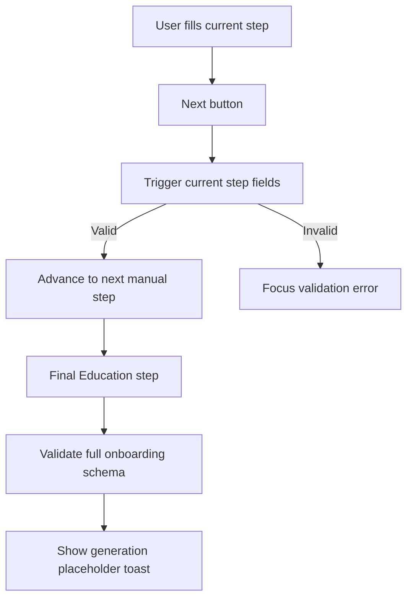

# Onboarding: Resume Data Capture

> Onboarding captures a user's source resume data through upload, GitHub import, or manual entry. Generation submit handlers are temporarily placeholders while the next analysis pipeline is rebuilt.

---

## 1. Core Philosophy

### 1.1 Design Pillars

| Pillar                   | Description                                                                                                    |
| ------------------------ | -------------------------------------------------------------------------------------------------------------- |
| **Guided completion**      | Manual entry is a sequential flow so required fields are validated before users advance.                       |
| **Low-clutter feedback**   | Progress UI should show where the user is without repeating equivalent percentage, count, and stepper signals. |
| **Scratch-ready submits**  | Generate/analyze actions keep their UI entry points but do not call backend generation until the new pipeline is designed. |

### 1.2 Key Decisions

- **Non-interactive manual stepper**: Manual-entry step labels are status indicators, not tabs, because users should not skip required validation by jumping forward.
- **Mobile-specific progress summary**: Small screens show only the current step name and compact count because the full stepper does not fit.

---

## 2. Architecture Overview

```text
app/onboarding/page.tsx
  ├─ MethodSelection
  ├─ UploadStep
  ├─ GitHubStep
  └─ ManualEntryForm
       ├─ ProgressBar
       ├─ react-hook-form + onboardingSchema
       └─ Contact/Summary/Experience/Projects/Education steps
```

---

## 3. Key Files & Entry Points

> **For AI**: When asked to work on this domain, start by reading these files.

| File                                                                    | Purpose                                                                           | When to Read                                |
| ----------------------------------------------------------------------- | --------------------------------------------------------------------------------- | ------------------------------------------- |
| `apps/frontend/app/onboarding/page.tsx`                                 | Chooses onboarding method and renders the selected onboarding path.               | Any onboarding route-level change.          |
| `apps/frontend/app/onboarding/types.ts`                                 | Defines onboarding method and manual-entry step config.                           | Adding, removing, or renaming manual steps. |
| `apps/frontend/app/components/onboarding/manual-entry-form.tsx`         | Coordinates manual-entry form state, validation, step transitions, and placeholder generation submit. | Manual-entry flow changes.                  |
| `apps/frontend/app/components/onboarding/github/github-step.tsx`        | Handles GitHub connection/repo loading and placeholder repo analysis submit.      | GitHub onboarding path changes.             |
| `apps/frontend/app/components/onboarding/github/github-repo-selection-view.tsx` | Coordinates GitHub repo search query param, selection limit, clear selection, and analyze handoff. | GitHub repo picker behavior changes.        |
| `apps/frontend/app/components/onboarding/github/github-repo-*.tsx`      | Feature-local GitHub repo picker header, toolbar, card, empty-state, and action components. | GitHub repo picker presentation changes.    |
| `apps/frontend/app/components/onboarding/github/github-loading-view.tsx` | Skeleton UI for GitHub connection and repository loading states.                  | GitHub onboarding loading-state UI changes. |
| `apps/frontend/app/components/onboarding/github/github-repo-grid-skeleton.tsx` | Shared skeleton grid used while GitHub repositories are loading.                  | GitHub repo loading-state UI changes.       |
| `apps/frontend/app/components/onboarding/upload/upload-step.tsx`        | Handles upload view submission and placeholder file analysis submit.              | Upload onboarding path changes.             |
| `apps/frontend/app/components/onboarding/progress-bar.tsx`              | Non-interactive manual-entry step progress indicator.                             | Manual-entry progress UI changes.           |
| `apps/frontend/app/components/onboarding/steps/onboarding-item-section.tsx` | Shared repeatable-item section wrapper for manual entry cards.                 | Experience, projects, or education list-section UI changes. |
| `apps/frontend/app/components/onboarding/steps/technical-skills-section.tsx` | Technical skills input and chip UI used by Projects & Skills.                 | Technical skills UI changes.                |
| `apps/frontend/app/components/onboarding/steps/date-clear-button.tsx`    | Shared DatePicker clear control for onboarding date fields.                      | Resume date clear-control behavior changes. |
| `apps/frontend/lib/utils/resume-date.ts`                                | Shared DatePicker parser/serializer for resume date strings.                      | Resume date picker behavior changes.        |
| `packages/shared/src/schemas/resume.ts`                                  | Single source of truth for onboarding resume validation.                          | Resume data validation changes.             |
| `apps/frontend/app/components/onboarding/steps/projects-step.test.tsx`  | Locks the projects and skills guidance, empty-state, and skill chip UI contracts. | Projects & Skills step UI changes.          |
| `apps/frontend/app/components/onboarding/steps/project-item-content.test.tsx` | Locks project item header and date picker behavior.                           | Project item UI changes.                    |
| `apps/frontend/app/components/onboarding/steps/education-step.test.tsx` | Locks the final education empty-state UI contract.                                | Education empty-state UI changes.           |
| `apps/frontend/app/components/onboarding/steps/`                        | Individual manual-entry form steps.                                               | Field-level manual-entry changes.           |

---

## 4. Data Flow

### 4.1 Manual Entry Flow



---

## 5. Component / Module Structure

```text
apps/frontend/app/components/onboarding/
├── manual-entry-form.tsx       # Manual flow orchestration
├── progress-bar.tsx            # Manual step status UI
├── progress-bar.test.tsx       # Progress UI contract test
├── github/                     # GitHub onboarding flow views and repo picker components
│   ├── github-step.tsx
│   ├── github-connect-view.tsx
│   ├── github-repo-selection-view.tsx
│   └── github-repo-*.tsx
├── upload/                     # Upload onboarding flow views
└── steps/                      # Manual-entry step components
```

---

## 6. Patterns & Conventions

### 6.1 Manual Step Navigation

```typescript
const ok = await form.trigger(stepFields, { shouldFocus: true });
if (ok) goToNextStep();
```

- **Rule**: Validate only the current step before moving forward; validate the full schema before starting generation.
- **Anti-pattern**: Do not make progress labels clickable unless validation and backward/forward navigation rules are designed explicitly.

### 6.2 Progress UI

- **Rule**: Use one primary visual progress model per viewport: full labeled stepper on larger screens, compact current-step summary on mobile.
- **Rule**: Explain the required-field marker once at the manual-entry form level instead of repeating optional helper text under individual fields.
- **Anti-pattern**: Do not show percentage, a progress bar, and step labels together for the five-step manual form.

---

## 7. Integration Points

> How this domain connects to other domains. Update this when dependencies change.

| Domain            | Relationship                                                      | Key Interface                                       |
| ----------------- | ----------------------------------------------------------------- | --------------------------------------------------- |
| Auth              | New users land on onboarding after registration.                  | `config.auth.afterSignUpUrl`                        |
| Resume generation | Onboarding submit handlers are placeholders until the next analysis pipeline is implemented. | Placeholder toasts in GitHub, upload, and manual paths |
| Shared schemas    | Manual entry validates against the shared onboarding form schema. | `onboardingSchema`, `OnboardingFormInput`           |

---

## 8. Implementation Status

### Phase 1: Manual Entry

- [x] Sequential manual-entry form
- [x] Per-step validation before advancing
- [x] Compact non-interactive progress indicator
- [x] Generation submit temporarily reset to placeholder
- [ ] Optional future review screen before generation

### Phase 2: Alternative Inputs

- [x] Upload onboarding path
- [x] GitHub onboarding path
- [x] Alternative-input analysis submit temporarily reset to placeholder

---

## 9. Risks & Mitigations

| Risk                                           | Mitigation                                                                                   |
| ---------------------------------------------- | -------------------------------------------------------------------------------------------- |
| Users interpret the stepper as clickable tabs. | Keep step labels visually status-like and do not render buttons/links.                       |
| Mobile progress UI becomes cramped.            | Hide the full stepper on small screens and show a compact current-step summary.              |
| Required data is skipped before generation.    | Trigger step-level validation before advancing and full schema validation before submitting. |
| Placeholder submits look like completed generation. | Use explicit not-implemented toasts until the new generation pipeline exists.              |

---

## 10. Development Log

### [2026-05-05] - Progressive GitHub Repository Loading

- **Decision:** Render the GitHub repo picker shell as soon as the connection is known, and skeleton-load only repo-dependent content while repositories fetch.
- **Problem:** Repository loading still blocked the search, selected count, Back, Analyze, and connected-account UI even though the connection data was already available.
- **Solution:**
  1. **Progressive flow:** Updated `apps/frontend/app/components/onboarding/github/github-step.tsx` to render `GitHubRepoSelectionView` during repository loading with an empty repo list and `isReposLoading`.
  2. **Partial skeleton state:** Updated `github-repo-selection-view.tsx` and `github-repo-selection-header.tsx` so only the repository count and grid skeleton while search/actions remain visible.
  3. **Shared grid skeleton:** Added `github-repo-grid-skeleton.tsx` and reused it from `github-loading-view.tsx` to keep skeleton card shape consistent.
- **Outcome:** Users see the connected account, search field, selected count, and actions earlier while repositories continue loading in the grid area.

### [2026-05-05] - GitHub Repo Search URL State

- **Decision:** Persist GitHub repo search text in the onboarding URL as `q` using `nuqs`.
- **Problem:** Repository search was held only in component state, so refreshing the page or sharing the current onboarding URL lost the active filter.
- **Solution:**
  1. **URL-backed search state:** Updated `apps/frontend/app/components/onboarding/github/github-repo-selection-view.tsx` to replace local search text state with `useQueryState('q', parseAsString.withDefault(''))`.
  2. **History control:** Configured the `q` parameter with replace-history and shallow routing so typing in the search bar updates the URL without adding a browser-history entry per keypress.
  3. **Documentation update:** Updated this doc's key file description for the GitHub repo picker.
- **Outcome:** The GitHub repo search field now survives refreshes and restores from URLs while preserving existing search filtering and selection behavior.

### [2026-05-04] - GitHub Repo Picker Modularization

- **Decision:** Keep GitHub repo selection behavior in `github-repo-selection-view.tsx`, but move each visual region into focused feature-local components.
- **Problem:** The repo picker mixed account header, search/status controls, repository cards, empty state, and action footer in one file, making UI changes harder to isolate without touching selection logic.
- **Solution:**
  1. **Thin flow container:** Updated `apps/frontend/app/components/onboarding/github/github-repo-selection-view.tsx` to own `selectedRepos`, `searchQuery`, filtering, clear selection, and analyze handoff only.
  2. **Focused render components:** Added `github-repo-selection-header.tsx`, `github-repo-selection-toolbar.tsx`, `github-repo-card.tsx`, `github-repo-selection-empty-state.tsx`, and `github-repo-selection-actions.tsx` under `apps/frontend/app/components/onboarding/github/`.
  3. **Documentation entry points:** Updated this doc's GitHub key files and component tree so future GitHub picker work starts from the correct files.
- **Outcome:** The GitHub repo picker is easier to edit section-by-section while preserving repo search, selection limit, clear selection, empty state, back, and analyze behavior.

### [2026-05-04] - GitHub Loading Skeleton Alignment

- **Decision:** Match the GitHub loading skeleton to the live repository picker layout instead of using the older stacked loading cards.
- **Problem:** The loading state had different width, spacing, card shape, and breakpoints from the actual repo selection UI, causing a visible layout jump when repositories loaded.
- **Solution:**
  1. **Layout parity:** Updated `apps/frontend/app/components/onboarding/github/github-loading-view.tsx` to use the same `max-w-3xl`, header rhythm, toolbar breakpoint, repo grid, and footer action row as the repo picker.
  2. **Card skeleton parity:** Added a private `RepoCardSkeleton` in `github-loading-view.tsx` with the same rounded card shape and internal zones as `github-repo-card.tsx`.
  3. **Documentation entry point:** Added `github-loading-view.tsx` to the GitHub onboarding key files table.
- **Outcome:** GitHub repository loading now transitions into the loaded picker with less visual shift and a closer representation of the final screen.

### [2026-05-04] - Onboarding Generation Reset

- **Decision:** Remove the old onboarding job pipeline while preserving onboarding UI entry points and GitHub connection/repo browsing.
- **Problem:** GitHub, upload, and manual onboarding submits were coupled to job IDs, BullMQ workers, polling, streaming, idempotency headers, and file extraction code that made the next generation rewrite harder to reason about.
- **Solution:**
  1. **Frontend placeholder submits:** Updated `apps/frontend/app/components/onboarding/github/github-step.tsx`, `upload/upload-step.tsx`, and `manual-entry-form.tsx` so Analyze/Generate actions validate/select data and show explicit placeholder toasts instead of calling generation actions.
  2. **Job UI removal:** Updated `apps/frontend/app/onboarding/page.tsx` and onboarding exports, and removed the job provider, job UI, job proxy routes, and job HTTP hooks.
  3. **Backend generation reset:** Updated `apps/backend/src/routes/onboarding.router.ts`, `controllers/onboarding.controller.ts`, and `server.ts` to keep only onboarding status and remove onboarding job/worker/admin queue wiring.
  4. **Database cleanup:** Updated `apps/backend/prisma/schema.prisma` and added a migration to drop `onboarding_jobs` plus its job status/stage enums.
- **Outcome:** Onboarding is now a clean UI/data-capture surface ready for a new generation implementation without the retired job pipeline.

### [2026-05-01] - Experience Card Alignment & Mobile Project Reordering

- **Decision:** Experience cards now follow the same scan pattern as project cards, while project cards expose mobile reorder controls like the other reorderable onboarding entries.
- **Problem:** Experience cards still used the older `Job #n` header, separate current-role checkbox placement, and non-clearable date controls, while project cards lacked small-screen up/down controls for users who cannot access the desktop hover controls.
- **Solution:**
  1. **Experience section polish:** Updated `apps/frontend/app/components/onboarding/steps/experience-step.tsx` to add an `Experience` section header, populated count, calmer empty state, and consistent add-action labels.
  2. **Experience card alignment:** Updated `apps/frontend/app/components/onboarding/steps/experience-item-content.tsx` to use a numeric badge, clearable date pickers, and the current-role checkbox directly under End Date.
  3. **Project mobile controls:** Updated `apps/frontend/app/components/onboarding/steps/projects-step.tsx` and `project-item-content.tsx` to pass and render mobile up/down reorder controls without changing the desktop floating controls.
- **Outcome:** Work experience and project entries now share a consistent card rhythm, and project cards can be reordered on small screens.

### [2026-05-01] - Onboarding Step Component Modularization

- **Decision:** Repeatable onboarding step sections, date clear controls, and technical skills UI now live in focused components instead of being embedded in the step containers.
- **Problem:** `experience-step.tsx` and `projects-step.tsx` mixed section chrome, empty states, add actions, item rendering, and skills UI, making small UI changes harder to review.
- **Solution:**
  1. **Shared section wrapper:** Added `apps/frontend/app/components/onboarding/steps/onboarding-item-section.tsx` and reused it from experience and projects steps.
  2. **Shared date clear control:** Added `apps/frontend/app/components/onboarding/steps/date-clear-button.tsx` and reused it in project and experience date pickers.
  3. **Skills section extraction:** Added `apps/frontend/app/components/onboarding/steps/technical-skills-section.tsx` so `projects-step.tsx` keeps form orchestration separate from skills rendering.
- **Outcome:** Experience and Projects & Skills steps are easier to scan while preserving their existing form state, validation, and navigation behavior.

### [2026-04-30] - Resume Date Picker Full-Date Preservation

- **Decision:** Resume date pickers now preserve full selected dates while still loading legacy year-only and month-only values.
- **Problem:** DatePicker controls rendered day-level calendars, but form handlers truncated selections to `YYYY-MM`, causing selected days to appear to jump back to the first day of the month and making min/max constraints inconsistent.
- **Solution:**
  1. **Shared parsing contract:** Added `apps/frontend/lib/utils/resume-date.ts` to parse `YYYY`, `YYYY-MM`, and `YYYY-MM-DD` values for DatePicker controls and serialize selected dates without dropping the day.
  2. **Onboarding picker alignment:** Updated `apps/frontend/app/components/onboarding/steps/project-item-content.tsx`, `experience-item-content.tsx`, and `education-item-content.tsx` to use the shared parser for values and min/max bounds.
  3. **Review picker alignment:** Updated `apps/frontend/app/components/resumes/review/sections/projects/project-card.tsx`, `experience/experience-card.tsx`, and `education/education-card.tsx` so post-onboarding edits preserve the same date behavior.
  4. **Validation coverage:** Updated `packages/shared/src/schemas/resume.ts` to accept full `YYYY-MM-DD` dates and added focused tests for helper parsing, schema acceptance, and project item DatePicker values.
- **Outcome:** Users can select a specific day without the UI snapping back to day one, while older resume data continues to load safely.

### [2026-04-29] - Skills Clear-All Control

- **Decision:** Technical skills now include a lightweight `Clear all` action only when multiple skill chips are present.
- **Problem:** Removing several skill chips one by one added friction, while adding equivalent bulk deletion to projects or education would be more destructive and require heavier confirmation UI.
- **Solution:**
  1. **Bulk skill removal:** Updated `apps/frontend/app/components/onboarding/steps/projects-step.tsx` to clear the `skills` field through React Hook Form when the `Clear all` action is pressed.
  2. **Scoped visibility:** Updated `apps/frontend/app/components/onboarding/steps/projects-step.tsx` to show the action only when there is more than one skill.
  3. **Regression coverage:** Updated `apps/frontend/app/components/onboarding/steps/projects-step.test.tsx` to verify all skill chips are removed and the clear action disappears.
- **Outcome:** Users can quickly reset a long skill list without introducing risky bulk deletion for richer project or education entries.

### [2026-04-29] - Project Item Header Polish

- **Decision:** Project cards now use a compact numeric badge for item order and keep the `Projects` section label as the primary section heading.
- **Problem:** Rendering `Projects` immediately above `Project #1` repeated the same noun and made the first project card feel visually heavier than the surrounding form.
- **Solution:**
  1. **Muted project badge:** Updated `apps/frontend/app/components/onboarding/steps/project-item-content.tsx` to replace `Project #n` with an accessible number badge.
  2. **Section count:** Updated `apps/frontend/app/components/onboarding/steps/projects-step.tsx` to show a muted populated count such as `2 projects` beside the section heading.
  3. **Regression coverage:** Added `apps/frontend/app/components/onboarding/steps/project-item-content.test.tsx` and updated `apps/frontend/app/components/onboarding/steps/projects-step.test.tsx` to lock the badge and count behavior.
- **Outcome:** Populated project cards are easier to scan without repeating the section name in every card header.

### [2026-04-29] - Projects & Skills Empty State Refresh

- **Decision:** The manual progress step now labels the fourth step as `Projects & Skills`, and the step guidance reads as advisory resume-strengthening copy rather than an unenforced generation requirement.
- **Problem:** The previous guidance referenced `1 experience` inside the Projects step and presented suggestions as pre-generation requirements, while an empty projects list showed only an add button with no contextual empty state.
- **Solution:**
  1. **Progress label alignment:** Updated `apps/frontend/app/onboarding/types.ts` so the progress pill matches the step header copy.
  2. **Advisory checklist copy:** Updated `apps/frontend/app/components/onboarding/steps/projects-step.tsx` to recommend 3 technical skills and 1 detailed project without mentioning experience.
  3. **Projects empty state:** Updated `apps/frontend/app/components/onboarding/steps/projects-step.tsx` to mirror the education empty-state pattern with concise muted guidance and an `Add Project` action.
  4. **Regression coverage:** Updated `apps/frontend/app/components/onboarding/progress-bar.test.tsx` and `apps/frontend/app/components/onboarding/steps/projects-step.test.tsx` to lock the combined label, empty state, and retired experience copy.
- **Outcome:** Users now get consistent Projects & Skills navigation, clearer non-blocking guidance, and a populated empty Projects section instead of a bare action button.

### [2026-04-28] - Education Empty State Cleanup

- **Decision:** The final education step now uses the main step header as the only major heading, keeps the empty state concise, and relies on the generate button for final-step action clarity.
- **Problem:** The previous empty state stacked a second headline with the main `Education` header and always rendered a separate `You're all set!` card, which added visual weight without changing the user's next action.
- **Solution:**
  1. **Concise empty prompt:** Updated `apps/frontend/app/components/onboarding/steps/education-step.tsx` to replace the duplicate empty-state heading with one optional-education support sentence and the existing `Add Education` action.
  2. **Removed redundant completion card:** Updated `apps/frontend/app/components/onboarding/steps/education-step.tsx` to remove the persistent final-step success card and align muted text with `text-muted-foreground`.
  3. **Locked the UI contract:** Added `apps/frontend/app/components/onboarding/steps/education-step.test.tsx` to verify the concise empty state and absence of duplicate completion messaging.
- **Outcome:** Users see a calmer final onboarding step with one clear optional education prompt and an unchanged path to generate their resume.

### [2026-04-27] - Professional Summary Step Simplification

- **Decision:** Keep the professional summary step focused on one writing task and move guidance into the field helper text instead of a separate help panel.
- **Problem:** The previous summary step repeated guidance across the centered header, field description, and help card, making the step feel visually cluttered for a single optional field.
- **Solution:**
  1. **Balanced prompt copy:** Updated `apps/frontend/app/components/onboarding/steps/summary-step.tsx` to use a shorter header description that wraps more cleanly.
  2. **Inline field guidance:** Updated `apps/frontend/app/components/onboarding/steps/summary-step.tsx` to replace the separate help card with concise helper text under the textarea.
  3. **Regression coverage:** Added `apps/frontend/app/components/onboarding/steps/summary-step.test.tsx` to verify the focused prompt and absence of the old help panel.
- **Outcome:** The summary step now presents one clear writing surface with quieter guidance and less competing visual weight.

### [2026-04-27] - Immediate Skill Chip Removal

- **Decision:** Keep technical skills as a simple form-backed chip array, but subscribe the rendered chip list directly to the `skills` field.
- **Problem:** Removing a skill updated React Hook Form state, but the chip list did not visually update until another local state change, making the remove button appear broken.
- **Solution:**
  1. **Field subscription:** Updated `apps/frontend/app/components/onboarding/steps/projects-step.tsx` to render skills from `useWatch({ control, name: 'skills' })` instead of relying on a stale `watch('skills')` snapshot.
  2. **Typed removal handler:** Updated `apps/frontend/app/components/onboarding/steps/projects-step.tsx` to remove skills through a single object-parameter handler and validate the field after removal.
  3. **Regression coverage:** Added `apps/frontend/app/components/onboarding/steps/projects-step.test.tsx` to verify a clicked skill remove control immediately removes that chip while keeping the other skills visible.
- **Outcome:** Technical skill removal now updates the onboarding UI immediately and has focused regression coverage.

### [2026-04-24] - Required Field Legend Cleanup

- **Decision:** Manual entry now explains required fields once near the progress header and avoids repeated optional helper text on contact fields.
- **Problem:** Optional helper text under unstarred contact fields duplicated the required-marker convention and made the helper/error text area feel busier than needed.
- **Solution:**
  1. **Shared required-field legend:** Updated `apps/frontend/app/components/onboarding/manual-entry-form.tsx` to render `Required fields are marked with *` beneath the manual progress header.
  2. **Removed redundant optional labels:** Updated `apps/frontend/app/components/onboarding/steps/contact-step.tsx` to remove `Optional` descriptions from optional contact fields.
- **Outcome:** Users get one clear explanation for required fields while optional contact fields stay visually quieter and reserve helper text space for meaningful guidance or errors.

### [2026-04-24] - Progress Stepper Review Fixes

- **Decision:** Keep the simplified onboarding stepper design, but harden its docs, defensive state handling, and test harness behavior.
- **Problem:** Follow-up review found markdownlint issues in the onboarding doc, motion-only props leaking into native test DOM nodes, and a missing defensive guard around invalid manual step indexes.
- **Solution:**
  1. **Labeled text fences:** Updated `docs/architecture/onboarding.md` to mark the architecture tree blocks as `text`.
  2. **Safer motion test mock:** Updated `apps/frontend/app/components/onboarding/progress-bar.test.tsx` to strip motion-only props before rendering mocked `motion.div` and `motion.li`.
  3. **Fail-closed invalid step guard:** Updated `apps/frontend/app/components/onboarding/progress-bar.tsx` to warn and return `null` for invalid step indexes before deriving step text and state.
- **Outcome:** The onboarding progress UI keeps the same visible behavior while avoiding DOM prop pollution, markdownlint noise, and invalid fallback output.

### [2026-04-23] - Compact Desktop Stepper Pills

- **Decision:** Desktop manual-entry progress labels now size to their content and wrap when needed instead of filling the full row equally.
- **Problem:** Equal-width step labels created large empty areas around short labels, making the non-interactive stepper feel visually heavier and more tab-like than intended.
- **Solution:**
  1. **Fit-content desktop pills:** Updated `apps/frontend/app/components/onboarding/progress-bar.tsx` to replace equal `flex-1` step items with `w-fit` content-sized items.
  2. **Responsive wrapping:** Updated `apps/frontend/app/components/onboarding/progress-bar.tsx` to allow the desktop stepper row to wrap naturally with `flex-wrap`.
- **Outcome:** The manual-entry progress indicator now reads as a compact status trail while preserving the mobile summary and non-interactive step semantics.

### [2026-04-23] - Simplified Manual Entry Progress UI

- **Decision:** Manual entry now uses a single progress model per viewport: a non-interactive labeled stepper on larger screens and a compact current-step summary on mobile.
- **Problem:** The previous progress header repeated status as a percentage, progress bar, numeric count, and step labels, which made the manual-entry form feel cluttered without adding useful guidance.
- **Solution:**
  1. **Removed duplicate progress signals:** Updated `apps/frontend/app/components/onboarding/progress-bar.tsx` to remove percentage text and the animated progress bar.
  2. **Added mobile current-step summary:** Updated `apps/frontend/app/components/onboarding/progress-bar.tsx` to show `Step n`, `n/5`, and the current step label on small screens.
  3. **Locked the UI contract:** Added `apps/frontend/app/components/onboarding/progress-bar.test.tsx` to verify the simplified progress indicator does not render duplicate percentage/progress bar signals.
- **Outcome:** Users now see one clear progress indicator for the manual-entry form without redundant visual noise.

---
