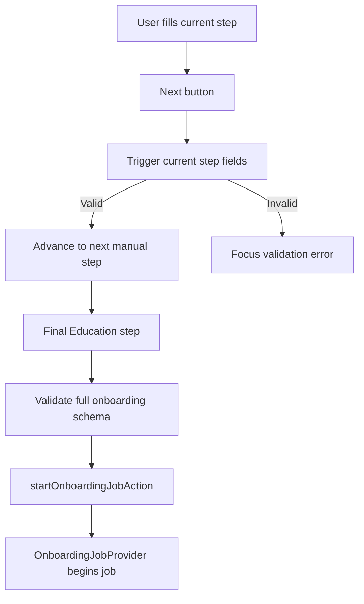

# Onboarding: Resume Data Capture

> Onboarding captures a user's source resume data through upload, GitHub import, or manual entry, then starts the resume generation job.

---

## 1. Core Philosophy

### 1.1 Design Pillars

| Pillar | Description |
| ------ | ----------- |
| **Guided completion** | Manual entry is a sequential flow so required fields are validated before users advance. |
| **Low-clutter feedback** | Progress UI should show where the user is without repeating equivalent percentage, count, and stepper signals. |
| **Job handoff clarity** | Once valid data is submitted, the UI hands control to the onboarding job context and job UI. |

### 1.2 Key Decisions

- **Non-interactive manual stepper**: Manual-entry step labels are status indicators, not tabs, because users should not skip required validation by jumping forward.
- **Mobile-specific progress summary**: Small screens show only the current step name and compact count because the full stepper does not fit.

---

## 2. Architecture Overview

```text
app/onboarding/page.tsx
  ├─ MethodSelection
  ├─ UploadStep
  ├─ GitHubStep
  └─ ManualEntryForm
       ├─ ProgressBar
       ├─ react-hook-form + onboardingSchema
       ├─ Contact/Summary/Experience/Projects/Education steps
       └─ startOnboardingJobAction -> OnboardingJobProvider
```

---

## 3. Key Files & Entry Points

> **For AI**: When asked to work on this domain, start by reading these files.

| File | Purpose | When to Read |
| ---- | ------- | ------------ |
| `apps/frontend/app/onboarding/page.tsx` | Chooses onboarding method and wraps job UI/provider. | Any onboarding route-level change. |
| `apps/frontend/app/onboarding/types.ts` | Defines onboarding method and manual-entry step config. | Adding, removing, or renaming manual steps. |
| `apps/frontend/app/components/onboarding/manual-entry-form.tsx` | Coordinates manual-entry form state, validation, step transitions, and job start. | Manual-entry flow changes. |
| `apps/frontend/app/components/onboarding/progress-bar.tsx` | Non-interactive manual-entry step progress indicator. | Manual-entry progress UI changes. |
| `apps/frontend/app/components/onboarding/steps/` | Individual manual-entry form steps. | Field-level manual-entry changes. |

---

## 4. Data Flow

### 4.1 Manual Entry Flow



---

## 5. Component / Module Structure

```text
apps/frontend/app/components/onboarding/
├── manual-entry-form.tsx       # Manual flow orchestration
├── progress-bar.tsx            # Manual step status UI
├── progress-bar.test.tsx       # Progress UI contract test
├── onboarding-job-context.tsx   # Job state provider
├── onboarding-job-ui.tsx        # Job status UI
├── github/                     # GitHub onboarding flow views
├── upload/                     # Upload onboarding flow views
└── steps/                      # Manual-entry step components
```

---

## 6. Patterns & Conventions

### 6.1 Manual Step Navigation

```typescript
const ok = await form.trigger(stepFields, { shouldFocus: true });
if (ok) goToNextStep();
```

- **Rule**: Validate only the current step before moving forward; validate the full schema before starting generation.
- **Anti-pattern**: Do not make progress labels clickable unless validation and backward/forward navigation rules are designed explicitly.

### 6.2 Progress UI

- **Rule**: Use one primary visual progress model per viewport: full labeled stepper on larger screens, compact current-step summary on mobile.
- **Anti-pattern**: Do not show percentage, a progress bar, and step labels together for the five-step manual form.

---

## 7. Integration Points

> How this domain connects to other domains. Update this when dependencies change.

| Domain | Relationship | Key Interface |
| ------ | ------------ | ------------- |
| Auth | New users land on onboarding after registration. | `config.auth.afterSignUpUrl` |
| Resume generation | Onboarding starts the generation job after valid input. | `startOnboardingJobAction`, `OnboardingJobProvider` |
| Shared schemas | Manual entry validates against the shared onboarding form schema. | `onboardingSchema`, `OnboardingFormInput` |

---

## 8. Implementation Status

### Phase 1: Manual Entry

- [x] Sequential manual-entry form
- [x] Per-step validation before advancing
- [x] Compact non-interactive progress indicator
- [ ] Optional future review screen before generation

### Phase 2: Alternative Inputs

- [x] Upload onboarding path
- [x] GitHub onboarding path

---

## 9. Risks & Mitigations

| Risk | Mitigation |
| ---- | ---------- |
| Users interpret the stepper as clickable tabs. | Keep step labels visually status-like and do not render buttons/links. |
| Mobile progress UI becomes cramped. | Hide the full stepper on small screens and show a compact current-step summary. |
| Required data is skipped before generation. | Trigger step-level validation before advancing and full schema validation before submitting. |

---

## 10. Development Log

### [2026-04-24] - Progress Stepper Review Fixes

- **Decision:** Keep the simplified onboarding stepper design, but harden its docs, defensive state handling, and test harness behavior.
- **Problem:** Follow-up review found markdownlint issues in the onboarding doc, motion-only props leaking into native test DOM nodes, and a missing defensive guard around invalid manual step indexes.
- **Solution:**
  1. **Labeled text fences:** Updated `docs/architecture/onboarding.md` to mark the architecture tree blocks as `text`.
  2. **Safer motion test mock:** Updated `apps/frontend/app/components/onboarding/progress-bar.test.tsx` to strip motion-only props before rendering mocked `motion.div` and `motion.li`.
  3. **Fail-closed invalid step guard:** Updated `apps/frontend/app/components/onboarding/progress-bar.tsx` to warn and return `null` for invalid step indexes before deriving step text and state.
- **Outcome:** The onboarding progress UI keeps the same visible behavior while avoiding DOM prop pollution, markdownlint noise, and invalid fallback output.

### [2026-04-23] - Compact Desktop Stepper Pills

- **Decision:** Desktop manual-entry progress labels now size to their content and wrap when needed instead of filling the full row equally.
- **Problem:** Equal-width step labels created large empty areas around short labels, making the non-interactive stepper feel visually heavier and more tab-like than intended.
- **Solution:**
  1. **Fit-content desktop pills:** Updated `apps/frontend/app/components/onboarding/progress-bar.tsx` to replace equal `flex-1` step items with `w-fit` content-sized items.
  2. **Responsive wrapping:** Updated `apps/frontend/app/components/onboarding/progress-bar.tsx` to allow the desktop stepper row to wrap naturally with `flex-wrap`.
- **Outcome:** The manual-entry progress indicator now reads as a compact status trail while preserving the mobile summary and non-interactive step semantics.

### [2026-04-23] - Simplified Manual Entry Progress UI

- **Decision:** Manual entry now uses a single progress model per viewport: a non-interactive labeled stepper on larger screens and a compact current-step summary on mobile.
- **Problem:** The previous progress header repeated status as a percentage, progress bar, numeric count, and step labels, which made the manual-entry form feel cluttered without adding useful guidance.
- **Solution:**
  1. **Removed duplicate progress signals:** Updated `apps/frontend/app/components/onboarding/progress-bar.tsx` to remove percentage text and the animated progress bar.
  2. **Added mobile current-step summary:** Updated `apps/frontend/app/components/onboarding/progress-bar.tsx` to show `Step n`, `n/5`, and the current step label on small screens.
  3. **Locked the UI contract:** Added `apps/frontend/app/components/onboarding/progress-bar.test.tsx` to verify the simplified progress indicator does not render duplicate percentage/progress bar signals.
- **Outcome:** Users now see one clear progress indicator for the manual-entry form without redundant visual noise.

---
