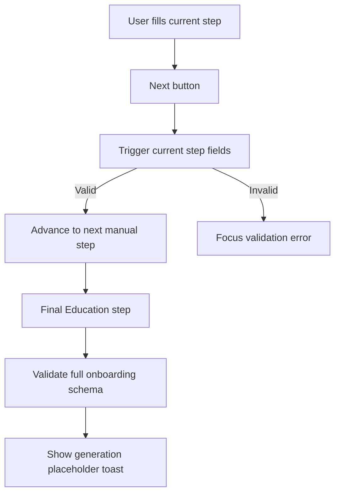

# Onboarding: Resume Data Capture

> Onboarding captures a user's source resume data through upload, GitHub import, or manual entry. Generation submit handlers are temporarily placeholders while the next analysis pipeline is rebuilt. The method-selection UI currently offers GitHub import only; upload and manual entry remain implemented and reachable via their `?method=` query values but are not presented as selectable cards.

---

## 1. Core Philosophy

### 1.1 Design Pillars

| Pillar                    | Description                                                                                                                |
| ------------------------- | -------------------------------------------------------------------------------------------------------------------------- |
| **Guided completion**     | Manual entry is a sequential flow so required fields are validated before users advance.                                   |
| **Low-clutter feedback**  | Progress UI should show where the user is without repeating equivalent percentage, count, and stepper signals.             |
| **Scratch-ready submits** | Generate/analyze actions keep their UI entry points but do not call backend generation until the new pipeline is designed. |

### 1.2 Key Decisions

- **Non-interactive manual stepper**: Manual-entry step labels are status indicators, not tabs, because users should not skip required validation by jumping forward.
- **Mobile-specific progress summary**: Small screens show only the current step name and compact count because the full stepper does not fit.

---

## 2. Architecture Overview

```text
app/onboarding/page.tsx
  ├─ MethodSelection
  ├─ UploadStep
  ├─ GitHubStep
  └─ ManualEntryForm
       ├─ ProgressBar
       ├─ react-hook-form + onboardingSchema
       └─ Contact/Summary/Experience/Projects/Education steps
```

---

## 3. Key Files & Entry Points

> **For AI**: When asked to work on this domain, start by reading these files.

| File                                                                             | Purpose                                                                                                                           | When to Read                                                |
| -------------------------------------------------------------------------------- | --------------------------------------------------------------------------------------------------------------------------------- | ----------------------------------------------------------- |
| `apps/frontend/app/onboarding/page.tsx`                                          | Chooses onboarding method and renders the selected onboarding path.                                                               | Any onboarding route-level change.                          |
| `apps/frontend/app/onboarding/types.ts`                                          | Defines onboarding method and manual-entry step config.                                                                           | Adding, removing, or renaming manual steps.                 |
| `apps/frontend/app/components/onboarding/manual-entry-form.tsx`                  | Coordinates manual-entry form state, validation, step transitions, and placeholder generation submit.                             | Manual-entry flow changes.                                  |
| `apps/frontend/app/components/onboarding/github/github-step.tsx`                 | Handles GitHub connection, installation-repository loading, and temporary analysis submit.                                        | GitHub onboarding path changes.                             |
| `apps/frontend/app/components/onboarding/github/github-repo-selection-view.tsx`  | Coordinates GitHub repo search query param, installation-repository count, selection limit, clear selection, and analyze handoff. | GitHub repo picker behavior changes.                        |
| `apps/frontend/app/components/onboarding/github/github-repo-*.tsx`               | Feature-local GitHub repo picker header, toolbar, card, empty-state, and action components.                                       | GitHub repo picker presentation changes.                    |
| `apps/frontend/app/components/onboarding/github/github-repo-grid-skeleton.tsx`   | Shared skeleton grid used while GitHub repositories are loading.                                                                  | GitHub repo loading-state UI changes.                       |
| `apps/frontend/app/components/ui/global-loading.tsx`                             | Body-level blocking loading portal with customizable status copy.                                                                 | Full-viewport loading-state UI changes.                     |
| `apps/frontend/app/components/onboarding/upload/upload-step.tsx`                 | Handles upload view submission and placeholder file analysis submit.                                                              | Upload onboarding path changes.                             |
| `apps/frontend/app/components/onboarding/progress-bar.tsx`                       | Non-interactive manual-entry step progress indicator.                                                                             | Manual-entry progress UI changes.                           |
| `apps/frontend/app/components/onboarding/steps/onboarding-item-section.tsx`      | Shared repeatable-item section wrapper for manual entry cards.                                                                    | Experience, projects, or education list-section UI changes. |
| `apps/frontend/app/components/onboarding/steps/technical-skills-section.tsx`     | Technical skills input and chip UI used by Projects & Skills.                                                                     | Technical skills UI changes.                                |
| `apps/frontend/app/components/onboarding/steps/date-clear-button.tsx`            | Shared DatePicker clear control for onboarding date fields.                                                                       | Resume date clear-control behavior changes.                 |
| `apps/frontend/lib/utils/resume-date.ts`                                         | Shared DatePicker parser/serializer for resume date strings.                                                                      | Resume date picker behavior changes.                        |
| `packages/shared/src/schemas/resume.ts`                                          | Single source of truth for onboarding resume validation.                                                                          | Resume data validation changes.                             |
| `apps/frontend/app/components/onboarding/steps/projects-step.test.tsx`           | Locks the projects and skills guidance, empty-state, and skill chip UI contracts.                                                 | Projects & Skills step UI changes.                          |
| `apps/frontend/app/components/onboarding/steps/project-item-content.test.tsx`    | Locks project item date and current-project checkbox behavior.                                                                    | Project item UI changes.                                    |
| `apps/frontend/app/components/onboarding/steps/experience-item-content.test.tsx` | Locks experience end-date clearing through date and current-role controls.                                                        | Experience item UI changes.                                 |
| `apps/frontend/app/components/onboarding/steps/education-step.test.tsx`          | Locks the final education empty-state UI contract.                                                                                | Education empty-state UI changes.                           |
| `apps/frontend/app/components/onboarding/steps/`                                 | Individual manual-entry form steps.                                                                                               | Field-level manual-entry changes.                           |

---

## 4. Data Flow

### 4.1 Manual Entry Flow



---

## 5. Component / Module Structure

```text
apps/frontend/app/components/
├── onboarding/
│   ├── manual-entry-form.tsx       # Manual flow orchestration
│   ├── progress-bar.tsx            # Manual step status UI
│   ├── progress-bar.test.tsx       # Progress UI contract test
│   ├── github/                     # GitHub onboarding flow views and repo picker components
│   │   ├── github-step.tsx
│   │   ├── github-connect-view.tsx
│   │   ├── github-repo-selection-view.tsx
│   │   └── github-repo-*.tsx
│   ├── upload/                     # Upload onboarding flow views
│   └── steps/                      # Manual-entry step components
└── ui/
    └── global-loading.tsx          # Body-level blocking loading portal
```

---

## 6. Patterns & Conventions

### 6.1 Manual Step Navigation

```typescript
const ok = await form.trigger(stepFields, { shouldFocus: true });
if (ok) goToNextStep();
```

- **Rule**: Validate only the current step before moving forward; validate the full schema before starting generation.
- **Anti-pattern**: Do not make progress labels clickable unless validation and backward/forward navigation rules are designed explicitly.

### 6.2 Progress UI

- **Rule**: Use one primary visual progress model per viewport: full labeled stepper on larger screens, compact current-step summary on mobile.
- **Rule**: Explain the required-field marker once at the manual-entry form level instead of repeating optional helper text under individual fields.
- **Anti-pattern**: Do not show percentage, a progress bar, and step labels together for the five-step manual form.

### 6.3 Loading States

- **Rule**: Use `GlobalLoading` only while a blocking page-level prerequisite, such as the initial GitHub connection check, is unresolved.
- **Rule**: Keep repository fetching progressive by rendering the picker shell and skeleton-loading only the repository grid.
- **Anti-pattern**: Do not replace structured repository loading with the full-viewport overlay after the connection is known.

---

## 7. Integration Points

> How this domain connects to other domains. Update this when dependencies change.

| Domain            | Relationship                                                                                                                            | Key Interface                                                  |
| ----------------- | --------------------------------------------------------------------------------------------------------------------------------------- | -------------------------------------------------------------- |
| Auth              | New users land on onboarding after registration.                                                                                        | `config.auth.afterSignUpUrl`                                   |
| GitHub analysis   | GitHub loads repositories from the connected installation; Analyze calls a temporary endpoint that currently returns an empty response. | `FetchGithubReposResponse`, `POST /api/v1/auth/github/analyze` |
| Resume generation | Upload and manual submit handlers are placeholders until the next generation pipeline is implemented.                                   | Placeholder toasts in upload and manual paths                  |
| Shared schemas    | Manual entry validates against the shared onboarding form schema.                                                                       | `onboardingSchema`, `OnboardingFormInput`                      |
| UI system         | HeroUI supplies form, date, modal, chip, and Checkbox primitives used by onboarding.                                                    | `@heroui/react`, `docs/architecture/ui/README.md`              |

---

## 8. Implementation Status

### Phase 1: Manual Entry

- [x] Sequential manual-entry form
- [x] Per-step validation before advancing
- [x] Compact non-interactive progress indicator
- [x] Generation submit temporarily reset to placeholder
- [ ] Optional future review screen before generation

### Phase 2: Alternative Inputs

- [x] Upload onboarding path
- [x] GitHub onboarding path
- [x] Upload analysis submit temporarily reset to placeholder
- [x] GitHub installation repository picker
- [x] GitHub analysis submit wired to a temporary empty-response endpoint
- [ ] Resume GitHub project-structure analysis after the temporary endpoint is restored

---

## 9. Risks & Mitigations

| Risk                                                | Mitigation                                                                                   |
| --------------------------------------------------- | -------------------------------------------------------------------------------------------- |
| Users interpret the stepper as clickable tabs.      | Keep step labels visually status-like and do not render buttons/links.                       |
| Mobile progress UI becomes cramped.                 | Hide the full stepper on small screens and show a compact current-step summary.              |
| Required data is skipped before generation.         | Trigger step-level validation before advancing and full schema validation before submitting. |
| Placeholder submits look like completed generation. | Use explicit not-implemented toasts until the new generation pipeline exists.                |

---

---

## 10. History & Decisions

- **Changelog:** [changelog.md](changelog.md)
- **Architecture decisions:** [adr/](adr/)
