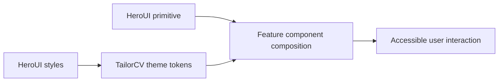

# UI: HeroUI and Tailwind Component System

> TailorCV's frontend UI composes HeroUI v3 primitives with Tailwind CSS 4 and repository-owned theme tokens.

---

## 1. Core Philosophy

| Pillar | Description |
| ------ | ----------- |
| **Accessible primitives** | HeroUI and React Aria own component semantics, keyboard behavior, and compound-component contracts. |
| **Application-owned theme** | TailorCV owns brand colors and intentional interaction overrides in `globals.css` without copying HeroUI internals. |
| **Deliberate upgrades** | HeroUI versions are pinned exactly and upgraded only after release-note, type, interaction, and visual review. |

### 1.1 Durable Decisions

- [0001-pin-heroui-exact-versions.md](adr/0001-pin-heroui-exact-versions.md) - Pin HeroUI packages exactly and treat every upgrade as an explicit migration.

---

## 2. Architecture Overview

```text
@heroui/react components
        +
@heroui/styles theme contract
        +
apps/frontend/app/globals.css TailorCV tokens
        -> feature-local React views
```

---

## 3. Key Files & Entry Points

| File | Purpose | When to Read |
| ---- | ------- | ------------ |
| `apps/frontend/package.json` | Pins the supported HeroUI and Tailwind versions. | Any component-library upgrade. |
| `apps/frontend/app/globals.css` | Imports HeroUI's explicit CSS export and owns TailorCV theme tokens and intentional global overrides. | Theme or cross-component styling changes. |
| `apps/frontend/app/layout.tsx` | Mounts global UI providers, including HeroUI Toast. | Provider or global feedback changes. |

---

## 4. Component Flow



---

## 5. Component / Module Structure

```text
apps/frontend/
├── package.json             # Exact HeroUI version contract
└── app/
    ├── globals.css          # HeroUI import and TailorCV theme
    ├── layout.tsx           # Global providers
    └── components/          # Feature-local HeroUI compositions
```

---

## 6. Patterns & Conventions

- Import public components and utilities from `@heroui/react`; do not depend on private HeroUI source paths.
- Import `@heroui/styles/css` immediately after Tailwind in `globals.css`; the explicit public CSS export prevents Turbopack's persisted module graph from retaining beta-era styles after a package upgrade.
- Follow the compound-component structure documented for the installed version. In HeroUI 3.2.3, `Checkbox.Control` belongs inside `Checkbox.Content`.
- Preserve accessible names through visible content and semantic HeroUI composition rather than test-only selectors.
- Keep TailorCV palette ownership in `globals.css`; add global interaction overrides only when the application intentionally differs from HeroUI defaults.
- Keep HeroUI Toast and Sonner as separate existing feedback systems until a dedicated consolidation decision is made.

---

## 7. Integration Points

| Domain | Relationship | Key Interface |
| ------ | ------------ | ------------- |
| Dependency management | Owns workspace placement, exact package resolution, and peer-tree review. | `apps/frontend/package.json`, `package-lock.json` |
| Development environment | Supplies the Node 22 runtime required by the supported HeroUI toolchain. | `.nvmrc`, CI, Docker, root `engines` |
| Auth flows | Uses Checkbox, InputOTP, Form, and Toast for custom authentication screens. | `apps/frontend/app/components/auth/` |
| Onboarding | Uses Checkbox, DatePicker, Calendar, Modal, Chip, and form primitives. | `apps/frontend/app/components/onboarding/` |

---

## 8. Implementation Status

- [x] HeroUI React and Styles pinned to `3.2.3`
- [x] Tailwind CSS 4 retained as the styling engine
- [x] HeroUI 3.2 Checkbox composition adopted across current application usages
- [x] Immediate Tooltip closing preserved through `--tooltip-close-delay`
- [ ] Complete authorized type, test, build, dependency-tree, and browser verification

---

## 9. Risks & Mitigations

| Risk | Mitigation |
| ---- | ---------- |
| A HeroUI release changes a compound API outside a major version | Keep exact pins and inspect every intervening release before upgrading. |
| React Aria peer packages resolve incompatibly | Regenerate the lockfile and inspect the installed peer tree for every upgrade. |
| Shared theme changes regress contrast or overlays | Review representative light/dark screens and keyboard focus behavior. |
| Mocks hide an invalid real component composition | Keep behavior-focused tests and include real-browser checks for upgraded primitives. |

---

## 10. History & Decisions

- **Changelog:** [changelog.md](changelog.md)
- **Architecture decisions:** [adr/](adr/)
