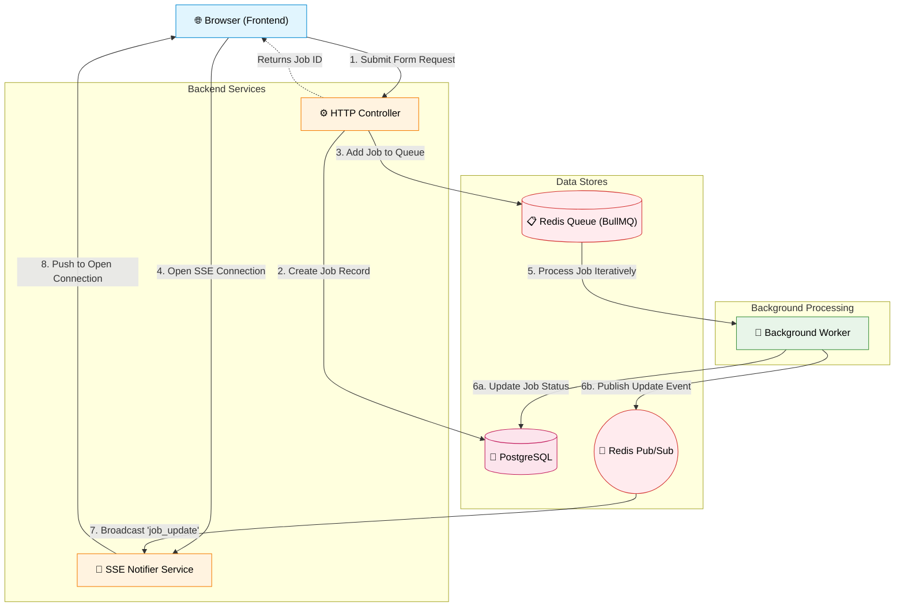

# Guide: Building Background Workers with Real-Time Frontend Updates

When building complex applications (like those generating content via AI), some tasks take too long to process during a standard HTTP request. If you make the user wait on a loading spinner while keeping the HTTP connection open, the request might time out, or the server might get overwhelmed.

The solution is to use **Background Workers** and **Real-Time Updates (SSE)** using **Redis**.

This guide breaks down exactly how this is implemented in your project so you can easily replicate this architecture in the future.

---

## 1. The High-Level Architecture

Here is the exact flow of data from start to finish:



1. **The Request**: The user submits a form on the frontend. The backend creates a record in the database (e.g., `OnboardingJob`) and adds a **Job** to a queue. It then immediately returns the Job ID to the frontend.
2. **The Queue**: The Job waits in a **Redis** queue (managed by BullMQ).
3. **The Worker**: A background **Worker process** constantly listens to the queue. It picks up the job and starts doing the heavy lifting (calling AI APIs, etc.).
4. **The Updates**: As the worker progresses, it periodically updates the database and **publishes a message** to a Redis Pub/Sub channel.
5. **The Notification**: A Node.js service (the Notifier) uses a second Redis connection to **subscribe** to that channel.
6. **The SSE Connection**: Meanwhile, the frontend has opened a **Server-Sent Event (SSE)** connection to the server. When the Notifier hears the Redis message, it forwards it down the SSE connection to the browser.

---

## 2. Setting Up Redis (The Foundation)
**File location:** `src/lib/redis.ts`

Redis acts as both our queue storage and our real-time messenger.

**Key Concept: The Two Connections**
You will notice we create two distinct Redis clients: `redisPublisher` and `redisSubscriber`.
Why? Because in Redis, once a connection enters "Subscriber" mode (listening to a channel), it **cannot do anything else** except listen. If you want to publish messages *and* listen to messages, you strictly need two separate connections.

```typescript
// Used to SEND messages (publish)
export const redisPublisher = new Redis(env.REDIS_URL);

// Used to LISTEN to messages (subscribe)
export const redisSubscriber = new Redis(env.REDIS_URL);
```

---

## 3. Defining the Queue (BullMQ)
**File location:** `src/lib/queue.ts`

We use a library called **BullMQ** to handle the heavy queue safety mechanisms (retries, backoffs, failure states) so we don't have to write them manually using raw Redis.

We initialize a `Queue` instance. We also define a helper function (`addJob`) to easily drop payloads into this queue from our HTTP controllers.

```typescript
export const onboardingQueue = new Queue('onboarding.generate', defaultQueueOptions);

// When a user hits our API, we call this function:
export async function addJob(queueName, data) {
  await queue.add(queueName, data);
}
```

---

## 4. Setting Up the Worker Runner (The Engine)
**File location:** `src/worker-runner.ts`

The worker acts as a separate "engine" that polls the Redis queue for new jobs. We create a `Worker` instance and hook it up to the exact same queue name (`onboarding.generate`).

This file is responsible for the configuration of *how* the worker runs:
- `concurrency`: How many jobs this Node process handles simultaneously.
- `backoffStrategy`: If an API call fails, how long should it wait before retrying?
- Important events: Listening on `.on('completed')` and `.on('failed')`.

```typescript
import onboardingProcessor from './workers/onboarding-generate.worker';

// Instantiates the worker and maps the queue name to the processor function
const onboardingWorker = new Worker('onboarding.generate', onboardingProcessor, { ...options });
```

---

## 5. The Job Processor (The Business Logic)
**File location:** `src/workers/onboarding-generate.worker.ts`

This is where the actual work happens. The processor is just a function that receives the `Job` object.

**The most crucial pattern here is Progress Reporting:**
As the worker progresses through different stages (e.g., `CALLING_AI`, `SAVING`, `DONE`), it does two things:
1. It updates the database record so the state is permanently saved.
2. It immediately calls `publishJobUpdate()`.

```typescript
// Inside the worker function...

// 1. Update the Database
const updatedJob = await prisma.onboardingJob.update({
  where: { id: dbJob.id },
  data: { stage: 'CALLING_AI', progressPct: 25 },
});

// 2. Broadcast the update via Redis Pub/Sub
await publishJobUpdate('job_updates', updatedJob);
```
This is how a decoupled background worker communicates back to the "live" web server.

---

## 6. The Notifier & SSE (Closing the Loop)
**File location:** `src/services/job-notifier.service.ts`

How does the frontend browser know what the worker is doing? Through Server-Sent Events (SSE).

This file is the glue between Redis Pub/Sub and the user's browser:
1. **`initListener`**: It uses our `redisSubscriber` to listen to the `job_updates` channel.
2. **`connections` Map**: It keeps a memory map of `jobId -> [Callback Functions]`. When a user's browser opens an SSE stream to our API, we store their `res.write` callback in this map.
3. **`broadcast`**: When Redis receives a message for Job ID "123", we look up Job "123" in our map, and trigger all associated callbacks, pushing the data over the open HTTP connection down to the frontend.

### The Publish Pattern:
```typescript
export async function publishJobUpdate(channel, data) {
  // Uses the PUBLISHER client
  await redisPublisher.publish(channel, JSON.stringify(data));
}
```

### The Subscribe & SSE Pattern:
```typescript
redisSubscriber.on('message', (channel, message) => {
  const data = JSON.parse(message);
  // Find the browser that cares about this job, and send it the data
  broadcast(data.id, data); 
});
```

---

## Summary Checklist for Next Time

If you want to implement this architecture again from scratch, here is your checklist:

1. [x] Install `ioredis` and `bullmq`.
2. [x] Create 2 Redis clients (one for Publishing, one for Subscribing).
3. [x] Create a `Queue` to hold tasks, and a function to add tasks to it via your REST/GraphQL controllers.
4. [x] Create a `Worker` script that listens to that queue and runs heavy tasks.
5. [x] Inside the worker script, publish progress to a Redis Channel.
6. [x] Create a subscriber service that listens to that Redis Channel.
7. [x] Create a frontend SSE route/controller. When the route is hit, map the connection to the Job ID.
8. [x] Pipe the data from the subscriber service straight into the SSE connection.
